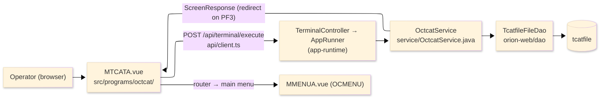
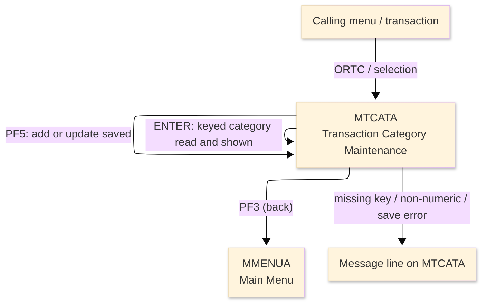
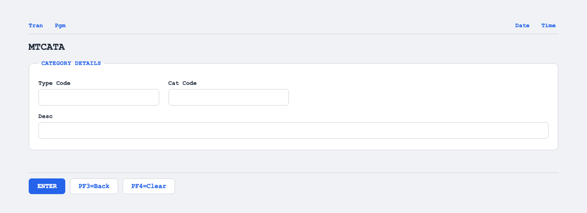

# TO-BE Screen Design — OCTCAT_TranCategoryMaint

> **Rule 1: TO-BE = AS-IS in business terms.** The interface moves to a web SPA, but the
> input/output data, the check conditions, the business flow and the database results are
> preserved. The section order follows the AS-IS document so the two compare 1-to-1.

## 0. Cover

| Item | Content |
|---|---|
| System | ORION-CCMS (ORION Credit Card Management System) |
| Subsystem | On-line (was CICS/BMS; now Vue SPA + REST) |
| Function name | Transaction Category Maintenance |
| Function ID | OCTCAT（COBOL program）／Trans-ID `ORTC`／Map `MTCATA` |
| Module | `octcat` |
| Platform | Java 17 · Spring Boot 3.x · Vue 3 + TypeScript · DB Oracle (H2 in dev) |
| Version ／ Author ／ Date | 1 ／ modernizeX ／ 2026-09-28 |

## 1. Function overview

### 1.1 Overview diagram

System architecture — the screen, the request path to the server, the program service it runs,
and the data store it maintains.

### 1.2 Function overview

| # | Function | Implementation |
|---|---|---|
| 1 | Look up a transaction category by its type code and category code | The keyed pair is read by primary key from `tcatfile` and the current description is shown |
| 2 | Add a new category or change an existing one | The operator keys the description and confirms; the row is written when new or rewritten when it already exists |
| 3 | Return to the calling menu when finished | The back action ends the maintenance and returns the operator to the main menu |

**Roles ／ authorisation**: authenticated operator (signed on through the Sign On screen). Sign-on
state travels in the conversation carried between requests; no framework role gate is wired yet.

**Keys → operations** (the SPA renders each former PF key as a button):

| Key | Label as rendered (verbatim) | What it does |
|---|---|---|
| `ENTER` | `ENTER=PROCESS` | read the keyed category and show its current definition |
| `PF3` | `PF3=BACK` | return to the main menu |
| `PF4` | `PF4=CLEAR` | clear the entered values so the operator can start again |
| `PF5` | `PF5` | confirm and save — add a new category or update the existing one |

> The middle column is the string the button really shows, copied from the program's button
> definitions. The physical PF keystrokes are not reproduced as keyboard shortcuts, so operators
> used to typing PF3 now click the `PF3=BACK` button — same action, one extra pointer move.

### 1.3 Databases used

| № | Business name | Table | C | R | U | D |
|---|---|---|---|---|---|---|
| 1 | Transaction category master — keyed by type code and category code | `tcatfile` | 〇 | 〇 | 〇 | - |

> The on-line service reads the category, adds a new row and rewrites an existing row; it does not
> delete a category, so the delete column stays empty.

## 2. Screen spec

Screen transition of the whole function — every screen a box, every edge labelled with what moves
the operator.

### 2.1 MTCATA — Transaction Category Maintenance

**Layout**

**Archetype applied**: maintenance form with a two-part lookup key and one editable detail field
(`_archetypes/screenModel`). The header carries the transaction/program/date/time meta strip; the
body has the key entry boxes and the description box; a message line and a button row close the
screen.

| Area | Notes |
|---|---|
| Header (Tran/Prog/Date/Time) | meta strip above the title, filled by the server |
| Input area | two key boxes (type code, category code) plus the description box |
| Details area | the description read back after a lookup shows the current stored text |
| Message line | inline alert below the form (was row 23 `ERRMSG`) |
| Button row | `ENTER=PROCESS`, `PF3=BACK`, `PF4=CLEAR`, `PF5` |

**Screen items**

_State legend: ○ shown · 必 must be entered · □ read-only · － not shown._

| № | Item name | Field | Type ／ length | Control | Required | Initial | Key prompt | Record shown | Notes |
|---|---|---|---|---|---|---|---|---|---|
| 1 | Transaction id | `TRNNAME` | text, 4 | read-only | - | ○ | － | □ | header meta, server-filled |
| 2 | Screen title | `TITLE` | text, 40 | read-only | - | ○ | － | □ | header meta |
| 3 | Current date | `CURDATE` | date text, 10 | read-only | - | ○ | － | □ | header meta |
| 4 | Program name | `PGMNAME` | text, 8 | read-only | - | ○ | － | □ | header meta |
| 5 | Current time | `CURTIME` | time text, 8 | read-only | - | ○ | － | □ | header meta |
| 6 | Type Code | `TCTYPE` | text, 2 | entry box, 2 chars | 必 | ○ | 必 | □ | key part 1; kept at 2 as in the source |
| 7 | Cat Code | `TCCD` | numeric text, 4 | entry box, 4 chars | 必 | ○ | 必 | □ | key part 2; numeric, kept at 4 |
| 8 | Desc | `TCDESC` | text, 50 | entry box, 50 chars | 必 | ○ | － | □ | the category description saved on PF5 |
| 9 | Message line | `ERRMSG` | text, 78 | read-only | - | － | － | □ | prompt and result messages |

> **Length and format unchanged**: the type code accepts 2 characters, the category code 4 numeric
> characters, and the description 50 characters — the same widths the terminal screen used.

## 3. Check specifications

### 3.1 MTCATA — Transaction Category Maintenance

All strings below are the literal messages the server returns to the on-screen message line.
Type: E=Error / I=Information.

| No. | What is checked | When it is checked | Message code | Message shown | If it fails |
|---|---|---|---|---|---|
| 1 | Opening prompt (informational) | when the screen first appears | — | Enter type + category code and press ENTER. | not a failure; guides the operator |
| 2 | The type code must be entered | on `ENTER` / `PF5`, during key validation | — | Type code is required. | the cursor stays on the type code; nothing is read or saved |
| 3 | The category code must be numeric | on `ENTER` / `PF5`, during key validation | — | Category code must be numeric. | the cursor stays on the code; nothing is read or saved |
| 4 | The description must be entered | on `PF5`, before the save | — | Description is required. | the cursor stays on the description; nothing is saved |
| 5 | The key must be looked up before saving | on `PF5`, before the save | — | Enter the key and press ENTER first. | nothing is saved; the operator must press `ENTER` first |
| 6 | The keyed category already exists (informational) | on `ENTER`, after the read | — | Category found. Change text, PF5 to update. | not a failure; the stored description is shown for editing |
| 7 | The keyed category is new (informational) | on `ENTER`, after the read | — | New category. Enter text, PF5 to add. | not a failure; the description is left blank for entry |
| 8 | Add applied (informational) | after a successful `PF5` add | — | Transaction category added. | not a failure; the new row is committed |
| 9 | Update applied (informational) | after a successful `PF5` update | — | Transaction category updated. | not a failure; the row is committed |
| 10 | The category store must be writable | during the `PF5` save | — | Error saving the transaction category. | the row is not saved; the entry stays on the screen |
| 11 | Only a supported key may be used | on any key press | — | Invalid key pressed. Please try again. | the screen is redisplayed unchanged |

## 4. Event specifications

### 4.1 MTCATA — Transaction Category Maintenance

| No. | Event | What the system does | Result ／ next screen |
|---|---|---|---|
| 1 | The operator keys the type code and category code and presses `ENTER` | the keyed category is read and its current description is filled in | stays on the maintenance screen; a message says whether the category already exists or is new |
| 2 | The operator edits the description and presses `PF5` | the category is saved — a new row is added, or the existing row is updated | stays on the screen with a saved message, or an error when the store cannot be written |
| 3 | The operator presses `PF3` | the maintenance ends and control returns to the calling menu | the main menu appears |
| 4 | The operator presses `PF4` | the entered values are cleared and the opening prompt returns | stays on the maintenance screen, ready for a new key |
| 5 | The operator presses an unsupported key | the request is rejected and a message is shown | stays on the maintenance screen, unchanged |

## 5. DB CRUD

**Update spec**

The maintenance reads the category by its two-part key, then either writes a new row when the
category is new or rewrites the existing row when it is found. The on-line service performs no
delete.

**Column-level CRUD (per event ／ business type)**

| Table | Operation | Field | Value source | Transaction |
|---|---|---|---|---|
| `tcatfile` | SELECT (read by key) | whole record | the type code and category code the operator entered | read-only lookup on `ENTER` |
| `tcatfile` | INSERT (add) | `tc_type_cd`, `tc_cd`, `tc_desc` | the keyed pair plus the entered description | committed on `PF5` when the category is new |
| `tcatfile` | UPDATE (rewrite) | `tc_desc` | the entered description | committed on `PF5` when the category already exists |

## 6. API contract

| Request | Response | What it does | Errors |
|---|---|---|---|
| `POST /api/terminal/execute` — `{ programName: "OCTCAT", aidKey, fields: { TCTYPE, TCCD, TCDESC } }` | `ScreenResponse` — `{ fields: { TCTYPE, TCCD, TCDESC }, message, buttons }` | reads the keyed category on `ENTER`, or adds/updates it on `PF5` | blank type → "Type code is required."; non-numeric code → "Category code must be numeric."; blank description → "Description is required."; save fault → "Error saving the transaction category." |

FE types: `src/programs/octcat/schemas.d.ts` (`MTCATAFields`) · client: `src/api/client.ts` ·
endpoint: `TerminalController` (`/api/terminal/execute`), one round-trip per key press (CICS
pseudo-conversation preserved through the HTTP session).
