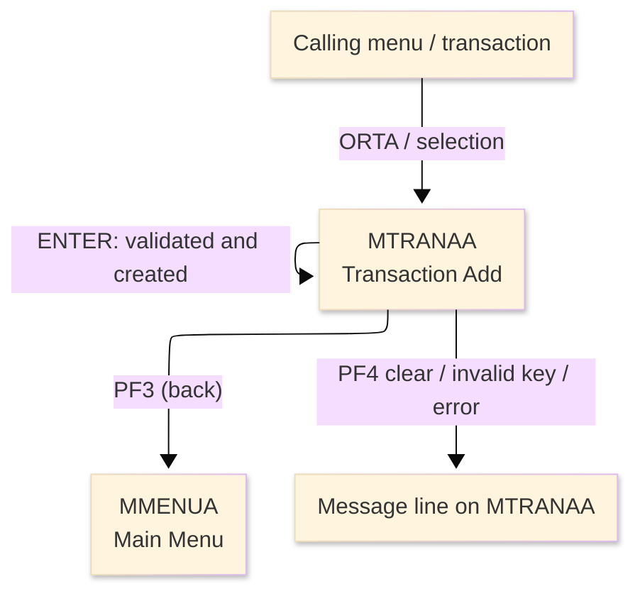
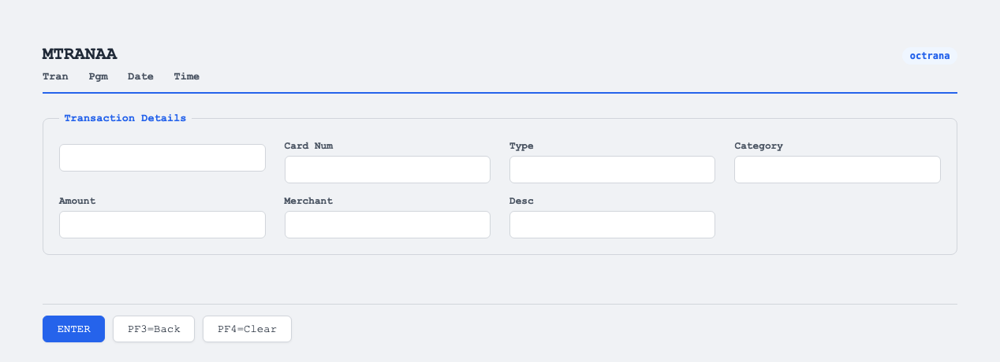

# TO-BE Screen Design — OCTRANA_TransactionAdd

> **Rule 1: TO-BE = AS-IS in business terms.** The interface moves to a web SPA, but the
> input/output data, the check conditions, the business flow and the database results are
> preserved. The section order follows the AS-IS document so the two compare 1-to-1.

## 0. Cover

| Item | Content |
|---|---|
| System | ORION-CCMS (ORION Credit Card Management System) |
| Subsystem | On-line (was CICS/BMS; now Vue SPA + REST) |
| Function name | Transaction Add |
| Function ID | OCTRANA（COBOL program）／Trans-ID `ORTA`／Map `MTRANAA` |
| Module | `octrana` |
| Platform | Java 17 · Spring Boot 3.x · Vue 3 + TypeScript · DB Oracle (H2 in dev) |
| Version ／ Author ／ Date | 1 ／ modernizeX ／ 2026-09-28 |

## 1. Function overview

### 1.1 Overview diagram

System architecture — the screen, the request path to the server, the program service it runs,
and the data stores it reads and writes.

```mermaid
---
config:
  layout: elk
  look: neo
  theme: base
---
flowchart LR
    U["Operator (browser)"] --> V["MTRANAA.vue<br>src/programs/octrana/"]
    V -- "POST /api/terminal/execute<br>api/client.ts" --> API["TerminalController → AppRunner<br>(app-runtime)"]
    API --> PG["OctranaService<br>service/OctranaService.java"]
    PG -- "R" --> D1["XreffileFileDao"] --> DB1[("xreffile")]
    PG -- "R" --> D2["TtypfileFileDao"] --> DB2[("ttypfile")]
    PG -- "R" --> D3["TcatfileFileDao"] --> DB3[("tcatfile")]
    PG -- "R/U" --> D4["CtrlfileFileDao"] --> DB4[("ctrlfile")]
    PG -- "C" --> D5["TranfileFileDao"] --> DB5[("tranfile")]
    PG -- "ScreenResponse (redirect on PF3)" --> V
    V -- "router → main menu" --> MENU["MMENUA.vue (OCMENU)"]
```

### 1.2 Function overview

| # | Function | Implementation |
|---|---|---|
| 1 | Accept the details for a new transaction | The operator keys the card number, type, category, amount, merchant name and description |
| 2 | Validate each entry against the business rules | Every field is checked for presence, format and against the reference files before anything is saved |
| 3 | Create the transaction on confirmation | A new transaction number is assigned, the record is written and a confirmation with that number is shown |

**Roles ／ authorisation**: authenticated operator (signed on through the Sign On screen). Sign-on
state travels in the conversation carried between requests; no framework role gate is wired yet.

**Keys → operations** (the SPA renders each former PF key as a button):

| Key | Label as rendered (verbatim) | What it does |
|---|---|---|
| `ENTER` | `ENTER=PROCESS` | validate the entered values and create the transaction |
| `PF3` | `PF3=BACK` | return to the main menu |
| `PF4` | `PF4=CLEAR` | clear the entered values so the operator can start again |

> The middle column is the string the button really shows, copied from the program's button
> definitions. The physical PF keystrokes are not reproduced as keyboard shortcuts, so operators
> used to typing PF3 now click the `PF3=BACK` button — same action, one extra pointer move.

### 1.3 Databases used

| № | Business name | Table | C | R | U | D |
|---|---|---|---|---|---|---|
| 1 | Card cross-reference — checks the card number is on file | `xreffile` | - | 〇 | - | - |
| 2 | Transaction type master — checks the type is valid | `ttypfile` | - | 〇 | - | - |
| 3 | Transaction category master — checks the category for that type | `tcatfile` | - | 〇 | - | - |
| 4 | Control counter — supplies the next transaction number | `ctrlfile` | - | 〇 | 〇 | - |
| 5 | Transaction master — the new record is written here | `tranfile` | 〇 | - | - | - |

## 2. Screen spec

Screen transition of the whole function — every screen a box, every edge labelled with what moves
the operator.

### 2.1 MTRANAA — Transaction Add

**Layout**

**Archetype applied**: data-entry form that creates one record (`_archetypes/screenModel`). The header
carries the transaction/program/date/time meta strip; the body has six entry boxes for the
transaction details; a message line and a button row close the screen.

| Area | Notes |
|---|---|
| Header (Tran/Prog/Date/Time) | meta strip above the title, filled by the server |
| Input area | six entry boxes — card number, type, category, amount, merchant, description |
| Message line | inline alert / confirmation below the form (was row 23 `ERRMSG`) |
| Button row | `ENTER=PROCESS`, `PF3=BACK`, `PF4=CLEAR` |

**Screen items**

_State legend: ○ shown · 必 must be entered · □ read-only · － not shown._

| № | Item name | Field | Type ／ length | Control | Required | Initial | On validate | On confirm | Notes |
|---|---|---|---|---|---|---|---|---|---|
| 1 | Transaction name | `TRNNAME` | text, 4 | read-only | - | □ | □ | □ | program-supplied header |
| 2 | Title | `TITLE` | text, 40 | read-only | - | □ | □ | □ | program-supplied header |
| 3 | Current date | `CURDATE` | date text, 10 | read-only | - | □ | □ | □ | server-filled |
| 4 | Program name | `PGMNAME` | text, 8 | read-only | - | □ | □ | □ | server-filled |
| 5 | Current time | `CURTIME` | time text, 8 | read-only | - | □ | □ | □ | server-filled |
| 6 | Card number | `CARDNUM` | numeric text, 16 | entry box, 16 chars | 必 | ○ | ○ | □ | checked against the card cross-reference |
| 7 | Type | `TRTYPE` | text, 2 | entry box, 2 chars | 必 | ○ | ○ | □ | checked against the transaction type master |
| 8 | Category | `TRCAT` | numeric text, 4 | entry box, 4 chars | 必 | ○ | ○ | □ | must be numeric; checked against the category master |
| 9 | Amount | `TRAMT` | amount text, 12 | entry box, 12 chars | 必 | ○ | ○ | □ | must be a valid number greater than zero |
| 10 | Merchant | `TRMERCH` | text, 50 | entry box, 50 chars | 必 | ○ | ○ | □ | required |
| 11 | Description | `TRDESC` | text, 50 | entry box, 50 chars | 必 | ○ | ○ | □ | required |
| 12 | Message line | `ERRMSG` | text, 78 | read-only | - | □ | □ | □ | inline alert or the added confirmation |

> **Length and format unchanged**: each entry box accepts the same character count as the terminal
> field (card 16, type 2, category 4, amount 12, merchant 50, description 50), and the server writes
> the same widths to the transaction record.

## 3. Check specifications

### 3.1 MTRANAA — Transaction Add

All strings below are the literal messages the server returns to the on-screen message line.
Type: E=Error / I=Information.

| No. | What is checked | When it is checked | Message code | Message shown | If it fails |
|---|---|---|---|---|---|
| 1 | Opening prompt (informational) | when the screen first appears | — | Enter the transaction details and press ENTER. | not a failure; guides the operator |
| 2 | The card number must be entered | on `ENTER`, before the lookup | — | Card number is required. | the cursor returns to the card field; nothing is saved |
| 3 | The card number must be on file | on `ENTER`, after the cross-reference read | — | Card number is not on file. | the card field is flagged; nothing is saved |
| 4 | The transaction type must be entered | on `ENTER` | — | Transaction type is required. | the type field is flagged; nothing is saved |
| 5 | The transaction type must be valid | on `ENTER`, after the type read | — | Transaction type is not valid. | the type field is flagged; nothing is saved |
| 6 | The category code must be entered | on `ENTER` | — | Category code is required. | the category field is flagged; nothing is saved |
| 7 | The category code must be numeric | on `ENTER` | — | Category code must be numeric. | the category field is flagged; nothing is saved |
| 8 | The category must be valid for that type | on `ENTER`, after the category read | — | Category is not valid for that type. | the category field is flagged; nothing is saved |
| 9 | The amount must be entered | on `ENTER` | — | Amount is required. | the amount field is flagged; nothing is saved |
| 10 | The amount must be a valid number | on `ENTER` | — | Amount is not a valid number. | the amount field is flagged; nothing is saved |
| 11 | The amount must be greater than zero | on `ENTER` | — | Amount must be greater than zero. | the amount field is flagged; nothing is saved |
| 12 | The merchant name must be entered | on `ENTER` | — | Merchant name is required. | the merchant field is flagged; nothing is saved |
| 13 | The description must be entered | on `ENTER` | — | Description is required. | the description field is flagged; nothing is saved |
| 14 | The transaction counter must exist | on `ENTER`, when assigning the id | — | Transaction counter is not defined. | the add stops; nothing is written |
| 15 | The counter must update cleanly | on `ENTER`, when assigning the id | — | Error updating the transaction counter. | the add stops; nothing is written |
| 16 | The record must write cleanly | on `ENTER`, at write time | — | Error writing the transaction record. | the add stops; the entry stays on screen |
| 17 | Successful add (informational) | on `ENTER`, after the write | — | Transaction &lt;id&gt; added. | confirmation with the new transaction number |
| 18 | Only a supported key may be used | on any key press | — | Invalid key pressed. Please try again. | the screen is redisplayed unchanged |

## 4. Event specifications

### 4.1 MTRANAA — Transaction Add

| No. | Event | What the system does | Result ／ next screen |
|---|---|---|---|
| 1 | The operator fills the details and presses `ENTER` | every field is validated and, when all pass, a new transaction number is assigned and the record is created | stays on Transaction Add with the added confirmation, or a message when a field fails |
| 2 | The operator presses `PF3` | the add is cancelled and control returns to the calling menu | the main menu appears |
| 3 | The operator presses `PF4` | the entered values are cleared and the opening prompt returns | stays on Transaction Add, ready for new input |
| 4 | The operator presses an unsupported key | the request is rejected and a message is shown | stays on Transaction Add, unchanged |

## 5. DB CRUD

**Update spec**

On a valid `ENTER` the control counter is read for update and stepped by one to yield the next
transaction number, then one new row is inserted into the transaction master. The reference files
are read only, to validate the entry.

**Column-level CRUD (per event ／ business type)**

| Table | Operation | Field | Value source | Transaction |
|---|---|---|---|---|
| `xreffile` | SELECT (read by key) | whole record | the card number the operator entered | read-only; no commit |
| `ttypfile` | SELECT (read by key) | whole record | the transaction type entered | read-only; no commit |
| `tcatfile` | SELECT (read by key) | whole record | the type + category entered | read-only; no commit |
| `ctrlfile` | SELECT for update, then UPDATE | `ct_last_value` | the counter stepped by one | committed |
| `tranfile` | INSERT | whole record | the entered details plus the new transaction id | committed |

## 6. API contract

| Request | Response | What it does | Errors |
|---|---|---|---|
| `POST /api/terminal/execute` — `{ programName: "OCTRANA", aidKey, fields: { CARDNUM, TRTYPE, TRCAT, TRAMT, TRMERCH, TRDESC } }` | `ScreenResponse` — `{ fields: { TRNNAME, TITLE, CURDATE, PGMNAME, CURTIME, ERRMSG }, message, buttons }` | validates the fields, reads the reference files, assigns the next transaction id and inserts the record, then returns the confirmation | required-field, not-on-file, not-valid, must-be-numeric, greater-than-zero, counter and write messages listed in §3 |

FE types: `src/programs/octrana/schemas.d.ts` (`MTRANAAFields`) · client: `src/api/client.ts` ·
endpoint: `TerminalController` (`/api/terminal/execute`), one round-trip per key press (CICS
pseudo-conversation preserved through the HTTP session).
