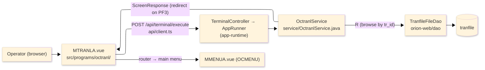
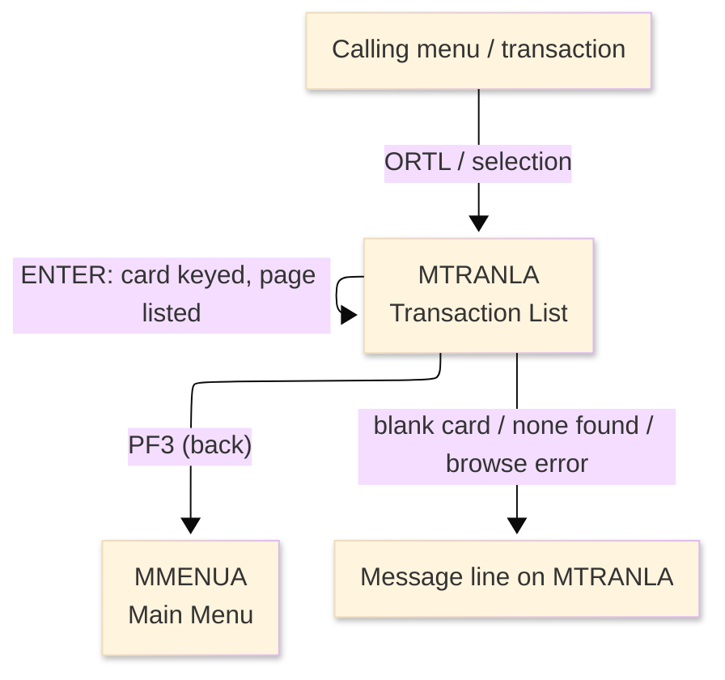
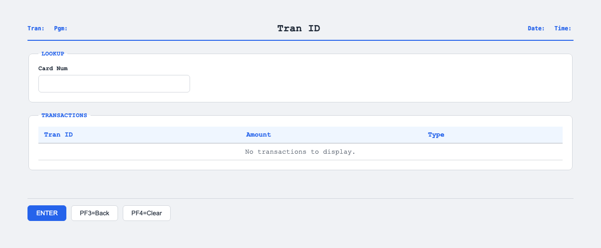

# TO-BE Screen Design — OCTRANL_TransactionList

> **Rule 1: TO-BE = AS-IS in business terms.** The interface moves to a web SPA, but the
> input/output data, the check conditions, the business flow and the database results are
> preserved. The section order follows the AS-IS document so the two compare 1-to-1.

## 0. Cover

| Item | Content |
|---|---|
| System | ORION-CCMS (ORION Credit Card Management System) |
| Subsystem | On-line (was CICS/BMS; now Vue SPA + REST) |
| Function name | Transaction List |
| Function ID | OCTRANL（COBOL program）／Trans-ID `ORTL`／Map `MTRANLA` |
| Module | `octranl` |
| Platform | Java 17 · Spring Boot 3.x · Vue 3 + TypeScript · DB Oracle (H2 in dev) |
| Version ／ Author ／ Date | 1 ／ modernizeX ／ 2026-09-28 |

## 1. Function overview

### 1.1 Overview diagram

System architecture — the screen, the request path to the server, the program service it runs,
and the data store it browses.

### 1.2 Function overview

| # | Function | Implementation |
|---|---|---|
| 1 | List the transactions for one card, a page at a time | The operator keys a card number and the transaction store is browsed in id order |
| 2 | Keep only the rows that belong to that card | Each browsed record is matched on its card number and up to five matches are shown |
| 3 | Report how many rows were listed | A count line tells the operator how many transactions are displayed, or that none were found |

**Roles ／ authorisation**: authenticated operator (signed on through the Sign On screen). Sign-on
state travels in the conversation carried between requests; no framework role gate is wired yet.

**Keys → operations** (the SPA renders each former PF key as a button):

| Key | Label as rendered (verbatim) | What it does |
|---|---|---|
| `ENTER` | `ENTER=PROCESS` | browse the transactions for the keyed card and list the first page |
| `PF3` | `PF3=BACK` | return to the main menu |
| `PF4` | `PF4=CLEAR` | clear the entry so the operator can start again |

> The middle column is the string the button really shows, copied from the program's button
> definitions. The physical PF keystrokes are not reproduced as keyboard shortcuts, so operators
> used to typing PF3 now click the `PF3=BACK` button — same action, one extra pointer move.

### 1.3 Databases used

| № | Business name | Table | C | R | U | D |
|---|---|---|---|---|---|---|
| 1 | Transaction master — browsed in ascending `tr_id` order, kept when `tr_card_num` matches | `tranfile` | - | 〇 | - | - |

## 2. Screen spec

Screen transition of the whole function — every screen a box, every edge labelled with what moves
the operator.

### 2.1 MTRANLA — Transaction List

**Layout**

**Archetype applied**: browse list with a single filter key (`_archetypes/screenModel`). The header
carries the transaction/program/date/time meta strip; the body has one entry box and a five-row
result grid (transaction id, amount, type); a message line and a button row close the screen.

| Area | Notes |
|---|---|
| Header (Tran/Prog/Date/Time) | meta strip above the title, filled by the server |
| Input area | one entry box — the card number that filters the browse |
| Result grid | up to five rows: transaction id, amount, type |
| Message line | count summary or alert below the grid (was row 23 `ERRMSG`) |
| Button row | `ENTER=PROCESS`, `PF3=BACK`, `PF4=CLEAR` |

**Screen items**

_State legend: ○ shown · 必 must be entered · □ read-only · － not shown._

| № | Item name | Field | Type ／ length | Control | Required | Initial | Page displayed | Notes |
|---|---|---|---|---|---|---|---|---|
| 1 | Transaction name | `TRNNAME` | text, 4 | read-only | - | □ | □ | program-supplied header |
| 2 | Title | `TITLE` | text, 40 | read-only | - | □ | □ | program-supplied header |
| 3 | Current date | `CURDATE` | date text, 10 | read-only | - | □ | □ | server-filled |
| 4 | Program name | `PGMNAME` | text, 8 | read-only | - | □ | □ | server-filled |
| 5 | Current time | `CURTIME` | time text, 8 | read-only | - | □ | □ | server-filled |
| 6 | Card number | `CARDNUM` | numeric text, 16 | entry box, 16 chars | 必 | ○ | □ | filter key for the browse; kept at 16 as in the source |
| 7 | Transaction id (rows 1–5) | `TRN1`–`TRN5` | text, 16 | read-only | - | － | □ | one per listed transaction |
| 8 | Amount (rows 1–5) | `AMT1`–`AMT5` | amount text, 15 | read-only | - | － | □ | edited amount per row |
| 9 | Type (rows 1–5) | `TYP1`–`TYP5` | text, 2 | read-only | - | － | □ | transaction type per row |
| 10 | Message line | `ERRMSG` | text, 78 | read-only | - | □ | □ | count summary or alert |

> **Length and format unchanged**: the entry box accepts 16 characters and each result column keeps
> its terminal width (id 16, amount 15, type 2). The screen shows one page of five rows, exactly as
> the terminal map did.

## 3. Check specifications

### 3.1 MTRANLA — Transaction List

All strings below are the literal messages the server returns to the on-screen message line.
Type: E=Error / I=Information.

| No. | What is checked | When it is checked | Message code | Message shown | If it fails |
|---|---|---|---|---|---|
| 1 | Opening prompt (informational) | when the screen first appears | — | Enter a card number and press ENTER. | not a failure; guides the operator |
| 2 | The card number must be entered | on `ENTER`, before the browse | — | Card number is required. | the cursor stays on the entry; nothing is browsed |
| 3 | Rows returned (informational) | on `ENTER`, after the browse | — | &lt;count&gt; transaction(s) displayed. | the count line reports how many rows were listed |
| 4 | No match for that card (informational) | on `ENTER`, when nothing matched | — | No transactions found for that card. | the grid stays empty |
| 5 | The transaction store must be browsable | on `ENTER`, during the browse | — | Error browsing the transaction file. | the browse stops; the grid stays empty |
| 6 | Only a supported key may be used | on any key press | — | Invalid key pressed. Please try again. | the screen is redisplayed unchanged |

## 4. Event specifications

### 4.1 MTRANLA — Transaction List

| No. | Event | What the system does | Result ／ next screen |
|---|---|---|---|
| 1 | The operator keys a card number and presses `ENTER` | the transaction store is browsed in id order and the first five rows for that card are listed with a count | stays on Transaction List with the rows shown, or a message when the card is blank or nothing matched |
| 2 | The operator presses `PF3` | the list ends and control returns to the calling menu | the main menu appears |
| 3 | The operator presses `PF4` | the entered value is cleared and the opening prompt returns | stays on Transaction List, ready for a new card |
| 4 | The operator presses an unsupported key | the request is rejected and a message is shown | stays on Transaction List, unchanged |

## 5. DB CRUD

**Update spec**

Not applicable — Transaction List only reads; no row is created, updated or deleted. The browse
reads `tranfile` in ascending `tr_id` order (start-browse then read-next), keeping each record whose
`tr_card_num` equals the entered card, up to five rows.

**Column-level CRUD (per event ／ business type)**

| Table | Operation | Field | Value source | Transaction |
|---|---|---|---|---|
| `tranfile` | BROWSE (start-browse + read-next, ascending `tr_id`) | whole record | the card number the operator entered filters the matches | read-only; no commit |

## 6. API contract

| Request | Response | What it does | Errors |
|---|---|---|---|
| `POST /api/terminal/execute` — `{ programName: "OCTRANL", aidKey, fields: { CARDNUM } }` | `ScreenResponse` — `{ fields: { TRN1..TRN5, AMT1..AMT5, TYP1..TYP5, ERRMSG }, message, buttons }` | browses the transactions for the keyed card in id order and returns up to five rows plus a count | blank card → "Card number is required."; no match → "No transactions found for that card."; browse error → "Error browsing the transaction file." |

FE types: `src/programs/octranl/schemas.d.ts` (`MTRANLAFields`) · client: `src/api/client.ts` ·
endpoint: `TerminalController` (`/api/terminal/execute`), one round-trip per key press (CICS
pseudo-conversation preserved through the HTTP session).
