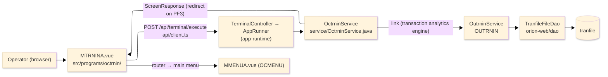
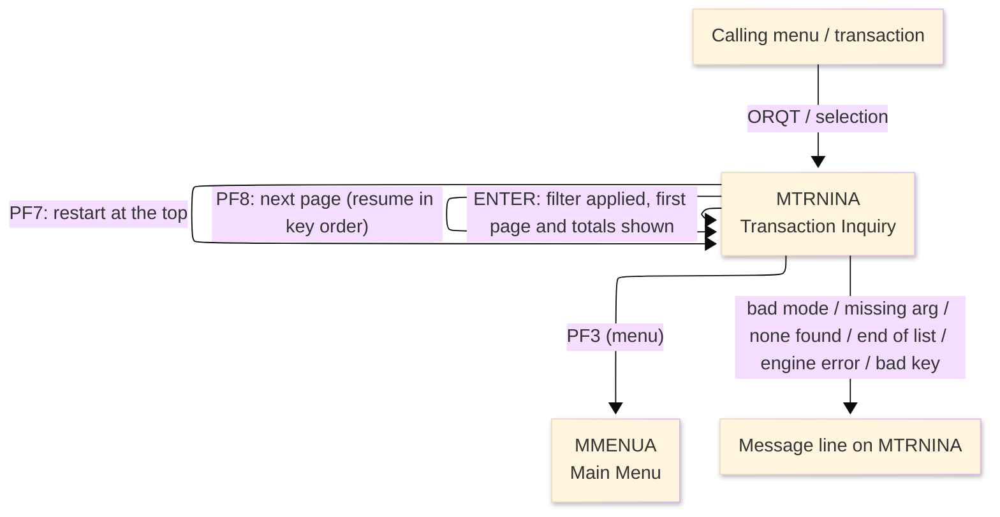
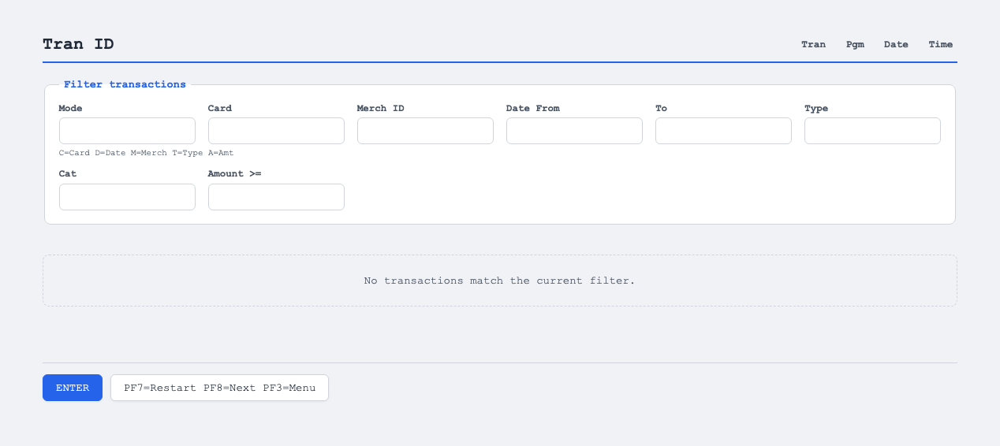

# TO-BE Screen Design — OCTRNIN_TransactionInquiry

> **Rule 1: TO-BE = AS-IS in business terms.** The interface moves to a web SPA, but the
> input/output data, the check conditions, the business flow and the database results are
> preserved. The section order follows the AS-IS document so the two compare 1-to-1.

## 0. Cover

| Item | Content |
|---|---|
| System | ORION-CCMS (ORION Credit Card Management System) |
| Subsystem | On-line (was CICS/BMS; now Vue SPA + REST) |
| Function name | Transaction Inquiry |
| Function ID | OCTRNIN（COBOL program）／Trans-ID `ORQT`／Map `MTRNINA` |
| Module | `octrnin` |
| Platform | Java 17 · Spring Boot 3.x · Vue 3 + TypeScript · DB Oracle (H2 in dev) |
| Version ／ Author ／ Date | 1 ／ modernizeX ／ 2026-09-28 |

## 1. Function overview

### 1.1 Overview diagram

System architecture — the screen, the request path to the server, the program service it runs, the
linked transaction analytics engine, and the data store the engine reads a page at a time.

### 1.2 Function overview

| # | Function | Implementation |
|---|---|---|
| 1 | Accept a search filter for the inquiry | The operator picks a filter mode (card, date range, merchant, type/category or amount threshold) and keys the matching arguments |
| 2 | Retrieve and display the matching transactions and analytics | The linked transaction analytics engine reads the transactions that match and returns a page of up to six rows plus totals — matches and net total, per-type counts and sums for purchases, payments, fees and interest, and the largest transaction |
| 3 | Let the operator page through and refine the filter | A next action fetches the following page, a restart action lists from the top, and a new filter re-runs the inquiry |
| 4 | Return to the calling menu when finished | The menu action ends the inquiry and returns the operator to the main menu |

**Roles ／ authorisation**: authenticated operator (signed on through the Sign On screen). Sign-on
state travels in the conversation carried between requests; no framework role gate is wired yet.

**Keys → operations** (the SPA renders each former PF key as a button):

| Key | Label as rendered (verbatim) | What it does |
|---|---|---|
| `ENTER` | `ENTER=FILTER` | apply the chosen filter and list the first page of matching transactions |
| `PF7` | `PF7=RESTART` | restart the list from the top |
| `PF8` | `PF8=NEXT` | page forward to the next page of matching transactions |
| `PF3` | `PF3=MENU` | return to the main menu |

> The middle column is the string the button really shows, copied from the program's button
> definitions. The physical PF keystrokes are not reproduced as keyboard shortcuts, so operators
> used to typing PF8 now click the `PF8=NEXT` button — same paging action, one extra pointer move.

### 1.3 Databases used

| № | Business name | Table | C | R | U | D |
|---|---|---|---|---|---|---|
| 1 | Transaction master — read by the linked analytics engine | `tranfile` | - | 〇 | - | - |
| 2 | Transaction type descriptions — looked up for display | `ttypfile` | - | 〇 | - | - |
| 3 | Transaction category descriptions — looked up for display | `tcatfile` | - | 〇 | - | - |

> This program itself opens no file; the reads are performed by the linked transaction analytics engine
> (OUTRNIN), which browses `tranfile`, looks up the type and category descriptions, and returns each
> page with the totals.

## 2. Screen spec

Screen transition of the whole function — every screen a box, every edge labelled with what moves
the operator. The list is paged: each page shows up to six transactions, and each next page resumes
from the key the previous page returned; the totals block reflects the whole matched set.

### 2.1 MTRNINA — Transaction Inquiry

**Layout**

**Archetype applied**: filtered paged list with an analytics summary (`_archetypes/screenModel`, LIST).
The header carries the transaction/program/date/time meta strip; the body has a mode letter and the
filter argument boxes, a six-row result grid, and a totals block; a message line and a button row
close the screen.

| Area | Notes |
|---|---|
| Header (Tran/Prog/Date/Time) | meta strip above the title, filled by the server |
| Input area | one mode letter box plus the filter argument boxes (card, merchant id, date from/to, type, category, amount) |
| List area | up to six rows, each a transaction id, card (last four), type/category, description, merchant, amount and date |
| Totals block | matches and net total, per-type counts and sums for purchases, payments, fees and interest, and the largest transaction id and amount |
| Message line | inline alert / paging hint below the list (was row 23 `ERRMSG`) |
| Button row | `ENTER=FILTER`, `PF7=RESTART`, `PF8=NEXT`, `PF3=MENU` |

**Screen items**

_State legend: ○ shown · 必 must be entered · □ read-only · － not shown._

| № | Item name | Field | Type ／ length | Control | Required | Initial | Key prompt | Record shown | Notes |
|---|---|---|---|---|---|---|---|---|---|
| 1 | Filter mode | `TMODE` | text, 1 | entry box, 1 char | 必 | ○ | 必 | □ | C card · D date · M merchant · T type/category · A amount; defaults to C |
| 2 | Card number | `FCARD` | text, 16 | entry box, 16 chars | - | ○ | ○ | □ | required when the mode is card |
| 3 | Merchant ID | `FMERCH` | numeric text, 9 | entry box, 9 chars | - | ○ | ○ | □ | required and numeric when the mode is merchant |
| 4 | Date from | `FRDATE` | date text, 10 | entry box, 10 chars | - | ○ | ○ | □ | start of the range when the mode is date |
| 5 | Date to | `FTDATE` | date text, 10 | entry box, 10 chars | - | ○ | ○ | □ | end of the range when the mode is date |
| 6 | Type | `FTYPE` | text, 2 | entry box, 2 chars | - | ○ | ○ | □ | required when the mode is type/category |
| 7 | Category | `FCAT` | numeric text, 4 | entry box, 4 chars | - | ○ | ○ | □ | optional category when the mode is type/category |
| 8 | Amount ≥ | `FAMT` | amount text, 12 | entry box, 12 chars | - | ○ | ○ | □ | threshold when the mode is amount |
| 9 | Transaction ID (each row) | `TID1`…`TID6` | text, 16 | read-only | - | － | □ | □ | transaction id for each listed row |
| 10 | Card (each row) | `TCD1`…`TCD6` | text, 4 | read-only | - | － | □ | □ | last four of the card for each listed row |
| 11 | Type/Category (each row) | `TTC1`…`TTC6` | text, 7 | read-only | - | － | □ | □ | type and category for each listed row |
| 12 | Description (each row) | `TDS1`…`TDS6` | text, 10 | read-only | - | － | □ | □ | short description for each listed row |
| 13 | Merchant (each row) | `TMC1`…`TMC6` | text, 10 | read-only | - | － | □ | □ | merchant name for each listed row |
| 14 | Amount (each row) | `TAM1`…`TAM6` | amount text, 15 | read-only | - | － | □ | □ | transaction amount for each listed row |
| 15 | Date (each row) | `TDT1`…`TDT6` | date text, 10 | read-only | - | － | □ | □ | transaction date for each listed row |
| 16 | Matches | `MCNT` | numeric text, 9 | read-only | - | ○ | - | □ | number of matching transactions |
| 17 | Net total | `MTOT` | amount text, 20 | read-only | - | ○ | - | □ | net total across the matches |
| 18 | Purchases count | `PCNT` | numeric text, 7 | read-only | - | ○ | - | □ | number of purchase transactions |
| 19 | Purchases sum | `PSUM` | amount text, 20 | read-only | - | ○ | - | □ | total of purchase transactions |
| 20 | Payments count | `YCNT` | numeric text, 7 | read-only | - | ○ | - | □ | number of payment transactions |
| 21 | Payments sum | `YSUM` | amount text, 20 | read-only | - | ○ | - | □ | total of payment transactions |
| 22 | Fees count | `FCNT` | numeric text, 7 | read-only | - | ○ | - | □ | number of fee transactions |
| 23 | Fees sum | `FSUM` | amount text, 20 | read-only | - | ○ | - | □ | total of fee transactions |
| 24 | Interest count | `ICNT` | numeric text, 7 | read-only | - | ○ | - | □ | number of interest transactions |
| 25 | Interest sum | `ISUM` | amount text, 20 | read-only | - | ○ | - | □ | total of interest transactions |
| 26 | Top transaction id | `XID` | text, 16 | read-only | - | ○ | - | □ | id of the largest transaction |
| 27 | Top transaction amount | `XAMT` | amount text, 20 | read-only | - | ○ | - | □ | amount of the largest transaction |

> **Length and format unchanged**: the argument boxes keep their widths (mode 1, card 16, merchant 9,
> dates 10, type 2, category 4, amount 12) and each result row keeps the same column widths
> (transaction id 16, card 4, type/category 7, description 10, merchant 10, amount 15, date 10) as the
> terminal screen; the grid keeps its six rows per page.

## 3. Check specifications

### 3.1 MTRNINA — Transaction Inquiry

All strings below are the literal messages the server returns to the on-screen message line.
Type: E=Error / I=Information.

| No. | What is checked | When it is checked | Message code | Message shown | If it fails |
|---|---|---|---|---|---|
| 1 | Opening prompt (informational) | when the screen first appears | — | Choose filter C/D/M/T/A, key args, press ENTER. | not a failure; guides the operator |
| 2 | The filter mode must be one of the supported letters | on `ENTER`, before the inquiry | — | Mode must be C D M T or A. | nothing is listed; the entry stays |
| 3 | A card number must be given for the card filter | on `ENTER`, when the mode is card | — | Card number is required for the card filter. | nothing is listed; the entry stays |
| 4 | A numeric merchant id must be given for the merchant filter | on `ENTER`, when the mode is merchant | — | Merchant id is required and must be numeric. | nothing is listed; the entry stays |
| 5 | A type must be given for the type/category filter | on `ENTER`, when the mode is type/category | — | Type is required for the type/category filter. | nothing is listed; the entry stays |
| 6 | A keyed numeric argument must be valid | on `ENTER`, when a numeric argument is keyed | — | A numeric filter argument is not valid. | nothing is listed; the entry stays |
| 7 | The amount threshold must be a valid number | on `ENTER`, when the mode is amount | — | Amount threshold is not a valid number. | nothing is listed; the entry stays |
| 8 | The filter must match at least one transaction | on `ENTER`, after the inquiry | — | No transactions match the filter. | an empty list is shown |
| 9 | There must be more transactions to page to | on `PF8`, when the last page is reached | — | End of list - no more transactions. | the page stays as it was |
| 10 | The analytics engine must be reachable | on `ENTER` / `PF7` / `PF8`, during the inquiry | — | Unable to link to analytics engine OUTRNIN. | no page is shown |
| 11 | Result summary while more remain (informational) | after a page that has more transactions | — | … matching tran(s).  PF8=more PF7=top | not a failure; reports the count and offers paging |
| 12 | Result summary at the end (informational) | after the final page | — | … matching tran(s).  End of list. | not a failure; the list is complete |
| 13 | Only a supported key may be used | on any key press | — | Invalid key pressed. Please try again. | the screen is redisplayed unchanged |

## 4. Event specifications

### 4.1 MTRNINA — Transaction Inquiry

| No. | Event | What the system does | Result ／ next screen |
|---|---|---|---|
| 1 | The operator picks a mode, keys the arguments and presses `ENTER` | the filter is validated and the analytics engine returns the first page of matching transactions with the totals | stays on Transaction Inquiry with the first page and totals, or a message when the mode or an argument is invalid or nothing matches |
| 2 | The operator presses `PF8` | the analytics engine resumes from where the last page stopped and returns the next page | stays on Transaction Inquiry with the next page, or a message when there are no more |
| 3 | The operator presses `PF7` | the list restarts from the top for the same filter | stays on Transaction Inquiry showing the first page |
| 4 | The operator presses `PF3` | the inquiry ends and control returns to the calling menu | the main menu appears |
| 5 | The operator presses an unsupported key | the request is rejected and a message is shown | stays on Transaction Inquiry, unchanged |

## 5. DB CRUD

**Update spec**

Not applicable — Transaction Inquiry only reads, and it does so through the linked transaction
analytics engine; no row is created, updated or deleted. The engine browses `tranfile` for the
transactions that match the chosen filter, looks up the type and category descriptions in `ttypfile`
and `tcatfile`, computes the counts and sums, returns a page of up to six rows with the totals, and
hands back a resume key so the next page continues in order.

**Column-level CRUD (per event ／ business type)**

| Table | Operation | Field | Value source | Transaction |
|---|---|---|---|---|
| `tranfile` | SELECT (browse, via the linked engine) | transaction id, card, type/category, description, merchant, amount, date | filtered by the chosen mode and arguments; resumes from the saved key | read-only; no commit |
| `ttypfile` | SELECT (lookup) | type description | the transaction type of each listed row | read-only; no commit |
| `tcatfile` | SELECT (lookup) | category description | the transaction category of each listed row | read-only; no commit |

## 6. API contract

| Request | Response | What it does | Errors |
|---|---|---|---|
| `POST /api/terminal/execute` — `{ programName: "OCTRNIN", aidKey, fields: { TMODE, FCARD, FMERCH, FRDATE, FTDATE, FTYPE, FCAT, FAMT } }` | `ScreenResponse` — `{ fields: { TID1..TID6, TCD1..TCD6, TTC1..TTC6, TDS1..TDS6, TMC1..TMC6, TAM1..TAM6, TDT1..TDT6, MCNT, MTOT, PCNT, PSUM, YCNT, YSUM, FCNT, FSUM, ICNT, ISUM, XID, XAMT }, message, buttons }` | applies the filter and returns a page of matching transactions with totals; `aidKey` selects filter (`ENTER`), restart (`PF7`) or next (`PF8`) | bad mode → "Mode must be C D M T or A."; none → "No transactions match the filter."; page past end → "End of list - no more transactions."; engine down → "Unable to link to analytics engine OUTRNIN." |

FE types: `src/programs/octrnin/schemas.d.ts` (`MTRNINAFields`) · client: `src/api/client.ts` ·
endpoint: `TerminalController` (`/api/terminal/execute`), one round-trip per key press (CICS
pseudo-conversation, and the paging resume key, preserved through the HTTP session).
