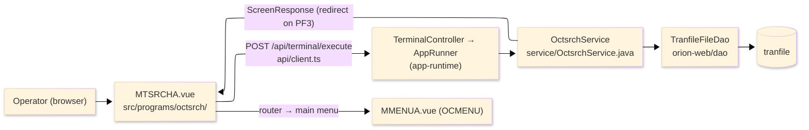
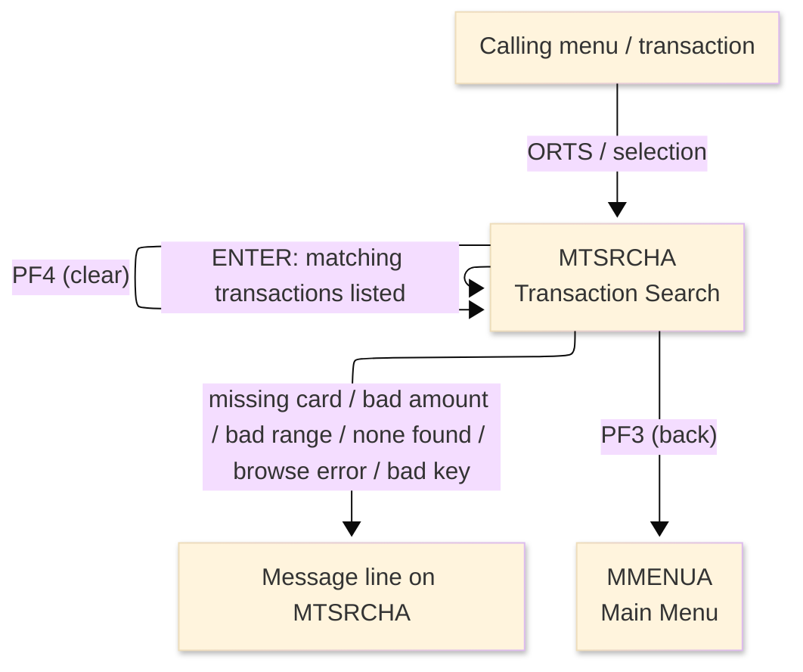
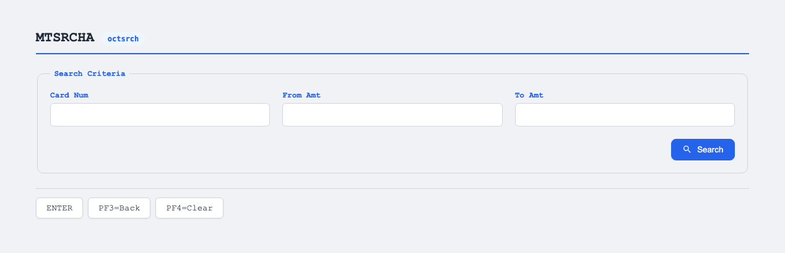

# TO-BE Screen Design — OCTSRCH_TransactionSearch

> **Rule 1: TO-BE = AS-IS in business terms.** The interface moves to a web SPA, but the
> input/output data, the check conditions, the business flow and the database results are
> preserved. The section order follows the AS-IS document so the two compare 1-to-1.

## 0. Cover

| Item | Content |
|---|---|
| System | ORION-CCMS (ORION Credit Card Management System) |
| Subsystem | On-line (was CICS/BMS; now Vue SPA + REST) |
| Function name | Transaction Search |
| Function ID | OCTSRCH（COBOL program）／Trans-ID `ORTS`／Map `MTSRCHA` |
| Module | `octsrch` |
| Platform | Java 17 · Spring Boot 3.x · Vue 3 + TypeScript · DB Oracle (H2 in dev) |
| Version ／ Author ／ Date | 1 ／ modernizeX ／ 2026-09-28 |

## 1. Function overview

### 1.1 Overview diagram

System architecture — the screen, the request path to the server, the program service it runs,
and the data store it browses for matching transactions.

### 1.2 Function overview

| # | Function | Implementation |
|---|---|---|
| 1 | Accept a card number and an amount range | The operator keys the card number and an optional from / to amount range into the entry boxes |
| 2 | Retrieve and display the matching transactions | The transaction file is browsed in key order and up to five transactions on that card within the amount range are shown, each on one result line |
| 3 | Report how many were shown | A summary line reports how many matching transactions were displayed |
| 4 | Let the operator clear and search again, or return to the menu | A clear action resets the entry; a back action returns the operator to the main menu |

**Roles ／ authorisation**: authenticated operator (signed on through the Sign On screen). Sign-on
state travels in the conversation carried between requests; no framework role gate is wired yet.

**Keys → operations** (the SPA renders each former PF key as a button):

| Key | Label as rendered (verbatim) | What it does |
|---|---|---|
| `ENTER` | `ENTER=PROCESS` | validate the entry and list the matching transactions |
| `PF3` | `PF3=BACK` | return to the main menu |
| `PF4` | `PF4=CLEAR` | clear the entry and return to the opening prompt |

> The middle column is the string the button really shows, copied from the program's button
> definitions. The physical PF keystrokes are not reproduced as keyboard shortcuts, so operators
> used to typing PF3 now click the `PF3=BACK` button — same action, one extra pointer move.

### 1.3 Databases used

| № | Business name | Table | C | R | U | D |
|---|---|---|---|---|---|---|
| 1 | Transaction master — browsed to match the card and amount range | `tranfile` | - | 〇 | - | - |

## 2. Screen spec

Screen transition of the whole function — every screen a box, every edge labelled with what moves
the operator. One search reads the transaction file and shows up to five matching lines.

### 2.1 MTSRCHA — Transaction Search

**Layout**

**Archetype applied**: filtered result list with a card and amount-range entry (`_archetypes/screenModel`,
LIST). The header carries the transaction/program/date/time meta strip; the body has a card number box
and a from/to amount range, and a five-line result list; a message line and a button row close the
screen.

| Area | Notes |
|---|---|
| Header (Tran/Prog/Date/Time) | meta strip above the title, filled by the server |
| Input area | one card number box and a from / to amount range |
| List area | up to five result lines, each a transaction id, type, amount and merchant name |
| Message line | inline alert / summary count below the list (was row 23 `ERRMSG`) |
| Button row | `ENTER=PROCESS`, `PF3=BACK`, `PF4=CLEAR` |

**Screen items**

_State legend: ○ shown · 必 must be entered · □ read-only · － not shown._

| № | Item name | Field | Type ／ length | Control | Required | Initial | Key prompt | Record shown | Notes |
|---|---|---|---|---|---|---|---|---|---|
| 1 | Card number | `CARDNUM` | text, 16 | entry box, 16 chars | 必 | ○ | 必 | □ | the card whose transactions are searched |
| 2 | From amount | `FRAMT` | amount text, 12 | entry box, 12 chars | - | ○ | ○ | □ | low end of the range; blank means from zero |
| 3 | To amount | `TOAMT` | amount text, 12 | entry box, 12 chars | - | ○ | ○ | □ | high end of the range; blank means no upper limit |
| 4 | Result line (each row) | `SR1`…`SR5` | text, 70 | read-only | - | － | □ | □ | one matching transaction per line — id, type, amount and merchant |

> **Length and format unchanged**: the card box accepts 16 characters, each amount box 12, and each
> result line keeps its 70-character width as on the terminal screen; the list shows at most five rows.

## 3. Check specifications

### 3.1 MTSRCHA — Transaction Search

All strings below are the literal messages the server returns to the on-screen message line.
Type: E=Error / I=Information.

| No. | What is checked | When it is checked | Message code | Message shown | If it fails |
|---|---|---|---|---|---|
| 1 | Opening prompt (informational) | when the screen first appears | — | Enter card and amount range, press ENTER. | not a failure; guides the operator |
| 2 | A card number must be entered | on `ENTER`, before the search | — | Card number is required. | nothing is listed; the entry stays |
| 3 | The from amount must be a valid number | on `ENTER`, when a from amount is keyed | — | From amount is not a valid number. | nothing is listed; the entry stays |
| 4 | The to amount must be a valid number | on `ENTER`, when a to amount is keyed | — | To amount is not a valid number. | nothing is listed; the entry stays |
| 5 | The from amount must not exceed the to amount | on `ENTER`, after both amounts are read | — | From amount cannot exceed to amount. | nothing is listed; the entry stays |
| 6 | The search must match at least one transaction | on `ENTER`, after the browse | — | No transactions in that range. | an empty list is shown |
| 7 | The transaction file must be browseable | on `ENTER`, during the browse | — | Error browsing the transaction file. | no rows are shown |
| 8 | Result summary (informational) | after a page of matches is listed | — | … match(es) displayed. | not a failure; reports the row count |
| 9 | Only a supported key may be used | on any key press | — | Invalid key pressed. Please try again. | the screen is redisplayed unchanged |

## 4. Event specifications

### 4.1 MTSRCHA — Transaction Search

| No. | Event | What the system does | Result ／ next screen |
|---|---|---|---|
| 1 | The operator keys a card number and amount range and presses `ENTER` | the entry is validated and up to five matching transactions on that card within the range are listed with a count | stays on Transaction Search with the matches, or a message when the entry is invalid or nothing matches |
| 2 | The operator presses `PF4` | the entry is cleared and the opening prompt returns | stays on Transaction Search, ready for a new search |
| 3 | The operator presses `PF3` | the search ends and control returns to the calling menu | the main menu appears |
| 4 | The operator presses an unsupported key | the request is rejected and a message is shown | stays on Transaction Search, unchanged |

## 5. DB CRUD

**Update spec**

Not applicable — Transaction Search only reads; no row is created, updated or deleted. The transaction
file is browsed in key order (`tranfile`, ORDER BY `tr_id`); each row is kept when its card number
equals the keyed card and its amount falls within the from / to range, and the browse stops once five
matches are found or the file ends.

**Column-level CRUD (per event ／ business type)**

| Table | Operation | Field | Value source | Transaction |
|---|---|---|---|---|
| `tranfile` | SELECT (start / read next by key) | transaction id, type, amount, merchant name | the keyed card number and the from / to amount range | read-only; no commit |

## 6. API contract

| Request | Response | What it does | Errors |
|---|---|---|---|
| `POST /api/terminal/execute` — `{ programName: "OCTSRCH", aidKey, fields: { CARDNUM, FRAMT, TOAMT } }` | `ScreenResponse` — `{ fields: { SR1, SR2, SR3, SR4, SR5 }, message, buttons }` | browses the transaction file and returns up to five matching lines with a count | missing card → "Card number is required."; bad from → "From amount is not a valid number."; bad to → "To amount is not a valid number."; from over to → "From amount cannot exceed to amount."; none → "No transactions in that range." |

FE types: `src/programs/octsrch/schemas.d.ts` (`MTSRCHAFields`) · client: `src/api/client.ts` ·
endpoint: `TerminalController` (`/api/terminal/execute`), one round-trip per key press (CICS
pseudo-conversation preserved through the HTTP session).
