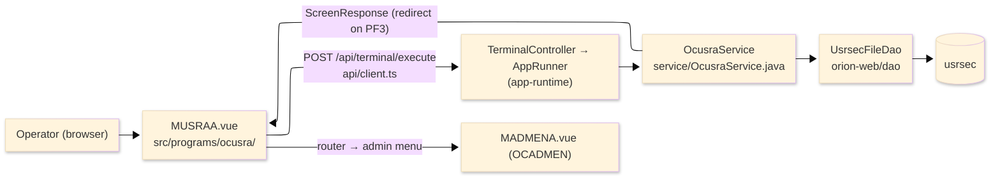
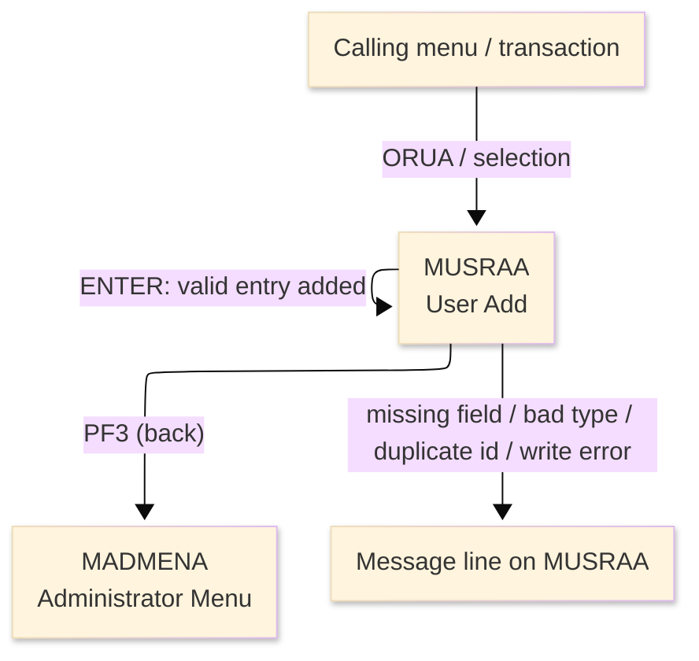
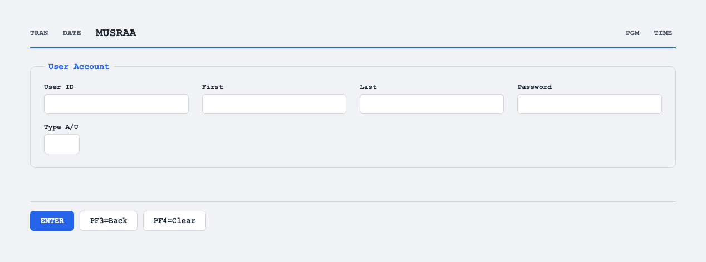

# TO-BE Screen Design — OCUSRA_UserAdd

> **Rule 1: TO-BE = AS-IS in business terms.** The interface moves to a web SPA, but the
> input/output data, the check conditions, the business flow and the database results are
> preserved. The section order follows the AS-IS document so the two compare 1-to-1.

## 0. Cover

| Item | Content |
|---|---|
| System | ORION-CCMS (ORION Credit Card Management System) |
| Subsystem | On-line (was CICS/BMS; now Vue SPA + REST) |
| Function name | User Add |
| Function ID | OCUSRA（COBOL program）／Trans-ID `ORUA`／Map `MUSRAA` |
| Module | `ocusra` |
| Platform | Java 17 · Spring Boot 3.x · Vue 3 + TypeScript · DB Oracle (H2 in dev) |
| Version ／ Author ／ Date | 1 ／ modernizeX ／ 2026-09-28 |

## 1. Function overview

### 1.1 Overview diagram

System architecture — the screen, the request path to the server, the program service it runs,
and the data store it writes.

### 1.2 Function overview

| # | Function | Implementation |
|---|---|---|
| 1 | Accept the details for a new user | The operator keys the id, first and last name, password and the account type |
| 2 | Validate the entry against the business rules | Each required field is checked and the type must be admin or user before anything is stored |
| 3 | Create the new user on confirmation | A new user-security record is added under the keyed id; a duplicate id is rejected |
| 4 | Return to the administrator menu when finished | The back action ends the add and hands control to the administrator menu |

**Roles ／ authorisation**: authenticated operator (signed on through the Sign On screen). Sign-on
state travels in the conversation carried between requests; no framework role gate is wired yet.

**Keys → operations** (the SPA renders each former PF key as a button):

| Key | Label as rendered (verbatim) | What it does |
|---|---|---|
| `ENTER` | `ENTER=PROCESS` | validate the entry and, when valid, add the new user |
| `PF3` | `PF3=BACK` | return to the administrator menu |
| `PF4` | `PF4=CLEAR` | clear the entered values so the operator can start again |

> The middle column is the string the button really shows, copied from the program's button
> definitions. The physical PF keystrokes are not reproduced as keyboard shortcuts, so operators
> used to typing PF3 now click the `PF3=BACK` button — same action, one extra pointer move.

### 1.3 Databases used

| № | Business name | Table | C | R | U | D |
|---|---|---|---|---|---|---|
| 1 | User security — a new user row is inserted under the keyed id | `usrsec` | 〇 | - | - | - |

## 2. Screen spec

Screen transition of the whole function — every screen a box, every edge labelled with what moves
the operator.

### 2.1 MUSRAA — User Add

**Layout**

**Archetype applied**: data-entry form that creates a record (`_archetypes/screenModel`). The header
carries the transaction/program/date/time meta strip; the body has one entry block for the new user
details; a message line and a button row close the screen.

| Area | Notes |
|---|---|
| Header (Tran/Prog/Date/Time) | meta strip above the title, filled by the server |
| Input area | five entry boxes — user id, first name, last name, password, type |
| Message line | inline alert below the form (was row 23 `ERRMSG`) |
| Button row | `ENTER=PROCESS`, `PF3=BACK`, `PF4=CLEAR` |

**Screen items**

_State legend: ○ shown · 必 must be entered · □ read-only · － not shown._

| № | Item name | Field | Type ／ length | Control | Required | Initial | Key prompt | Record shown | Notes |
|---|---|---|---|---|---|---|---|---|---|
| 1 | User ID | `USERID` | text, 8 | entry box, 8 chars | 必 | ○ | 必 | － | record key of the new user |
| 2 | First name | `USFNAM` | text, 20 | entry box, 20 chars | 必 | ○ | － | － | kept at 20 as in the source |
| 3 | Last name | `USLNAM` | text, 20 | entry box, 20 chars | 必 | ○ | － | － | kept at 20 as in the source |
| 4 | Password | `USPWD` | text, 8 | entry box, 8 chars | 必 | ○ | － | － | rendered masked (dark) on entry |
| 5 | Type A/U | `USTYPE` | text, 1 | entry box, 1 char | 必 | ○ | － | － | must be `A` (admin) or `U` (user) |

> **Length and format unchanged**: the id and password keep 8 characters, the names keep 20, the
> type keeps 1 — the server validates and stores the same widths as the terminal screen.

## 3. Check specifications

### 3.1 MUSRAA — User Add

All strings below are the literal messages the server returns to the on-screen message line.
Type: E=Error / I=Information.

| No. | What is checked | When it is checked | Message code | Message shown | If it fails |
|---|---|---|---|---|---|
| 1 | Opening prompt (informational) | when the screen first appears | — | Enter new user details and press ENTER. | not a failure; guides the operator |
| 2 | The user id must be entered | on `ENTER`, before storing | — | User id is required. | the entry stays; nothing is stored |
| 3 | The first name must be entered | on `ENTER`, before storing | — | First name is required. | the entry stays; nothing is stored |
| 4 | The last name must be entered | on `ENTER`, before storing | — | Last name is required. | the entry stays; nothing is stored |
| 5 | The password must be entered | on `ENTER`, before storing | — | Password is required. | the entry stays; nothing is stored |
| 6 | The type must be admin or user | on `ENTER`, before storing | — | Type must be A (admin) or U (user). | the entry stays; nothing is stored |
| 7 | The id must not already exist | on `ENTER`, during the insert | — | User id already exists. | the entry stays; no row is added |
| 8 | The user store must be writable | on `ENTER`, during the insert | — | Error writing user file. | the entry stays; no row is added |
| 9 | Successful add (informational) | on `ENTER`, after the insert | — | User added successfully. | not a failure; the entry is cleared |
| 10 | Only a supported key may be used | on any key press | — | Invalid key pressed. Please try again. | the screen is redisplayed unchanged |

## 4. Event specifications

### 4.1 MUSRAA — User Add

| No. | Event | What the system does | Result ／ next screen |
|---|---|---|---|
| 1 | The operator fills the details and presses `ENTER` | the entry is validated and, when every rule passes, a new user is added under the keyed id | stays on User Add with a success message, or a message when a field is missing, the type is wrong or the id already exists |
| 2 | The operator presses `PF3` | the add ends and control returns to the administrator menu | the administrator menu appears |
| 3 | The operator presses `PF4` | the entered values are cleared and the opening prompt returns | stays on User Add, ready for a new user |
| 4 | The operator presses an unsupported key | the request is rejected and a message is shown | stays on User Add, unchanged |

## 5. DB CRUD

**Update spec**

On `ENTER`, once the entry passes validation, one new row is inserted into `usrsec` under the keyed
user id. A duplicate id is rejected (no row added) and a store failure is reported; the screen only
reads back after a successful add to clear the form. No row is updated or deleted here.

**Column-level CRUD (per event ／ business type)**

| Table | Operation | Field | Value source | Transaction |
|---|---|---|---|---|
| `usrsec` | INSERT (create) | `US-ID` (key) | the user id the operator entered | `ENTER`: add — commit on success |
| `usrsec` | INSERT (create) | `US-FIRST-NAME` | the first name the operator entered | `ENTER`: add — commit on success |
| `usrsec` | INSERT (create) | `US-LAST-NAME` | the last name the operator entered | `ENTER`: add — commit on success |
| `usrsec` | INSERT (create) | `US-PASSWORD` | the password the operator entered | `ENTER`: add — commit on success |
| `usrsec` | INSERT (create) | `US-TYPE` | the type the operator entered (`A`/`U`) | `ENTER`: add — commit on success |

## 6. API contract

| Request | Response | What it does | Errors |
|---|---|---|---|
| `POST /api/terminal/execute` — `{ programName: "OCUSRA", aidKey, fields: { USERID, USFNAM, USLNAM, USPWD, USTYPE } }` | `ScreenResponse` — `{ fields, message, buttons }` | validates the entry and inserts a new user row under the keyed id, then reports success or the failing rule | blank field → "User id is required." / "First name is required." / "Last name is required." / "Password is required."; bad type → "Type must be A (admin) or U (user)."; duplicate → "User id already exists."; write error → "Error writing user file." |

FE types: `src/programs/ocusra/schemas.d.ts` (`MUSRAAFields`) · client: `src/api/client.ts` ·
endpoint: `TerminalController` (`/api/terminal/execute`), one round-trip per key press (CICS
pseudo-conversation preserved through the HTTP session).
