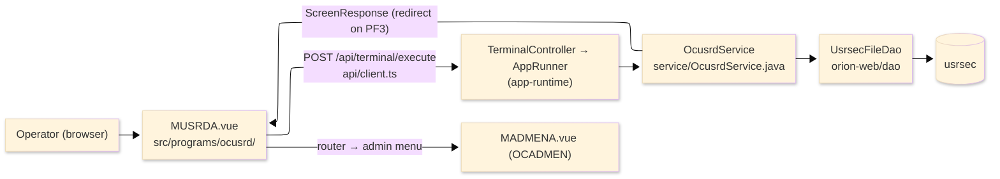
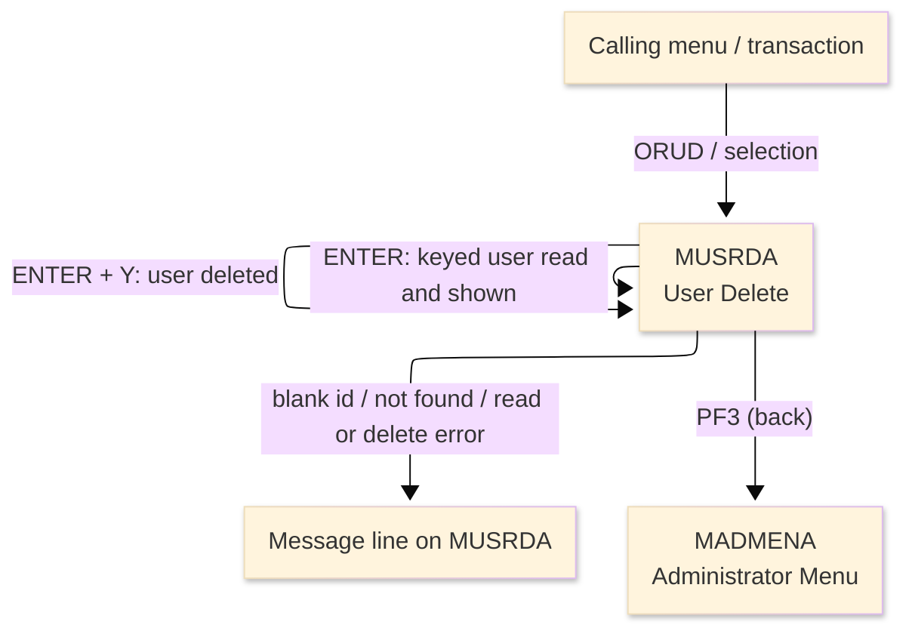
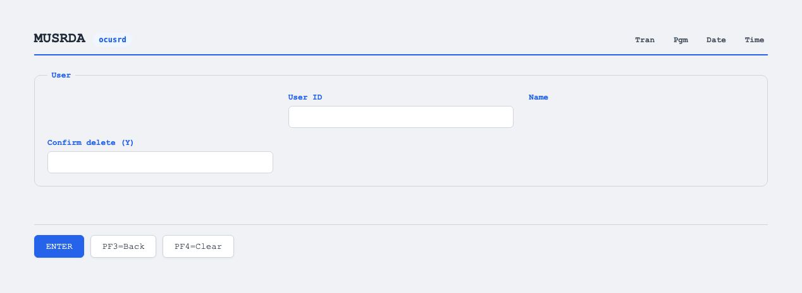

# TO-BE Screen Design — OCUSRD_UserDelete

> **Rule 1: TO-BE = AS-IS in business terms.** The interface moves to a web SPA, but the
> input/output data, the check conditions, the business flow and the database results are
> preserved. The section order follows the AS-IS document so the two compare 1-to-1.

## 0. Cover

| Item | Content |
|---|---|
| System | ORION-CCMS (ORION Credit Card Management System) |
| Subsystem | On-line (was CICS/BMS; now Vue SPA + REST) |
| Function name | User Delete |
| Function ID | OCUSRD（COBOL program）／Trans-ID `ORUD`／Map `MUSRDA` |
| Module | `ocusrd` |
| Platform | Java 17 · Spring Boot 3.x · Vue 3 + TypeScript · DB Oracle (H2 in dev) |
| Version ／ Author ／ Date | 1 ／ modernizeX ／ 2026-09-28 |

## 1. Function overview

### 1.1 Overview diagram

System architecture — the screen, the request path to the server, the program service it runs,
and the data store it reads and deletes from.

### 1.2 Function overview

| # | Function | Implementation |
|---|---|---|
| 1 | Look up the user to be removed and show it for confirmation | The operator keys the id and the matching user-security record is read by primary key from `usrsec` |
| 2 | Delete the user once the operator confirms | Typing `Y` and pressing `ENTER` removes the keyed row from `usrsec` |
| 3 | Report the outcome of the deletion | The screen shows whether the delete succeeded, was cancelled, or failed |
| 4 | Return to the administrator menu when finished | The back action ends the delete and hands control to the administrator menu |

**Roles ／ authorisation**: authenticated operator (signed on through the Sign On screen). Sign-on
state travels in the conversation carried between requests; no framework role gate is wired yet.

**Keys → operations** (the SPA renders each former PF key as a button):

| Key | Label as rendered (verbatim) | What it does |
|---|---|---|
| `ENTER` | `ENTER=PROCESS` | read the keyed user, then delete it once confirmed |
| `PF3` | `PF3=BACK` | return to the administrator menu |
| `PF4` | `PF4=CLEAR` | clear the entered values so the operator can start again |

> The middle column is the string the button really shows, copied from the program's button
> definitions. The physical PF keystrokes are not reproduced as keyboard shortcuts, so operators
> used to typing PF3 now click the `PF3=BACK` button — same action, one extra pointer move.

### 1.3 Databases used

| № | Business name | Table | C | R | U | D |
|---|---|---|---|---|---|---|
| 1 | User security — read by id to confirm, then deleted by key | `usrsec` | - | 〇 | - | 〇 |

## 2. Screen spec

Screen transition of the whole function — every screen a box, every edge labelled with what moves
the operator.

### 2.1 MUSRDA — User Delete

**Layout**

**Archetype applied**: confirm-and-delete form with a single lookup key (`_archetypes/screenModel`).
The header carries the transaction/program/date/time meta strip; the body has one lookup box, a
read-only name shown before the delete and a confirm box; a message line and a button row close the
screen.

| Area | Notes |
|---|---|
| Header (Tran/Prog/Date/Time) | meta strip above the title, filled by the server |
| Input area | user id lookup box and the confirm-delete box |
| Details area | read-only user name shown before the delete |
| Message line | inline alert below the form (was row 23 `ERRMSG`) |
| Button row | `ENTER=PROCESS`, `PF3=BACK`, `PF4=CLEAR` |

**Screen items**

_State legend: ○ shown · 必 must be entered · □ read-only · － not shown._

| № | Item name | Field | Type ／ length | Control | Required | Initial | Look up | Confirm delete | Notes |
|---|---|---|---|---|---|---|---|---|---|
| 1 | User ID | `USERID` | text, 8 | entry box, 8 chars | 必 | ○ | 必 | □ | record key of the user to remove |
| 2 | Name | `USNAME` | text, 40 | read-only | - | － | － | □ | first and last name shown before the delete |
| 3 | Confirm delete (Y) | `USCONF` | text, 1 | entry box, 1 char | - | ○ | ○ | 必 | type `Y` and press `ENTER` to delete |

> **Length and format unchanged**: the id box keeps 8 characters, the name is shown at 40 and the
> confirm box at 1 — the server reads, shows and deletes on the same key width as the terminal screen.

## 3. Check specifications

### 3.1 MUSRDA — User Delete

All strings below are the literal messages the server returns to the on-screen message line.
Type: E=Error / I=Information.

| No. | What is checked | When it is checked | Message code | Message shown | If it fails |
|---|---|---|---|---|---|
| 1 | Opening prompt (informational) | when the screen first appears | — | Enter a user id and press ENTER. | not a failure; guides the operator |
| 2 | The user id must be entered | on `ENTER`, before the lookup | — | Please enter all required fields. | the entry stays; nothing is read |
| 3 | The keyed user must exist | on `ENTER`, after the lookup | — | User not found. | the entry stays; no details are shown |
| 4 | The user store must be readable | on `ENTER`, during the lookup | — | Error reading user file. | the entry stays; no details are shown |
| 5 | Confirmation prompt (informational) | after the user is found and shown | — | Type Y and press ENTER to delete this user. | not a failure; asks the operator to confirm |
| 6 | The user must still exist at delete | on `ENTER`, during the delete | — | User no longer exists. | the details stay; no row is removed |
| 7 | The user store must be writable | on `ENTER`, during the delete | — | Error deleting user file. | the details stay; no row is removed |
| 8 | Successful delete (informational) | on `ENTER`, after the delete | — | User deleted successfully. | not a failure; the screen is reset |
| 9 | Delete not confirmed | on `ENTER`, when the confirm box is not `Y` | — | Delete cancelled. | no row is removed; the screen is reset |
| 10 | Only a supported key may be used | on any key press | — | Invalid key pressed. Please try again. | the screen is redisplayed unchanged |

## 4. Event specifications

### 4.1 MUSRDA — User Delete

| No. | Event | What the system does | Result ／ next screen |
|---|---|---|---|
| 1 | The operator keys a user id and presses `ENTER` | the keyed user is read and, when found, its name is shown with a prompt to confirm the delete | stays on User Delete with the user shown, or a message when the id is blank or not found |
| 2 | The operator types `Y` in the confirm box and presses `ENTER` | the shown user is removed from the user store | stays on User Delete with a success message, or a message when it no longer exists or the store cannot be written |
| 3 | The operator leaves the confirm box other than `Y` and presses `ENTER` | the delete is abandoned and the screen is reset | stays on User Delete, ready for another id |
| 4 | The operator presses `PF3` | the delete ends and control returns to the administrator menu | the administrator menu appears |
| 5 | The operator presses `PF4` | the entered values are cleared and the opening prompt returns | stays on User Delete, ready for a new id |
| 6 | The operator presses an unsupported key | the request is rejected and a message is shown | stays on User Delete, unchanged |

## 5. DB CRUD

**Update spec**

On `ENTER` the keyed row is first read from `usrsec` and its name is shown for confirmation; once the
operator types `Y` and presses `ENTER` again, the same keyed row is deleted. A row that has gone
missing before the delete is reported, and a store failure is reported; nothing is created or updated
by this screen.

**Column-level CRUD (per event ／ business type)**

| Table | Operation | Field | Value source | Transaction |
|---|---|---|---|---|
| `usrsec` | SELECT (read by key) | whole record | the user id the operator entered | `ENTER`: show the user before deleting |
| `usrsec` | DELETE (remove by key) | `US-ID` (key) | the shown user id | `ENTER` + `Y`: delete — commit on confirm |

## 6. API contract

| Request | Response | What it does | Errors |
|---|---|---|---|
| `POST /api/terminal/execute` — `{ programName: "OCUSRD", aidKey, fields: { USERID, USCONF } }` | `ScreenResponse` — `{ fields: { USNAME }, message, buttons }` | reads the keyed user and, once confirmed, deletes it | blank id → "Please enter all required fields."; missing → "User not found."; read error → "Error reading user file."; gone at delete → "User no longer exists."; write error → "Error deleting user file." |

FE types: `src/programs/ocusrd/schemas.d.ts` (`MUSRDAFields`) · client: `src/api/client.ts` ·
endpoint: `TerminalController` (`/api/terminal/execute`), one round-trip per key press (CICS
pseudo-conversation preserved through the HTTP session; the confirm stage travels in the conversation
between requests).
