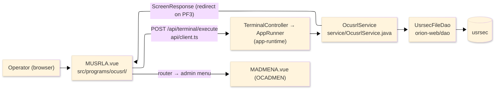
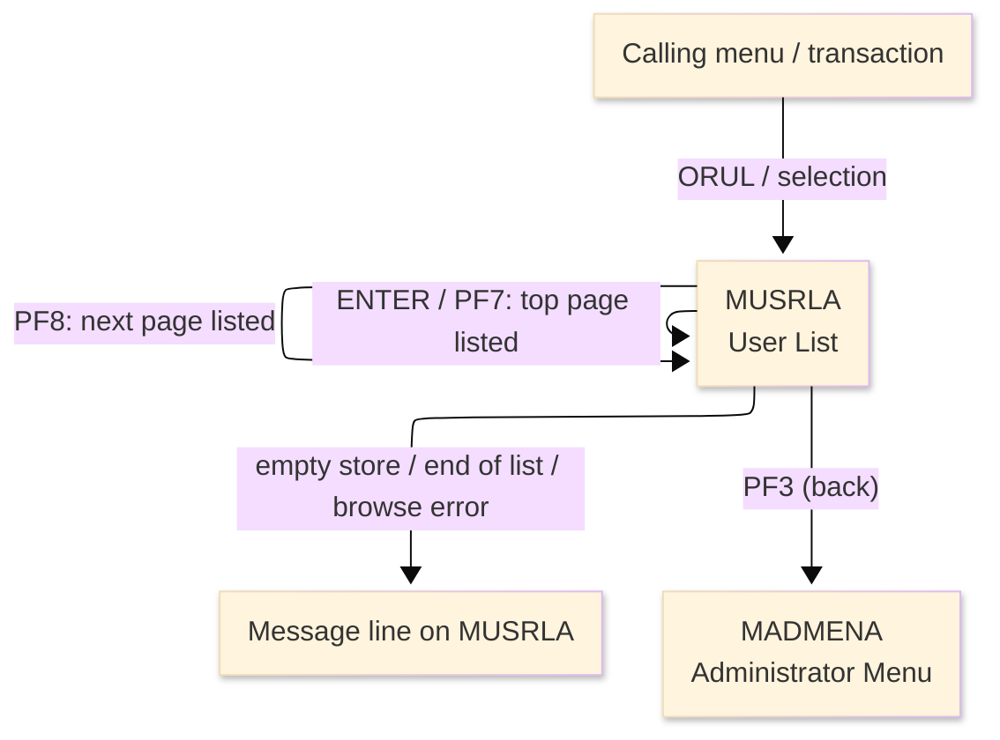
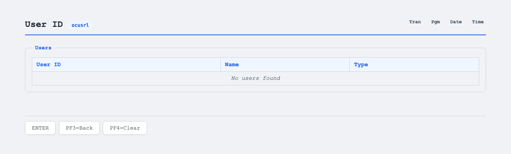

# TO-BE Screen Design — OCUSRL_UserList

> **Rule 1: TO-BE = AS-IS in business terms.** The interface moves to a web SPA, but the
> input/output data, the check conditions, the business flow and the database results are
> preserved. The section order follows the AS-IS document so the two compare 1-to-1.

## 0. Cover

| Item | Content |
|---|---|
| System | ORION-CCMS (ORION Credit Card Management System) |
| Subsystem | On-line (was CICS/BMS; now Vue SPA + REST) |
| Function name | User List |
| Function ID | OCUSRL（COBOL program）／Trans-ID `ORUL`／Map `MUSRLA` |
| Module | `ocusrl` |
| Platform | Java 17 · Spring Boot 3.x · Vue 3 + TypeScript · DB Oracle (H2 in dev) |
| Version ／ Author ／ Date | 1 ／ modernizeX ／ 2026-09-28 |

## 1. Function overview

### 1.1 Overview diagram

System architecture — the screen, the request path to the server, the program service it runs,
and the data store it browses.

### 1.2 Function overview

| # | Function | Implementation |
|---|---|---|
| 1 | List the users a page at a time | Up to four users are read in ascending id order from `usrsec`, starting at the top of the file |
| 2 | Let the operator page forward through the users | The forward action continues the browse from where the previous page ended |
| 3 | Let the operator jump back to the top | The top action restarts the listing at the first user |
| 4 | Return to the administrator menu when finished | The back action ends the list and returns the operator to the administrator menu |

**Roles ／ authorisation**: authenticated operator (signed on through the Sign On screen). Sign-on
state travels in the conversation carried between requests; no framework role gate is wired yet.

**Keys → operations** (the SPA renders each former PF key as a button):

| Key | Label as rendered (verbatim) | What it does |
|---|---|---|
| `ENTER` | `ENTER=PROCESS` | list the first page of users from the top |
| `PF3` | `PF3=BACK` | return to the administrator menu |
| `PF4` | `PF4=CLEAR` | clear the list and start again from the top |
| `PF7` | `PF7` | return to the top page of users |
| `PF8` | `PF8` | page forward to the next page of users |

> The middle column is the string the button really shows, copied from the program's button
> definitions. The physical PF keystrokes are not reproduced as keyboard shortcuts, so operators
> used to typing PF8 now click the `PF8` button — same action, one extra pointer move.

### 1.3 Databases used

| № | Business name | Table | C | R | U | D |
|---|---|---|---|---|---|---|
| 1 | User security — browsed in id order to fill the page | `usrsec` | - | 〇 | - | - |

## 2. Screen spec

Screen transition of the whole function — every screen a box, every edge labelled with what moves
the operator.

### 2.1 MUSRLA — User List

**Layout**

**Archetype applied**: paged browse list, filled top-down, with no key entry
(`_archetypes/screenModel`). The header carries the transaction/program/date/time meta strip; the
body is a four-row grid of user id, name and type; a message line and a button row close the screen.

| Area | Notes |
|---|---|
| Header (Tran/Prog/Date/Time) | meta strip above the title, filled by the server |
| List area | four rows of user id, name and type, filled top-down each page |
| Message line | inline alert / paging hint below the grid (was row 23 `ERRMSG`) |
| Button row | `ENTER=PROCESS`, `PF3=BACK`, `PF4=CLEAR`, `PF7`, `PF8` |

**Screen items**

_State legend: ○ shown · 必 must be entered · □ read-only · － not shown._

| № | Item name | Field | Type ／ length | Control | Required | Initial | Empty list | Page shown | Notes |
|---|---|---|---|---|---|---|---|---|---|
| 1 | User ID (rows 1–4) | `USR1`…`USR4` | text, 8 | read-only | - | － | － | □ | one user id per grid row |
| 2 | Name (rows 1–4) | `UNM1`…`UNM4` | text, 25 | read-only | - | － | － | □ | first and last name |
| 3 | Type (rows 1–4) | `UTY1`…`UTY4` | text, 1 | read-only | - | － | － | □ | `A` (admin) or `U` (user) |

> **Length and format unchanged**: each grid column keeps the same width as the terminal screen
> (8 / 25 / 1 characters) and a page still shows at most four rows.

## 3. Check specifications

### 3.1 MUSRLA — User List

All strings below are the literal messages the server returns to the on-screen message line.
Type: E=Error / I=Information.

| No. | What is checked | When it is checked | Message code | Message shown | If it fails |
|---|---|---|---|---|---|
| 1 | Empty result (informational) | on `ENTER` / `PF7`, when no users exist | — | No users found. | not a failure; the grid stays empty |
| 2 | Paging hint (informational) | after a page is listed | — | PF8 next page  PF7 top  PF3 exit. | not a failure; guides the operator |
| 3 | Top-of-list hint (informational) | on `ENTER` / `PF7`, at the first page | — | Top of list. PF8 next page. | not a failure; confirms the top page |
| 4 | End of list (informational) | on `PF8`, when no more rows follow | — | No more users to display. | not a failure; the grid stays on the last page |
| 5 | The user store must open for browse | on `ENTER` / `PF7` / `PF8`, when the browse starts | — | Error starting user browse. | the grid is cleared; no rows are shown |
| 6 | The user store must be readable | while reading each row | — | Error reading user file. | the browse stops; the rows read so far stay |
| 7 | Only a supported key may be used | on any key press | — | Invalid key pressed. Please try again. | the screen is redisplayed unchanged |

## 4. Event specifications

### 4.1 MUSRLA — User List

| No. | Event | What the system does | Result ／ next screen |
|---|---|---|---|
| 1 | The operator presses `ENTER` | the first page of users is listed from the top of the file | stays on User List with the page filled, or "No users found." when the store is empty |
| 2 | The operator presses `PF8` | the next page of users is listed, continuing from where the last page ended | stays on User List with the next page, or an end-of-list message |
| 3 | The operator presses `PF7` | the listing returns to the top page of users | stays on User List showing the first page |
| 4 | The operator presses `PF3` | the list ends and control returns to the administrator menu | the administrator menu appears |
| 5 | The operator presses `PF4` | the list is cleared and redisplayed from the top | stays on User List showing the first page |
| 6 | The operator presses an unsupported key | the request is rejected and a message is shown | stays on User List, unchanged |

## 5. DB CRUD

**Update spec**

Not applicable — User List only reads; no row is created, updated or deleted.

**Column-level CRUD (per event ／ business type)**

| Table | Operation | Field | Value source | Transaction |
|---|---|---|---|---|
| `usrsec` | Browse (start / read next by key) | user id, name, type | the top of the file, then the next key each page | read-only; no commit |

## 6. API contract

| Request | Response | What it does | Errors |
|---|---|---|---|
| `POST /api/terminal/execute` — `{ programName: "OCUSRL", aidKey, fields: {} }` | `ScreenResponse` — `{ fields: { USR1..USR4, UNM1..UNM4, UTY1..UTY4 }, message, buttons }` | browses users from the top and returns up to four rows per page plus a paging hint | empty store → "No users found."; browse open error → "Error starting user browse."; read error → "Error reading user file." |

FE types: `src/programs/ocusrl/schemas.d.ts` (`MUSRLAFields`) · client: `src/api/client.ts` ·
endpoint: `TerminalController` (`/api/terminal/execute`), one round-trip per key press (CICS
pseudo-conversation preserved through the HTTP session; the next-page start key travels in the
conversation between requests).
