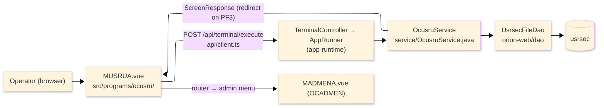
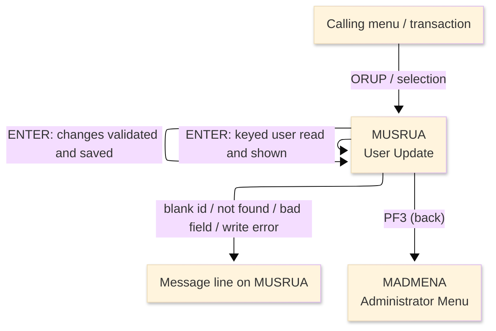
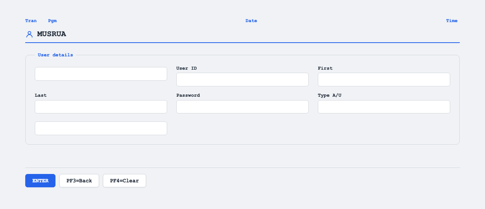

# TO-BE Screen Design — OCUSRU_UserUpdate

> **Rule 1: TO-BE = AS-IS in business terms.** The interface moves to a web SPA, but the
> input/output data, the check conditions, the business flow and the database results are
> preserved. The section order follows the AS-IS document so the two compare 1-to-1.

## 0. Cover

| Item | Content |
|---|---|
| System | ORION-CCMS (ORION Credit Card Management System) |
| Subsystem | On-line (was CICS/BMS; now Vue SPA + REST) |
| Function name | User Update |
| Function ID | OCUSRU（COBOL program）／Trans-ID `ORUP`／Map `MUSRUA` |
| Module | `ocusru` |
| Platform | Java 17 · Spring Boot 3.x · Vue 3 + TypeScript · DB Oracle (H2 in dev) |
| Version ／ Author ／ Date | 1 ／ modernizeX ／ 2026-09-28 |

## 1. Function overview

### 1.1 Overview diagram

System architecture — the screen, the request path to the server, the program service it runs,
and the data store it reads and rewrites.

### 1.2 Function overview

| # | Function | Implementation |
|---|---|---|
| 1 | Look up the user by id and show the current values | The operator keys the id and the matching user-security record is read by primary key from `usrsec` |
| 2 | Let the operator change the editable fields | First name, last name, password and account type can be edited on screen |
| 3 | Validate the changes and save them | Each required field is checked and the type must be admin or user before the row is rewritten in `usrsec` |
| 4 | Return to the administrator menu when finished | The back action ends the update and hands control to the administrator menu |

**Roles ／ authorisation**: authenticated operator (signed on through the Sign On screen). Sign-on
state travels in the conversation carried between requests; no framework role gate is wired yet.

**Keys → operations** (the SPA renders each former PF key as a button):

| Key | Label as rendered (verbatim) | What it does |
|---|---|---|
| `ENTER` | `ENTER=PROCESS` | look up the user, then save the changed values |
| `PF3` | `PF3=BACK` | return to the administrator menu |
| `PF4` | `PF4=CLEAR` | clear the entered values so the operator can start again |

> The middle column is the string the button really shows, copied from the program's button
> definitions. The physical PF keystrokes are not reproduced as keyboard shortcuts, so operators
> used to typing PF3 now click the `PF3=BACK` button — same action, one extra pointer move.

### 1.3 Databases used

| № | Business name | Table | C | R | U | D |
|---|---|---|---|---|---|---|
| 1 | User security — read by id, then rewritten by key | `usrsec` | - | 〇 | 〇 | - |

## 2. Screen spec

Screen transition of the whole function — every screen a box, every edge labelled with what moves
the operator.

### 2.1 MUSRUA — User Update

**Layout**

**Archetype applied**: fetch-then-edit form with a single lookup key (`_archetypes/screenModel`).
The header carries the transaction/program/date/time meta strip; the body has one lookup box and an
editable block of user details; a message line and a button row close the screen.

| Area | Notes |
|---|---|
| Header (Tran/Prog/Date/Time) | meta strip above the title, filled by the server |
| Input area | user id lookup box, then the editable first name, last name, password and type |
| Message line | inline alert below the form (was row 23 `ERRMSG`) |
| Button row | `ENTER=PROCESS`, `PF3=BACK`, `PF4=CLEAR` |

**Screen items**

_State legend: ○ shown · 必 must be entered · □ read-only · － not shown._

| № | Item name | Field | Type ／ length | Control | Required | Initial | Look up | Edit ＆ save | Notes |
|---|---|---|---|---|---|---|---|---|---|
| 1 | User ID | `USERID` | text, 8 | entry box, 8 chars | 必 | ○ | 必 | □ | record key; read-only once loaded |
| 2 | First name | `USFNAM` | text, 20 | entry box, 20 chars | - | － | － | 必 | editable after the user is loaded |
| 3 | Last name | `USLNAM` | text, 20 | entry box, 20 chars | - | － | － | 必 | editable after the user is loaded |
| 4 | Password | `USPWD` | text, 8 | entry box, 8 chars | - | － | － | 必 | editable; rendered masked (dark) on entry |
| 5 | Type A/U | `USTYPE` | text, 1 | entry box, 1 char | - | － | － | 必 | must be `A` (admin) or `U` (user) |

> **Length and format unchanged**: the id and password keep 8 characters, the names keep 20, the type
> keeps 1 — the server validates and rewrites the same widths as the terminal screen.

## 3. Check specifications

### 3.1 MUSRUA — User Update

All strings below are the literal messages the server returns to the on-screen message line.
Type: E=Error / I=Information.

| No. | What is checked | When it is checked | Message code | Message shown | If it fails |
|---|---|---|---|---|---|
| 1 | Opening prompt (informational) | when the screen first appears | — | Enter a user id and press ENTER. | not a failure; guides the operator |
| 2 | The user id must be entered | on `ENTER`, before the lookup | — | Please enter all required fields. | the entry stays; nothing is read |
| 3 | The keyed user must exist | on `ENTER`, after the lookup | — | User not found. | the entry stays; no values are shown |
| 4 | The user store must be readable | on `ENTER`, during the lookup | — | Error reading user file. | the entry stays; no values are shown |
| 5 | Edit prompt (informational) | after the user is found and shown | — | Modify fields and press ENTER to update. | not a failure; invites the operator to edit |
| 6 | The first name must be entered | on `ENTER`, before saving | — | First name is required. | the values stay; nothing is saved |
| 7 | The last name must be entered | on `ENTER`, before saving | — | Last name is required. | the values stay; nothing is saved |
| 8 | The password must be entered | on `ENTER`, before saving | — | Password is required. | the values stay; nothing is saved |
| 9 | The type must be admin or user | on `ENTER`, before saving | — | Type must be A (admin) or U (user). | the values stay; nothing is saved |
| 10 | The user must still exist at save | on `ENTER`, during the save | — | User no longer exists. | the values stay; no row is written |
| 11 | The user store must be re-readable to save | on `ENTER`, during the save | — | Error reading user for update. | the values stay; no row is written |
| 12 | The user store must be writable | on `ENTER`, during the save | — | Error updating user file. | the values stay; no row is written |
| 13 | Successful save (informational) | on `ENTER`, after the save | — | User updated successfully. | not a failure; the screen is reset |
| 14 | Only a supported key may be used | on any key press | — | Invalid key pressed. Please try again. | the screen is redisplayed unchanged |

## 4. Event specifications

### 4.1 MUSRUA — User Update

| No. | Event | What the system does | Result ／ next screen |
|---|---|---|---|
| 1 | The operator keys a user id and presses `ENTER` | the keyed user is read and its current values are shown for editing | stays on User Update with the values shown, or a message when the id is blank or not found |
| 2 | The operator changes the fields and presses `ENTER` | the changes are validated and, when every rule passes, written back to the user record | stays on User Update with a success message, or a message when a field is missing or the type is wrong |
| 3 | The operator presses `PF3` | the update ends and control returns to the administrator menu | the administrator menu appears |
| 4 | The operator presses `PF4` | the entered values are cleared and the opening prompt returns | stays on User Update, ready for a new id |
| 5 | The operator presses an unsupported key | the request is rejected and a message is shown | stays on User Update, unchanged |

## 5. DB CRUD

**Update spec**

On `ENTER` at the lookup stage the keyed row is read from `usrsec` to show the current values. On
`ENTER` at the edit stage, once every rule passes, the same row is re-read for update and rewritten
with the changed first name, last name, password and type; the id (key) is unchanged. A row that has
gone missing before the save is reported and nothing is written. No row is created or deleted here.

**Column-level CRUD (per event ／ business type)**

| Table | Operation | Field | Value source | Transaction |
|---|---|---|---|---|
| `usrsec` | SELECT (read by key) | whole record | the user id the operator entered | `ENTER` (lookup): show current values |
| `usrsec` | UPDATE (rewrite by key) | `US-ID` (key) | the keyed id (unchanged) | `ENTER` (save): commit on success |
| `usrsec` | UPDATE (rewrite by key) | `US-FIRST-NAME` | the first name the operator entered | `ENTER` (save): commit on success |
| `usrsec` | UPDATE (rewrite by key) | `US-LAST-NAME` | the last name the operator entered | `ENTER` (save): commit on success |
| `usrsec` | UPDATE (rewrite by key) | `US-PASSWORD` | the password the operator entered | `ENTER` (save): commit on success |
| `usrsec` | UPDATE (rewrite by key) | `US-TYPE` | the type the operator entered (`A`/`U`) | `ENTER` (save): commit on success |

## 6. API contract

| Request | Response | What it does | Errors |
|---|---|---|---|
| `POST /api/terminal/execute` — `{ programName: "OCUSRU", aidKey, fields: { USERID, USFNAM, USLNAM, USPWD, USTYPE } }` | `ScreenResponse` — `{ fields: { USFNAM, USLNAM, USPWD, USTYPE }, message, buttons }` | reads the keyed user to show its values, then validates and rewrites the changed fields | blank id → "Please enter all required fields."; missing → "User not found."; blank field → "First name is required." / "Last name is required." / "Password is required."; bad type → "Type must be A (admin) or U (user)."; gone at save → "User no longer exists."; write error → "Error updating user file." |

FE types: `src/programs/ocusru/schemas.d.ts` (`MUSRUAFields`) · client: `src/api/client.ts` ·
endpoint: `TerminalController` (`/api/terminal/execute`), one round-trip per key press (CICS
pseudo-conversation preserved through the HTTP session; the lookup-then-edit stage travels in the
conversation between requests).
