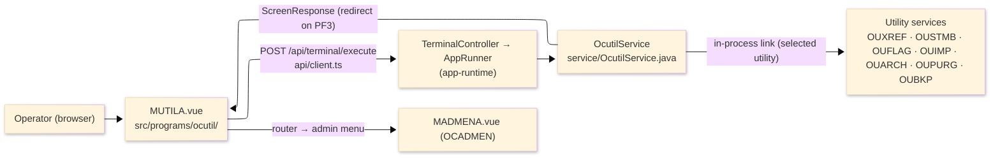
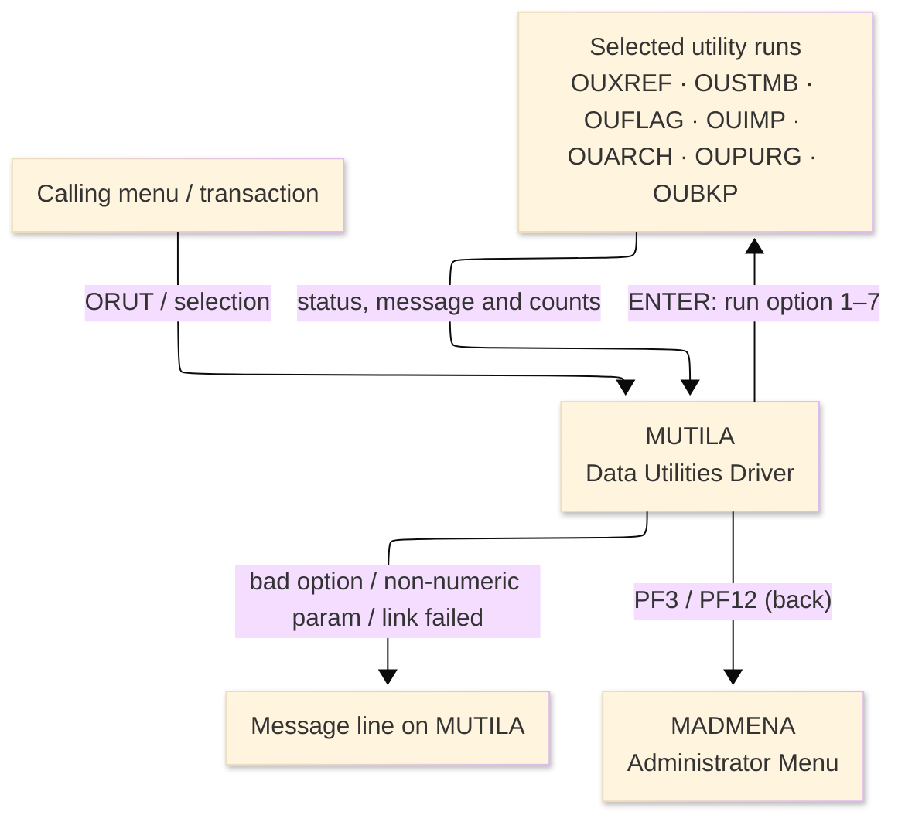
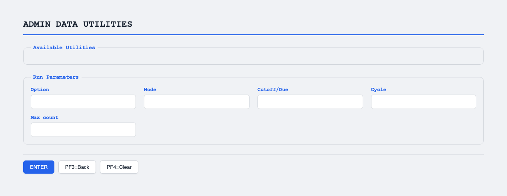

# TO-BE Screen Design — OCUTIL_DataUtilities

> **Rule 1: TO-BE = AS-IS in business terms.** The interface moves to a web SPA, but the
> input/output data, the check conditions, the business flow and the database results are
> preserved. The section order follows the AS-IS document so the two compare 1-to-1.

## 0. Cover

| Item | Content |
|---|---|
| System | ORION-CCMS (ORION Credit Card Management System) |
| Subsystem | On-line (was CICS/BMS; now Vue SPA + REST) |
| Function name | Admin Data-Utilities Driver |
| Function ID | OCUTIL（COBOL program）／Trans-ID `ORUT`／Map `MUTILA` |
| Module | `ocutil` |
| Platform | Java 17 · Spring Boot 3.x · Vue 3 + TypeScript · DB Oracle (H2 in dev) |
| Version ／ Author ／ Date | 1 ／ modernizeX ／ 2026-09-28 |

## 1. Function overview

### 1.1 Overview diagram

System architecture — the screen, the request path to the server, the driver service it runs, and
the back-office utilities it hands work to.

### 1.2 Function overview

| # | Function | Implementation |
|---|---|---|
| 1 | Present the back-office operations as a numbered list | Options 1 through 7 are shown for the seven data-utility jobs |
| 2 | Run the selected operation | The chosen number and its parameters are passed to the matching utility, which is run in-process |
| 3 | Show the result and the record counts | The status, a message and up to four count lines are displayed after the run |
| 4 | Return to the administrator menu when finished | The back action ends the driver and hands control to the administrator menu |

**Roles ／ authorisation**: authenticated operator (signed on through the Sign On screen). Sign-on
state travels in the conversation carried between requests; no framework role gate is wired yet.

**Keys → operations** (the SPA renders each former PF key as a button):

| Key | Label as rendered (verbatim) | What it does |
|---|---|---|
| `ENTER` | `ENTER=RUN` | check the option number and run the selected utility |
| `PF3` | `PF3=BACK` | return to the administrator menu |
| `PF4` | `PF4=CLEAR` | clear the entered values and return to the opening prompt |
| `PF12` | `PF12` | cancel and return to the administrator menu |
| `CLEAR` | `Clear` | clear the screen and redisplay it |

> The middle column is the string the button really shows, copied from the program's button
> definitions. The physical PF keystrokes are not reproduced as keyboard shortcuts, so operators
> used to typing PF3 now click the `PF3=BACK` button — same action, one extra pointer move.

### 1.3 Databases used

| № | Business name | Table | C | R | U | D |
|---|---|---|---|---|---|---|
| 1 | Not applicable — navigation only; the linked utilities perform all file access | — | - | - | - | - |

## 2. Screen spec

Screen transition of the whole function — every screen a box, every edge labelled with what moves
the operator.

### 2.1 MUTILA — Data Utilities Driver

**Layout**

**Archetype applied**: option-driven driver form with a result panel (`_archetypes/screenModel`).
The header carries the transaction/program/date/time meta strip; the body lists the seven utilities,
takes an option number with its parameters, and shows a result panel; a message line and a button row
close the screen.

| Area | Notes |
|---|---|
| Header (Tran/Prog/Date/Time) | meta strip above the title, filled by the server |
| Option list | seven numbered utilities (1–7) shown as static captions |
| Input area | option number plus mode, cutoff/due date, cycle and max-count parameters |
| Result area | status, result message and up to four count/amount lines |
| Message line | inline alert below the form (was row 23 `ERRMSG`) |
| Button row | `ENTER=RUN`, `PF3=BACK`, `PF4=CLEAR`, `PF12`, `Clear` |

**Screen items**

_State legend: ○ shown · 必 must be entered · □ read-only · － not shown._

| № | Item name | Field | Type ／ length | Control | Required | Initial | Select ＆ run | After run | Notes |
|---|---|---|---|---|---|---|---|---|---|
| 1 | Option | `UTOPT` | numeric text, 2 | entry box, 2 chars | 必 | ○ | 必 | □ | utility number 1–7 |
| 2 | Mode | `UTMODE` | text, 4 | entry box, 4 chars | - | ○ | ○ | □ | run mode; defaults to `REBL` |
| 3 | Cutoff/Due | `UTDATE` | date text, 10 | entry box, 10 chars | - | ○ | ○ | □ | cutoff or due date for the utility |
| 4 | Cycle | `UTCYC` | numeric text, 6 | entry box, 6 chars | - | ○ | ○ | □ | statement cycle (YYYYMM) |
| 5 | Max count | `UTNUM` | numeric text, 7 | entry box, 7 chars | - | ○ | ○ | □ | max records to process |
| 6 | Status | `RSTAT` | text, 2 | read-only | - | － | － | □ | status code returned by the utility |
| 7 | Result message | `RMSG` | text, 50 | read-only | - | － | － | □ | summary message from the utility |
| 8 | Result lines | `RLINE1`…`RLINE4` | text, 60 | read-only | - | － | － | □ | up to four count/amount lines |

> **Length and format unchanged**: the option keeps 2 characters, the parameters keep their widths
> (mode 4, date 10, cycle 6, max count 7) and each result line keeps 60 — the same widths as the
> terminal screen.

## 3. Check specifications

### 3.1 MUTILA — Data Utilities Driver

All strings below are the literal messages the server returns to the on-screen message line.
Type: E=Error / I=Information.

| No. | What is checked | When it is checked | Message code | Message shown | If it fails |
|---|---|---|---|---|---|
| 1 | Opening prompt (informational) | when the screen first appears | — | Select a utility (1-7), key params, press ENTER. | not a failure; guides the operator |
| 2 | A utility number must be entered | on `ENTER`, before running | — | Enter a utility number 1 through 7. | the entry stays; nothing runs |
| 3 | The utility number must be 1 through 7 | on `ENTER`, before running | — | Utility number must be 1 through 7. | the entry stays; nothing runs |
| 4 | The max count must be numeric | on `ENTER`, when a max count is typed | — | Max count must be numeric. | the entry stays; nothing runs |
| 5 | The cycle must be numeric (YYYYMM) | on `ENTER`, when a cycle is typed | — | Cycle must be numeric (YYYYMM). | the entry stays; nothing runs |
| 6 | The selected utility must run | on `ENTER`, during the run | — | Sub-program link failed - check resources. | no counts are shown; the entry stays |
| 7 | Successful run (informational) | on `ENTER`, after the run | — | Utility complete - see counts below. | not a failure; the status, message and counts are shown |
| 8 | Only a supported key may be used | on any key press | — | Invalid key pressed. Please try again. | the screen is redisplayed unchanged |

## 4. Event specifications

### 4.1 MUTILA — Data Utilities Driver

| No. | Event | What the system does | Result ／ next screen |
|---|---|---|---|
| 1 | The operator keys an option number with its parameters and presses `ENTER` | the option is checked and the matching utility is run in-process, then its status, message and counts are shown | stays on Data Utilities with the results, or a message when the option or a parameter is invalid or the utility cannot be run |
| 2 | The operator presses `PF3` | the driver ends and control returns to the administrator menu | the administrator menu appears |
| 3 | The operator presses `PF12` | the current action is cancelled and control returns to the administrator menu | the administrator menu appears |
| 4 | The operator presses `PF4` | the entered values are cleared and the opening prompt returns | stays on Data Utilities, ready for a new selection |
| 5 | The operator presses `CLEAR` | the screen is cleared and redisplayed | stays on Data Utilities, ready for a new selection |
| 6 | The operator presses an unsupported key | the request is rejected and a message is shown | stays on Data Utilities, unchanged |

## 5. DB CRUD

**Update spec**

Not applicable — the Data Utilities driver performs no file access itself; every read, update and
delete is done by the utility it runs. No row is created, updated or deleted by this screen.

**Column-level CRUD (per event ／ business type)**

| Table | Operation | Field | Value source | Transaction |
|---|---|---|---|---|
| — | none | — | — | driver only — the linked utilities do all file access |

## 6. API contract

| Request | Response | What it does | Errors |
|---|---|---|---|
| `POST /api/terminal/execute` — `{ programName: "OCUTIL", aidKey, fields: { UTOPT, UTMODE, UTDATE, UTCYC, UTNUM } }` | `ScreenResponse` — `{ fields: { RSTAT, RMSG, RLINE1..RLINE4 }, message, buttons }` | validates the option and parameters, runs the selected utility in-process, and returns its status, message and count lines | blank option → "Enter a utility number 1 through 7."; out of range → "Utility number must be 1 through 7."; bad max → "Max count must be numeric."; bad cycle → "Cycle must be numeric (YYYYMM)."; run failure → "Sub-program link failed - check resources." |

FE types: `src/programs/ocutil/schemas.d.ts` (`MUTILAFields`) · client: `src/api/client.ts` ·
endpoint: `TerminalController` (`/api/terminal/execute`), one round-trip per key press (CICS
pseudo-conversation preserved through the HTTP session).
