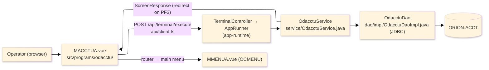
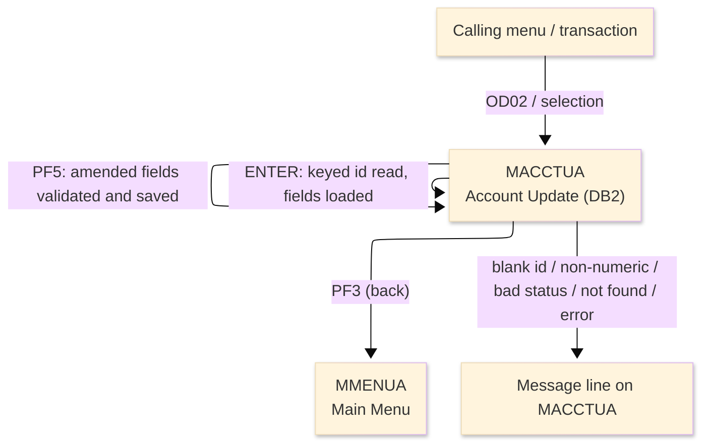
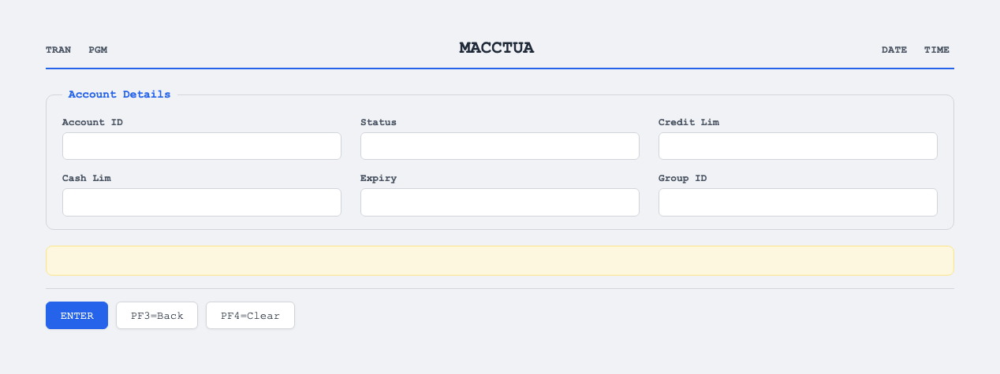

# TO-BE Screen Design — ODACCTU_AccountUpdateDB2

> **Rule 1: TO-BE = AS-IS in business terms.** The interface moves to a web SPA, but the
> input/output data, the check conditions, the business flow and the database results are
> preserved. The section order follows the AS-IS document so the two compare 1-to-1.

## 0. Cover

| Item | Content |
|---|---|
| System | ORION-CCMS (ORION Credit Card Management System) |
| Subsystem | On-line (was CICS/BMS; now Vue SPA + REST) |
| Function name | Account Update (DB2) |
| Function ID | ODACCTU（COBOL program）／Trans-ID `OD02`／Map `MACCTUA` |
| Module | `odacctu` |
| Platform | Java 17 · Spring Boot 3.x · Vue 3 + TypeScript · DB Oracle (H2 in dev) |
| Version ／ Author ／ Date | 1 ／ modernizeX ／ 2026-09-28 |

## 1. Function overview

### 1.1 Overview diagram

System architecture — the screen, the request path to the server, the program service it runs,
and the relational account table it reads and updates. In the legacy program the data access was
embedded SQL against DB2; it is now a JDBC read and a JDBC update issued by this program's own
data-access class.

### 1.2 Function overview

| # | Function | Implementation |
|---|---|---|
| 1 | Look up an account by its id and show the current values | The operator enters the id and the account record is read by primary key from the DB2 relational table `ORION.ACCT` |
| 2 | Let the operator amend the editable fields | Status, credit limit, cash limit, expiry and group can be changed on the loaded record |
| 3 | Validate the changes and save them on confirmation | When the operator confirms, the amended values are written back to the same account row |
| 4 | Reach the account data through the modern data layer | The former embedded SQL read and update are now JDBC statements issued by this program's own data-access class against the same account table |

**Roles ／ authorisation**: authenticated operator (signed on through the Sign On screen). Sign-on
state travels in the conversation carried between requests; no framework role gate is wired yet.

**Keys → operations** (the SPA renders each former PF key as a button):

| Key | Label as rendered (verbatim) | What it does |
|---|---|---|
| `ENTER` | `ENTER=PROCESS` | read the keyed account and load its fields for amendment |
| `PF3` | `PF3=BACK` | return to the main menu |
| `PF4` | `PF4=CLEAR` | clear the entry so the operator can start again |
| `PF5` | `PF5` | validate the amended fields and save the change |

> The middle column is the string the button really shows, copied from the program's button
> definitions. The physical PF keystrokes are not reproduced as keyboard shortcuts, so operators
> used to typing PF5 now click the `PF5` button — same action, one extra pointer move.

### 1.3 Databases used

| № | Business name | Table | C | R | U | D |
|---|---|---|---|---|---|---|
| 1 | Account master (DB2 relational) — read by id, then updated in place | `ORION.ACCT` | - | 〇 | 〇 | - |

## 2. Screen spec

Screen transition of the whole function — every screen a box, every edge labelled with what moves
the operator.

### 2.1 MACCTUA — Account Update (DB2)

**Layout**

**Archetype applied**: maintenance form with fetch-then-save (`_archetypes/screenModel`). The header
carries the transaction/program/date/time meta strip; the body has the lookup key and the editable
detail fields; a message line and a button row close the screen.

| Area | Notes |
|---|---|
| Header (Tran/Prog/Date/Time) | meta strip above the title, filled by the server |
| Input area | the account id lookup key plus the editable detail fields |
| Details area | status, credit limit, cash limit, expiry and group — editable once the row is loaded |
| Message line | inline alert below the form (was row 23 `ERRMSG`) |
| Button row | `ENTER=PROCESS`, `PF3=BACK`, `PF4=CLEAR`, `PF5` |

**Screen items**

_State legend: ○ shown · 必 must be entered · □ read-only · － not shown._

| № | Item name | Field | Type ／ length | Control | Required | Initial | Key entry | Record loaded | Notes |
|---|---|---|---|---|---|---|---|---|---|
| 1 | Account ID | `ACCTID` | numeric text, 11 | entry box, 11 chars | 必 | ○ | 必 | □ | lookup key; identifies the row to amend |
| 2 | Status | `ACSTAT` | text, 1 | entry box, 1 char | 必 | － | － | 必 | active status; must be Y or N |
| 3 | Credit limit | `ACCRLIM` | amount, 13 | entry box, 13 chars | 必 | － | － | 必 | numeric credit limit |
| 4 | Cash limit | `ACCSLIM` | amount, 13 | entry box, 13 chars | 必 | － | － | 必 | numeric cash limit |
| 5 | Expiry | `ACEXP` | date text, 10 | entry box, 10 chars | - | － | － | ○ | expiry date as stored |
| 6 | Group ID | `ACGRP` | text, 10 | entry box, 10 chars | - | － | － | ○ | disclosure group |

> **Length and format unchanged**: each entry box accepts the same number of characters as the
> terminal field and the server validates against the same widths.

## 3. Check specifications

### 3.1 MACCTUA — Account Update (DB2)

All strings below are the literal messages the server returns to the on-screen message line.

| No. | What is checked | When it is checked | Message code | Message shown | If it fails |
|---|---|---|---|---|---|
| 1 | Opening prompt (informational) | when the screen first appears | — | Enter account id and press ENTER to fetch. | not a failure; guides the operator |
| 2 | The account id must be entered | on `ENTER`, before the lookup | — | Please enter all required fields. | the entry stays; nothing is read |
| 3 | The account id must be numeric | on `ENTER`, before the lookup | — | Account id must be numeric. | the entry stays; no record is loaded |
| 4 | The keyed account must exist | on `ENTER`, after the lookup | — | Record not found. | the entry stays; no fields are loaded |
| 5 | Confirmation the row is ready to amend | on `ENTER`, after a successful read | — | Amend fields and press PF5 to update. | not a failure; the fields become editable |
| 6 | A row must be fetched before saving | on `PF5`, before the update | — | Press ENTER to fetch a row before PF5. | nothing is saved; the operator must fetch first |
| 7 | The account id must be present and numeric | on `PF5`, during validation | — | Account id is required and numeric. | the update is rejected; the entry stays |
| 8 | The status must be Y or N | on `PF5`, during validation | — | Status must be Y or N. | the update is rejected; the entry stays |
| 9 | The credit and cash limits must be entered | on `PF5`, during validation | — | Credit and cash limits are required. | the update is rejected; the entry stays |
| 10 | The account table must be readable | on `ENTER`, during the lookup | — | Error reading account table. | the entry stays; no fields are loaded |
| 11 | The account row must be writable | on `PF5`, during the update | — | Error updating account table. | the change is not saved; the entry stays |
| 12 | Confirmation the change was saved | on `PF5`, after a successful update | — | Account updated successfully. | not a failure; the change is saved |
| 13 | Only a supported key may be used | on any key press | — | Invalid key pressed. Please try again. | the screen is redisplayed unchanged |

## 4. Event specifications

### 4.1 MACCTUA — Account Update (DB2)

| No. | Event | What the system does | Result ／ next screen |
|---|---|---|---|
| 1 | The operator enters an id and presses `ENTER` | the keyed account is read and its editable fields are loaded | stays on Account Update with the fields ready to amend, or a message when the id is blank / non-numeric / not found |
| 2 | The operator amends the fields and presses `PF5` | the changes are validated and, once valid, saved back to the account record | stays on Account Update with a success or an error message |
| 3 | The operator presses `PF3` | the update ends and control returns to the calling menu | the main menu appears |
| 4 | The operator presses `PF4` | the entered values are cleared and the opening prompt returns | stays on Account Update, ready for a new id |
| 5 | The operator presses an unsupported key | the request is rejected and a message is shown | stays on Account Update, unchanged |

## 5. DB CRUD

**Update spec**

| Table | Operation | Field | Value source | Transaction |
|---|---|---|---|---|
| `ORION.ACCT` | UPDATE by account id | active status | the status the operator entered (Y or N) | committed on `PF5` |
| `ORION.ACCT` | UPDATE by account id | credit limit | the credit limit the operator entered | committed on `PF5` |
| `ORION.ACCT` | UPDATE by account id | cash limit | the cash limit the operator entered | committed on `PF5` |
| `ORION.ACCT` | UPDATE by account id | expiry date | the expiry date the operator entered | committed on `PF5` |
| `ORION.ACCT` | UPDATE by account id | group id | the group id the operator entered | committed on `PF5` |

**Column-level CRUD (per event ／ business type)**

| Table | Operation | Field | Value source | Transaction |
|---|---|---|---|---|
| `ORION.ACCT` | SELECT (read by key) | status, limits, expiry, group | the account id the operator entered | read-only; on `ENTER` |
| `ORION.ACCT` | UPDATE (write by key) | status, credit limit, cash limit, expiry, group | the amended values the operator entered | committed on `PF5` |

## 6. API contract

| Request | Response | What it does | Errors |
|---|---|---|---|
| `POST /api/terminal/execute` — `{ programName: "ODACCTU", aidKey, fields: { ACCTID, ACSTAT, ACCRLIM, ACCSLIM, ACEXP, ACGRP } }` | `ScreenResponse` — `{ fields: { ACSTAT, ACCRLIM, ACCSLIM, ACEXP, ACGRP }, message, buttons }` | on `ENTER` reads the account and loads its editable fields; on `PF5` validates and updates `ORION.ACCT` | blank id → "Please enter all required fields."; non-numeric → "Account id must be numeric."; bad status → "Status must be Y or N."; missing limits → "Credit and cash limits are required."; not found → "Record not found."; update error → "Error updating account table." |

FE types: `src/programs/odacctu/schemas.d.ts` (`MACCTUAFields`) · client: `src/api/client.ts` ·
endpoint: `TerminalController` (`/api/terminal/execute`), one round-trip per key press (CICS
pseudo-conversation preserved through the HTTP session).
