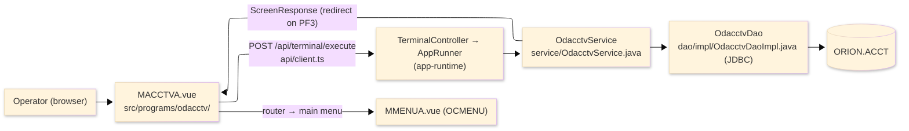
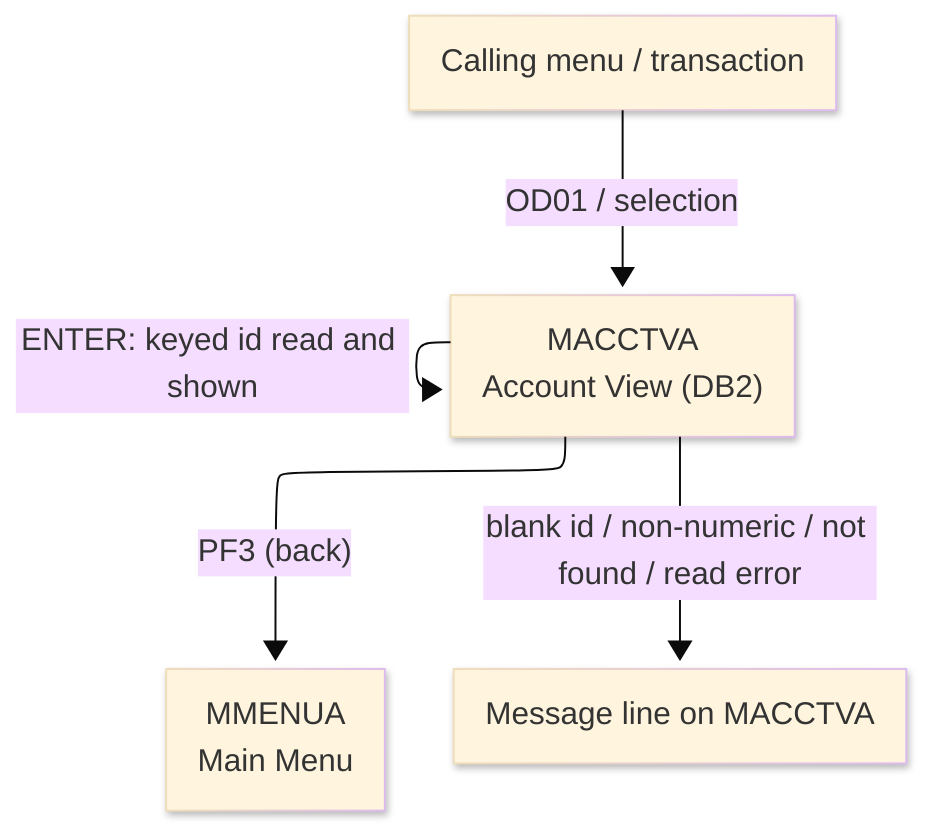
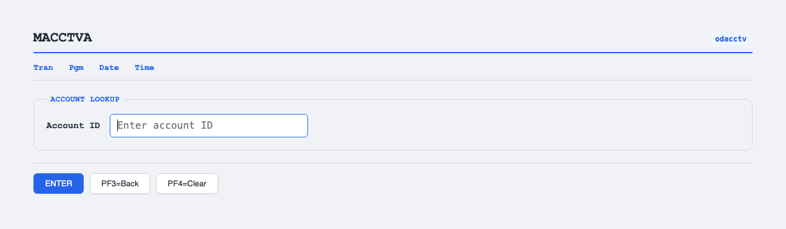

# TO-BE Screen Design — ODACCTV_AccountViewDB2

> **Rule 1: TO-BE = AS-IS in business terms.** The interface moves to a web SPA, but the
> input/output data, the check conditions, the business flow and the database results are
> preserved. The section order follows the AS-IS document so the two compare 1-to-1.

## 0. Cover

| Item | Content |
|---|---|
| System | ORION-CCMS (ORION Credit Card Management System) |
| Subsystem | On-line (was CICS/BMS; now Vue SPA + REST) |
| Function name | Account View (DB2) |
| Function ID | ODACCTV（COBOL program）／Trans-ID `OD01`／Map `MACCTVA` |
| Module | `odacctv` |
| Platform | Java 17 · Spring Boot 3.x · Vue 3 + TypeScript · DB Oracle (H2 in dev) |
| Version ／ Author ／ Date | 1 ／ modernizeX ／ 2026-09-28 |

## 1. Function overview

### 1.1 Overview diagram

System architecture — the screen, the request path to the server, the program service it runs,
and the relational account table it reads. In the legacy program the data access was embedded SQL
against DB2; it is now a JDBC query issued by this program's own data-access class.

### 1.2 Function overview

| # | Function | Implementation |
|---|---|---|
| 1 | Look up an account by its account id | The operator enters the id and the account record is read by primary key from the DB2 relational table `ORION.ACCT` |
| 2 | Show the current account details in read-only form | Status, balances, limits, dates and group are displayed; nothing on this screen is editable |
| 3 | Return to the calling menu when finished | The back action ends the view and returns the operator to the main menu |
| 4 | Reach the account data through the modern data layer | The former embedded SQL is now a JDBC query issued by this program's own data-access class against the same account table |

**Roles ／ authorisation**: authenticated operator (signed on through the Sign On screen). Sign-on
state travels in the conversation carried between requests; no framework role gate is wired yet.

**Keys → operations** (the SPA renders each former PF key as a button):

| Key | Label as rendered (verbatim) | What it does |
|---|---|---|
| `ENTER` | `ENTER=PROCESS` | read the keyed account and show its details |
| `PF3` | `PF3=BACK` | return to the main menu |
| `PF4` | `PF4=CLEAR` | clear the entry so the operator can start again |

> The middle column is the string the button really shows, copied from the program's button
> definitions. The physical PF keystrokes are not reproduced as keyboard shortcuts, so operators
> used to typing PF3 now click the `PF3=BACK` button — same action, one extra pointer move.

### 1.3 Databases used

| № | Business name | Table | C | R | U | D |
|---|---|---|---|---|---|---|
| 1 | Account master (DB2 relational) — read by account id to show the detail | `ORION.ACCT` | - | 〇 | - | - |

## 2. Screen spec

Screen transition of the whole function — every screen a box, every edge labelled with what moves
the operator.

### 2.1 MACCTVA — Account View (DB2)

**Layout**

**Archetype applied**: display form with a single lookup key (`_archetypes/screenModel`). The header
carries the transaction/program/date/time meta strip; the body has one entry box and a read-only
details block; a message line and a button row close the screen.

| Area | Notes |
|---|---|
| Header (Tran/Prog/Date/Time) | meta strip above the title, filled by the server |
| Input area | one entry box — the account id lookup key |
| Details area | read-only outputs: status, balances, limits, dates, group |
| Message line | inline alert below the form (was row 23 `ERRMSG`) |
| Button row | `ENTER=PROCESS`, `PF3=BACK`, `PF4=CLEAR` |

**Screen items**

_State legend: ○ shown · 必 must be entered · □ read-only · － not shown._

| № | Item name | Field | Type ／ length | Control | Required | Initial | Key prompt | Record shown | Notes |
|---|---|---|---|---|---|---|---|---|---|
| 1 | Account ID | `ACCTID` | numeric text, 11 | entry box, 11 chars | 必 | ○ | 必 | □ | lookup key; kept at 11 as in the source |
| 2 | Status | `ACSTAT` | text, 1 | read-only | - | － | □ | □ | active status code |
| 3 | Current balance | `ACBAL` | amount, 15 | read-only | - | － | □ | □ | edited amount |
| 4 | Credit limit | `ACCRLIM` | amount, 15 | read-only | - | － | □ | □ | edited amount |
| 5 | Cash limit | `ACCSLIM` | amount, 15 | read-only | - | － | □ | □ | edited amount |
| 6 | Open date | `ACOPEN` | date text, 10 | read-only | - | － | □ | □ | as stored |
| 7 | Expiry | `ACEXP` | date text, 10 | read-only | - | － | □ | □ | as stored |
| 8 | Group ID | `ACGRP` | text, 10 | read-only | - | － | □ | □ | disclosure group |

> **Length and format unchanged**: the entry box accepts 11 characters and the server reads the same
> 11-character key; the amounts and dates are shown with the same widths as the terminal screen.

## 3. Check specifications

### 3.1 MACCTVA — Account View (DB2)

All strings below are the literal messages the server returns to the on-screen message line.

| No. | What is checked | When it is checked | Message code | Message shown | If it fails |
|---|---|---|---|---|---|
| 1 | Opening prompt (informational) | when the screen first appears | — | Enter account id and press ENTER. | not a failure; guides the operator |
| 2 | The account id must be entered | on `ENTER`, before the lookup | — | Please enter all required fields. | the entry stays; nothing is read |
| 3 | The account id must be numeric | on `ENTER`, before the lookup | — | Account id must be numeric. | the entry stays; no details are shown |
| 4 | The keyed account must exist | on `ENTER`, after the lookup | — | Record not found. | the entry stays; no details are shown |
| 5 | The account table must be readable | on `ENTER`, during the lookup | — | Error reading account table. | the entry stays; no details are shown |
| 6 | Confirmation that the account was found | on `ENTER`, after a successful read | — | Account displayed. | not a failure; the details are shown |
| 7 | Only a supported key may be used | on any key press | — | Invalid key pressed. Please try again. | the screen is redisplayed unchanged |

## 4. Event specifications

### 4.1 MACCTVA — Account View (DB2)

| No. | Event | What the system does | Result ／ next screen |
|---|---|---|---|
| 1 | The operator enters an id and presses `ENTER` | the keyed account is read and its details are filled in | stays on Account View with the details shown, or a message when the id is blank / non-numeric / not found |
| 2 | The operator presses `PF3` | the view ends and control returns to the calling menu | the main menu appears |
| 3 | The operator presses `PF4` | the entered value is cleared and the opening prompt returns | stays on Account View, ready for a new id |
| 4 | The operator presses an unsupported key | the request is rejected and a message is shown | stays on Account View, unchanged |

## 5. DB CRUD

**Update spec**

Not applicable — Account View (DB2) only reads; no row is created, updated or deleted.

**Column-level CRUD (per event ／ business type)**

| Table | Operation | Field | Value source | Transaction |
|---|---|---|---|---|
| `ORION.ACCT` | SELECT (read by key) | whole record | the account id the operator entered | read-only; no commit |

## 6. API contract

| Request | Response | What it does | Errors |
|---|---|---|---|
| `POST /api/terminal/execute` — `{ programName: "ODACCTV", aidKey, fields: { ACCTID } }` | `ScreenResponse` — `{ fields: { ACSTAT, ACBAL, ACCRLIM, ACCSLIM, ACOPEN, ACEXP, ACGRP }, message, buttons }` | reads the account by key from `ORION.ACCT` and returns its detail fields, or a message | blank id → "Please enter all required fields."; non-numeric → "Account id must be numeric."; missing → "Record not found."; read error → "Error reading account table." |

FE types: `src/programs/odacctv/schemas.d.ts` (`MACCTVAFields`) · client: `src/api/client.ts` ·
endpoint: `TerminalController` (`/api/terminal/execute`), one round-trip per key press (CICS
pseudo-conversation preserved through the HTTP session).
