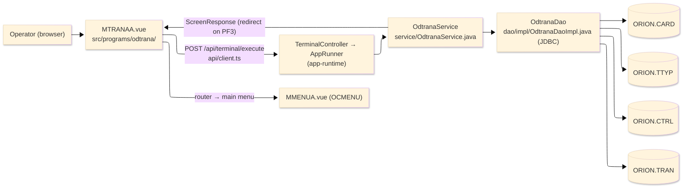
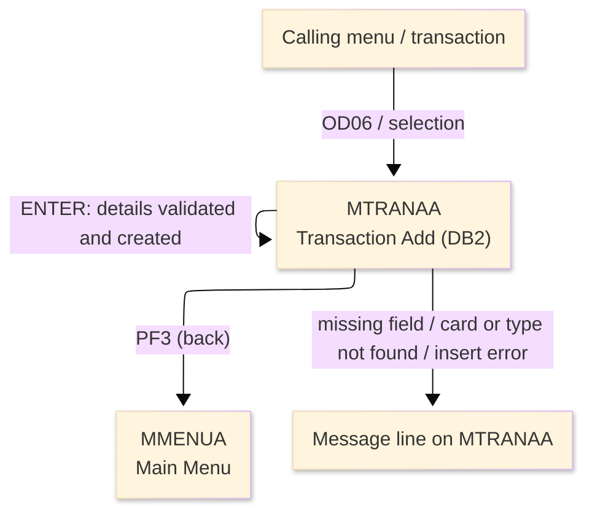
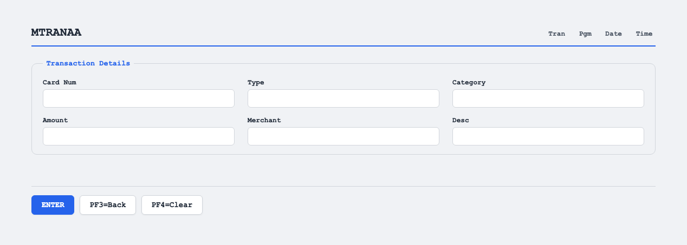

# TO-BE Screen Design — ODTRANA_TransactionAddDB2

> **Rule 1: TO-BE = AS-IS in business terms.** The interface moves to a web SPA, but the
> input/output data, the check conditions, the business flow and the database results are
> preserved. The section order follows the AS-IS document so the two compare 1-to-1.

## 0. Cover

| Item | Content |
|---|---|
| System | ORION-CCMS (ORION Credit Card Management System) |
| Subsystem | On-line (was CICS/BMS; now Vue SPA + REST) |
| Function name | Transaction Add (DB2) |
| Function ID | ODTRANA（COBOL program）／Trans-ID `OD06`／Map `MTRANAA` |
| Module | `odtrana` |
| Platform | Java 17 · Spring Boot 3.x · Vue 3 + TypeScript · DB Oracle (H2 in dev) |
| Version ／ Author ／ Date | 1 ／ modernizeX ／ 2026-09-28 |

## 1. Function overview

### 1.1 Overview diagram

System architecture — the screen, the request path to the server, the program service it runs,
and the relational tables it reads and writes to create a transaction. In the legacy program the
data access was embedded SQL against DB2; it is now a set of JDBC statements issued by this
program's own data-access class.

### 1.2 Function overview

| # | Function | Implementation |
|---|---|---|
| 1 | Accept the details for a new transaction | The operator types the card number, type, category, amount, merchant and description |
| 2 | Confirm the referenced card and type exist | The card is read from `ORION.CARD` and the type is read from `ORION.TTYP` before anything is created |
| 3 | Assign the next id and create the transaction | The running number in `ORION.CTRL` is read, incremented and saved, then a new row is inserted into `ORION.TRAN` |
| 4 | Reach the data through the modern data layer | The former embedded SQL reads, update and insert are now JDBC statements issued by this program's own data-access class |

**Roles ／ authorisation**: authenticated operator (signed on through the Sign On screen). Sign-on
state travels in the conversation carried between requests; no framework role gate is wired yet.

**Keys → operations** (the SPA renders each former PF key as a button):

| Key | Label as rendered (verbatim) | What it does |
|---|---|---|
| `ENTER` | `ENTER=PROCESS` | validate the entry and create the transaction |
| `PF3` | `PF3=BACK` | return to the main menu |
| `PF4` | `PF4=CLEAR` | clear the entry so the operator can start again |

> The middle column is the string the button really shows, copied from the program's button
> definitions. The physical PF keystrokes are not reproduced as keyboard shortcuts, so operators
> used to typing PF3 now click the `PF3=BACK` button — same action, one extra pointer move.

### 1.3 Databases used

| № | Business name | Table | C | R | U | D |
|---|---|---|---|---|---|---|
| 1 | Card master (DB2 relational) — read to confirm the card exists | `ORION.CARD` | - | 〇 | - | - |
| 2 | Transaction type (DB2 relational) — read to confirm the type exists | `ORION.TTYP` | - | 〇 | - | - |
| 3 | Control (DB2 relational) — running transaction number, read then incremented | `ORION.CTRL` | - | 〇 | 〇 | - |
| 4 | Transaction (DB2 relational) — the new row is inserted | `ORION.TRAN` | 〇 | - | - | - |

## 2. Screen spec

Screen transition of the whole function — every screen a box, every edge labelled with what moves
the operator.

### 2.1 MTRANAA — Transaction Add (DB2)

**Layout**

**Archetype applied**: data-entry form that creates a record (`_archetypes/screenModel`). The header
carries the transaction/program/date/time meta strip; the body has the transaction detail entry
boxes; a message line and a button row close the screen.

| Area | Notes |
|---|---|
| Header (Tran/Prog/Date/Time) | meta strip above the title, filled by the server |
| Input area | the transaction detail entry boxes: card number, type, category, amount, merchant, description |
| Message line | inline alert or new-id confirmation below the form (was row 23 `ERRMSG`) |
| Button row | `ENTER=PROCESS`, `PF3=BACK`, `PF4=CLEAR` |

**Screen items**

_State legend: ○ shown · 必 must be entered · □ read-only · － not shown._

| № | Item name | Field | Type ／ length | Control | Required | Initial | Entry state | Notes |
|---|---|---|---|---|---|---|---|---|
| 1 | Card number | `CARDNUM` | text, 16 | entry box, 16 chars | 必 | ○ | 必 | owning card; must already exist |
| 2 | Type | `TRTYPE` | text, 2 | entry box, 2 chars | 必 | ○ | 必 | transaction type; must already exist |
| 3 | Category | `TRCAT` | numeric text, 4 | entry box, 4 chars | 必 | ○ | 必 | must be numeric |
| 4 | Amount | `TRAMT` | amount, 12 | entry box, 12 chars | 必 | ○ | 必 | transaction amount |
| 5 | Merchant | `TRMERCH` | text, 50 | entry box, 50 chars | - | ○ | ○ | merchant name |
| 6 | Description | `TRDESC` | text, 50 | entry box, 50 chars | - | ○ | ○ | free description |

> **Length and format unchanged**: each entry box accepts the same number of characters as the
> terminal field and the server validates against the same widths.

## 3. Check specifications

### 3.1 MTRANAA — Transaction Add (DB2)

All strings below are the literal messages the server returns to the on-screen message line.

| No. | What is checked | When it is checked | Message code | Message shown | If it fails |
|---|---|---|---|---|---|
| 1 | Opening prompt (informational) | when the screen first appears | — | Enter transaction detail and press ENTER. | not a failure; guides the operator |
| 2 | The card number must be entered | on `ENTER`, during validation | — | Card number is required. | the entry is rejected; nothing is created |
| 3 | The transaction type must be entered | on `ENTER`, during validation | — | Transaction type is required. | the entry is rejected; nothing is created |
| 4 | The category must be numeric | on `ENTER`, during validation | — | Category must be numeric. | the entry is rejected; nothing is created |
| 5 | The amount must be entered | on `ENTER`, during validation | — | Amount is required. | the entry is rejected; nothing is created |
| 6 | The card must exist | on `ENTER`, after validation | — | Card number not found. | the entry stays; nothing is created |
| 7 | The transaction type must exist | on `ENTER`, after the card check | — | Transaction type not found. | the entry stays; nothing is created |
| 8 | The card table must be readable | on `ENTER`, during the card check | — | Error reading card table. | the entry stays; nothing is created |
| 9 | The type table must be readable | on `ENTER`, during the type check | — | Error reading type table. | the entry stays; nothing is created |
| 10 | The transaction row must be insertable | on `ENTER`, during the create | — | Error inserting transaction row. | the entry stays; nothing is created |
| 11 | Confirmation that the transaction was created | on `ENTER`, after a successful insert | — | Transaction added. Id=<transaction id> | not a failure; the new transaction id is shown |
| 12 | Only a supported key may be used | on any key press | — | Invalid key pressed. Please try again. | the screen is redisplayed unchanged |

## 4. Event specifications

### 4.1 MTRANAA — Transaction Add (DB2)

| No. | Event | What the system does | Result ／ next screen |
|---|---|---|---|
| 1 | The operator fills in the details and presses `ENTER` | the values are validated, the referenced card and type are confirmed, a new id is assigned and the transaction is created | stays on Transaction Add showing the new transaction id, or a message when a value is missing or a reference is not found |
| 2 | The operator presses `PF3` | the add ends and control returns to the calling menu | the main menu appears |
| 3 | The operator presses `PF4` | the entered values are cleared and the opening prompt returns | stays on Transaction Add, ready for a new entry |
| 4 | The operator presses an unsupported key | the request is rejected and a message is shown | stays on Transaction Add, unchanged |

## 5. DB CRUD

**Update spec**

| Table | Operation | Field | Value source | Transaction |
|---|---|---|---|---|
| `ORION.CTRL` | UPDATE by key | running transaction number | the previous number read from control, incremented by one | saved on `ENTER` before the insert |
| `ORION.TRAN` | INSERT (new row) | whole transaction record | the details the operator entered plus the assigned id and timestamps | committed on `ENTER` |

**Column-level CRUD (per event ／ business type)**

| Table | Operation | Field | Value source | Transaction |
|---|---|---|---|---|
| `ORION.CARD` | SELECT (read by key) | active status | the card number the operator entered | read-only; on `ENTER` |
| `ORION.TTYP` | SELECT (read by key) | type description | the type code the operator entered | read-only; on `ENTER` |
| `ORION.CTRL` | SELECT then UPDATE (by key) | running transaction number | read, incremented and written back | on `ENTER` |
| `ORION.TRAN` | INSERT (new row) | id, type, category, source, description, amount, merchant, card, timestamps | the entered details plus the assigned id | committed on `ENTER` |

## 6. API contract

| Request | Response | What it does | Errors |
|---|---|---|---|
| `POST /api/terminal/execute` — `{ programName: "ODTRANA", aidKey, fields: { CARDNUM, TRTYPE, TRCAT, TRAMT, TRMERCH, TRDESC } }` | `ScreenResponse` — `{ message, buttons }` (the new transaction id is carried in the message) | validates the entry, confirms the card and type, assigns the next id and inserts a row into `ORION.TRAN` | missing field → "Card number is required." / "Transaction type is required." / "Category must be numeric." / "Amount is required."; card missing → "Card number not found."; type missing → "Transaction type not found."; insert error → "Error inserting transaction row." |

FE types: `src/programs/odtrana/schemas.d.ts` (`MTRANAAFields`) · client: `src/api/client.ts` ·
endpoint: `TerminalController` (`/api/terminal/execute`), one round-trip per key press (CICS
pseudo-conversation preserved through the HTTP session).
