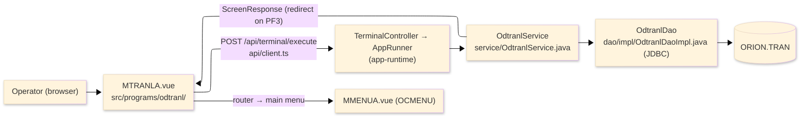
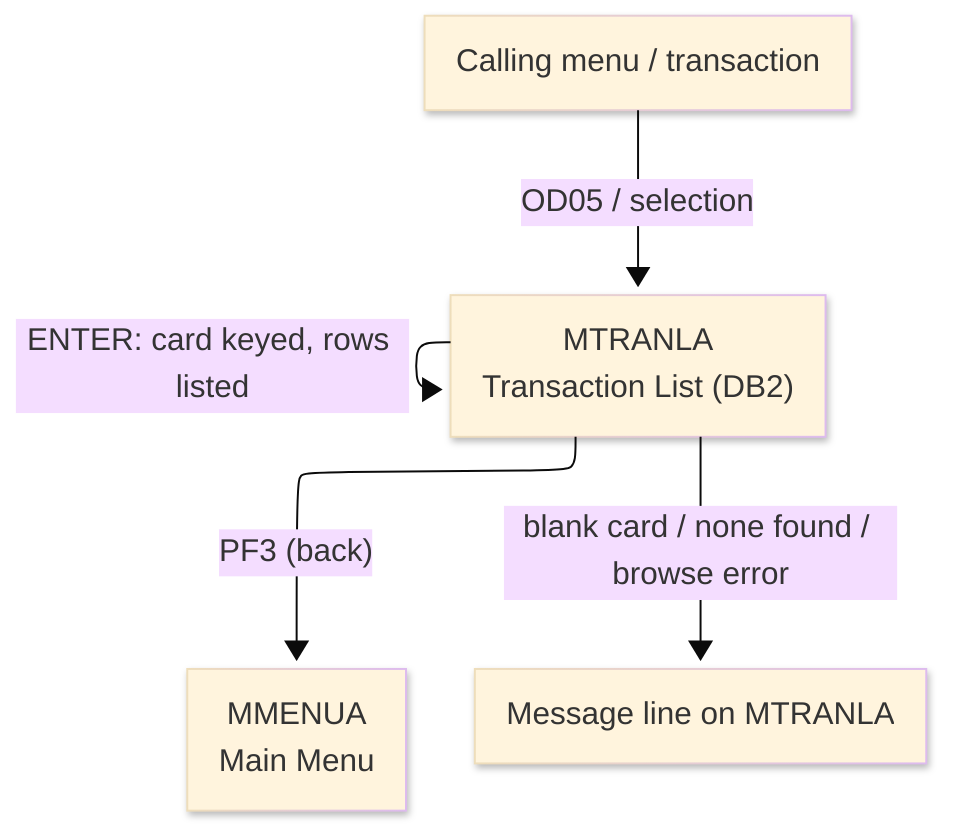
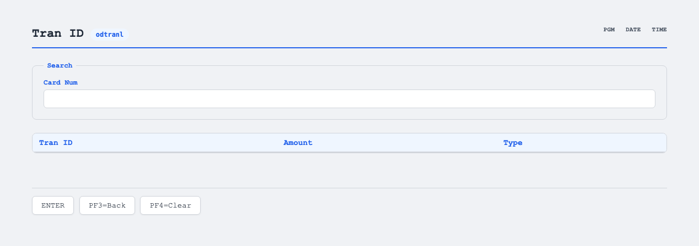

# TO-BE Screen Design — ODTRANL_TransactionListDB2

> **Rule 1: TO-BE = AS-IS in business terms.** The interface moves to a web SPA, but the
> input/output data, the check conditions, the business flow and the database results are
> preserved. The section order follows the AS-IS document so the two compare 1-to-1.

## 0. Cover

| Item | Content |
|---|---|
| System | ORION-CCMS (ORION Credit Card Management System) |
| Subsystem | On-line (was CICS/BMS; now Vue SPA + REST) |
| Function name | Transaction List (DB2) |
| Function ID | ODTRANL（COBOL program）／Trans-ID `OD05`／Map `MTRANLA` |
| Module | `odtranl` |
| Platform | Java 17 · Spring Boot 3.x · Vue 3 + TypeScript · DB Oracle (H2 in dev) |
| Version ／ Author ／ Date | 1 ／ modernizeX ／ 2026-09-28 |

## 1. Function overview

### 1.1 Overview diagram

System architecture — the screen, the request path to the server, the program service it runs,
and the relational transaction table it browses. In the legacy program the data access was an
embedded SQL cursor against DB2; it is now a JDBC query issued by this program's own data-access
class.

### 1.2 Function overview

| # | Function | Implementation |
|---|---|---|
| 1 | List a card's transactions | Up to five transaction rows are read for the entered card number from the DB2 relational table `ORION.TRAN`, ordered by transaction id |
| 2 | Filter the list by card number | The operator types the card number and only the matching transactions are shown |
| 3 | Return to the calling menu when finished | The back action ends the list and returns the operator to the main menu |
| 4 | Reach the transaction data through the modern data layer | The former embedded SQL cursor is now a JDBC query issued by this program's own data-access class against the same transaction table |

**Roles ／ authorisation**: authenticated operator (signed on through the Sign On screen). Sign-on
state travels in the conversation carried between requests; no framework role gate is wired yet.

**Keys → operations** (the SPA renders each former PF key as a button):

| Key | Label as rendered (verbatim) | What it does |
|---|---|---|
| `ENTER` | `ENTER=PROCESS` | list the transactions for the keyed card |
| `PF3` | `PF3=BACK` | return to the main menu |
| `PF4` | `PF4=CLEAR` | clear the entry so the operator can start again |

> The middle column is the string the button really shows, copied from the program's button
> definitions. The physical PF keystrokes are not reproduced as keyboard shortcuts, so operators
> used to typing PF3 now click the `PF3=BACK` button — same action, one extra pointer move.

### 1.3 Databases used

| № | Business name | Table | C | R | U | D |
|---|---|---|---|---|---|---|
| 1 | Transaction (DB2 relational) — browsed by card number to list rows | `ORION.TRAN` | - | 〇 | - | - |

## 2. Screen spec

Screen transition of the whole function — every screen a box, every edge labelled with what moves
the operator.

### 2.1 MTRANLA — Transaction List (DB2)

**Layout**

**Archetype applied**: browse list with a single filter key (`_archetypes/screenModel`). The header
carries the transaction/program/date/time meta strip; the body has one entry box and a five-row
result grid (transaction id, amount, type); a message line and a button row close the screen.

| Area | Notes |
|---|---|
| Header (Tran/Prog/Date/Time) | meta strip above the title, filled by the server |
| Input area | one entry box — the card number that filters the list |
| Result grid | up to five rows: transaction id, amount, type |
| Message line | count summary or alert below the grid (was row 23 `ERRMSG`) |
| Button row | `ENTER=PROCESS`, `PF3=BACK`, `PF4=CLEAR` |

**Screen items**

_State legend: ○ shown · 必 must be entered · □ read-only · － not shown._

| № | Item name | Field | Type ／ length | Control | Required | Initial | Page displayed | Notes |
|---|---|---|---|---|---|---|---|---|
| 1 | Card number | `CARDNUM` | text, 16 | entry box, 16 chars | 必 | ○ | □ | filter key for the list; kept at 16 as in the source |
| 2 | Transaction id (rows 1–5) | `TRN1`–`TRN5` | text, 16 | read-only | - | － | □ | one per listed transaction |
| 3 | Amount (rows 1–5) | `AMT1`–`AMT5` | amount text, 15 | read-only | - | － | □ | edited amount per row |
| 4 | Type (rows 1–5) | `TYP1`–`TYP5` | text, 2 | read-only | - | － | □ | transaction type per row |

> **Length and format unchanged**: the entry box accepts 16 characters and each result column keeps
> its terminal width (id 16, amount 15, type 2). The screen shows one page of five rows, exactly as
> the terminal map did.

## 3. Check specifications

### 3.1 MTRANLA — Transaction List (DB2)

All strings below are the literal messages the server returns to the on-screen message line.

| No. | What is checked | When it is checked | Message code | Message shown | If it fails |
|---|---|---|---|---|---|
| 1 | Opening prompt (informational) | when the screen first appears | — | Enter card number and press ENTER. | not a failure; guides the operator |
| 2 | The card number must be entered | on `ENTER`, before the list | — | Please enter all required fields. | the entry stays; nothing is listed |
| 3 | There must be transactions for the card | on `ENTER`, after the list | — | No transactions for this card. | not a failure; an empty result is reported |
| 4 | Confirmation that rows were listed | on `ENTER`, after a successful list | — | Transactions listed. | not a failure; the rows are shown |
| 5 | The transaction browse must open | on `ENTER`, when the list begins | — | Error opening transaction cursor. | the list stops; no rows are shown |
| 6 | The transaction rows must be readable | on `ENTER`, while reading rows | — | Error fetching transactions. | the list stops; no further rows are shown |
| 7 | Only a supported key may be used | on any key press | — | Invalid key pressed. Please try again. | the screen is redisplayed unchanged |

## 4. Event specifications

### 4.1 MTRANLA — Transaction List (DB2)

| No. | Event | What the system does | Result ／ next screen |
|---|---|---|---|
| 1 | The operator enters a card number and presses `ENTER` | up to five matching transactions are read and listed | stays on Transaction List with the rows shown, or a message when the card is blank or has no transactions |
| 2 | The operator presses `PF3` | the list ends and control returns to the calling menu | the main menu appears |
| 3 | The operator presses `PF4` | the entered value is cleared and the opening prompt returns | stays on Transaction List, ready for a new card |
| 4 | The operator presses an unsupported key | the request is rejected and a message is shown | stays on Transaction List, unchanged |

## 5. DB CRUD

**Update spec**

Not applicable — Transaction List (DB2) only reads; no row is created, updated or deleted.

**Column-level CRUD (per event ／ business type)**

| Table | Operation | Field | Value source | Transaction |
|---|---|---|---|---|
| `ORION.TRAN` | SELECT (browse by card number) | transaction id, amount, type | the card number the operator entered | read-only; no commit |

## 6. API contract

| Request | Response | What it does | Errors |
|---|---|---|---|
| `POST /api/terminal/execute` — `{ programName: "ODTRANL", aidKey, fields: { CARDNUM } }` | `ScreenResponse` — `{ fields: { TRN1…TRN5, AMT1…AMT5, TYP1…TYP5 }, message, buttons }` | browses `ORION.TRAN` for the keyed card and returns up to five transaction rows, or a message | blank card → "Please enter all required fields."; none found → "No transactions for this card."; open error → "Error opening transaction cursor."; fetch error → "Error fetching transactions." |

FE types: `src/programs/odtranl/schemas.d.ts` (`MTRANLAFields`) · client: `src/api/client.ts` ·
endpoint: `TerminalController` (`/api/terminal/execute`), one round-trip per key press (CICS
pseudo-conversation preserved through the HTTP session).
