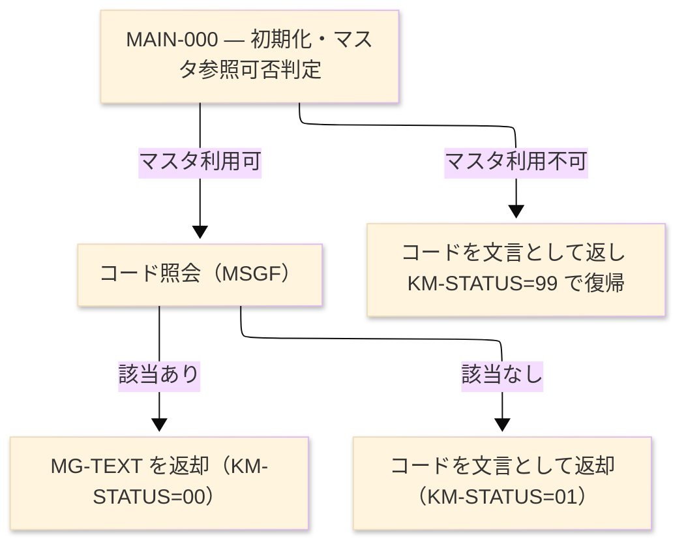

# ジョブフロー — GETMSG

| 項目 | 内容 |
|---|---|
| JOBID | GETMSG（`sub/GETMSG.cob`） |
| 処理名称 | メッセージ文言取得（共通下位モジュール） |
| システム／分類 | SAKURA 販売管理システム／バッチ（NEC COBOL85, サブルーチン） |
| 実行環境（現行） | COBOL サブルーチン。`CALL "GETMSG" USING KMSG` で各画面・帳票から呼び出される |
| ジョブ情報源 | **reg に orchestrator（JCL/BAT）が存在しない** — 下記「ステップ」は本プログラム自身の内部実行フェーズ（INIT/main/END）であり、単独ジョブとしては起動しない |
| 起動コマンド／実行スケジュール | ※未確定（要チーム確認）— 呼出し元プログラムの実行時に同期呼び出しされる |

> **凡例**: ★＝詳細設計あり（`GETMSG_メッセージ取得_プログラム詳細設計書.md`）｜IN:＝入力｜OUT:＝出力（連絡領域）

| ステップ | 行 | 処理 | ＤＤ | データセット／ファイル | 備考 |
|---|---|---|---|---|---|
| **◆ 概要** | | メッセージコードから表示文言を返す共通サブルーチン | ・全体: | `KM-CODE を受領 → MSGF 照会 → KM-TEXT／KM-STATUS を返却` | orchestrator 不在 |
| | | | ・P0: | `初期化・マスタ参照可否判定` | |
| | | | ・Input: | `連絡領域 KM-CODE、メッセージマスタ MSGF` | |
| | | | ・Output: | `連絡領域 KM-TEXT／KM-STATUS` | |
| **◆ P0 主処理** | | 呼び出し 1 回＝ 1 メッセージ取得 | | | |
| **MAIN-000** | L30 | ★ メッセージ取得：返却領域を初期化し、マスタを開き、コードで照会して文言を返す | IN:LINKAGE | `KMSG（KM-CODE）` | 呼出し元が設定 |
| | | | IN:MSGF | `メッセージマスタ（MG-CODE で READ）` | 索引編成 |
| | | | OUT:LINKAGE | `KMSG（KM-TEXT／KM-STATUS）` | 00／01／99 |
| **終了** | L47 | 正常終了（`EXIT PROGRAM`）。異常系: マスタが開けない場合は KM-STATUS=99 を設定してフェイルソフト復帰、該当コードなしは KM-STATUS=01 | LOG:- | `-` | ABEND なし |

### ジョブフロー図

