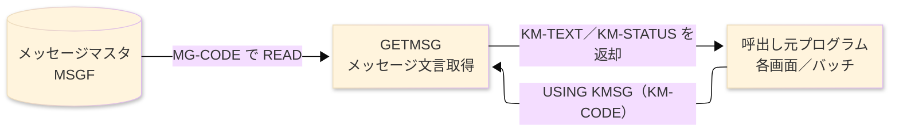
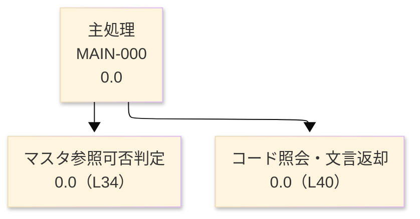

# プログラム詳細設計書 — GETMSG

**共通ヘッダ**

| システム名 | プログラムID | 作成／修正日・作成者 | 修正箇所（修正日を記載） |
|---|---|---|---|
| SAKURA 販売管理システム | GETMSG | 作成 2026-08-30／modernizeX | - |

## 1. プログラム概要

### 1.1 I/O図

### 1.2 機能概要

メッセージコードに対応する表示文言を返すサブルーチンである。呼出し元は連絡領域 `KMSG` に
メッセージコード（`KM-CODE`）を設定して呼び出す。本プログラムはメッセージマスタ（MSGF）を
そのコードで 1 件参照し、見つかれば文言を `KM-TEXT` に返す。見つからない場合はコードそのものを
文言として返す。処理結果は状態コード `KM-STATUS` で通知する（`00`＝正常取得、`01`＝該当コードなし、
`99`＝マスタ利用不可）。全画面・帳票が共通で利用する下位モジュールで、単独では起動しない。

### 1.3 I/O概要

| ファイル／テーブル／画面／帳票名 | DD／SYS-ID | Copybook ID | I/O区分 | 種別 (Main/Sub) | ファイル編成 |
|---|---|---|---|---|---|
| メッセージマスタ（MSGF） | MSGF-RDB | FMSG (FD)／SMSG (SELECT) | I | Main | INDEXED（キー MG-CODE） |
| 連絡領域（KMSG） | LINKAGE | KLINK | I-O | Main | 連絡（KM-CODE 受領／KM-TEXT・KM-STATUS 返却） |

### 1.4 呼出しサブプログラム／モジュール

| プログラムID | 呼出し方式 | 機能名 | インタフェース |
|---|---|---|---|
| （なし） | - | 本プログラムは他モジュールを呼び出さない | - |

### 1.5 DB表＆SQL（EXEC SQL がある場合）

SQL 不使用（純粋なファイル I/O）。メッセージマスタは COBOL 索引編成ファイル（MSGF, `MSGF-RDB`）。

### 1.6 特記事項

- 呼出しのたびにメッセージマスタを OPEN／CLOSE する（常駐保持しない）。マスタが開けない場合でも
  異常終了せず、コードをそのまま文言として返し `KM-STATUS=99` で呼出し元へ通知する（フェイルソフト）。
- 該当コードが無い場合もコードを文言として返す（`KM-STATUS=01`）。呼出し元は状態コードで
  取得可否を判定できる。

## 2. 処理内容

### 1. 主処理　[0.0]　(L30)
1) 返却領域を初期化する（状態＝正常、文言＝空白）。
2) メッセージマスタを参照用に開く。開けない場合は、要求コードをそのまま文言として設定し、
   状態を「マスタ利用不可」にして呼出し元へ戻る (L34)。
3) 要求されたメッセージコードでメッセージマスタを 1 件照会する (L40)。
   (1) 該当あり → 登録されている文言を返却領域へ設定する。
   (2) 該当なし → 要求コードをそのまま文言とし、状態を「該当なし」にする (L41)。
4) メッセージマスタを閉じ、呼出し元へ戻る (L47)。

## 3. 構造図

## 4. 出力仕様（ファイル・テーブル）

### 4.1 連絡領域 KMSG（copybook KLINK）— 68 byte（返却）

| Level | 項目名 | フィールド名 | 型 | Byte数 | 位置 | INMSG | Master | Literal | その他 | TBL | 値の設定方法 |
|---|---|---|---|---|---|---|---|---|---|---|---|
| 01 | 連絡領域 | KMSG | (group) | 68 | 1 | | | | ○ | | 呼出し元と共有 |
| 02 | メッセージコード | KM-CODE | X(6) | 6 | 1 | ○ | | | | | 呼出し元が設定（入力） |
| 02 | メッセージ文言 | KM-TEXT | X(60) | 60 | 7 | | ○ | | | | 該当時 MG-TEXT、非該当時 KM-CODE を設定 |
| 02 | 状態コード | KM-STATUS | X(2) | 2 | 67 | | | ○ | | | 00＝正常／01＝該当なし／99＝マスタ利用不可 |

### 4.2 参照レコード MG-REC（FD MSGF, copybook FMSG）— 76 byte（入力参照）

| Level | 項目名 | フィールド名 | 型 | Byte数 | 位置 | INMSG | Master | Literal | その他 | TBL | 値の設定方法 |
|---|---|---|---|---|---|---|---|---|---|---|---|
| 01 | メッセージレコード | MG-REC | (group) | 76 | 1 | | ○ | | | | メッセージマスタから読取 |
| 02 | メッセージコード | MG-CODE | X(6) | 6 | 1 | | ○ | | | | 読取キー（KM-CODE を設定） |
| 02 | メッセージ文言 | MG-TEXT | X(60) | 60 | 7 | | ○ | | | | 返却文言の取得元 |
| 02 | 予備 | FILLER | X(10) | 10 | 67 | | | | ○ | | - |

## 5. 入出力パラメータ＆チェック仕様

### 5.1 パラメータ

| 区分 | 名称 | 型／長さ | 意味 | 値／出所 |
|---|---|---|---|---|
| Linkage（入力） | KM-CODE | X(6) | 取得したいメッセージコード | 呼出し元が設定 |
| Linkage（出力） | KM-TEXT | X(60) | 取得した文言（非該当時はコード） | 本プログラムが設定 |
| Linkage（出力） | KM-STATUS | X(2) | 取得結果状態 | 00／01／99 |

### 5.2 チェック

| No. | チェック種別 | 対象 | 発生条件 | エラーコード | メッセージ／動作 |
|---|---|---|---|---|---|
| 1 | 業務 | メッセージマスタ | マスタが開けない | KM-STATUS=99 | コードを文言として返し、フェイルソフトで継続 |
| 2 | 業務 | メッセージコード | 指定コードがマスタに無い | KM-STATUS=01 | コードを文言として返す |

## 6. 修正概要

| No. | 修正日 | 表題 | 修正概要 |
|---|---|---|---|
| 1 | 2026.08.30 | AS-IS 初版 | reg（AST）からの新規リバース起票。 |
