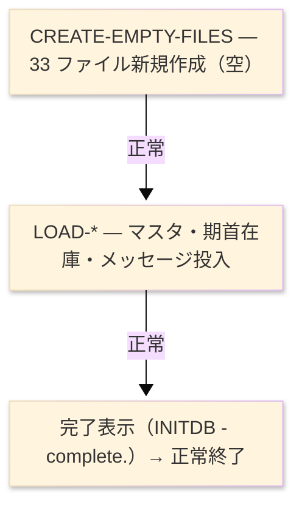

# ジョブフロー — INITDB

| 項目 | 内容 |
|---|---|
| JOBID | INITDB（`main/INITDB.cob`） |
| 処理名称 | データベース初期化・初期データ投入 |
| システム／分類 | SAKURA 販売管理システム／バッチ（NEC COBOL85, コンソール実行） |
| 実行環境（現行） | COBOL バッチ（`/Ccon` コンソール）。索引編成ファイルの新規作成と初期データ投入 |
| ジョブ情報源 | **reg に orchestrator（JCL/BAT）が存在しない** — 下記「ステップ」は本プログラム自身の内部実行フェーズ（INIT/main/END）である |
| 起動コマンド／実行スケジュール | 初回セットアップ時に一度だけ手動起動（`INITDB`）。定期実行なし。※起動手順の詳細は要チーム確認 |

> **凡例**: ★＝詳細設計あり（`INITDB_データベース初期化_プログラム詳細設計書.md`）｜OUT:＝新規作成／投入（出力）｜LOG:＝コンソール表示

| ステップ | 行 | 処理 | ＤＤ | データセット／ファイル | 備考 |
|---|---|---|---|---|---|
| **◆ 概要** | | 全索引編成ファイルを新規作成し、マスタ初期データと期首在庫を投入する | ・全体: | `作成開始表示 → 33 ファイル新規作成 → マスタ／期首在庫投入 → 完了表示` | orchestrator 不在。破壊的初期化 |
| | | | ・P0: | `ファイル新規作成` | |
| | | | ・P1: | `初期データ投入` | |
| | | | ・Output: | `SYSCF/NUMCF/TAXF・各マスタ・STOKF・MSGF、および空の取引ファイル群` | |
| **◆ P0 ファイル作成** | | 既存を上書きし空ファイルを確保 | | | |
| **CREATE-EMPTY-FILES** | L114 | ★ 全 33 ファイルを出力モードで作成し即クローズ（空ファイル確保） | OUT:各-RDB | `SYSCF/NUMCF/TAXF/REGNF/DEPTF/CATGF/BANKF/WHSEF/STAFF/USERF/CUSTF/SUPPF/PRODF/CPRCF/STOKF/MSGF ほか取引 17 ファイル` | 索引編成。既存データは消失 |
| | L93 | 初期化開始をコンソール表示 | LOG:CONSOLE | `SAKURA-SMS  INITDB - creating files ...` | 逐語 |
| **◆ P1 初期データ投入** | | マスタと期首在庫を投入 | | | |
| **LOAD-SYSTEM 他** | L137 | ★ システム制御・採番・消費税率・地域・部門・分類・銀行・倉庫・社員・ユーザーを投入 | OUT:各-RDB | `SYSCF/NUMCF/TAXF/REGNF/DEPTF/CATGF/BANKF/WHSEF/STAFF/USERF` | デモ用ハードコード初期値 |
| **LOAD-CUST 他** | L(P1) | ★ 得意先・仕入先・商品・得意先別単価・期首在庫・メッセージを投入 | OUT:各-RDB | `CUSTF/SUPPF/PRODF/CPRCF/STOKF/MSGF` | 取引ファイルは空のまま |
| **終了** | L111 | 完了をコンソール表示し正常終了 | LOG:CONSOLE | `SAKURA-SMS  INITDB - complete.` | ABEND なし。RC=0 |

### ジョブフロー図

