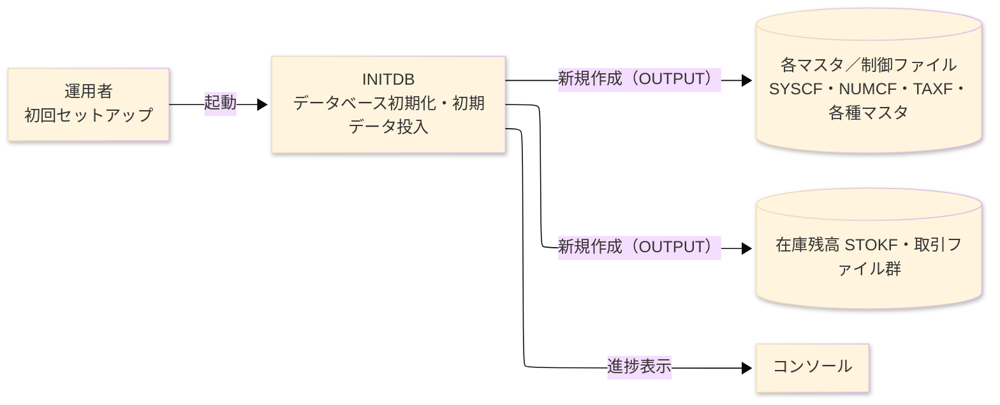
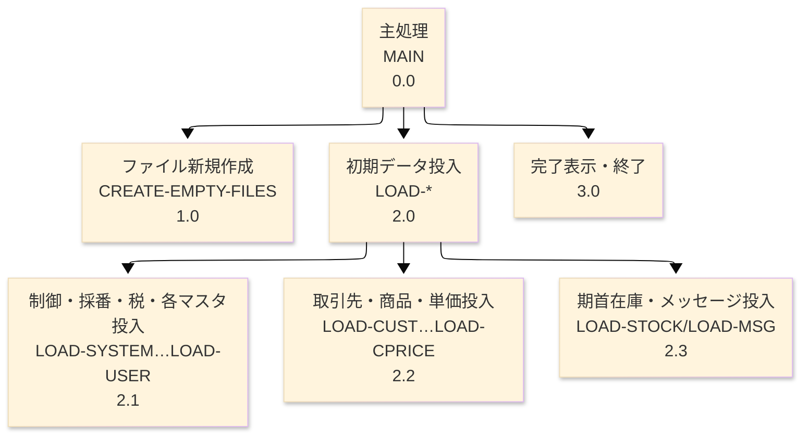

# プログラム詳細設計書 — INITDB

**共通ヘッダ**

| システム名 | プログラムID | 作成／修正日・作成者 | 修正箇所（修正日を記載） |
|---|---|---|---|
| SAKURA 販売管理システム | INITDB | 作成 2026-08-30／modernizeX | - |

## 1. プログラム概要

### 1.1 I/O図

### 1.2 機能概要

システムを即座にデモできるよう、全ての索引編成ファイルを新規に作成し、マスタの初期データと
期首在庫を投入する初期化バッチである。初回運用の前に一度だけ実行する（コンソール／バッチ）。
起動時にコンソールへ `SAKURA-SMS  INITDB - creating files ...` を表示し、全ファイルを出力モードで
作成したのち、システム制御・採番・消費税率・地域・部門・分類・銀行・倉庫・社員・ユーザー・得意先・
仕入先・商品・得意先別単価・在庫残高・メッセージの各ファイルへ初期レコードを投入し、最後に
`SAKURA-SMS  INITDB - complete.` を表示して終了する。取引系ファイル（受注・売上・発注・仕入・入荷・
出荷・売掛元帳・買掛元帳・入金・支払・在庫移動）は空で作成する。

### 1.3 I/O概要

| ファイル／テーブル／画面／帳票名 | DD／SYS-ID | Copybook ID | I/O区分 | 種別 (Main/Sub) | ファイル編成 |
|---|---|---|---|---|---|
| システム制御（SYSCF） | SYSCF-RDB | FSYSC | O（新規作成・投入） | Main | INDEXED |
| 採番マスタ（NUMCF） | NUMCF-RDB | FNUMC | O | Main | INDEXED |
| 消費税率マスタ（TAXF） | TAXF-RDB | FTAX | O | Main | INDEXED |
| 地域／部門／分類／銀行／倉庫／社員／ユーザーマスタ | 各 -RDB | FREGN/FDEPT/FCATG/FBANK/FWHSE/FSTAF/FUSER | O | Main | INDEXED |
| 得意先／仕入先／商品／得意先別単価マスタ（CUSTF/SUPPF/PRODF/CPRCF） | 各 -RDB | FCUST/FSUPP/FPROD/FCPRC | O | Main | INDEXED |
| 在庫残高（STOKF）・メッセージマスタ（MSGF） | 各 -RDB | FSTOK/FMSG | O | Main | INDEXED |
| 取引ファイル群（ORDHF/ORDDF/INVHF/INVDF/POHF/PODF/PURHF/PURDF/RCVHF/RCVDF/SHPHF/SHPDF/ARLF/APLF/RCPTF/PAYF/SMOVF） | 各 -RDB | 各 F* | O（空で作成） | Main | INDEXED |
| コンソール | - | - | O（進捗表示） | Main | 画面（DISPLAY のみ） |

計 33 の索引編成ファイルを出力モードで新規作成する（`OPEN OUTPUT` × 33）。

### 1.4 呼出しサブプログラム／モジュール

| プログラムID | 呼出し方式 | 機能名 | インタフェース |
|---|---|---|---|
| （なし） | - | 他モジュールを呼び出さない | - |

### 1.5 DB表＆SQL（EXEC SQL がある場合）

SQL 不使用（純粋なファイル I/O）。全データストアは COBOL 索引編成ファイル（`*-RDB`）。

### 1.6 特記事項

- **破壊的初期化**: 全ファイルを出力モードで作り直すため、既存データがある環境では**全件消失**する。
  初回セットアップ専用で、本番稼働後の再実行は禁止（要運用ルール確認）。
- 取引ファイルは空で作成し、マスタと期首在庫のみ投入する。投入値はソースにハードコードされた
  デモ用初期データ（要チーム確認）。

## 2. 処理内容

### 1. 主処理（MAIN）　[0.0]　(L91)
1) コンソールへ初期化開始を表示する（`SAKURA-SMS  INITDB - creating files ...`）(L93)。
2) 「ファイル新規作成処理」を実行する。
3) 「初期データ投入処理」を各マスタについて順に実行する。
4) コンソールへ完了を表示する（`SAKURA-SMS  INITDB - complete.`）(L111) し、終了する。

### 2. ファイル新規作成処理（CREATE-EMPTY-FILES）　[1.0]　(L114)
1) 全 33 ファイルを出力モードで作成し、直ちに閉じる（空ファイルの確保）。既存ファイルは上書きされる。

### 3. 初期データ投入処理（LOAD-*）　[2.0]　(L137〜)
1) システム制御（会社情報・会計期首・当期年月・税既定率・端数処理）を 1 件投入する（LOAD-SYSTEM, L137）。
2) 採番マスタの各系列を投入する（LOAD-NUMBERS／WRITE-NUM, L158）。
3) 消費税率・地域・部門・分類・銀行・倉庫・社員・ユーザーの各マスタを投入する（LOAD-TAX 以降, L237〜）。
4) 得意先・仕入先・商品・得意先別単価の各マスタを投入する。
5) 期首在庫を在庫残高へ投入し、メッセージマスタを投入する。

### 4. 終了処理　[3.0]　(L111)
1) 完了メッセージを表示し、リターンコード正常で終了する。

## 3. 構造図

## 4. 出力仕様（ファイル・テーブル）

代表として得意先マスタ（CUSTF）の投入レコードを示す。他マスタも同様に各 copybook のレコード
レイアウトどおりに投入する。

### 4.1 得意先マスタ CU-REC（FD CUSTF, copybook FCUST）— 313 byte（抜粋）

| Level | 項目名 | フィールド名 | 型 | Byte数 | 位置 | INMSG | Master | Literal | その他 | TBL | 値の設定方法 |
|---|---|---|---|---|---|---|---|---|---|---|---|
| 01 | 得意先レコード | CU-REC | (group) | 313 | 1 | | | | ○ | | デモ初期データを投入 |
| 02 | 得意先コード | CU-CODE | 9(6) | 6 | 1 | | | ○ | | | ハードコード初期値 |
| 02 | 得意先名 | CU-NAME | X(40) | 40 | 7 | | | ○ | | | ハードコード初期値 |
| 02 | カナ名 | CU-KANA | X(40) | 40 | 47 | | | ○ | | | ハードコード初期値 |
| 02 | 郵便番号 | CU-ZIP | X(8) | 8 | 87 | | | ○ | | | ハードコード初期値 |
| 02 | 住所1 | CU-ADDR1 | X(40) | 40 | 95 | | | ○ | | | ハードコード初期値 |
| 02 | 住所2 | CU-ADDR2 | X(40) | 40 | 135 | | | ○ | | | ハードコード初期値 |
| 02 | 電話 | CU-TEL | X(15) | 15 | 175 | | | ○ | | | ハードコード初期値 |
| 02 | FAX | CU-FAX | X(15) | 15 | 190 | | | ○ | | | ハードコード初期値 |
| 02 | 地域コード | CU-REGION | 9(3) | 3 | 205 | | | ○ | | | 地域マスタ整合の初期値 |
| 02 | 営業担当 | CU-STAFF | 9(4) | 4 | 208 | | | ○ | | | 社員マスタ整合の初期値 |

（以降 CU-CLOSE-DAY ほか締め・支払・与信・銀行の各項目まで、FCUST のレイアウトどおり 313 byte を投入。）

## 5. 入出力パラメータ＆チェック仕様

### 5.1 パラメータ

| 区分 | 名称 | 型／長さ | 意味 | 値／出所 |
|---|---|---|---|---|
| 起動 | （引数なし） | - | 引数・SYSIN 無し。ハードコードの初期データを投入 | - |
| Return code | 正常終了 | - | 完了表示後に正常終了 | 0＝正常 |

### 5.2 チェック

| No. | チェック種別 | 対象 | 発生条件 | エラーコード | メッセージ／動作 |
|---|---|---|---|---|---|
| 1 | 業務 | 全ファイル | 出力モードでの作成 | - | 既存データは上書き（破壊的）。事前バックアップは運用側の責任（要チーム確認） |

## 6. 修正概要

| No. | 修正日 | 表題 | 修正概要 |
|---|---|---|---|
| 1 | 2026.08.30 | AS-IS 初版 | reg（AST）からの新規リバース起票。 |
