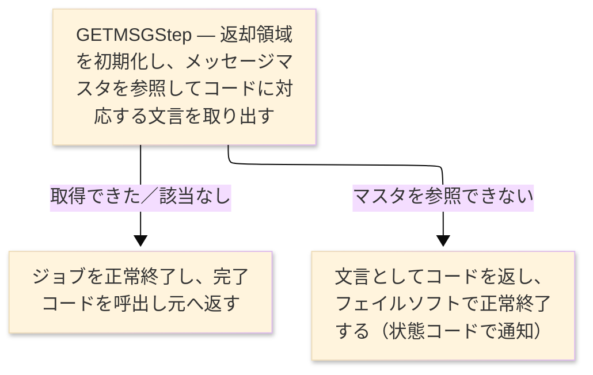

# TO-BE ジョブフロー設計書（ジョブフロー・TO-BE） — GETMSG

> `GETMSG_メッセージ取得_ジョブフロー.md` の TO-BE 版。**ステップの順序と分岐条件は維持する**。
> 変更した箇所は §4 に記載する。参照先: `test_sakura_light-batch/launcher`（`AppLauncher`）、
> `programs/getmsg/…/flow/GetmsgJobFlow.java`（Job/Step/Tasklet）、`service/GetmsgService.java`、
> `runtime/GetmsgDatasets.java`、`core/…/runtime/io/MsgfDataset.java`、および AS-IS 設計書。

| 項目 | 値 |
|---|---|
| JOBID | Job `GETMSGJob`（Step `GETMSGStep`） |
| 処理名 | メッセージ文言取得（そのまま維持） |
| プラットフォーム | Java 17 · Spring Boot 3.x · Spring Batch（Tasklet） |
| 実行方法 | `java -jar test_sakura_light-batch.jar --spring.batch.job.name=GETMSGJob` |
| 実行スケジュール | ※未確定（要チーム確認）— AS-IS は各画面・帳票から同期呼出しされる共通下位モジュールで、単独ジョブとしては起動しない |
| ログ／監視 | logback ＋ Spring Batch メタデータ表（`BATCH_JOB_EXECUTION` ほか）。ジョブ／ステップの開始・終了と完了コードを記録 |

### ジョブフロー図

## 1. ステップ表 — 1対1 対応

各ステップを太字の 1 行、その入出力を子行として書く。TO-BE の列は実際の成果物を指す。

| ステップ | プログラム | Step | I/O | ファイル／テーブル | 備考 |
|---|---|---|---|---|---|
| **◆ 概要** | | メッセージコードを受け取り、対応する表示文言を求めて呼出し元へ返す。見つからなければコード自身を文言として返す | ・全体: | 連絡領域で受領 → メッセージマスタ照会 → 文言と状態を返却 | AS-IS の内部フェーズ（初期化／照会／終了）を 1 ステップに集約 |
| **◆ P0 主処理** | | 1 回の実行で 1 件のメッセージ文言を取り出す業務を、単一ステップとして実行する | | | |
| **GETMSGStep** | GETMSG | `GETMSGStep` → Tasklet → `GetmsgService` | | | 単一ステップのジョブ |
| | | | IN | メッセージマスタ（`MsgfDataset`、キー `MG-CODE`） | 要求コードで 1 件参照 |
| | | | IN | 連絡領域（`GetmsgLinkParm`、`KM-CODE`） | 呼出し元が設定 |
| | | | OUT | 連絡領域（`GetmsgLinkParm`、`KM-TEXT`／`KM-STATUS`） | `00`＝正常／`01`＝該当なし／`99`＝マスタ利用不可 |

## 2. 分岐条件と依存関係

| 条件 | フロー |
|---|---|
| メッセージマスタを開いて該当コードを 1 件参照できたとき | 登録されている文言を返却領域へ設定し、状態コードを正常にしてジョブを正常終了する |
| 該当コードがマスタに存在しないとき | 要求コード自身を文言として返し、状態コードを「該当なし」にして正常終了する |
| メッセージマスタを参照できないとき | 要求コード自身を文言として返し、状態コードを「マスタ利用不可」にして、業務を止めずに正常終了する（フェイルソフト） |

## 3. 終了処理と異常処理

| 項目 | 値 |
|---|---|
| 正常終了 | ジョブが正常に終わり、完了コード 0 を返す。状態コードで取得可否（正常／該当なし／利用不可）を通知する |
| 業務エラー | 業務としての中断は無い。マスタ利用不可でも異常終了せず、状態コードで結果を通知して継続する（フェイルソフト設計） |
| 再実行 | 冪等な参照処理のため、ジョブ全体をそのまま再実行できる |
| 後始末 | 参照後にメッセージマスタを閉じる。常駐せず、実行のたびに開いて閉じる |

## 4. ジョブ内のプログラム

| # | プログラム | モジュール | 詳細設計書 |
|---|---|---|---|
| 1 | GETMSG | メッセージコードから表示文言を取り出す共通処理を、単一ステップのバッチジョブとして提供する | GETMSG プログラム詳細設計書（TO-BE） |

> **差異（AS-IS→TO-BE）**: AS-IS は `CALL "GETMSG"` で各画面・帳票から同期呼出しされる下位モジュールだった。
> TO-BE では Spring Batch の独立ジョブ（`GETMSGJob`）として生成される。業務挙動（コード→文言、状態コードの意味）は同一。
> 呼出し規約が「サブルーチン呼出し」から「ジョブ起動＋連絡領域」に変わる点のみ運用側の確認を要する（※要チーム確認）。
