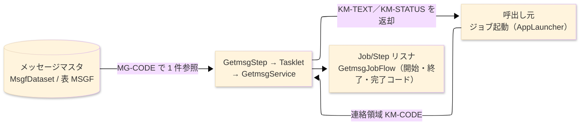
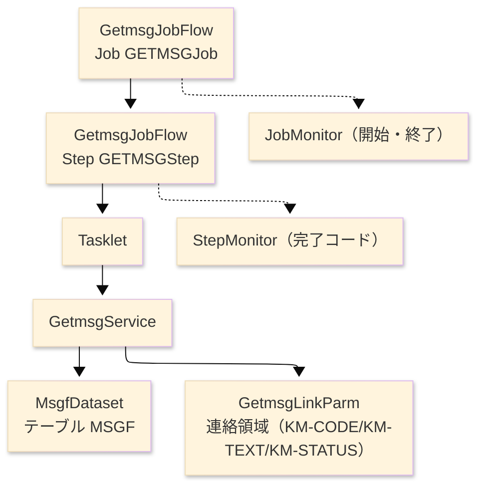

# TO-BE バッチプログラム設計書（プログラム詳細設計・TO-BE） — GETMSG

> **TO-BE は業務的に AS-IS と同一。** 節の順序は AS-IS 設計書
> （`GETMSG_メッセージ取得_プログラム詳細設計書.md`）に合わせ、1 対 1 で対照できるようにする。
> 追加するのは生成済み Spring Batch モジュールへの写像だけである。異ならざるを得ない箇所は §8 へ。
>
> **参照先**: `test_sakura_light-batch/programs/getmsg`（`flow/GetmsgJobFlow`・`service/GetmsgService`・
> `domain/WorkingStorage`・`domain/GetmsgFieldAccess`・`runtime/GetmsgDatasets`）、`core`（`runtime/io/MsgfDataset`・
> `runtime/linkage/GetmsgLinkParm`・`runtime/BatchServiceBase`）、`launcher/AppLauncher`、および AS-IS 設計書。

**ヘッダ**

| 項目 | 内容 |
|---|---|
| システム | SAKURA 販売管理システム |
| 元プログラム | GETMSG（COBOL・NEC COBOL85 サブルーチン） |
| TO-BE モジュール | `test_sakura_light-batch/programs/getmsg` · package `com.sakura.getmsg` |
| プラットフォーム | Java 17 · Spring Boot 3.x · Spring Batch（Tasklet） · DB H2／Oracle |
| 作成者／作成日 | modernizeX ／ 2026-08-30 |

## 1. プログラム概要

### 1.1 TO-BE I/O図

### 1.2 機能概要

メッセージコードに対応する表示文言を返す共通処理である。呼出し元は連絡領域にメッセージコードを設定して起動する。
本処理はメッセージマスタをそのコードで 1 件参照し、見つかれば登録文言を返し、見つからなければコード自身を文言として返す。
処理結果は状態コードで通知する（`00`＝正常取得、`01`＝該当コードなし、`99`＝マスタ利用不可）。
AS-IS では全画面・帳票が共通で呼び出す下位モジュールで、単独では起動しなかった。TO-BE では単一ステップの Spring Batch ジョブとして提供する。

### 1.3 I/O表

| 業務名 | ファイル／テーブル | I/O |
|---|---|---|
| メッセージマスタ | テーブル `MSGF`（`MsgfDataset`、索引キー `MG-CODE`） | I |
| 連絡領域（メッセージコード・文言・状態） | `GetmsgLinkParm`（`KM-CODE`／`KM-TEXT`／`KM-STATUS`） | I-O |

> AS-IS の索引編成ファイル MSGF は TO-BE で RDB 表になる。読取キー `MG-CODE` は主キー相当。
> 1 件のキー等価参照のみで、読み順（READ NEXT）には依存しない。

### 1.4 呼出しサブプログラム／モジュール

| 項目 | 備考 |
|---|---|
| （なし） | 他モジュールを呼び出さない共通下位処理である |

### 1.5 DB表＆SQL

| テーブル | 操作 | 列 |
|---|---|---|
| `MSGF` | SELECT（キー等価） | `MsgfDataset` 経由でコード `MG-CODE` により 1 件参照 |

ファイル→テーブル化に伴い参照は 1 件の等価検索になる。更新・追加は行わない（参照のみ）。

### 1.6 特記事項

- 実行のたびにメッセージマスタを開いて閉じる（常駐保持しない）。
- マスタを参照できない場合でも異常終了せず、コードをそのまま文言として返し状態コードで通知する（フェイルソフト）。

## 2. 処理内容

_処理順に 1 ステップ 1 行。各行はそのステップが業務として何をするかを書く。_

**識別番号** の採番はそのまま維持する（0.0 主処理）。

| 識別番号 | 業務ステップ | 何が起きるか | 条件／実際の値 |
|---|---|---|---|
| 0.0 | 1 件のメッセージ取得を開始する | 返却領域を初期化し、状態を正常に、文言を空白に整えてから処理に入る | |
| 0.0 | メッセージマスタを参照できるか確かめる | マスタを参照用に開き、開けない場合は要求コードをそのまま文言として返し、状態を「マスタ利用不可」にして呼出し元へ戻る | 開けないとき `KM-STATUS=99` |
| 0.0 | 要求コードで文言を取り出す | 要求されたコードでメッセージマスタを 1 件照会し、登録されている文言を返却領域へ設定する | 該当あり → `KM-STATUS=00` |
| 0.0 | 該当が無い場合の扱いを決める | 該当コードが無ければ、要求コード自身を文言とし、状態を「該当なし」にして返す | 該当なし → `KM-STATUS=01` |
| 0.0 | 取得を締める | メッセージマスタを閉じ、文言と状態コードを連絡領域に載せ、呼出し元へ戻る | |

## 3. 構造図

## 4. 出力仕様（ファイル・テーブル）

出力は連絡領域（返却）である。バイト位置はそのまま維持する。

### 4.1 連絡領域 KMSG（返却）— 68 byte

| Level | 項目名 | フィールド名 | 型／バイト | Java／SQL 型 | 設定方法 |
|---|---|---|---|---|---|
| 01 | 連絡領域 | KMSG | (group)／68 | `GetmsgLinkParm` | 呼出し元と共有 |
| 02 | メッセージコード | KM-CODE | X(6)／6 | `String` | 呼出し元が設定（入力） |
| 02 | メッセージ文言 | KM-TEXT | X(60)／60 | `String` | 該当時は登録文言、非該当時は要求コードを設定 |
| 02 | 状態コード | KM-STATUS | X(2)／2 | `String` | `00`＝正常／`01`＝該当なし／`99`＝マスタ利用不可 |

### 4.2 参照レコード MG-REC（テーブル MSGF）— 76 byte（入力参照）

| Level | 項目名 | フィールド名 | 型／バイト | Java／SQL 型 | 設定方法 |
|---|---|---|---|---|---|
| 01 | メッセージレコード | MG-REC | (group)／76 | `MsgfDataset` レコード | メッセージマスタから読取 |
| 02 | メッセージコード | MG-CODE | X(6)／6 | `String` ／ `VARCHAR2(6)` | 読取キー（要求コードを設定） |
| 02 | メッセージ文言 | MG-TEXT | X(60)／60 | `String` ／ `VARCHAR2(60)` | 返却文言の取得元 |
| 02 | 予備 | FILLER | X(10)／10 | `String` | - |

> 文字項目のみで数値・COMP-3 は無いため、丸め・数値誤差の論点は無い。

## 5. 入出力パラメータ＆チェック仕様

### 5.1 パラメータ

| 種別 | 値 | 備考 |
|---|---|---|
| 入力パラメータ | 連絡領域のメッセージコード（`KM-CODE`） | 呼出し元が設定 |
| 戻り値 | 取得した文言（`KM-TEXT`）と状態コード（`KM-STATUS`）、および完了コード | 状態コードで取得可否を判定できる |

### 5.2 チェック

| No. | 種別 | 条件 | エラーコード | 挙動 |
|---|---|---|---|---|
| 1 | 業務 | メッセージマスタを開けない | `KM-STATUS=99` | コードを文言として返し、フェイルソフトで正常終了する |
| 2 | 業務 | 指定コードがマスタに無い | `KM-STATUS=01` | コードを文言として返す |

## 6. 修正概要

| No. | 日付 | 件名 | 内容 |
|---|---|---|---|
| 1 | 2026-08-30 | TO-BE 初版 | AS-IS 設計書を Java/Spring Batch 実装へ写像して起票。 |

## 7. 画面（画面を持つ場合のみ）

画面なし。共通下位処理であり、コンソール／画面出力は持たない。

## 8. TO-BE 運用（JCL/BAT の代替）

| 項目 | 値 |
|---|---|
| 起動 | `java -jar test_sakura_light-batch.jar --spring.batch.job.name=GETMSGJob` |
| 実行スケジュール | ※未確定（要チーム確認）。AS-IS はサブルーチン同期呼出しで、独立ジョブとしては起動しなかった |
| 入力データ | 呼出し元が設定するメッセージコードと、投入済みのメッセージマスタ表 |
| ログ | logback ＋ Spring Batch メタデータ表（開始・終了・完了コードを記録） |
| 再実行 | 参照のみで副作用が無く、ジョブ全体をそのまま再実行できる |

> **差異（AS-IS→TO-BE）**: 呼出し規約が「`CALL "GETMSG"` の同期呼出し」から「Spring Batch ジョブ起動＋連絡領域」に変わる。
> 取得ロジック・状態コードの意味・返却文言は同一。運用側は呼出し方法の変更のみ確認すればよい。
