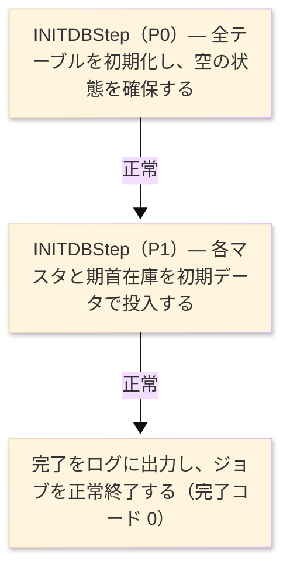

# TO-BE ジョブフロー設計書（ジョブフロー・TO-BE） — INITDB

> `INITDB_データベース初期化_ジョブフロー.md` の TO-BE 版。**ステップの順序と分岐条件は維持する**。
> 変更した箇所は §4 に記載する。参照先: `test_sakura_light-batch/launcher`（`AppLauncher`）、
> `programs/initdb/…/flow/InitdbJobFlow.java`（Job/Step/Tasklet）、`service/InitdbService.java`、
> `runtime/InitdbDatasets.java`、`io/<Xxx>Dataset.java`（各表）、`launcher/…/resources/schema.sql`、および AS-IS 設計書。

| 項目 | 値 |
|---|---|
| JOBID | Job `INITDBJob`（Step `INITDBStep`） |
| 処理名 | データベース初期化・初期データ投入（そのまま維持） |
| プラットフォーム | Java 17 · Spring Boot 3.x · Spring Batch（Tasklet） |
| 実行方法 | `java -jar test_sakura_light-batch.jar --spring.batch.job.name=INITDBJob` |
| 実行スケジュール | 初回セットアップ時に一度だけ手動起動。定期実行なし。※起動手順の詳細は要チーム確認 |
| ログ／監視 | logback ＋ Spring Batch メタデータ表。進捗はログ行として出力（旧コンソール表示に対応） |

### ジョブフロー図

## 1. ステップ表 — 1対1 対応

各フェーズを太字の 1 行、その入出力を子行として書く。TO-BE の列は実際の成果物を指す。
AS-IS の内部フェーズ（ファイル新規作成・初期データ投入・完了表示）は、単一ステップ内の処理順として維持される。

| ステップ | プログラム | Step | I/O | ファイル／テーブル | 備考 |
|---|---|---|---|---|---|
| **◆ 概要** | | 全データストアを初期化し、マスタ初期データと期首在庫を投入して、デモ可能な初期状態を作る | ・全体: | 開始をログ出力 → 全テーブル初期化 → マスタ・期首在庫投入 → 完了をログ出力 | 破壊的初期化。既存データは消える |
| **◆ P0 テーブル初期化** | | 対象の全テーブルを空の状態に整える（既存データを作り直す） | | | 旧「33 ファイル出力モード作成」に対応 |
| **INITDBStep** | INITDB | `INITDBStep` → Tasklet → `InitdbService` | | | 単一ステップのジョブ |
| | | | LOG | 実行ログ（開始メッセージ） | 逐語 `SAKURA-SMS  INITDB - creating files ...` |
| | | | OUT | システム制御・採番・各マスタ・在庫残高・メッセージの各表、および空の取引表群 | `SyscfDataset`／`NumcfDataset`／各 `<Xxx>Dataset` |
| **◆ P1 初期データ投入** | | システム制御・採番・消費税率・各マスタ・得意先別単価・期首在庫・メッセージを順に投入する | | | デモ用ハードコード初期値 |
| | | | OUT | `CUSTF`／`SUPPF`／`PRODF`／`CPRCF`／`STOKF`／`MSGF` ほか各マスタ表 | 取引表（受注・売上・発注・仕入・入荷・出荷・売掛・買掛・入金・支払・在庫移動）は空のまま |
| | | | LOG | 実行ログ（完了メッセージ） | 逐語 `SAKURA-SMS  INITDB - complete.` |

## 2. 分岐条件と依存関係

| 条件 | フロー |
|---|---|
| 全テーブルの初期化が正常に完了したとき | 続いて各マスタと期首在庫の初期データ投入へ進む |
| マスタ・期首在庫の投入が正常に完了したとき | 完了をログに出力し、ジョブを正常終了する（完了コード 0） |
| いずれかの処理で例外が発生したとき | ステップを失敗（FAILED）とし、失敗内容をログに記録してジョブを異常終了する |

## 3. 終了処理と異常処理

| 項目 | 値 |
|---|---|
| 正常終了 | 全テーブルの初期化と初期データ投入を終え、完了メッセージを出力して正常（コード 0）で終わる |
| 業務エラー | 例外発生時は step FAILED として異常終了し、実行ログに失敗内容を残す |
| 再実行 | 破壊的初期化のため、再実行すると既存データを作り直す。初回セットアップ専用で本番稼働後の再実行は運用ルールで禁止（※要チーム確認） |
| 後始末 | 各テーブルへの投入後に確定する（ステップのトランザクション境界でまとめて確定） |

## 4. ジョブ内のプログラム

| # | プログラム | モジュール | 詳細設計書 |
|---|---|---|---|
| 1 | INITDB | 全テーブルを初期化し、マスタ初期データと期首在庫を投入する初期化処理を、単一ステップのバッチジョブとして提供する | INITDB プログラム詳細設計書（TO-BE） |

> **差異（AS-IS→TO-BE）**: AS-IS はコンソール実行の COBOL バッチで、索引編成ファイルを `OPEN OUTPUT` で新規作成していた。
> TO-BE では RDB 表（`schema.sql`）を初期化して初期データを投入する。進捗のコンソール表示は実行ログ出力に置き換わる。
> 業務挙動（何を空にし、何を投入するか、破壊的である点）は同一。
