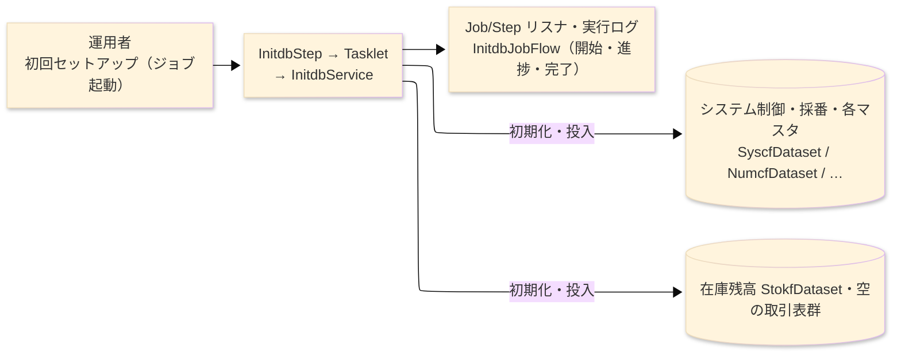
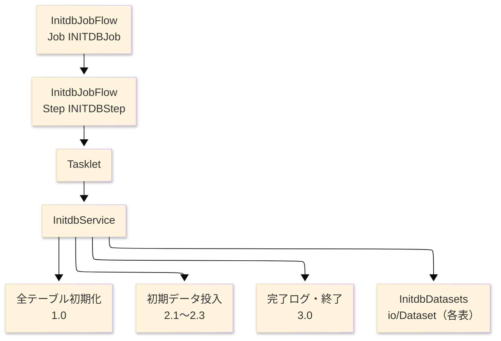

# TO-BE バッチプログラム設計書（プログラム詳細設計・TO-BE） — INITDB

> **TO-BE は業務的に AS-IS と同一。** 節の順序は AS-IS 設計書
> （`INITDB_データベース初期化_プログラム詳細設計書.md`）に合わせ、1 対 1 で対照できるようにする。
> 追加するのは生成済み Spring Batch モジュールへの写像だけである。異ならざるを得ない箇所は §8 へ。
>
> **参照先**: `test_sakura_light-batch/programs/initdb`（`flow/InitdbJobFlow`・`service/InitdbService`・
> `domain/WorkingStorage`・`domain/InitdbFieldAccess`・`runtime/InitdbDatasets`・`io/<Xxx>Dataset`）、
> `launcher/AppLauncher`・`launcher/…/resources/schema.sql`、および AS-IS 設計書。

**ヘッダ**

| 項目 | 内容 |
|---|---|
| システム | SAKURA 販売管理システム |
| 元プログラム | INITDB（COBOL・NEC COBOL85 コンソールバッチ） |
| TO-BE モジュール | `test_sakura_light-batch/programs/initdb` · package `com.sakura.initdb` |
| プラットフォーム | Java 17 · Spring Boot 3.x · Spring Batch（Tasklet） · DB H2／Oracle |
| 作成者／作成日 | modernizeX ／ 2026-08-30 |

## 1. プログラム概要

### 1.1 TO-BE I/O図

### 1.2 機能概要

システムを即座にデモできるよう、対象の全テーブルを初期化し、マスタの初期データと期首在庫を投入する初期化処理である。
初回運用の前に一度だけ実行する。開始時に実行ログへ `SAKURA-SMS  INITDB - creating files ...` を出力し、
全テーブルを初期状態に整えたのち、システム制御・採番・消費税率・地域・部門・分類・銀行・倉庫・社員・ユーザー・得意先・
仕入先・商品・得意先別単価・在庫残高・メッセージの各テーブルへ初期レコードを投入し、最後に `SAKURA-SMS  INITDB - complete.`
を出力して終了する。取引系テーブル（受注・売上・発注・仕入・入荷・出荷・売掛元帳・買掛元帳・入金・支払・在庫移動）は空で作成する。

### 1.3 I/O表

| 業務名 | ファイル／テーブル | I/O |
|---|---|---|
| システム制御・採番 | テーブル `SYSCF`・`NUMCF`（`SyscfDataset`・`NumcfDataset`） | O |
| 各マスタ（税率・地域・部門・分類・銀行・倉庫・社員・ユーザー） | `TAXF`・`REGNF`・`DEPTF`・`CATGF`・`BANKF`・`WHSEF`・`STAFF`・`USERF` | O |
| 取引先・商品・単価・在庫・メッセージ | `CUSTF`・`SUPPF`・`PRODF`・`CPRCF`・`STOKF`・`MSGF` | O |
| 取引テーブル群（空で作成） | `ORDHF`／`ORDDF`／`INVHF`／`INVDF`／`POHF`／`PODF`／`PURHF`／`PURDF`／`RCVHF`／`RCVDF`／`SHPHF`／`SHPDF`／`ARLF`／`APLF`／`RCPTF`／`PAYF`／`SMOVF` | O |
| 進捗表示 | 実行ログ（旧コンソール） | O |

> AS-IS の索引編成ファイル（`OPEN OUTPUT` × 33）は TO-BE で RDB 表になる。初期化時に既存データを作り直す点は同一（破壊的）。

### 1.4 呼出しサブプログラム／モジュール

| 項目 | 備考 |
|---|---|
| （なし） | 他モジュールを呼び出さない |

### 1.5 DB表＆SQL

| テーブル | 操作 | 列 |
|---|---|---|
| 全マスタ・制御・在庫・メッセージ表 | 初期化 ＋ INSERT | 各 `<Xxx>Dataset` 経由でデモ用初期レコードを投入 |
| 取引表群 | 初期化のみ | 空の状態で用意する |

ファイル→テーブル化により、AS-IS の索引編成ファイル作成が RDB 表の初期化＋投入になる。テーブル定義は `schema.sql` に対応する。

### 1.6 特記事項

- **破壊的初期化**: 全テーブルを作り直すため、既存データがある環境では全件消失する。初回セットアップ専用で、本番稼働後の再実行は禁止（要運用ルール確認）。
- 取引テーブルは空で作成し、マスタと期首在庫のみ投入する。投入値はソースにハードコードされたデモ用初期データ（要チーム確認）。

## 2. 処理内容

_処理順に 1 ステップ 1 行。各行はそのステップが業務として何をするかを書く。_

**識別番号** の採番はそのまま維持する（0.0 主処理／1.0 初期化／2.x 投入／3.0 終了）。

| 識別番号 | 業務ステップ | 何が起きるか | 条件／実際の値 |
|---|---|---|---|
| 0.0 | 初期化の実行を開始する | 実行ログへ初期化開始を出力し、対象を確かめ、初期化と投入の一連の処理に入る | 逐語 `SAKURA-SMS  INITDB - creating files ...` |
| 1.0 | 全テーブルを初期化する | 対象の全テーブルを空の状態に整え、既存データがあれば消去し、作り直して空の状態を確保する | 旧「33 ファイルを出力モードで作成」に対応 |
| 2.1 | 制御・採番・各マスタを投入する | システム制御や採番、消費税率や各マスタへ、初期レコードを順に投入する | 対象は地域・部門・分類・銀行・倉庫・社員・ユーザーの各マスタ。デモ用ハードコード初期値 |
| 2.2 | 取引先・商品・単価を投入する | 得意先や仕入先、商品や得意先別単価の各マスタへ、初期レコードを投入する | マスタ整合の初期値 |
| 2.3 | 期首在庫とメッセージを投入する | 在庫残高へ期首在庫を、メッセージマスタへ表示文言を投入する。取引テーブルは空のままとする | |
| 3.0 | 初期化を締める | 実行ログへ完了を出力し、正常（完了コード 0）でジョブを終了する | 逐語 `SAKURA-SMS  INITDB - complete.` |

## 3. 構造図

## 4. 出力仕様（ファイル・テーブル）

代表として得意先マスタ（CUSTF）の投入レコードを示す。他マスタも各テーブル定義どおりに投入する。
バイト位置は AS-IS レコードレイアウトをそのまま維持する。

### 4.1 得意先マスタ CU-REC（テーブル CUSTF）— 313 byte（抜粋）

| Level | 項目名 | フィールド名 | 型／バイト | Java／SQL 型 | 設定方法 |
|---|---|---|---|---|---|
| 01 | 得意先レコード | CU-REC | (group)／313 | `CustfDataset` レコード | デモ初期データを投入 |
| 02 | 得意先コード | CU-CODE | 9(6)／6 | `String` ／ `NUMBER(6)` | ハードコード初期値 |
| 02 | 得意先名 | CU-NAME | X(40)／40 | `String` ／ `VARCHAR2(40)` | ハードコード初期値 |
| 02 | カナ名 | CU-KANA | X(40)／40 | `String` ／ `VARCHAR2(40)` | ハードコード初期値 |
| 02 | 郵便番号 | CU-ZIP | X(8)／8 | `String` ／ `VARCHAR2(8)` | ハードコード初期値 |
| 02 | 住所1 | CU-ADDR1 | X(40)／40 | `String` ／ `VARCHAR2(40)` | ハードコード初期値 |
| 02 | 住所2 | CU-ADDR2 | X(40)／40 | `String` ／ `VARCHAR2(40)` | ハードコード初期値 |
| 02 | 電話 | CU-TEL | X(15)／15 | `String` ／ `VARCHAR2(15)` | ハードコード初期値 |
| 02 | FAX | CU-FAX | X(15)／15 | `String` ／ `VARCHAR2(15)` | ハードコード初期値 |
| 02 | 地域コード | CU-REGION | 9(3)／3 | `String` ／ `NUMBER(3)` | 地域マスタ整合の初期値 |
| 02 | 営業担当 | CU-STAFF | 9(4)／4 | `String` ／ `NUMBER(4)` | 社員マスタ整合の初期値 |

（以降 CU-CLOSE-DAY ほか締め・支払・与信・銀行の各項目まで、レコードレイアウトどおり 313 byte を投入。）

> 数値項目（`9(n)`）は桁数を維持する。金額・与信など符号付き項目は `BigDecimal` として扱い、丸めは AS-IS と同じ（切り捨て）とする。

## 5. 入出力パラメータ＆チェック仕様

### 5.1 パラメータ

| 種別 | 値 | 備考 |
|---|---|---|
| 入力パラメータ | （引数なし） | ハードコードの初期データを投入する |
| 戻り値 | 完了コード（正常 0） | 完了メッセージ出力後に正常終了 |

### 5.2 チェック

| No. | 種別 | 条件 | エラーコード | 挙動 |
|---|---|---|---|---|
| 1 | 業務 | 全テーブルの初期化（破壊的） | - | 既存データは作り直される。事前バックアップは運用側の責任（要チーム確認） |
| 2 | 形式 | 投入中に例外が発生 | - | step FAILED として異常終了し、失敗内容をログに残す |

## 6. 修正概要

| No. | 日付 | 件名 | 内容 |
|---|---|---|---|
| 1 | 2026-08-30 | TO-BE 初版 | AS-IS 設計書を Java/Spring Batch 実装へ写像して起票。 |

## 7. 画面（画面を持つ場合のみ）

画面なし。進捗は実行ログへ出力する（AS-IS のコンソール表示に対応）。

## 8. TO-BE 運用（JCL/BAT の代替）

| 項目 | 値 |
|---|---|
| 起動 | `java -jar test_sakura_light-batch.jar --spring.batch.job.name=INITDBJob` |
| 実行スケジュール | 初回セットアップ時に一度だけ手動起動。定期実行なし（※起動手順の詳細は要チーム確認） |
| 入力データ | ソースにハードコードされたデモ用初期データ |
| ログ | logback ＋ Spring Batch メタデータ表。進捗・完了はログ行として出力 |
| 再実行 | 破壊的初期化のため、再実行は既存データを作り直す。運用ルールで再実行の可否を管理する（要チーム確認） |

> **差異（AS-IS→TO-BE）**: 索引編成ファイルの `OPEN OUTPUT` 作成が RDB 表の初期化＋投入になり、コンソール進捗表示が
> 実行ログ出力に変わる。業務挙動（初期化対象・投入内容・破壊的である点・投入値）は同一。
