# TO-BE 画面設計書 — MENU00_販売管理システム

## 0. 表紙

| 項目 | 内容 |
|---|---|
| システム | SAKURA 販売管理システム |
| サブシステム | 販売管理（受注・売上・購買・在庫・債権債務・帳票・締め） |
| 機能名 | 販売管理システム（オンライン画面群） |
| 機能ID | MENU00（COBOL program）／オンライン画面群 36 本 |
| TO-BE モジュール | `test_sakura_light-web`（front-end: Vue SFC `src/programs/<pgm>` ／ back-end: `programs/<pgm>` ／ 共通ランタイム `core`） |
| プラットフォーム | Java 17 · Spring Boot 3.x · Vue 3 + TypeScript（WebSocket ターミナルランタイム, 24×80 グリッド） · DB H2／Oracle |
| 版数／作成者／作成日 | 1 ／ modernizeX ／ 2026-08-30 |

承認枠: お客様｜作成者｜承認者｜責任者

本書は SAKURA 販売管理システムのオンライン画面アプリ（ルート `MENU00`）の TO-BE を 1 冊で被覆する。
メインメニューから動的に呼び出される 36 の画面プログラムを §2〜§4 に画面 ID ごとのブロックで記述する。
業務挙動・項目桁数・チェック・分岐条件・データ更新結果は AS-IS と同一であり、変わるのは実装形態（Web 化）だけである。

## 1. 機能概要

### 1.1 概要図

> システム構成: オペレーターはブラウザから WebSocket でランタイムに接続する。ランタイムがメインメニューを描画し、
> 選択された業務画面プログラムを動的に呼び出す。各画面プログラムは共通処理を利用し、RDB 表（旧 索引編成ファイル）を読み書きする。
> 画面そのものと画面間の移動は §2 に置く。

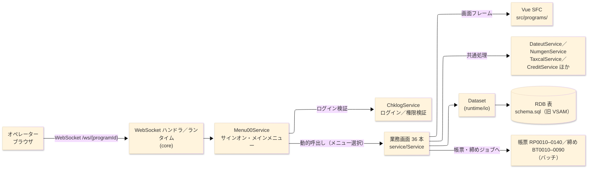
```mermaid
---
config:
  layout: elk
  look: neo
  theme: base
---
flowchart LR
    U["オペレーター<br>ブラウザ"] -- "WebSocket /ws/{programId}" --> WEB["WebSocket ハンドラ／ランタイム<br>(core)"]
    WEB --> MENU["Menu00Service<br>サインオン・メインメニュー"]
    MENU -- "ログイン検証" --> CHK["ChklogService<br>ログイン／権限検証"]
    MENU -- "動的呼出し（メニュー選択）" --> BIZ["業務画面 36 本<br>service/<Pgm>Service"]
    BIZ -- "画面フレーム" --> SFC["Vue SFC<br>src/programs/<pgm>"]
    BIZ -- "共通処理" --> UTIL["DateutService／NumgenService<br>TaxcalService／CreditService ほか"]
    BIZ --> DAO["<Xxx>Dataset<br>(runtime/io)"]
    DAO --> DB[("RDB 表<br>schema.sql（旧 VSAM）")]
    BIZ -- "帳票・締めジョブへ" --> BAT["帳票 RP0010–0140／締め BT0010–0090<br>（バッチ）"]
```

### 1.2 機能概要

> ロール: 全オペレーターはメインメニューでログイン（ログイン ID＋パスワード）し、ユーザーマスタの 5 種の権限フラグ
> （マスタ／受注／売上／購買／締め）で各業務の操作可否が判定される。認証と権限判定はサーバ側で行う。

主要機能（メインメニューの 7 グループ）:

1. マスタ保守 — 得意先・仕入先・商品・倉庫・社員・分類・単価・部門・税率・銀行・地域・ユーザーの各マスタを登録／変更／削除／照会する。
2. 受注・売上 — 受注入力・照会・引当・保守、売上／請求入力・照会・返品・クレジットノート、出荷入力。
3. 購買 — 発注入力・照会、仕入入力・返品、入荷入力。
4. 在庫 — 在庫残高照会・調整・棚卸・移動履歴照会・倉庫間移動。
5. 債権債務 — 入金入力、売掛照会・年齢表、支払入力、買掛照会。
6. 帳票 — 各種一覧・集計・元帳・レポートの印刷（バッチ、画面なし）。
7. バッチ・締め — 日次／月次／年次の締め、残高再計算、パージ、再編成、整合性チェック（バッチ、画面なし）。

**ファンクションキー**（TO-BE では画面上のボタンとキーボード操作で実現し、押下は AID コードとしてサーバへ送られる。表記は画面ごとに異なる。詳細は §4）:

| キー | 表示ラベル（逐語, 代表例） | 動作 |
|---|---|---|
| `ENTER` | `ENTER=Read` | 押下時の局面に応じて、読込や検索、確定や次明細への前進など、その画面の主操作を実行する |
| `PF3` | `PF3=End` | 現在の入力を確定せず、業務を終了し、メインメニューへ戻る |
| `PF9` | `PF9=Delete` | マスタ保守画面で、表示中のレコードを論理削除の対象とし、確認入力を経て削除する |
| `PF4` | `PF4=Clear line` | 入力中の明細をクリアし、スキップや新規入力など、画面ごとの補助操作を行う |
| `PF6` | `PF6=NextPage` | 一覧・照会画面で、明細の次ページへ送り、続きのレコードを表示する |
| `PF12` | `PF12=PrevPage` | 一覧・照会画面で、明細の前ページへ戻り、直前のレコードを表示する |
| `PF5/6` | `PF5/6=Prev/Next` | 照会画面で、前のレコードや次のレコードへ、参照対象を切り替える |

> TO-BE 実装対応: 各画面は front-end の Vue SFC（`src/programs/<pgm>/*.vue`）で描画し、業務ロジックは back-end の
> `programs/<pgm>/…/service/<Pgm>Service` が担う。共通処理は日付・採番・消費税・与信・メッセージ・異常処理の各サービスに対応する。
> キーボードショートカット（PF キー）は AID コードとして維持され、キー操作に慣れたオペレーターの操作感は保たれる。

### 1.3 使用データベース

> 本アプリの全画面が使用する RDB 表（旧 索引編成ファイル）と、アプリ全体での CRUD。読取順（旧 READ NEXT）は各表の
> キー順で保持する（照会・一覧の並び順は AS-IS と同一であること。要回帰確認）。

| № | 論理テーブル名 | 物理テーブル名 | 登録(C) | 参照(R) | 更新(U) | 削除(D) | 備考 |
|---|---|---|---|---|---|---|---|
| 1 | 得意先マスタ | CUSTF | 〇 | 〇 | 〇 | - | 保守画面で登録や変更、照会を行い、売上や入金の計上時に現在残高を更新する |
| 2 | 仕入先マスタ | SUPPF | 〇 | 〇 | 〇 | - | 保守画面で登録や変更、照会を行い、仕入や支払の計上時に買掛残高を更新する |
| 3 | 商品マスタ | PRODF | 〇 | 〇 | 〇 | - | 商品の登録や変更、照会に用い、受注や売上の単価解決の基礎とする |
| 4 | 倉庫マスタ | WHSEF | 〇 | 〇 | 〇 | - | 倉庫の登録や変更、照会に用い、在庫や移動の保管場所を管理する |
| 5 | 社員マスタ | STAFF | 〇 | 〇 | 〇 | - | 社員の登録や変更、照会に用い、担当者や管理者の割当に参照する |
| 6 | 商品分類マスタ | CATGF | 〇 | 〇 | 〇 | - | 分類の登録や変更、照会に用い、商品の分類付けや集計に参照する |
| 7 | 得意先別単価マスタ | CPRCF | 〇 | 〇 | 〇 | - | 得意先と商品の組合せで契約単価を登録し、変更や照会を行い、受注や売上の単価に優先適用する |
| 8 | 部門マスタ | DEPTF | 〇 | 〇 | 〇 | - | 部門の登録や変更、照会に用い、社員や集計の所属区分に参照する |
| 9 | 消費税率マスタ | TAXF | 〇 | 〇 | 〇 | 〇 | 税区分と適用開始日で税率を登録し、変更や照会を行い、保守画面では物理削除も行う |
| 10 | 銀行マスタ | BANKF | 〇 | 〇 | 〇 | - | 銀行の登録や変更、照会に用い、取引先や入出金の振込先に参照する |
| 11 | 地域マスタ | REGNF | 〇 | 〇 | 〇 | - | 地域の登録や変更、照会に用い、得意先の地域区分や集計に参照する |
| 12 | ユーザーマスタ | USERF | 〇 | 〇 | 〇 | - | 利用者の登録や変更、照会に用い、ログイン照合や各業務の権限判定に参照する |
| 13 | 受注ヘッダ | ORDHF | 〇 | 〇 | 〇 | - | 受注入力で登録し、引当や出荷、受注保守の際に状態と内容を更新する |
| 14 | 受注明細 | ORDDF | 〇 | 〇 | 〇 | 〇 | 受注入力で登録し、受注保守で追加や変更、削除を行う明細である |
| 15 | 売上ヘッダ | INVHF | 〇 | 〇 | - | - | 売上・請求入力で登録し、返品や値引でも起票し、照会画面で参照する追記中心のヘッダである |
| 16 | 売上明細 | INVDF | 〇 | 〇 | - | - | 売上・請求入力で登録し、返品や値引で起票し、照会画面で参照する明細である |
| 17 | 発注ヘッダ | POHF | 〇 | 〇 | 〇 | - | 発注入力で登録し、入荷や仕入の進行に合わせて、状態を段階的に更新する |
| 18 | 発注明細 | PODF | 〇 | 〇 | 〇 | - | 発注入力で登録し、入荷や仕入の消込に合わせて、明細を段階的に更新する |
| 19 | 仕入ヘッダ | PURHF | 〇 | - | - | - | 仕入入力で計上し、仕入返品入力でも起票する、追記のヘッダである |
| 20 | 仕入明細 | PURDF | 〇 | - | - | - | 仕入入力で計上し、仕入返品入力でも起票する、追記の明細である |
| 21 | 入荷ヘッダ | RCVHF | 〇 | 〇 | 〇 | - | 入荷入力で登録し、仕入計上や消込の進行に合わせて、状態を更新する |
| 22 | 入荷明細 | RCVDF | 〇 | 〇 | - | - | 入荷入力で登録し、照会や仕入取込で参照し、明細として保持する |
| 23 | 出荷ヘッダ | SHPHF | 〇 | 〇 | 〇 | - | 出荷入力で登録し、出庫や請求連携の進行に合わせて、状態を更新する |
| 24 | 出荷明細 | SHPDF | 〇 | 〇 | - | - | 出荷入力で登録し、照会や売上取込で参照し、明細として保持する |
| 25 | 在庫残高 | STOKF | 〇 | 〇 | 〇 | - | 受注引当や在庫調整、棚卸や倉庫間移動、出荷や入荷の各操作で残高を更新する |
| 26 | 在庫移動履歴 | SMOVF | 〇 | 〇 | - | - | 在庫を動かす各操作で履歴を追記し、日付順に保持し、在庫移動履歴照会で参照する |
| 27 | 売掛元帳 | ARLF | 〇 | 〇 | - | - | 売上や入金の計上時に借方や貸方を追記し、残高に反映し、売掛照会で参照する |
| 28 | 買掛元帳 | APLF | 〇 | 〇 | - | - | 仕入や支払の計上時に借方や貸方を追記し、残高に反映し、買掛照会で参照する |
| 29 | 入金 | RCPTF | 〇 | - | - | - | 入金入力で登録し、売掛元帳へ貸方計上し、得意先残高の更新に連動する |
| 30 | 支払 | PAYF | 〇 | - | - | - | 支払入力で登録し、買掛元帳へ借方計上し、仕入先残高の更新に連動する |

## 2. 画面仕様

> 本節はアプリ全体の画面遷移図で始まり、続いて画面 ID ごとに 1 ブロック（2.1〜2.36）で
> レイアウト（モダナイズ後の画面）・項目詳細・項目状態を記述する。各ブロックの番号は
> §3 チェック仕様・§4 イベント仕様と一致する（2.n・3.n・4.n は同じ画面）。項目桁数・書式は AS-IS と同一である。

> 画面遷移: ログイン後にメインメニューを表示し、業務グループのサブメニューを経て各業務画面を
> 呼び出す。各業務画面は `PF3=End` でメニューへ戻る。

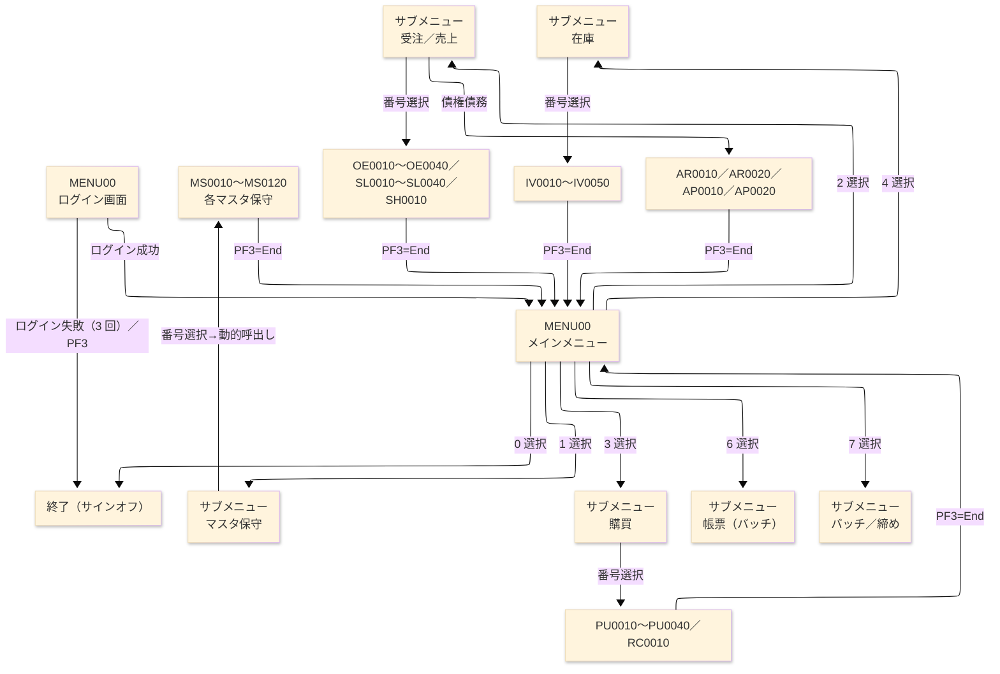
```mermaid
---
config:
  layout: elk
  look: neo
  theme: base
---
flowchart TB
    LOGIN["MENU00<br>ログイン画面"] -- "ログイン成功" --> MAIN["MENU00<br>メインメニュー"]
    LOGIN -- "ログイン失敗（3 回）／PF3" --> END["終了（サインオフ）"]
    MAIN -- "1 選択" --> SMST["サブメニュー<br>マスタ保守"]
    MAIN -- "2 選択" --> SORD["サブメニュー<br>受注／売上"]
    MAIN -- "3 選択" --> SPUR["サブメニュー<br>購買"]
    MAIN -- "4 選択" --> SINV["サブメニュー<br>在庫"]
    MAIN -- "6 選択" --> SRPT["サブメニュー<br>帳票（バッチ）"]
    MAIN -- "7 選択" --> SBAT["サブメニュー<br>バッチ／締め"]
    MAIN -- "0 選択" --> END
    SMST -- "番号選択→動的呼出し" --> MSSCR["MS0010〜MS0120<br>各マスタ保守"]
    SORD -- "番号選択" --> OESCR["OE0010〜OE0040／SL0010〜SL0040／SH0010"]
    SPUR -- "番号選択" --> PUSCR["PU0010〜PU0040／RC0010"]
    SINV -- "番号選択" --> IVSCR["IV0010〜IV0050"]
    SORD -- "債権債務" --> ARSCR["AR0010／AR0020／AP0010／AP0020"]
    MSSCR -- "PF3=End" --> MAIN
    OESCR -- "PF3=End" --> MAIN
    PUSCR -- "PF3=End" --> MAIN
    IVSCR -- "PF3=End" --> MAIN
    ARSCR -- "PF3=End" --> MAIN
```

### 2.1 MENU00 — サインオン・メインメニュー

**レイアウト**

モダナイズ後の画面（Vue SFC `src/programs/menu00/` を WebSocket ターミナルランタイムでレンダリング）。

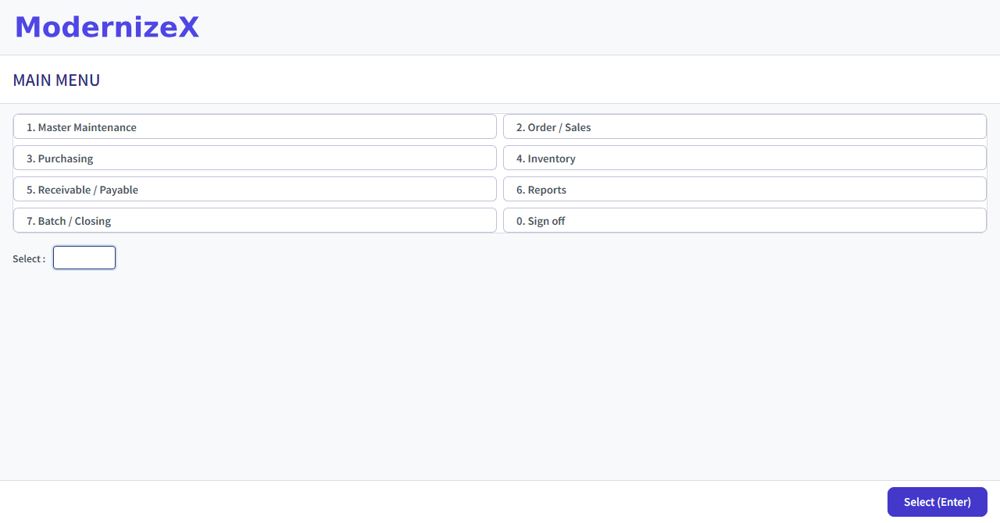

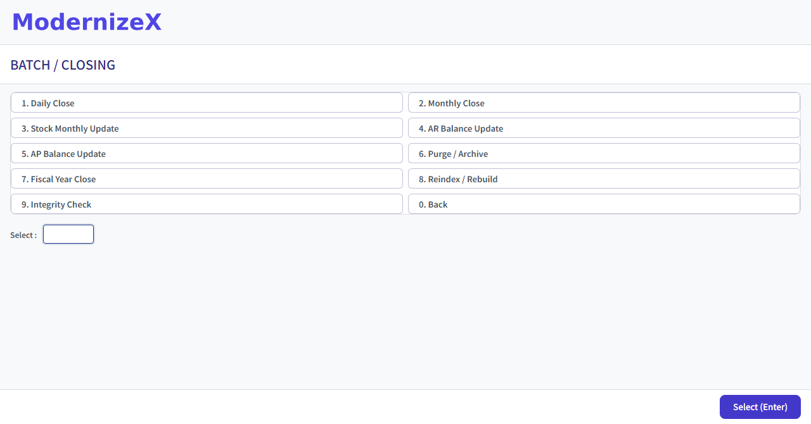

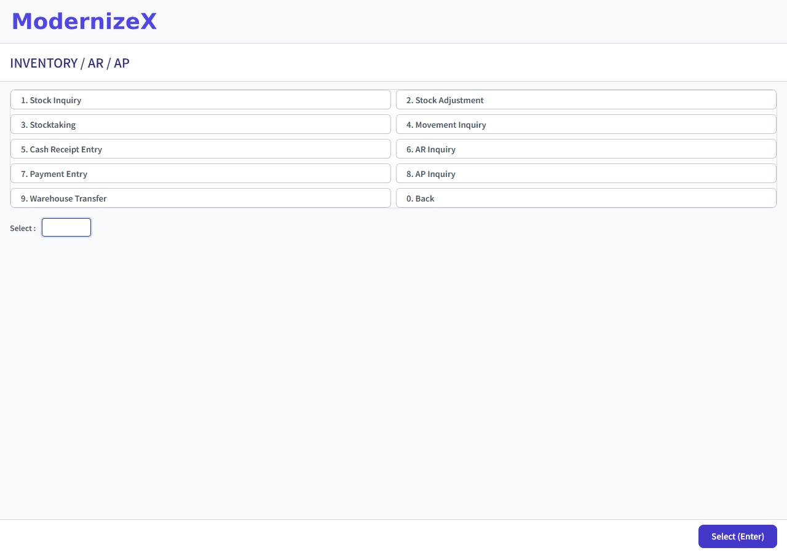

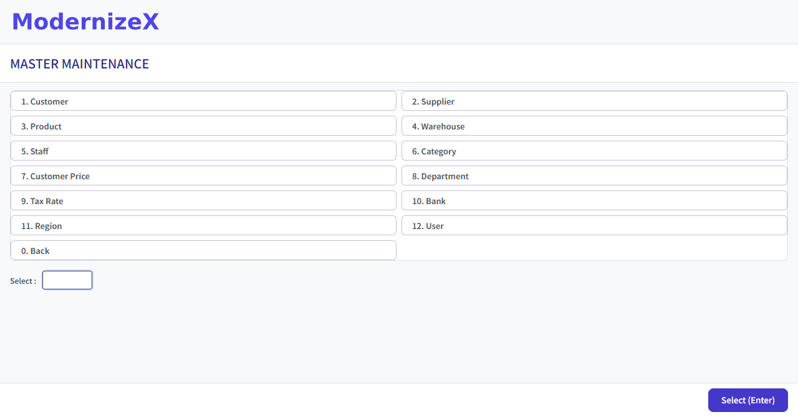

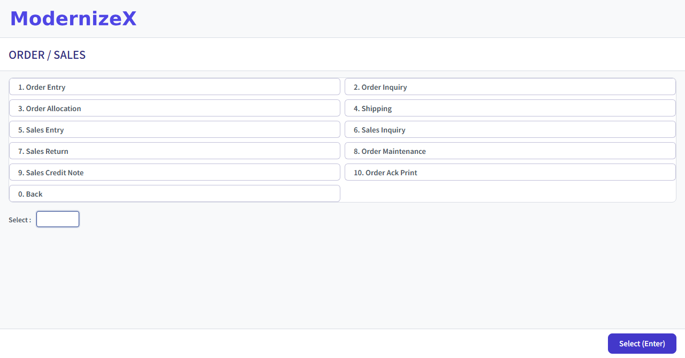

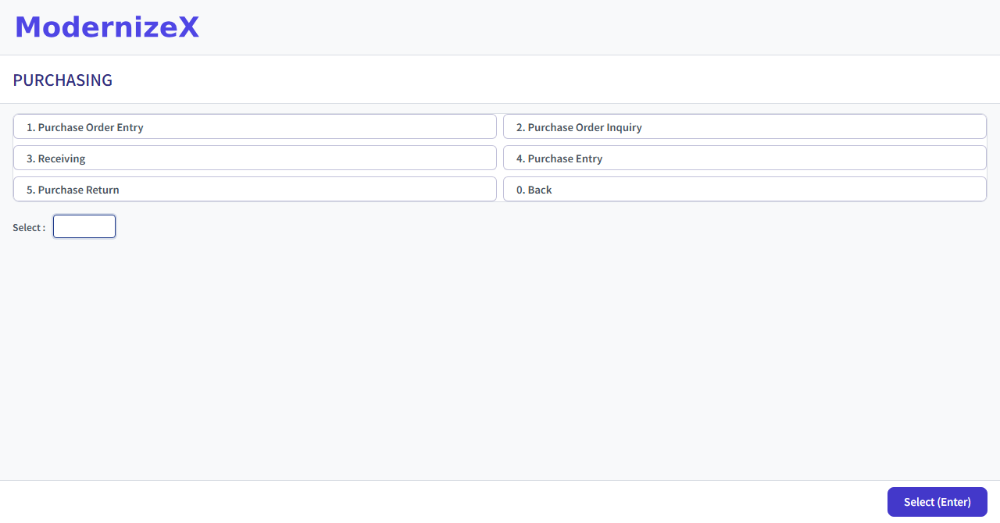

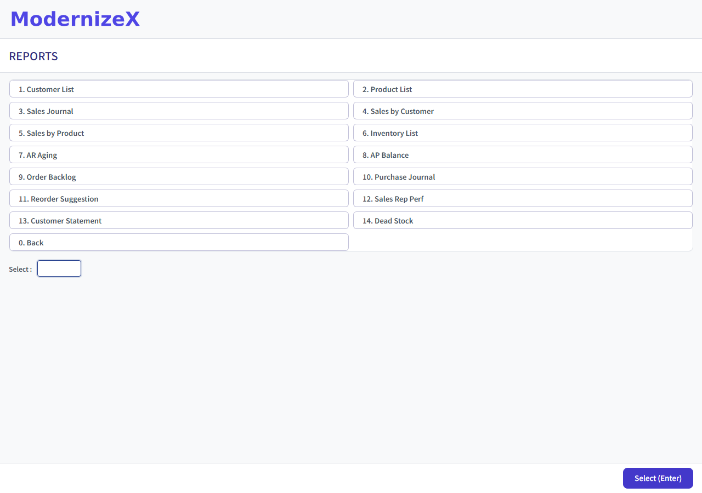

**項目詳細**

| № | コントロール名 | コントロールID | 種別 | Class／データ型 | Tab | 配置 | 文字数 | 値種別 | 初期表示 | 機能／表示データ（DBマッピング） | 取得元／条件 | 入力規則 | 備考 |
|---|---|---|---|---|---|---|---|---|---|---|---|---|---|
| **ログイン画面** ||||||||||||||
| 1 | Login ID | KL-LOGIN | 入力 | X(12) | 1 | 左 | 12 | 英数 | 空 | Login ID（-） | 画面入力 | 入力 | |
| 2 | Password | KL-PASSWORD | 入力 | X(16) | 2 | 左 | 16 | 英数 | 空 | Password（-） | 画面入力 | 入力 | |
| **メインメニュー** ||||||||||||||
| 3 | Select | WK-CHOICE | 入力 | 9(2) | 1 | 左 | 2 | 数値 | 空 | Select（-） | 画面入力 | 必須／コード検証 | |
| **サブメニュー（マスタ保守）** ||||||||||||||
| 4 | Select | WK-CHOICE | 入力 | 9(2) | 1 | 左 | 2 | 数値 | 空 | Select（-） | 画面入力 | 必須／コード検証 | |
| **サブメニュー（受注／売上）** ||||||||||||||
| 5 | Select | WK-CHOICE | 入力 | 9(2) | 1 | 左 | 2 | 数値 | 空 | Select（-） | 画面入力 | 必須／コード検証 | |
| **サブメニュー（購買）** ||||||||||||||
| 6 | Select | WK-CHOICE | 入力 | 9(2) | 1 | 左 | 2 | 数値 | 空 | Select（-） | 画面入力 | 必須／コード検証 | |
| **サブメニュー（在庫）** ||||||||||||||
| 7 | Select | WK-CHOICE | 入力 | 9(2) | 1 | 左 | 2 | 数値 | 空 | Select（-） | 画面入力 | 必須／コード検証 | |
| **サブメニュー（帳票）** ||||||||||||||
| 8 | Select | WK-CHOICE | 入力 | 9(2) | 1 | 左 | 2 | 数値 | 空 | Select（-） | 画面入力 | 必須／コード検証 | |
| **サブメニュー（バッチ／締め）** ||||||||||||||
| 9 | Select | WK-CHOICE | 入力 | 9(2) | 1 | 左 | 2 | 数値 | 空 | Select（-） | 画面入力 | 必須／コード検証 | |

**項目状態**

> 記号: `レ`=フォーカス｜`必`=使用可（必須）｜`略`=使用可（省略可）｜`○`=使用可｜`×`=非表示｜`□`=表示のみ

| № | コントロール名 | 初期表示 | 入力／編集 | 確認 | 参照 |
|---|---|---|---|---|---|
| **ログイン画面** ||||||
| 1 | Login ID | ○ | 必 | □ | □ |
| 2 | Password | ○ | 必 | □ | □ |
| **メインメニュー** ||||||
| 3 | Select | ○ | 必 | □ | □ |
| **サブメニュー（マスタ保守）** ||||||
| 4 | Select | ○ | 必 | □ | □ |
| **サブメニュー（受注／売上）** ||||||
| 5 | Select | ○ | 必 | □ | □ |
| **サブメニュー（購買）** ||||||
| 6 | Select | ○ | 必 | □ | □ |
| **サブメニュー（在庫）** ||||||
| 7 | Select | ○ | 必 | □ | □ |
| **サブメニュー（帳票）** ||||||
| 8 | Select | ○ | 必 | □ | □ |
| **サブメニュー（バッチ／締め）** ||||||
| 9 | Select | ○ | 必 | □ | □ |

### 2.2 MS0010 — 得意先マスタ保守

**レイアウト**

モダナイズ後の画面（Vue SFC `src/programs/ms0010/` を WebSocket ターミナルランタイムでレンダリング）。

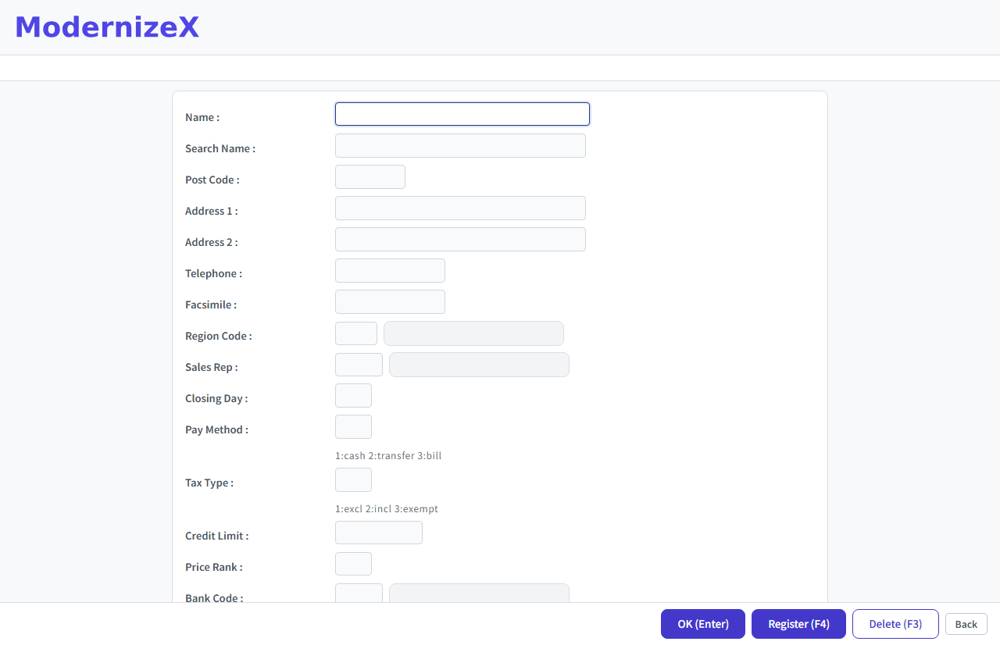

**項目詳細**

| № | コントロール名 | コントロールID | 種別 | Class／データ型 | Tab | 配置 | 文字数 | 値種別 | 初期表示 | 機能／表示データ（DBマッピング） | 取得元／条件 | 入力規則 | 備考 |
|---|---|---|---|---|---|---|---|---|---|---|---|---|---|
| **保守画面** ||||||||||||||
| 1 | Customer Code | CU-CODE | 入力 | 9(6) | 1 | 左 | 6 | 数値 | 空 | Customer Code（得意先マスタ(CUSTF)） | 画面入力 | 必須／コード検証 | |
| 2 | Name | CU-NAME | 入力 | X(40) | 2 | 左 | 40 | 英数 | 空 | Name（得意先マスタ(CUSTF)） | 画面入力 | 入力 | |
| 3 | Search Name | CU-KANA | 入力 | X(40) | 3 | 左 | 40 | 英数 | 空 | Search Name（得意先マスタ(CUSTF)） | 画面入力 | 入力 | |
| 4 | Post Code | CU-ZIP | 入力 | X(8) | 4 | 左 | 8 | 英数 | 空 | Post Code（得意先マスタ(CUSTF)） | 画面入力 | 入力 | |
| 5 | Address 1 | CU-ADDR1 | 入力 | X(40) | 5 | 左 | 40 | 英数 | 空 | Address 1（得意先マスタ(CUSTF)） | 画面入力 | 入力 | |
| 6 | Address 2 | CU-ADDR2 | 入力 | X(40) | 6 | 左 | 40 | 英数 | 空 | Address 2（得意先マスタ(CUSTF)） | 画面入力 | 入力 | |
| 7 | Telephone | CU-TEL | 入力 | X(15) | 7 | 左 | 15 | 英数 | 空 | Telephone（得意先マスタ(CUSTF)） | 画面入力 | 入力 | |
| 8 | Facsimile | CU-FAX | 入力 | X(15) | 8 | 左 | 15 | 英数 | 空 | Facsimile（得意先マスタ(CUSTF)） | 画面入力 | 入力 | |
| 9 | Region Code | CU-REGION | 入力 | 9(3) | 9 | 左 | 3 | 数値 | 空 | Region Code（得意先マスタ(CUSTF)） | 画面入力 | 必須／コード検証 | |
| 10 | Sales Rep | CU-STAFF | 入力 | 9(4) | 10 | 左 | 4 | 数値 | 空 | Sales Rep（得意先マスタ(CUSTF)） | 画面入力 | 必須／コード検証 | |
| 11 | Closing Day | CU-CLOSE-DAY | 入力 | 9(2) | 11 | 左 | 2 | 数値 | 空 | Closing Day（得意先マスタ(CUSTF)） | 画面入力 | 必須／コード検証 | |
| 12 | Pay Method | CU-PAY-METHOD | 入力 | 9(1) | 12 | 左 | 1 | 数値 | 空 | Pay Method（得意先マスタ(CUSTF)） | 画面入力 | 必須／コード検証 | |
| 13 | Tax Type | CU-TAX-TYPE | 入力 | 9(1) | 13 | 左 | 1 | 数値 | 空 | Tax Type（得意先マスタ(CUSTF)） | 画面入力 | 必須／コード検証 | |
| 14 | Credit Limit | CU-CREDIT-LIMIT | 入力 | S9(11) | 14 | 左 | 11 | 数値 | 空 | Credit Limit（得意先マスタ(CUSTF)） | 画面入力 | 必須／コード検証 | |
| 15 | Price Rank | CU-PRICE-RANK | 入力 | 9(1) | 15 | 左 | 1 | 数値 | 空 | Price Rank（得意先マスタ(CUSTF)） | 画面入力 | 必須／コード検証 | |
| 16 | Bank Code | CU-BANK-CODE | 入力 | 9(4) | 16 | 左 | 4 | 数値 | 空 | Bank Code（得意先マスタ(CUSTF)） | 画面入力 | 必須／コード検証 | |
| 17 | Confirm (Y/N) | WK-CONFIRM | 入力 | X(1) | 17 | 左 | 1 | 英数 | 空 | Confirm (Y/N)（-） | 画面入力 | 入力 | |
| 18 | Region Code | WK-REGION-NAME | 表示 | - | - | 左 | 30 | 英数 | 空 | Region Code（-） | マスタ照合表示 | - | |
| 19 | Sales Rep | WK-STAFF-NAME | 表示 | - | - | 左 | 30 | 英数 | 空 | Sales Rep（-） | マスタ照合表示 | - | |
| 20 | Bank Code | WK-BANK-NAME | 表示 | - | - | 左 | 30 | 英数 | 空 | Bank Code（-） | マスタ照合表示 | - | |

**項目状態**

> 記号: `レ`=フォーカス｜`必`=使用可（必須）｜`略`=使用可（省略可）｜`○`=使用可｜`×`=非表示｜`□`=表示のみ

| № | コントロール名 | 初期表示 | 入力／編集 | 確認 | 参照 |
|---|---|---|---|---|---|
| **保守画面** ||||||
| 1 | Customer Code | ○ | 必 | □ | □ |
| 2 | Name | ○ | 必 | □ | □ |
| 3 | Search Name | ○ | 必 | □ | □ |
| 4 | Post Code | ○ | 必 | □ | □ |
| 5 | Address 1 | ○ | 必 | □ | □ |
| 6 | Address 2 | ○ | 必 | □ | □ |
| 7 | Telephone | ○ | 必 | □ | □ |
| 8 | Facsimile | ○ | 必 | □ | □ |
| 9 | Region Code | ○ | 必 | □ | □ |
| 10 | Sales Rep | ○ | 必 | □ | □ |
| 11 | Closing Day | ○ | 必 | □ | □ |
| 12 | Pay Method | ○ | 必 | □ | □ |
| 13 | Tax Type | ○ | 必 | □ | □ |
| 14 | Credit Limit | ○ | 必 | □ | □ |
| 15 | Price Rank | ○ | 必 | □ | □ |
| 16 | Bank Code | ○ | 必 | □ | □ |
| 17 | Confirm (Y/N) | ○ | 必 | □ | □ |
| 18 | Region Code | □ | □ | □ | □ |
| 19 | Sales Rep | □ | □ | □ | □ |
| 20 | Bank Code | □ | □ | □ | □ |

### 2.3 MS0020 — 仕入先マスタ保守

**レイアウト**

モダナイズ後の画面（Vue SFC `src/programs/ms0020/` を WebSocket ターミナルランタイムでレンダリング）。

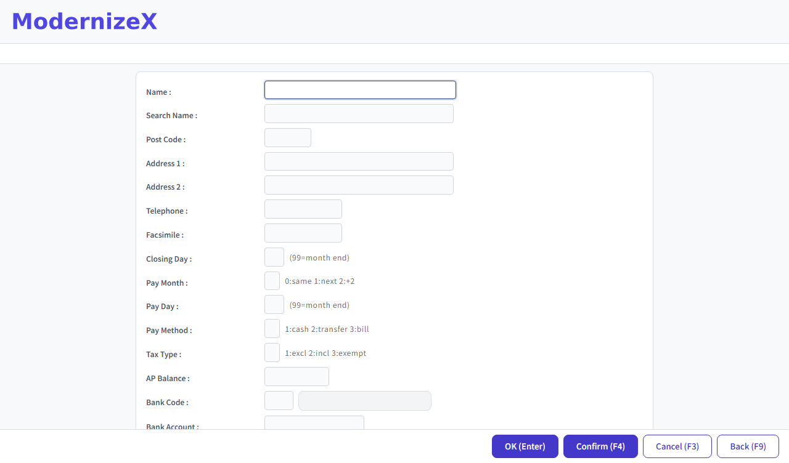

**項目詳細**

| № | コントロール名 | コントロールID | 種別 | Class／データ型 | Tab | 配置 | 文字数 | 値種別 | 初期表示 | 機能／表示データ（DBマッピング） | 取得元／条件 | 入力規則 | 備考 |
|---|---|---|---|---|---|---|---|---|---|---|---|---|---|
| **保守画面** ||||||||||||||
| 1 | Supplier Code | SP-CODE | 入力 | 9(6) | 1 | 左 | 6 | 数値 | 空 | Supplier Code（仕入先マスタ(SUPPF)） | 画面入力 | 必須／コード検証 | |
| 2 | Name | SP-NAME | 入力 | X(40) | 2 | 左 | 40 | 英数 | 空 | Name（仕入先マスタ(SUPPF)） | 画面入力 | 入力 | |
| 3 | Search Name | SP-KANA | 入力 | X(40) | 3 | 左 | 40 | 英数 | 空 | Search Name（仕入先マスタ(SUPPF)） | 画面入力 | 入力 | |
| 4 | Post Code | SP-ZIP | 入力 | X(8) | 4 | 左 | 8 | 英数 | 空 | Post Code（仕入先マスタ(SUPPF)） | 画面入力 | 入力 | |
| 5 | Address 1 | SP-ADDR1 | 入力 | X(40) | 5 | 左 | 40 | 英数 | 空 | Address 1（仕入先マスタ(SUPPF)） | 画面入力 | 入力 | |
| 6 | Address 2 | SP-ADDR2 | 入力 | X(40) | 6 | 左 | 40 | 英数 | 空 | Address 2（仕入先マスタ(SUPPF)） | 画面入力 | 入力 | |
| 7 | Telephone | SP-TEL | 入力 | X(15) | 7 | 左 | 15 | 英数 | 空 | Telephone（仕入先マスタ(SUPPF)） | 画面入力 | 入力 | |
| 8 | Facsimile | SP-FAX | 入力 | X(15) | 8 | 左 | 15 | 英数 | 空 | Facsimile（仕入先マスタ(SUPPF)） | 画面入力 | 入力 | |
| 9 | Closing Day | SP-CLOSE-DAY | 入力 | 9(2) | 9 | 左 | 2 | 数値 | 空 | Closing Day（仕入先マスタ(SUPPF)） | 画面入力 | 必須／コード検証 | |
| 10 | Pay Month | SP-PAY-MONTH | 入力 | 9(1) | 10 | 左 | 1 | 数値 | 空 | Pay Month（仕入先マスタ(SUPPF)） | 画面入力 | 必須／コード検証 | |
| 11 | Pay Day | SP-PAY-DAY | 入力 | 9(2) | 11 | 左 | 2 | 数値 | 空 | Pay Day（仕入先マスタ(SUPPF)） | 画面入力 | 必須／コード検証 | |
| 12 | Pay Method | SP-PAY-METHOD | 入力 | 9(1) | 12 | 左 | 1 | 数値 | 空 | Pay Method（仕入先マスタ(SUPPF)） | 画面入力 | 必須／コード検証 | |
| 13 | Tax Type | SP-TAX-TYPE | 入力 | 9(1) | 13 | 左 | 1 | 数値 | 空 | Tax Type（仕入先マスタ(SUPPF)） | 画面入力 | 必須／コード検証 | |
| 14 | Bank Code | SP-BANK-CODE | 入力 | 9(4) | 14 | 左 | 4 | 数値 | 空 | Bank Code（仕入先マスタ(SUPPF)） | 画面入力 | 必須／コード検証 | |
| 15 | Bank Account | SP-BANK-ACCT | 入力 | X(20) | 15 | 左 | 20 | 英数 | 空 | Bank Account（仕入先マスタ(SUPPF)） | 画面入力 | 入力 | |
| 16 | Confirm (Y/N) | WK-CONFIRM | 入力 | X(1) | 16 | 左 | 1 | 英数 | 空 | Confirm (Y/N)（-） | 画面入力 | 入力 | |
| 17 | AP Balance | SP-BALANCE | 表示 | - | - | 左 | 11 | 英数 | 空 | AP Balance（仕入先マスタ(SUPPF)） | マスタ照合表示 | - | |
| 18 | Bank Code | WK-BANK-NAME | 表示 | - | - | 左 | 30 | 英数 | 空 | Bank Code（-） | マスタ照合表示 | - | |

**項目状態**

> 記号: `レ`=フォーカス｜`必`=使用可（必須）｜`略`=使用可（省略可）｜`○`=使用可｜`×`=非表示｜`□`=表示のみ

| № | コントロール名 | 初期表示 | 入力／編集 | 確認 | 参照 |
|---|---|---|---|---|---|
| **保守画面** ||||||
| 1 | Supplier Code | ○ | 必 | □ | □ |
| 2 | Name | ○ | 必 | □ | □ |
| 3 | Search Name | ○ | 必 | □ | □ |
| 4 | Post Code | ○ | 必 | □ | □ |
| 5 | Address 1 | ○ | 必 | □ | □ |
| 6 | Address 2 | ○ | 必 | □ | □ |
| 7 | Telephone | ○ | 必 | □ | □ |
| 8 | Facsimile | ○ | 必 | □ | □ |
| 9 | Closing Day | ○ | 必 | □ | □ |
| 10 | Pay Month | ○ | 必 | □ | □ |
| 11 | Pay Day | ○ | 必 | □ | □ |
| 12 | Pay Method | ○ | 必 | □ | □ |
| 13 | Tax Type | ○ | 必 | □ | □ |
| 14 | Bank Code | ○ | 必 | □ | □ |
| 15 | Bank Account | ○ | 必 | □ | □ |
| 16 | Confirm (Y/N) | ○ | 必 | □ | □ |
| 17 | AP Balance | □ | □ | □ | □ |
| 18 | Bank Code | □ | □ | □ | □ |

### 2.4 MS0030 — 商品マスタ保守

**レイアウト**

モダナイズ後の画面（Vue SFC `src/programs/ms0030/` を WebSocket ターミナルランタイムでレンダリング）。

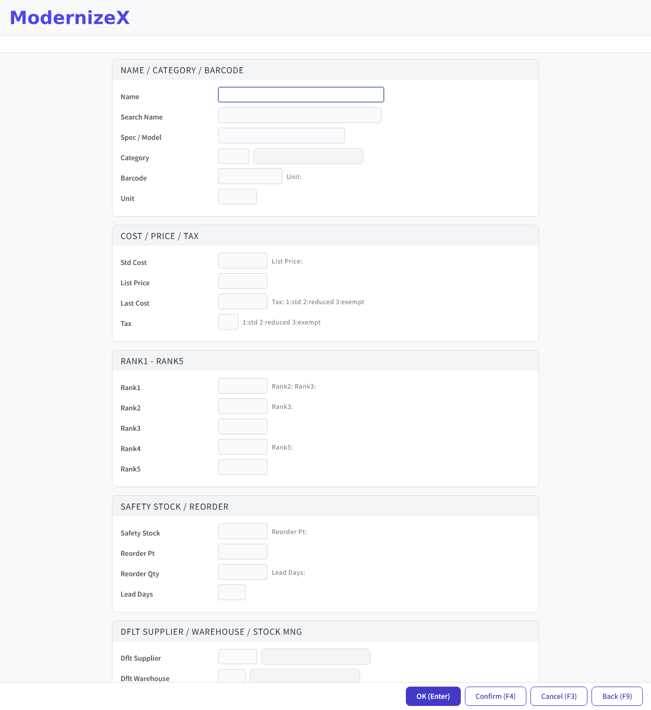

**項目詳細**

| № | コントロール名 | コントロールID | 種別 | Class／データ型 | Tab | 配置 | 文字数 | 値種別 | 初期表示 | 機能／表示データ（DBマッピング） | 取得元／条件 | 入力規則 | 備考 |
|---|---|---|---|---|---|---|---|---|---|---|---|---|---|
| **保守画面** ||||||||||||||
| 1 | Product Code | PR-CODE | 入力 | 9(8) | 1 | 左 | 8 | 数値 | 空 | Product Code（商品マスタ(PRODF)） | 画面入力 | 必須／コード検証 | |
| 2 | Name | PR-NAME | 入力 | X(40) | 2 | 左 | 40 | 英数 | 空 | Name（商品マスタ(PRODF)） | 画面入力 | 入力 | |
| 3 | Search Name | PR-KANA | 入力 | X(40) | 3 | 左 | 40 | 英数 | 空 | Search Name（商品マスタ(PRODF)） | 画面入力 | 入力 | |
| 4 | Spec / Model | PR-SPEC | 入力 | X(30) | 4 | 左 | 30 | 英数 | 空 | Spec / Model（商品マスタ(PRODF)） | 画面入力 | 入力 | |
| 5 | Category | PR-CATEGORY | 入力 | 9(4) | 5 | 左 | 4 | 数値 | 空 | Category（商品マスタ(PRODF)） | 画面入力 | 必須／コード検証 | |
| 6 | Barcode | PR-BARCODE | 入力 | X(13) | 6 | 左 | 13 | 英数 | 空 | Barcode（商品マスタ(PRODF)） | 画面入力 | 入力 | |
| 7 | Unit | PR-UNIT | 入力 | X(6) | 7 | 左 | 6 | 英数 | 空 | Unit（商品マスタ(PRODF)） | 画面入力 | 入力 | |
| 8 | Std Cost | PR-STD-COST | 入力 | S9(9)V9(2) | 8 | 左 | 11 | 数値 | 空 | Std Cost（商品マスタ(PRODF)） | 画面入力 | 必須／コード検証 | |
| 9 | List Price | PR-LIST-PRICE | 入力 | S9(9)V9(2) | 9 | 左 | 11 | 数値 | 空 | List Price（商品マスタ(PRODF)） | 画面入力 | 必須／コード検証 | |
| 10 | Last Cost | PR-LAST-COST | 入力 | S9(9)V9(2) | 10 | 左 | 11 | 数値 | 空 | Last Cost（商品マスタ(PRODF)） | 画面入力 | 必須／コード検証 | |
| 11 | Tax | PR-TAX-CATEGORY | 入力 | 9(1) | 11 | 左 | 1 | 数値 | 空 | Tax（商品マスタ(PRODF)） | 画面入力 | 必須／コード検証 | |
| 12 | Rank1 | PR-RANK-PRICE(1) | 入力 | S9(9)V9(2) | 12 | 左 | 11 | 数値 | 空 | Rank1（商品マスタ(PRODF)） | 画面入力 | 必須／コード検証 | |
| 13 | Rank2 | PR-RANK-PRICE(2) | 入力 | S9(9)V9(2) | 13 | 左 | 11 | 数値 | 空 | Rank2（商品マスタ(PRODF)） | 画面入力 | 必須／コード検証 | |
| 14 | Rank3 | PR-RANK-PRICE(3) | 入力 | S9(9)V9(2) | 14 | 左 | 11 | 数値 | 空 | Rank3（商品マスタ(PRODF)） | 画面入力 | 必須／コード検証 | |
| 15 | Rank4 | PR-RANK-PRICE(4) | 入力 | S9(9)V9(2) | 15 | 左 | 11 | 数値 | 空 | Rank4（商品マスタ(PRODF)） | 画面入力 | 必須／コード検証 | |
| 16 | Rank5 | PR-RANK-PRICE(5) | 入力 | S9(9)V9(2) | 16 | 左 | 11 | 数値 | 空 | Rank5（商品マスタ(PRODF)） | 画面入力 | 必須／コード検証 | |
| 17 | Safety Stock | PR-SAFETY-STOCK | 入力 | S9(9) | 17 | 左 | 9 | 数値 | 空 | Safety Stock（商品マスタ(PRODF)） | 画面入力 | 必須／コード検証 | |
| 18 | Reorder Pt | PR-REORDER-POINT | 入力 | S9(9) | 18 | 左 | 9 | 数値 | 空 | Reorder Pt（商品マスタ(PRODF)） | 画面入力 | 必須／コード検証 | |
| 19 | Reorder Qty | PR-REORDER-QTY | 入力 | S9(9) | 19 | 左 | 9 | 数値 | 空 | Reorder Qty（商品マスタ(PRODF)） | 画面入力 | 必須／コード検証 | |
| 20 | Lead Days | PR-LEAD-DAYS | 入力 | 9(3) | 20 | 左 | 3 | 数値 | 空 | Lead Days（商品マスタ(PRODF)） | 画面入力 | 必須／コード検証 | |
| 21 | Dflt Supplier | PR-DFLT-SUPP | 入力 | 9(6) | 21 | 左 | 6 | 数値 | 空 | Dflt Supplier（商品マスタ(PRODF)） | 画面入力 | 必須／コード検証 | |
| 22 | Dflt Warehouse | PR-DFLT-WHSE | 入力 | 9(3) | 22 | 左 | 3 | 数値 | 空 | Dflt Warehouse（商品マスタ(PRODF)） | 画面入力 | 必須／コード検証 | |
| 23 | Stock Mng | PR-STOCK-MNG | 入力 | 9(1) | 23 | 左 | 1 | 数値 | 空 | Stock Mng（商品マスタ(PRODF)） | 画面入力 | 必須／コード検証 | |
| 24 | Confirm (Y/N) | WK-CONFIRM | 入力 | X(1) | 24 | 左 | 1 | 英数 | 空 | Confirm (Y/N)（-） | 画面入力 | 入力 | |
| 25 | Category | WK-CATG-NAME | 表示 | - | - | 左 | 30 | 英数 | 空 | Category（-） | マスタ照合表示 | - | |
| 26 | Dflt Supplier | WK-SUPP-NAME | 表示 | - | - | 左 | 30 | 英数 | 空 | Dflt Supplier（-） | マスタ照合表示 | - | |
| 27 | Dflt Warehouse | WK-WHSE-NAME | 表示 | - | - | 左 | 30 | 英数 | 空 | Dflt Warehouse（-） | マスタ照合表示 | - | |

**項目状態**

> 記号: `レ`=フォーカス｜`必`=使用可（必須）｜`略`=使用可（省略可）｜`○`=使用可｜`×`=非表示｜`□`=表示のみ

| № | コントロール名 | 初期表示 | 入力／編集 | 確認 | 参照 |
|---|---|---|---|---|---|
| **保守画面** ||||||
| 1 | Product Code | ○ | 必 | □ | □ |
| 2 | Name | ○ | 必 | □ | □ |
| 3 | Search Name | ○ | 必 | □ | □ |
| 4 | Spec / Model | ○ | 必 | □ | □ |
| 5 | Category | ○ | 必 | □ | □ |
| 6 | Barcode | ○ | 必 | □ | □ |
| 7 | Unit | ○ | 必 | □ | □ |
| 8 | Std Cost | ○ | 必 | □ | □ |
| 9 | List Price | ○ | 必 | □ | □ |
| 10 | Last Cost | ○ | 必 | □ | □ |
| 11 | Tax | ○ | 必 | □ | □ |
| 12 | Rank1 | ○ | 必 | □ | □ |
| 13 | Rank2 | ○ | 必 | □ | □ |
| 14 | Rank3 | ○ | 必 | □ | □ |
| 15 | Rank4 | ○ | 必 | □ | □ |
| 16 | Rank5 | ○ | 必 | □ | □ |
| 17 | Safety Stock | ○ | 必 | □ | □ |
| 18 | Reorder Pt | ○ | 必 | □ | □ |
| 19 | Reorder Qty | ○ | 必 | □ | □ |
| 20 | Lead Days | ○ | 必 | □ | □ |
| 21 | Dflt Supplier | ○ | 必 | □ | □ |
| 22 | Dflt Warehouse | ○ | 必 | □ | □ |
| 23 | Stock Mng | ○ | 必 | □ | □ |
| 24 | Confirm (Y/N) | ○ | 必 | □ | □ |
| 25 | Category | □ | □ | □ | □ |
| 26 | Dflt Supplier | □ | □ | □ | □ |
| 27 | Dflt Warehouse | □ | □ | □ | □ |

### 2.5 MS0040 — 倉庫マスタ保守

**レイアウト**

モダナイズ後の画面（Vue SFC `src/programs/ms0040/` を WebSocket ターミナルランタイムでレンダリング）。

**項目詳細**

| № | コントロール名 | コントロールID | 種別 | Class／データ型 | Tab | 配置 | 文字数 | 値種別 | 初期表示 | 機能／表示データ（DBマッピング） | 取得元／条件 | 入力規則 | 備考 |
|---|---|---|---|---|---|---|---|---|---|---|---|---|---|
| **保守画面** ||||||||||||||
| 1 | Warehouse Code | WH-CODE | 入力 | 9(3) | 1 | 左 | 3 | 数値 | 空 | Warehouse Code（倉庫マスタ(WHSEF)） | 画面入力 | 必須／コード検証 | |
| 2 | Name | WH-NAME | 入力 | X(30) | 2 | 左 | 30 | 英数 | 空 | Name（倉庫マスタ(WHSEF)） | 画面入力 | 入力 | |
| 3 | Post Code | WH-ZIP | 入力 | X(8) | 3 | 左 | 8 | 英数 | 空 | Post Code（倉庫マスタ(WHSEF)） | 画面入力 | 入力 | |
| 4 | Address | WH-ADDR | 入力 | X(40) | 4 | 左 | 40 | 英数 | 空 | Address（倉庫マスタ(WHSEF)） | 画面入力 | 入力 | |
| 5 | Telephone | WH-TEL | 入力 | X(15) | 5 | 左 | 15 | 英数 | 空 | Telephone（倉庫マスタ(WHSEF)） | 画面入力 | 入力 | |
| 6 | Type | WH-TYPE | 入力 | 9(1) | 6 | 左 | 1 | 数値 | 空 | Type（倉庫マスタ(WHSEF)） | 画面入力 | 必須／コード検証 | |
| 7 | Manager | WH-MANAGER | 入力 | 9(4) | 7 | 左 | 4 | 数値 | 空 | Manager（倉庫マスタ(WHSEF)） | 画面入力 | 必須／コード検証 | |
| 8 | Confirm (Y/N) | WK-CONFIRM | 入力 | X(1) | 8 | 左 | 1 | 英数 | 空 | Confirm (Y/N)（-） | 画面入力 | 入力 | |
| 9 | Manager | WK-MGR-NAME | 表示 | - | - | 左 | 30 | 英数 | 空 | Manager（-） | マスタ照合表示 | - | |

**項目状態**

> 記号: `レ`=フォーカス｜`必`=使用可（必須）｜`略`=使用可（省略可）｜`○`=使用可｜`×`=非表示｜`□`=表示のみ

| № | コントロール名 | 初期表示 | 入力／編集 | 確認 | 参照 |
|---|---|---|---|---|---|
| **保守画面** ||||||
| 1 | Warehouse Code | ○ | 必 | □ | □ |
| 2 | Name | ○ | 必 | □ | □ |
| 3 | Post Code | ○ | 必 | □ | □ |
| 4 | Address | ○ | 必 | □ | □ |
| 5 | Telephone | ○ | 必 | □ | □ |
| 6 | Type | ○ | 必 | □ | □ |
| 7 | Manager | ○ | 必 | □ | □ |
| 8 | Confirm (Y/N) | ○ | 必 | □ | □ |
| 9 | Manager | □ | □ | □ | □ |

### 2.6 MS0050 — 社員マスタ保守

**レイアウト**

モダナイズ後の画面（Vue SFC `src/programs/ms0050/` を WebSocket ターミナルランタイムでレンダリング）。

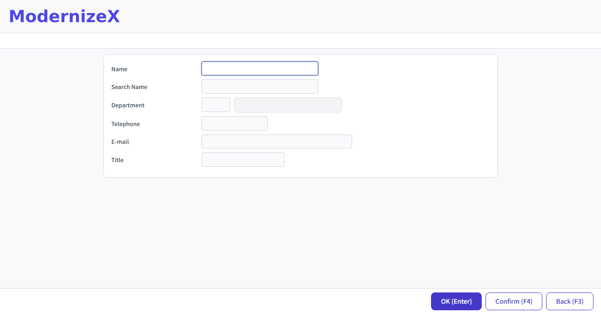

**項目詳細**

| № | コントロール名 | コントロールID | 種別 | Class／データ型 | Tab | 配置 | 文字数 | 値種別 | 初期表示 | 機能／表示データ（DBマッピング） | 取得元／条件 | 入力規則 | 備考 |
|---|---|---|---|---|---|---|---|---|---|---|---|---|---|
| **保守画面** ||||||||||||||
| 1 | Staff Code | SF-CODE | 入力 | 9(4) | 1 | 左 | 4 | 数値 | 空 | Staff Code（社員マスタ(STAFF)） | 画面入力 | 必須／コード検証 | |
| 2 | Name | SF-NAME | 入力 | X(30) | 2 | 左 | 30 | 英数 | 空 | Name（社員マスタ(STAFF)） | 画面入力 | 入力 | |
| 3 | Search Name | SF-KANA | 入力 | X(30) | 3 | 左 | 30 | 英数 | 空 | Search Name（社員マスタ(STAFF)） | 画面入力 | 入力 | |
| 4 | Department | SF-DEPT | 入力 | 9(4) | 4 | 左 | 4 | 数値 | 空 | Department（社員マスタ(STAFF)） | 画面入力 | 必須／コード検証 | |
| 5 | Telephone | SF-TEL | 入力 | X(15) | 5 | 左 | 15 | 英数 | 空 | Telephone（社員マスタ(STAFF)） | 画面入力 | 入力 | |
| 6 | E-mail | SF-EMAIL | 入力 | X(40) | 6 | 左 | 40 | 英数 | 空 | E-mail（社員マスタ(STAFF)） | 画面入力 | 入力 | |
| 7 | Title | SF-TITLE | 入力 | X(20) | 7 | 左 | 20 | 英数 | 空 | Title（社員マスタ(STAFF)） | 画面入力 | 入力 | |
| 8 | Confirm (Y/N) | WK-CONFIRM | 入力 | X(1) | 8 | 左 | 1 | 英数 | 空 | Confirm (Y/N)（-） | 画面入力 | 入力 | |
| 9 | Department | WK-DEPT-NAME | 表示 | - | - | 左 | 30 | 英数 | 空 | Department（-） | マスタ照合表示 | - | |

**項目状態**

> 記号: `レ`=フォーカス｜`必`=使用可（必須）｜`略`=使用可（省略可）｜`○`=使用可｜`×`=非表示｜`□`=表示のみ

| № | コントロール名 | 初期表示 | 入力／編集 | 確認 | 参照 |
|---|---|---|---|---|---|
| **保守画面** ||||||
| 1 | Staff Code | ○ | 必 | □ | □ |
| 2 | Name | ○ | 必 | □ | □ |
| 3 | Search Name | ○ | 必 | □ | □ |
| 4 | Department | ○ | 必 | □ | □ |
| 5 | Telephone | ○ | 必 | □ | □ |
| 6 | E-mail | ○ | 必 | □ | □ |
| 7 | Title | ○ | 必 | □ | □ |
| 8 | Confirm (Y/N) | ○ | 必 | □ | □ |
| 9 | Department | □ | □ | □ | □ |

### 2.7 MS0060 — 商品分類マスタ保守

**レイアウト**

モダナイズ後の画面（Vue SFC `src/programs/ms0060/` を WebSocket ターミナルランタイムでレンダリング）。

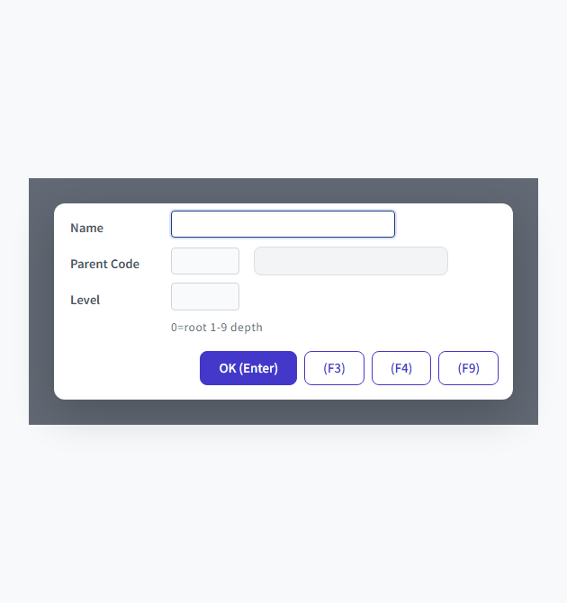

**項目詳細**

| № | コントロール名 | コントロールID | 種別 | Class／データ型 | Tab | 配置 | 文字数 | 値種別 | 初期表示 | 機能／表示データ（DBマッピング） | 取得元／条件 | 入力規則 | 備考 |
|---|---|---|---|---|---|---|---|---|---|---|---|---|---|
| **保守画面** ||||||||||||||
| 1 | Category Code | CT-CODE | 入力 | 9(4) | 1 | 左 | 4 | 数値 | 空 | Category Code（商品分類マスタ(CATGF)） | 画面入力 | 必須／コード検証 | |
| 2 | Name | CT-NAME | 入力 | X(30) | 2 | 左 | 30 | 英数 | 空 | Name（商品分類マスタ(CATGF)） | 画面入力 | 入力 | |
| 3 | Parent Code | CT-PARENT | 入力 | 9(4) | 3 | 左 | 4 | 数値 | 空 | Parent Code（商品分類マスタ(CATGF)） | 画面入力 | 必須／コード検証 | |
| 4 | Level | CT-LEVEL | 入力 | 9(1) | 4 | 左 | 1 | 数値 | 空 | Level（商品分類マスタ(CATGF)） | 画面入力 | 必須／コード検証 | |
| 5 | Confirm (Y/N) | WK-CONFIRM | 入力 | X(1) | 5 | 左 | 1 | 英数 | 空 | Confirm (Y/N)（-） | 画面入力 | 入力 | |
| 6 | Parent Code | WK-PARENT-NAME | 表示 | - | - | 左 | 30 | 英数 | 空 | Parent Code（-） | マスタ照合表示 | - | |

**項目状態**

> 記号: `レ`=フォーカス｜`必`=使用可（必須）｜`略`=使用可（省略可）｜`○`=使用可｜`×`=非表示｜`□`=表示のみ

| № | コントロール名 | 初期表示 | 入力／編集 | 確認 | 参照 |
|---|---|---|---|---|---|
| **保守画面** ||||||
| 1 | Category Code | ○ | 必 | □ | □ |
| 2 | Name | ○ | 必 | □ | □ |
| 3 | Parent Code | ○ | 必 | □ | □ |
| 4 | Level | ○ | 必 | □ | □ |
| 5 | Confirm (Y/N) | ○ | 必 | □ | □ |
| 6 | Parent Code | □ | □ | □ | □ |

### 2.8 MS0070 — 得意先別単価マスタ保守

**レイアウト**

モダナイズ後の画面（Vue SFC `src/programs/ms0070/` を WebSocket ターミナルランタイムでレンダリング）。

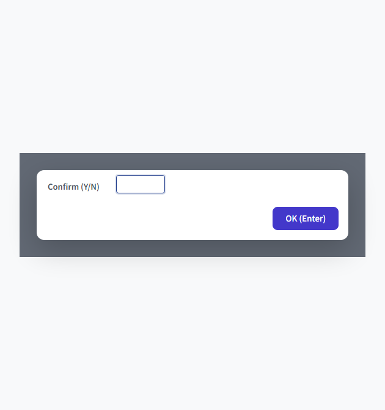

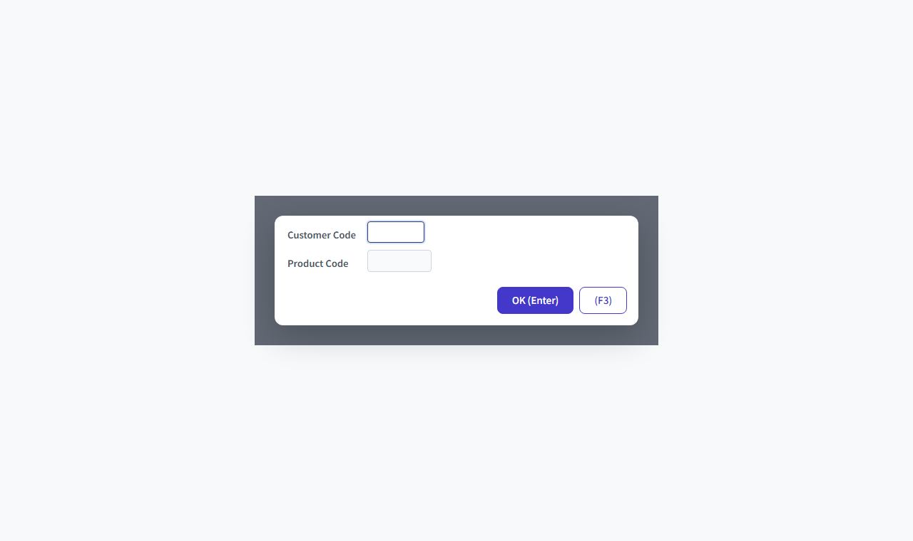

**項目詳細**

| № | コントロール名 | コントロールID | 種別 | Class／データ型 | Tab | 配置 | 文字数 | 値種別 | 初期表示 | 機能／表示データ（DBマッピング） | 取得元／条件 | 入力規則 | 備考 |
|---|---|---|---|---|---|---|---|---|---|---|---|---|---|
| **保守画面** ||||||||||||||
| 1 | Customer Code | CP-CUST | 入力 | 9(6) | 1 | 左 | 6 | 数値 | 空 | Customer Code（得意先別単価(CPRCF)） | 画面入力 | 必須／コード検証 | |
| 2 | Product Code | CP-PROD | 入力 | 9(8) | 2 | 左 | 8 | 数値 | 空 | Product Code（得意先別単価(CPRCF)） | 画面入力 | 必須／コード検証 | |
| 3 | Contract Price | CP-PRICE | 入力 | S9(9)V9(2) | 3 | 左 | 11 | 数値 | 空 | Contract Price（得意先別単価(CPRCF)） | 画面入力 | 必須／コード検証 | |
| 4 | Start Date | CP-START-DATE | 入力 | 9(8) | 4 | 左 | 8 | 数値 | 空 | Start Date（得意先別単価(CPRCF)） | 画面入力 | 必須／コード検証 | |
| 5 | End Date | CP-END-DATE | 入力 | 9(8) | 5 | 左 | 8 | 数値 | 空 | End Date（得意先別単価(CPRCF)） | 画面入力 | 必須／コード検証 | |
| 6 | Confirm (Y/N) | WK-CONFIRM | 入力 | X(1) | 6 | 左 | 1 | 英数 | 空 | Confirm (Y/N)（-） | 画面入力 | 入力 | |
| 7 | Customer Name | WK-CUST-NAME | 表示 | - | - | 左 | 40 | 英数 | 空 | Customer Name（-） | マスタ照合表示 | - | |
| 8 | Product Name | WK-PROD-NAME | 表示 | - | - | 左 | 40 | 英数 | 空 | Product Name（-） | マスタ照合表示 | - | |

**項目状態**

> 記号: `レ`=フォーカス｜`必`=使用可（必須）｜`略`=使用可（省略可）｜`○`=使用可｜`×`=非表示｜`□`=表示のみ

| № | コントロール名 | 初期表示 | 入力／編集 | 確認 | 参照 |
|---|---|---|---|---|---|
| **保守画面** ||||||
| 1 | Customer Code | ○ | 必 | □ | □ |
| 2 | Product Code | ○ | 必 | □ | □ |
| 3 | Contract Price | ○ | 必 | □ | □ |
| 4 | Start Date | ○ | 必 | □ | □ |
| 5 | End Date | ○ | 必 | □ | □ |
| 6 | Confirm (Y/N) | ○ | 必 | □ | □ |
| 7 | Customer Name | □ | □ | □ | □ |
| 8 | Product Name | □ | □ | □ | □ |

### 2.9 MS0080 — 部門マスタ保守

**レイアウト**

モダナイズ後の画面（Vue SFC `src/programs/ms0080/` を WebSocket ターミナルランタイムでレンダリング）。

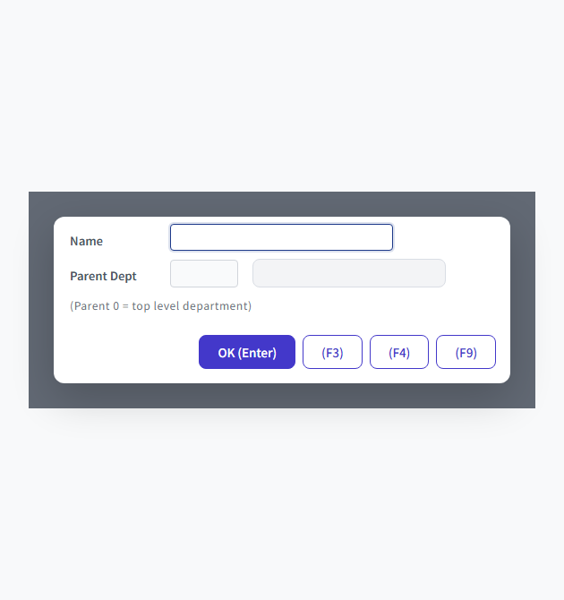

**項目詳細**

| № | コントロール名 | コントロールID | 種別 | Class／データ型 | Tab | 配置 | 文字数 | 値種別 | 初期表示 | 機能／表示データ（DBマッピング） | 取得元／条件 | 入力規則 | 備考 |
|---|---|---|---|---|---|---|---|---|---|---|---|---|---|
| **保守画面** ||||||||||||||
| 1 | Department Cd | DP-CODE | 入力 | 9(4) | 1 | 左 | 4 | 数値 | 空 | Department Cd（部門マスタ(DEPTF)） | 画面入力 | 必須／コード検証 | |
| 2 | Name | DP-NAME | 入力 | X(30) | 2 | 左 | 30 | 英数 | 空 | Name（部門マスタ(DEPTF)） | 画面入力 | 入力 | |
| 3 | Parent Dept | DP-PARENT | 入力 | 9(4) | 3 | 左 | 4 | 数値 | 空 | Parent Dept（部門マスタ(DEPTF)） | 画面入力 | 必須／コード検証 | |
| 4 | Confirm (Y/N) | WK-CONFIRM | 入力 | X(1) | 4 | 左 | 1 | 英数 | 空 | Confirm (Y/N)（-） | 画面入力 | 入力 | |
| 5 | Parent Dept | WK-PARENT-NAME | 表示 | - | - | 左 | 30 | 英数 | 空 | Parent Dept（-） | マスタ照合表示 | - | |

**項目状態**

> 記号: `レ`=フォーカス｜`必`=使用可（必須）｜`略`=使用可（省略可）｜`○`=使用可｜`×`=非表示｜`□`=表示のみ

| № | コントロール名 | 初期表示 | 入力／編集 | 確認 | 参照 |
|---|---|---|---|---|---|
| **保守画面** ||||||
| 1 | Department Cd | ○ | 必 | □ | □ |
| 2 | Name | ○ | 必 | □ | □ |
| 3 | Parent Dept | ○ | 必 | □ | □ |
| 4 | Confirm (Y/N) | ○ | 必 | □ | □ |
| 5 | Parent Dept | □ | □ | □ | □ |

### 2.10 MS0090 — 消費税率マスタ保守

**レイアウト**

モダナイズ後の画面（Vue SFC `src/programs/ms0090/` を WebSocket ターミナルランタイムでレンダリング）。

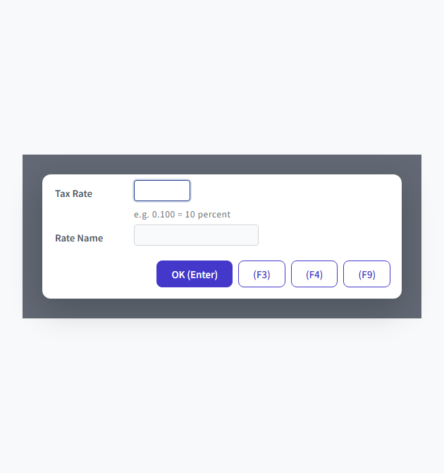

**項目詳細**

| № | コントロール名 | コントロールID | 種別 | Class／データ型 | Tab | 配置 | 文字数 | 値種別 | 初期表示 | 機能／表示データ（DBマッピング） | 取得元／条件 | 入力規則 | 備考 |
|---|---|---|---|---|---|---|---|---|---|---|---|---|---|
| **保守画面** ||||||||||||||
| 1 | Tax Category | TX-CODE | 入力 | 9(1) | 1 | 左 | 1 | 数値 | 空 | Tax Category（消費税率(TAXF)） | 画面入力 | 必須／コード検証 | |
| 2 | Start Date | TX-START-DATE | 入力 | 9(8) | 2 | 左 | 8 | 数値 | 空 | Start Date（消費税率(TAXF)） | 画面入力 | 必須／コード検証 | |
| 3 | Tax Rate | TX-RATE | 入力 | S9(2)V9(3) | 3 | 左 | 5 | 数値 | 空 | Tax Rate（消費税率(TAXF)） | 画面入力 | 必須／コード検証 | |
| 4 | Rate Name | TX-NAME | 入力 | X(20) | 4 | 左 | 20 | 英数 | 空 | Rate Name（消費税率(TAXF)） | 画面入力 | 入力 | |
| 5 | Confirm (Y/N) | WK-CONFIRM | 入力 | X(1) | 5 | 左 | 1 | 英数 | 空 | Confirm (Y/N)（-） | 画面入力 | 入力 | |

**項目状態**

> 記号: `レ`=フォーカス｜`必`=使用可（必須）｜`略`=使用可（省略可）｜`○`=使用可｜`×`=非表示｜`□`=表示のみ

| № | コントロール名 | 初期表示 | 入力／編集 | 確認 | 参照 |
|---|---|---|---|---|---|
| **保守画面** ||||||
| 1 | Tax Category | ○ | 必 | □ | □ |
| 2 | Start Date | ○ | 必 | □ | □ |
| 3 | Tax Rate | ○ | 必 | □ | □ |
| 4 | Rate Name | ○ | 必 | □ | □ |
| 5 | Confirm (Y/N) | ○ | 必 | □ | □ |

### 2.11 MS0100 — 銀行マスタ保守

**レイアウト**

モダナイズ後の画面（Vue SFC `src/programs/ms0100/` を WebSocket ターミナルランタイムでレンダリング）。

**項目詳細**

| № | コントロール名 | コントロールID | 種別 | Class／データ型 | Tab | 配置 | 文字数 | 値種別 | 初期表示 | 機能／表示データ（DBマッピング） | 取得元／条件 | 入力規則 | 備考 |
|---|---|---|---|---|---|---|---|---|---|---|---|---|---|
| **保守画面** ||||||||||||||
| 1 | Bank Code | BK-CODE | 入力 | 9(4) | 1 | 左 | 4 | 数値 | 空 | Bank Code（銀行マスタ(BANKF)） | 画面入力 | 必須／コード検証 | |
| 2 | Bank Name | BK-NAME | 入力 | X(30) | 2 | 左 | 30 | 英数 | 空 | Bank Name（銀行マスタ(BANKF)） | 画面入力 | 入力 | |
| 3 | Branch Name | BK-BRANCH | 入力 | X(30) | 3 | 左 | 30 | 英数 | 空 | Branch Name（銀行マスタ(BANKF)） | 画面入力 | 入力 | |
| 4 | Confirm (Y/N) | WK-CONFIRM | 入力 | X(1) | 4 | 左 | 1 | 英数 | 空 | Confirm (Y/N)（-） | 画面入力 | 入力 | |

**項目状態**

> 記号: `レ`=フォーカス｜`必`=使用可（必須）｜`略`=使用可（省略可）｜`○`=使用可｜`×`=非表示｜`□`=表示のみ

| № | コントロール名 | 初期表示 | 入力／編集 | 確認 | 参照 |
|---|---|---|---|---|---|
| **保守画面** ||||||
| 1 | Bank Code | ○ | 必 | □ | □ |
| 2 | Bank Name | ○ | 必 | □ | □ |
| 3 | Branch Name | ○ | 必 | □ | □ |
| 4 | Confirm (Y/N) | ○ | 必 | □ | □ |

### 2.12 MS0110 — 地域マスタ保守

**レイアウト**

モダナイズ後の画面（Vue SFC `src/programs/ms0110/` を WebSocket ターミナルランタイムでレンダリング）。

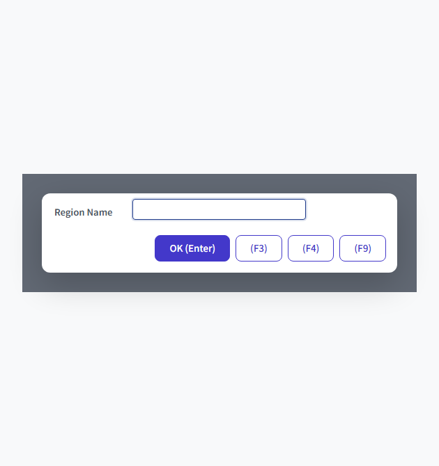

**項目詳細**

| № | コントロール名 | コントロールID | 種別 | Class／データ型 | Tab | 配置 | 文字数 | 値種別 | 初期表示 | 機能／表示データ（DBマッピング） | 取得元／条件 | 入力規則 | 備考 |
|---|---|---|---|---|---|---|---|---|---|---|---|---|---|
| **保守画面** ||||||||||||||
| 1 | Region Code | RG-CODE | 入力 | 9(3) | 1 | 左 | 3 | 数値 | 空 | Region Code（地域マスタ(REGNF)） | 画面入力 | 必須／コード検証 | |
| 2 | Region Name | RG-NAME | 入力 | X(30) | 2 | 左 | 30 | 英数 | 空 | Region Name（地域マスタ(REGNF)） | 画面入力 | 入力 | |
| 3 | Confirm (Y/N) | WK-CONFIRM | 入力 | X(1) | 3 | 左 | 1 | 英数 | 空 | Confirm (Y/N)（-） | 画面入力 | 入力 | |

**項目状態**

> 記号: `レ`=フォーカス｜`必`=使用可（必須）｜`略`=使用可（省略可）｜`○`=使用可｜`×`=非表示｜`□`=表示のみ

| № | コントロール名 | 初期表示 | 入力／編集 | 確認 | 参照 |
|---|---|---|---|---|---|
| **保守画面** ||||||
| 1 | Region Code | ○ | 必 | □ | □ |
| 2 | Region Name | ○ | 必 | □ | □ |
| 3 | Confirm (Y/N) | ○ | 必 | □ | □ |

### 2.13 MS0120 — ユーザーマスタ保守

**レイアウト**

モダナイズ後の画面（Vue SFC `src/programs/ms0120/` を WebSocket ターミナルランタイムでレンダリング）。

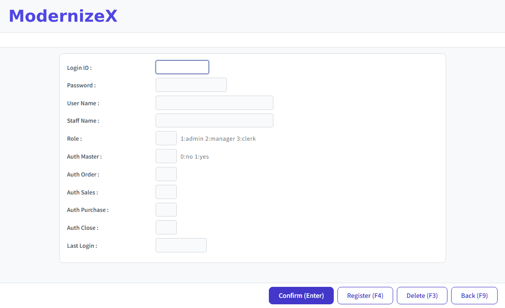

**項目詳細**

| № | コントロール名 | コントロールID | 種別 | Class／データ型 | Tab | 配置 | 文字数 | 値種別 | 初期表示 | 機能／表示データ（DBマッピング） | 取得元／条件 | 入力規則 | 備考 |
|---|---|---|---|---|---|---|---|---|---|---|---|---|---|
| **保守画面** ||||||||||||||
| 1 | User Code | US-CODE | 入力 | 9(6) | 1 | 左 | 6 | 数値 | 空 | User Code（ユーザーマスタ(USERF)） | 画面入力 | 必須／コード検証 | |
| 2 | Login ID | US-LOGIN | 入力 | X(12) | 2 | 左 | 12 | 英数 | 空 | Login ID（ユーザーマスタ(USERF)） | 画面入力 | 入力 | |
| 3 | Password | US-PASSWORD | 入力 | X(16) | 3 | 左 | 16 | 英数 | 空 | Password（ユーザーマスタ(USERF)） | 画面入力 | 入力 | |
| 4 | User Name | US-NAME | 入力 | X(30) | 4 | 左 | 30 | 英数 | 空 | User Name（ユーザーマスタ(USERF)） | 画面入力 | 入力 | |
| 5 | Role | US-ROLE | 入力 | 9(1) | 5 | 左 | 1 | 数値 | 空 | Role（ユーザーマスタ(USERF)） | 画面入力 | 必須／コード検証 | |
| 6 | Auth Master | US-AUTH-MASTER | 入力 | 9(1) | 6 | 左 | 1 | 数値 | 空 | Auth Master（ユーザーマスタ(USERF)） | 画面入力 | 必須／コード検証 | |
| 7 | Auth Order | US-AUTH-ORDER | 入力 | 9(1) | 7 | 左 | 1 | 数値 | 空 | Auth Order（ユーザーマスタ(USERF)） | 画面入力 | 必須／コード検証 | |
| 8 | Auth Sales | US-AUTH-SALES | 入力 | 9(1) | 8 | 左 | 1 | 数値 | 空 | Auth Sales（ユーザーマスタ(USERF)） | 画面入力 | 必須／コード検証 | |
| 9 | Auth Purchase | US-AUTH-PURCH | 入力 | 9(1) | 9 | 左 | 1 | 数値 | 空 | Auth Purchase（ユーザーマスタ(USERF)） | 画面入力 | 必須／コード検証 | |
| 10 | Auth Close | US-AUTH-CLOSE | 入力 | 9(1) | 10 | 左 | 1 | 数値 | 空 | Auth Close（ユーザーマスタ(USERF)） | 画面入力 | 必須／コード検証 | |
| 11 | Confirm (Y/N) | WK-CONFIRM | 入力 | X(1) | 11 | 左 | 1 | 英数 | 空 | Confirm (Y/N)（-） | 画面入力 | 入力 | |
| 12 | Staff Name | WK-STAFF-NAME | 表示 | - | - | 左 | 30 | 英数 | 空 | Staff Name（-） | マスタ照合表示 | - | |
| 13 | Last Login | US-LAST-LOGIN | 表示 | - | - | 左 | 10 | 英数 | 空 | Last Login（ユーザーマスタ(USERF)） | マスタ照合表示 | - | |

**項目状態**

> 記号: `レ`=フォーカス｜`必`=使用可（必須）｜`略`=使用可（省略可）｜`○`=使用可｜`×`=非表示｜`□`=表示のみ

| № | コントロール名 | 初期表示 | 入力／編集 | 確認 | 参照 |
|---|---|---|---|---|---|
| **保守画面** ||||||
| 1 | User Code | ○ | 必 | □ | □ |
| 2 | Login ID | ○ | 必 | □ | □ |
| 3 | Password | ○ | 必 | □ | □ |
| 4 | User Name | ○ | 必 | □ | □ |
| 5 | Role | ○ | 必 | □ | □ |
| 6 | Auth Master | ○ | 必 | □ | □ |
| 7 | Auth Order | ○ | 必 | □ | □ |
| 8 | Auth Sales | ○ | 必 | □ | □ |
| 9 | Auth Purchase | ○ | 必 | □ | □ |
| 10 | Auth Close | ○ | 必 | □ | □ |
| 11 | Confirm (Y/N) | ○ | 必 | □ | □ |
| 12 | Staff Name | □ | □ | □ | □ |
| 13 | Last Login | □ | □ | □ | □ |

### 2.14 OE0010 — 受注入力

**レイアウト**

モダナイズ後の画面（Vue SFC `src/programs/oe0010/` を WebSocket ターミナルランタイムでレンダリング）。

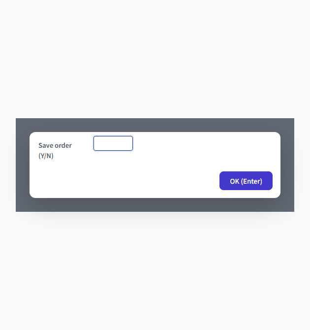

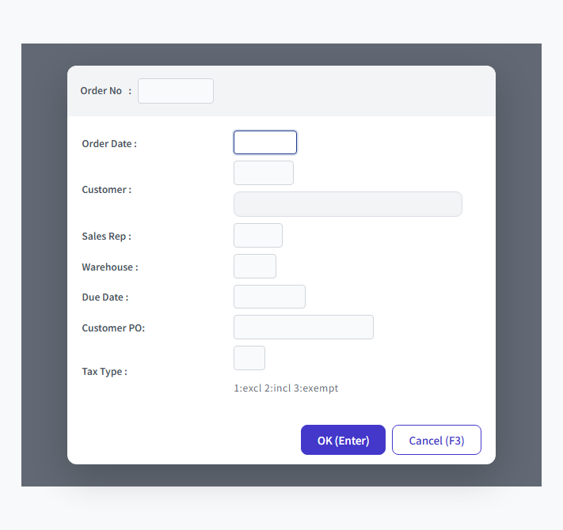

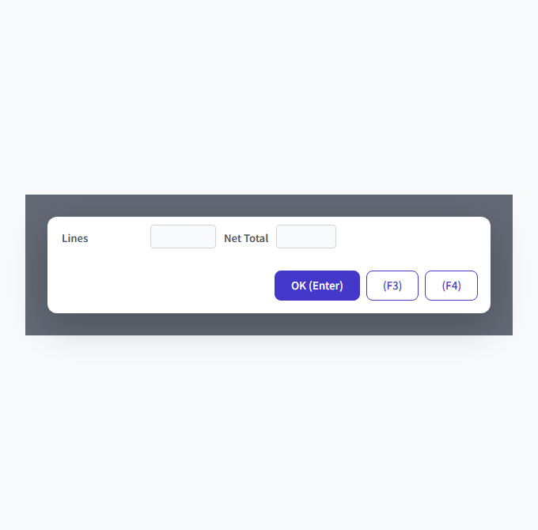

**項目詳細**

| № | コントロール名 | コントロールID | 種別 | Class／データ型 | Tab | 配置 | 文字数 | 値種別 | 初期表示 | 機能／表示データ（DBマッピング） | 取得元／条件 | 入力規則 | 備考 |
|---|---|---|---|---|---|---|---|---|---|---|---|---|---|
| **入力画面** ||||||||||||||
| 1 | Order Date | OH-DATE | 入力 | 9(8) | 1 | 左 | 8 | 数値 | 空 | Order Date（受注ヘッダ(ORDHF)） | 画面入力 | 必須／コード検証 | |
| 2 | Customer | OH-CUST | 入力 | 9(6) | 2 | 左 | 6 | 数値 | 空 | Customer（受注ヘッダ(ORDHF)） | 画面入力 | 必須／コード検証 | |
| 3 | Sales Rep | OH-STAFF | 入力 | 9(4) | 3 | 左 | 4 | 数値 | 空 | Sales Rep（受注ヘッダ(ORDHF)） | 画面入力 | 必須／コード検証 | |
| 4 | Warehouse | OH-WHSE | 入力 | 9(3) | 4 | 左 | 3 | 数値 | 空 | Warehouse（受注ヘッダ(ORDHF)） | 画面入力 | 必須／コード検証 | |
| 5 | Due Date | OH-DUE-DATE | 入力 | 9(8) | 5 | 左 | 8 | 数値 | 空 | Due Date（受注ヘッダ(ORDHF)） | 画面入力 | 必須／コード検証 | |
| 6 | Customer PO | OH-CUST-PO | 入力 | X(20) | 6 | 左 | 20 | 英数 | 空 | Customer PO（受注ヘッダ(ORDHF)） | 画面入力 | 入力 | |
| 7 | Tax Type | OH-TAX-TYPE | 入力 | 9(1) | 7 | 左 | 1 | 数値 | 空 | Tax Type（受注ヘッダ(ORDHF)） | 画面入力 | 必須／コード検証 | |
| 8 | Product | WK-D-PROD | 入力 | 9(8) | 8 | 左 | 8 | 数値 | 空 | Product（-） | 画面入力 | 必須／コード検証 | |
| 9 | Warehouse | WK-D-WHSE | 入力 | 9(3) | 9 | 左 | 3 | 数値 | 空 | Warehouse（-） | 画面入力 | 必須／コード検証 | |
| 10 | Quantity | WK-D-QTY | 入力 | S9(9) | 10 | 左 | 9 | 数値 | 空 | Quantity（-） | 画面入力 | 必須／コード検証 | |
| 11 | Unit Price | WK-D-PRICE | 入力 | S9(9)V9(2) | 11 | 左 | 11 | 数値 | 空 | Unit Price（-） | 画面入力 | 必須／コード検証 | |
| 12 | Save order (Y/N) | WK-CONFIRM | 入力 | X(1) | 12 | 左 | 1 | 英数 | 空 | Save order (Y/N)（-） | 画面入力 | 入力 | |
| 13 | Order No | WK-ORD-NO-D | 表示 | - | - | 左 | 10 | 英数 | 空 | Order No（-） | マスタ照合表示 | - | |
| 14 | Customer | WK-CUST-NAME | 表示 | - | - | 左 | 40 | 英数 | 空 | Customer（-） | マスタ照合表示 | - | |
| 15 | Product | WK-D-NAME | 表示 | - | - | 左 | 40 | 英数 | 空 | Product（-） | マスタ照合表示 | - | |
| 16 | Lines | WK-LCNT | 表示 | - | - | 左 | 3 | 英数 | 空 | Lines（-） | マスタ照合表示 | - | |
| 17 | Net Total | WK-NET-TOTAL | 表示 | - | - | 左 | 15 | 英数 | 空 | Net Total（-） | マスタ照合表示 | - | |

**項目状態**

> 記号: `レ`=フォーカス｜`必`=使用可（必須）｜`略`=使用可（省略可）｜`○`=使用可｜`×`=非表示｜`□`=表示のみ

| № | コントロール名 | 初期表示 | 入力／編集 | 確認 | 参照 |
|---|---|---|---|---|---|
| **入力画面** ||||||
| 1 | Order Date | ○ | 必 | □ | □ |
| 2 | Customer | ○ | 必 | □ | □ |
| 3 | Sales Rep | ○ | 必 | □ | □ |
| 4 | Warehouse | ○ | 必 | □ | □ |
| 5 | Due Date | ○ | 必 | □ | □ |
| 6 | Customer PO | ○ | 必 | □ | □ |
| 7 | Tax Type | ○ | 必 | □ | □ |
| 8 | Product | ○ | 必 | □ | □ |
| 9 | Warehouse | ○ | 必 | □ | □ |
| 10 | Quantity | ○ | 必 | □ | □ |
| 11 | Unit Price | ○ | 必 | □ | □ |
| 12 | Save order (Y/N) | ○ | 必 | □ | □ |
| 13 | Order No | □ | □ | □ | □ |
| 14 | Customer | □ | □ | □ | □ |
| 15 | Product | □ | □ | □ | □ |
| 16 | Lines | □ | □ | □ | □ |
| 17 | Net Total | □ | □ | □ | □ |

### 2.15 OE0020 — 受注照会

**レイアウト**

モダナイズ後の画面（Vue SFC `src/programs/oe0020/` を WebSocket ターミナルランタイムでレンダリング）。

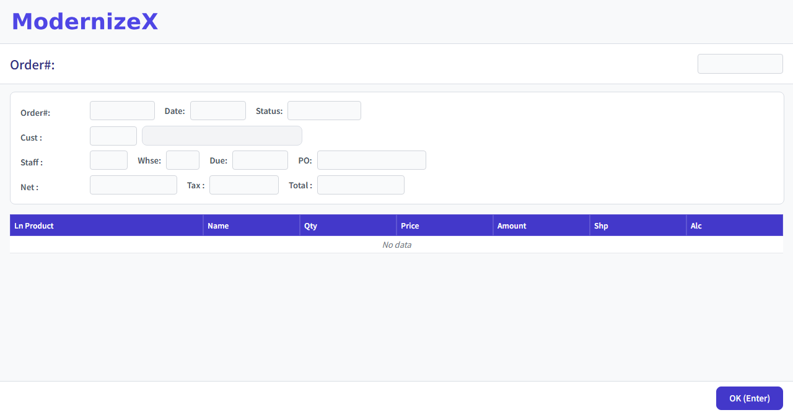

**項目詳細**

| № | コントロール名 | コントロールID | 種別 | Class／データ型 | Tab | 配置 | 文字数 | 値種別 | 初期表示 | 機能／表示データ（DBマッピング） | 取得元／条件 | 入力規則 | 備考 |
|---|---|---|---|---|---|---|---|---|---|---|---|---|---|
| **キー入力画面** ||||||||||||||
| 1 | Order No | WK-SEL-NO | 入力 | 9(10) | 1 | 左 | 10 | 数値 | 空 | Order No（-） | 画面入力 | 必須／コード検証 | |
| 2 | Customer | WK-SEL-CUST | 入力 | 9(6) | 2 | 左 | 6 | 数値 | 空 | Customer（-） | 画面入力 | 必須／コード検証 | |
| 3 | From Date | WK-SEL-DATE | 入力 | 9(8) | 3 | 左 | 8 | 数値 | 空 | From Date（-） | 画面入力 | 必須／コード検証 | |
| 4 | Customer | WK-CUST-NAME | 表示 | - | - | 左 | 40 | 英数 | 空 | Customer（-） | マスタ照合表示 | - | |
| **照会画面** ||||||||||||||
| 5 | PFkey | WK-DUMMY | 入力 | X(1) | 1 | 左 | 1 | 英数 | 空 | PFkey（-） | 画面入力 | 入力 | |
| 6 | Order# | OH-NO | 表示 | - | - | 左 | 10 | 英数 | 空 | Order#（受注ヘッダ(ORDHF)） | マスタ照合表示 | - | |
| 7 | Date | OH-DATE | 表示 | - | - | 左 | 8 | 英数 | 空 | Date（受注ヘッダ(ORDHF)） | マスタ照合表示 | - | |
| 8 | Status | WK-STAT-TEXT | 表示 | - | - | 左 | 12 | 英数 | 空 | Status（-） | マスタ照合表示 | - | |
| 9 | Cust | OH-CUST | 表示 | - | - | 左 | 6 | 英数 | 空 | Cust（受注ヘッダ(ORDHF)） | マスタ照合表示 | - | |
| 10 | Cust | WK-CUST-NAME | 表示 | - | - | 左 | 34 | 英数 | 空 | Cust（-） | マスタ照合表示 | - | |
| 11 | Staff | OH-STAFF | 表示 | - | - | 左 | 4 | 英数 | 空 | Staff（受注ヘッダ(ORDHF)） | マスタ照合表示 | - | |
| 12 | Whse | OH-WHSE | 表示 | - | - | 左 | 3 | 英数 | 空 | Whse（受注ヘッダ(ORDHF)） | マスタ照合表示 | - | |
| 13 | Due | OH-DUE-DATE | 表示 | - | - | 左 | 8 | 英数 | 空 | Due（受注ヘッダ(ORDHF)） | マスタ照合表示 | - | |
| 14 | PO | OH-CUST-PO | 表示 | - | - | 左 | 20 | 英数 | 空 | PO（受注ヘッダ(ORDHF)） | マスタ照合表示 | - | |
| 15 | Net | OH-AMOUNT | 表示 | - | - | 左 | 15 | 英数 | 空 | Net（受注ヘッダ(ORDHF)） | マスタ照合表示 | - | |
| 16 | Tax | OH-TAX-AMOUNT | 表示 | - | - | 左 | 11 | 英数 | 空 | Tax（受注ヘッダ(ORDHF)） | マスタ照合表示 | - | |
| 17 | Total | OH-TOTAL | 表示 | - | - | 左 | 15 | 英数 | 空 | Total（受注ヘッダ(ORDHF)） | マスタ照合表示 | - | |
| 18 | - | WW-LINE(1) | 表示 | - | - | 左 | 3 | 英数 | 空 | -（-） | マスタ照合表示 | - | |
| 19 | - | WW-PROD(1) | 表示 | - | - | 左 | 8 | 英数 | 空 | -（-） | マスタ照合表示 | - | |
| 20 | - | WW-NAME(1) | 表示 | - | - | 左 | 14 | 英数 | 空 | -（-） | マスタ照合表示 | - | |
| 21 | - | WW-QTY(1) | 表示 | - | - | 左 | 7 | 英数 | 空 | -（-） | マスタ照合表示 | - | |
| 22 | - | WW-PRICE(1) | 表示 | - | - | 左 | 10 | 英数 | 空 | -（-） | マスタ照合表示 | - | |
| 23 | - | WW-AMT(1) | 表示 | - | - | 左 | 12 | 英数 | 空 | -（-） | マスタ照合表示 | - | |
| 24 | - | WW-SHIP(1) | 表示 | - | - | 左 | 7 | 英数 | 空 | -（-） | マスタ照合表示 | - | |
| 25 | - | WW-ALLOC(1) | 表示 | - | - | 左 | 7 | 英数 | 空 | -（-） | マスタ照合表示 | - | |
| 26 | - | WW-LINE(2) | 表示 | - | - | 左 | 3 | 英数 | 空 | -（-） | マスタ照合表示 | - | |
| 27 | - | WW-PROD(2) | 表示 | - | - | 左 | 8 | 英数 | 空 | -（-） | マスタ照合表示 | - | |
| 28 | - | WW-NAME(2) | 表示 | - | - | 左 | 14 | 英数 | 空 | -（-） | マスタ照合表示 | - | |
| 29 | - | WW-QTY(2) | 表示 | - | - | 左 | 7 | 英数 | 空 | -（-） | マスタ照合表示 | - | |
| 30 | - | WW-PRICE(2) | 表示 | - | - | 左 | 10 | 英数 | 空 | -（-） | マスタ照合表示 | - | |
| 31 | - | WW-AMT(2) | 表示 | - | - | 左 | 12 | 英数 | 空 | -（-） | マスタ照合表示 | - | |
| 32 | - | WW-SHIP(2) | 表示 | - | - | 左 | 7 | 英数 | 空 | -（-） | マスタ照合表示 | - | |
| 33 | - | WW-ALLOC(2) | 表示 | - | - | 左 | 7 | 英数 | 空 | -（-） | マスタ照合表示 | - | |
| 34 | - | WW-LINE(3) | 表示 | - | - | 左 | 3 | 英数 | 空 | -（-） | マスタ照合表示 | - | |
| 35 | - | WW-PROD(3) | 表示 | - | - | 左 | 8 | 英数 | 空 | -（-） | マスタ照合表示 | - | |
| 36 | - | WW-NAME(3) | 表示 | - | - | 左 | 14 | 英数 | 空 | -（-） | マスタ照合表示 | - | |
| 37 | - | WW-QTY(3) | 表示 | - | - | 左 | 7 | 英数 | 空 | -（-） | マスタ照合表示 | - | |
| 38 | - | WW-PRICE(3) | 表示 | - | - | 左 | 10 | 英数 | 空 | -（-） | マスタ照合表示 | - | |
| 39 | - | WW-AMT(3) | 表示 | - | - | 左 | 12 | 英数 | 空 | -（-） | マスタ照合表示 | - | |
| 40 | - | WW-SHIP(3) | 表示 | - | - | 左 | 7 | 英数 | 空 | -（-） | マスタ照合表示 | - | |
| 41 | - | WW-ALLOC(3) | 表示 | - | - | 左 | 7 | 英数 | 空 | -（-） | マスタ照合表示 | - | |
| 42 | - | WW-LINE(4) | 表示 | - | - | 左 | 3 | 英数 | 空 | -（-） | マスタ照合表示 | - | |
| 43 | - | WW-PROD(4) | 表示 | - | - | 左 | 8 | 英数 | 空 | -（-） | マスタ照合表示 | - | |
| 44 | - | WW-NAME(4) | 表示 | - | - | 左 | 14 | 英数 | 空 | -（-） | マスタ照合表示 | - | |
| 45 | - | WW-QTY(4) | 表示 | - | - | 左 | 7 | 英数 | 空 | -（-） | マスタ照合表示 | - | |
| 46 | - | WW-PRICE(4) | 表示 | - | - | 左 | 10 | 英数 | 空 | -（-） | マスタ照合表示 | - | |
| 47 | - | WW-AMT(4) | 表示 | - | - | 左 | 12 | 英数 | 空 | -（-） | マスタ照合表示 | - | |
| 48 | - | WW-SHIP(4) | 表示 | - | - | 左 | 7 | 英数 | 空 | -（-） | マスタ照合表示 | - | |
| 49 | - | WW-ALLOC(4) | 表示 | - | - | 左 | 7 | 英数 | 空 | -（-） | マスタ照合表示 | - | |
| 50 | - | WW-LINE(5) | 表示 | - | - | 左 | 3 | 英数 | 空 | -（-） | マスタ照合表示 | - | |
| 51 | - | WW-PROD(5) | 表示 | - | - | 左 | 8 | 英数 | 空 | -（-） | マスタ照合表示 | - | |
| 52 | - | WW-NAME(5) | 表示 | - | - | 左 | 14 | 英数 | 空 | -（-） | マスタ照合表示 | - | |
| 53 | - | WW-QTY(5) | 表示 | - | - | 左 | 7 | 英数 | 空 | -（-） | マスタ照合表示 | - | |
| 54 | - | WW-PRICE(5) | 表示 | - | - | 左 | 10 | 英数 | 空 | -（-） | マスタ照合表示 | - | |
| 55 | - | WW-AMT(5) | 表示 | - | - | 左 | 12 | 英数 | 空 | -（-） | マスタ照合表示 | - | |
| 56 | - | WW-SHIP(5) | 表示 | - | - | 左 | 7 | 英数 | 空 | -（-） | マスタ照合表示 | - | |
| 57 | - | WW-ALLOC(5) | 表示 | - | - | 左 | 7 | 英数 | 空 | -（-） | マスタ照合表示 | - | |
| 58 | - | WW-LINE(6) | 表示 | - | - | 左 | 3 | 英数 | 空 | -（-） | マスタ照合表示 | - | |
| 59 | - | WW-PROD(6) | 表示 | - | - | 左 | 8 | 英数 | 空 | -（-） | マスタ照合表示 | - | |
| 60 | - | WW-NAME(6) | 表示 | - | - | 左 | 14 | 英数 | 空 | -（-） | マスタ照合表示 | - | |
| 61 | - | WW-QTY(6) | 表示 | - | - | 左 | 7 | 英数 | 空 | -（-） | マスタ照合表示 | - | |
| 62 | - | WW-PRICE(6) | 表示 | - | - | 左 | 10 | 英数 | 空 | -（-） | マスタ照合表示 | - | |
| 63 | - | WW-AMT(6) | 表示 | - | - | 左 | 12 | 英数 | 空 | -（-） | マスタ照合表示 | - | |
| 64 | - | WW-SHIP(6) | 表示 | - | - | 左 | 7 | 英数 | 空 | -（-） | マスタ照合表示 | - | |
| 65 | - | WW-ALLOC(6) | 表示 | - | - | 左 | 7 | 英数 | 空 | -（-） | マスタ照合表示 | - | |
| 66 | - | WW-LINE(7) | 表示 | - | - | 左 | 3 | 英数 | 空 | -（-） | マスタ照合表示 | - | |
| 67 | - | WW-PROD(7) | 表示 | - | - | 左 | 8 | 英数 | 空 | -（-） | マスタ照合表示 | - | |
| 68 | - | WW-NAME(7) | 表示 | - | - | 左 | 14 | 英数 | 空 | -（-） | マスタ照合表示 | - | |
| 69 | - | WW-QTY(7) | 表示 | - | - | 左 | 7 | 英数 | 空 | -（-） | マスタ照合表示 | - | |
| 70 | - | WW-PRICE(7) | 表示 | - | - | 左 | 10 | 英数 | 空 | -（-） | マスタ照合表示 | - | |
| 71 | - | WW-AMT(7) | 表示 | - | - | 左 | 12 | 英数 | 空 | -（-） | マスタ照合表示 | - | |
| 72 | - | WW-SHIP(7) | 表示 | - | - | 左 | 7 | 英数 | 空 | -（-） | マスタ照合表示 | - | |
| 73 | - | WW-ALLOC(7) | 表示 | - | - | 左 | 7 | 英数 | 空 | -（-） | マスタ照合表示 | - | |
| 74 | - | WW-LINE(8) | 表示 | - | - | 左 | 3 | 英数 | 空 | -（-） | マスタ照合表示 | - | |
| 75 | - | WW-PROD(8) | 表示 | - | - | 左 | 8 | 英数 | 空 | -（-） | マスタ照合表示 | - | |
| 76 | - | WW-NAME(8) | 表示 | - | - | 左 | 14 | 英数 | 空 | -（-） | マスタ照合表示 | - | |
| 77 | - | WW-QTY(8) | 表示 | - | - | 左 | 7 | 英数 | 空 | -（-） | マスタ照合表示 | - | |
| 78 | - | WW-PRICE(8) | 表示 | - | - | 左 | 10 | 英数 | 空 | -（-） | マスタ照合表示 | - | |
| 79 | - | WW-AMT(8) | 表示 | - | - | 左 | 12 | 英数 | 空 | -（-） | マスタ照合表示 | - | |
| 80 | - | WW-SHIP(8) | 表示 | - | - | 左 | 7 | 英数 | 空 | -（-） | マスタ照合表示 | - | |
| 81 | - | WW-ALLOC(8) | 表示 | - | - | 左 | 7 | 英数 | 空 | -（-） | マスタ照合表示 | - | |
| 82 | - | WW-LINE(9) | 表示 | - | - | 左 | 3 | 英数 | 空 | -（-） | マスタ照合表示 | - | |
| 83 | - | WW-PROD(9) | 表示 | - | - | 左 | 8 | 英数 | 空 | -（-） | マスタ照合表示 | - | |
| 84 | - | WW-NAME(9) | 表示 | - | - | 左 | 14 | 英数 | 空 | -（-） | マスタ照合表示 | - | |
| 85 | - | WW-QTY(9) | 表示 | - | - | 左 | 7 | 英数 | 空 | -（-） | マスタ照合表示 | - | |
| 86 | - | WW-PRICE(9) | 表示 | - | - | 左 | 10 | 英数 | 空 | -（-） | マスタ照合表示 | - | |
| 87 | - | WW-AMT(9) | 表示 | - | - | 左 | 12 | 英数 | 空 | -（-） | マスタ照合表示 | - | |
| 88 | - | WW-SHIP(9) | 表示 | - | - | 左 | 7 | 英数 | 空 | -（-） | マスタ照合表示 | - | |
| 89 | - | WW-ALLOC(9) | 表示 | - | - | 左 | 7 | 英数 | 空 | -（-） | マスタ照合表示 | - | |
| 90 | - | WW-LINE(10) | 表示 | - | - | 左 | 3 | 英数 | 空 | -（-） | マスタ照合表示 | - | |
| 91 | - | WW-PROD(10) | 表示 | - | - | 左 | 8 | 英数 | 空 | -（-） | マスタ照合表示 | - | |
| 92 | - | WW-NAME(10) | 表示 | - | - | 左 | 14 | 英数 | 空 | -（-） | マスタ照合表示 | - | |
| 93 | - | WW-QTY(10) | 表示 | - | - | 左 | 7 | 英数 | 空 | -（-） | マスタ照合表示 | - | |
| 94 | - | WW-PRICE(10) | 表示 | - | - | 左 | 10 | 英数 | 空 | -（-） | マスタ照合表示 | - | |
| 95 | - | WW-AMT(10) | 表示 | - | - | 左 | 12 | 英数 | 空 | -（-） | マスタ照合表示 | - | |
| 96 | - | WW-SHIP(10) | 表示 | - | - | 左 | 7 | 英数 | 空 | -（-） | マスタ照合表示 | - | |
| 97 | - | WW-ALLOC(10) | 表示 | - | - | 左 | 7 | 英数 | 空 | -（-） | マスタ照合表示 | - | |
| 98 | - | WW-LINE(11) | 表示 | - | - | 左 | 3 | 英数 | 空 | -（-） | マスタ照合表示 | - | |
| 99 | - | WW-PROD(11) | 表示 | - | - | 左 | 8 | 英数 | 空 | -（-） | マスタ照合表示 | - | |
| 100 | - | WW-NAME(11) | 表示 | - | - | 左 | 14 | 英数 | 空 | -（-） | マスタ照合表示 | - | |
| 101 | - | WW-QTY(11) | 表示 | - | - | 左 | 7 | 英数 | 空 | -（-） | マスタ照合表示 | - | |
| 102 | - | WW-PRICE(11) | 表示 | - | - | 左 | 10 | 英数 | 空 | -（-） | マスタ照合表示 | - | |
| 103 | - | WW-AMT(11) | 表示 | - | - | 左 | 12 | 英数 | 空 | -（-） | マスタ照合表示 | - | |
| 104 | - | WW-SHIP(11) | 表示 | - | - | 左 | 7 | 英数 | 空 | -（-） | マスタ照合表示 | - | |
| 105 | - | WW-ALLOC(11) | 表示 | - | - | 左 | 7 | 英数 | 空 | -（-） | マスタ照合表示 | - | |
| 106 | - | WW-LINE(12) | 表示 | - | - | 左 | 3 | 英数 | 空 | -（-） | マスタ照合表示 | - | |
| 107 | - | WW-PROD(12) | 表示 | - | - | 左 | 8 | 英数 | 空 | -（-） | マスタ照合表示 | - | |
| 108 | - | WW-NAME(12) | 表示 | - | - | 左 | 14 | 英数 | 空 | -（-） | マスタ照合表示 | - | |
| 109 | - | WW-QTY(12) | 表示 | - | - | 左 | 7 | 英数 | 空 | -（-） | マスタ照合表示 | - | |
| 110 | - | WW-PRICE(12) | 表示 | - | - | 左 | 10 | 英数 | 空 | -（-） | マスタ照合表示 | - | |
| 111 | - | WW-AMT(12) | 表示 | - | - | 左 | 12 | 英数 | 空 | -（-） | マスタ照合表示 | - | |
| 112 | - | WW-SHIP(12) | 表示 | - | - | 左 | 7 | 英数 | 空 | -（-） | マスタ照合表示 | - | |
| 113 | - | WW-ALLOC(12) | 表示 | - | - | 左 | 7 | 英数 | 空 | -（-） | マスタ照合表示 | - | |
| 114 | - | WW-LINE(13) | 表示 | - | - | 左 | 3 | 英数 | 空 | -（-） | マスタ照合表示 | - | |
| 115 | - | WW-PROD(13) | 表示 | - | - | 左 | 8 | 英数 | 空 | -（-） | マスタ照合表示 | - | |
| 116 | - | WW-NAME(13) | 表示 | - | - | 左 | 14 | 英数 | 空 | -（-） | マスタ照合表示 | - | |
| 117 | - | WW-QTY(13) | 表示 | - | - | 左 | 7 | 英数 | 空 | -（-） | マスタ照合表示 | - | |
| 118 | - | WW-PRICE(13) | 表示 | - | - | 左 | 10 | 英数 | 空 | -（-） | マスタ照合表示 | - | |
| 119 | - | WW-AMT(13) | 表示 | - | - | 左 | 12 | 英数 | 空 | -（-） | マスタ照合表示 | - | |
| 120 | - | WW-SHIP(13) | 表示 | - | - | 左 | 7 | 英数 | 空 | -（-） | マスタ照合表示 | - | |
| 121 | - | WW-ALLOC(13) | 表示 | - | - | 左 | 7 | 英数 | 空 | -（-） | マスタ照合表示 | - | |
| 122 | Lines | WK-DCNT | 表示 | - | - | 左 | 3 | 英数 | 空 | Lines（-） | マスタ照合表示 | - | |
| 123 | Page | WK-PAGE-NO | 表示 | - | - | 左 | 3 | 英数 | 空 | Page（-） | マスタ照合表示 | - | |
| 124 | / | WK-PAGE-CNT | 表示 | - | - | 左 | 3 | 英数 | 空 | /（-） | マスタ照合表示 | - | |

**項目状態**

> 記号: `レ`=フォーカス｜`必`=使用可（必須）｜`略`=使用可（省略可）｜`○`=使用可｜`×`=非表示｜`□`=表示のみ

| № | コントロール名 | 初期表示 | 入力／編集 | 確認 | 参照 |
|---|---|---|---|---|---|
| **キー入力画面** ||||||
| 1 | Order No | ○ | 必 | □ | □ |
| 2 | Customer | ○ | 必 | □ | □ |
| 3 | From Date | ○ | 必 | □ | □ |
| 4 | Customer | □ | □ | □ | □ |
| **照会画面** ||||||
| 5 | PFkey | ○ | 必 | □ | □ |
| 6 | Order# | □ | □ | □ | □ |
| 7 | Date | □ | □ | □ | □ |
| 8 | Status | □ | □ | □ | □ |
| 9 | Cust | □ | □ | □ | □ |
| 10 | Cust | □ | □ | □ | □ |
| 11 | Staff | □ | □ | □ | □ |
| 12 | Whse | □ | □ | □ | □ |
| 13 | Due | □ | □ | □ | □ |
| 14 | PO | □ | □ | □ | □ |
| 15 | Net | □ | □ | □ | □ |
| 16 | Tax | □ | □ | □ | □ |
| 17 | Total | □ | □ | □ | □ |
| 18 | - | □ | □ | □ | □ |
| 19 | - | □ | □ | □ | □ |
| 20 | - | □ | □ | □ | □ |
| 21 | - | □ | □ | □ | □ |
| 22 | - | □ | □ | □ | □ |
| 23 | - | □ | □ | □ | □ |
| 24 | - | □ | □ | □ | □ |
| 25 | - | □ | □ | □ | □ |
| 26 | - | □ | □ | □ | □ |
| 27 | - | □ | □ | □ | □ |
| 28 | - | □ | □ | □ | □ |
| 29 | - | □ | □ | □ | □ |
| 30 | - | □ | □ | □ | □ |
| 31 | - | □ | □ | □ | □ |
| 32 | - | □ | □ | □ | □ |
| 33 | - | □ | □ | □ | □ |
| 34 | - | □ | □ | □ | □ |
| 35 | - | □ | □ | □ | □ |
| 36 | - | □ | □ | □ | □ |
| 37 | - | □ | □ | □ | □ |
| 38 | - | □ | □ | □ | □ |
| 39 | - | □ | □ | □ | □ |
| 40 | - | □ | □ | □ | □ |
| 41 | - | □ | □ | □ | □ |
| 42 | - | □ | □ | □ | □ |
| 43 | - | □ | □ | □ | □ |
| 44 | - | □ | □ | □ | □ |
| 45 | - | □ | □ | □ | □ |
| 46 | - | □ | □ | □ | □ |
| 47 | - | □ | □ | □ | □ |
| 48 | - | □ | □ | □ | □ |
| 49 | - | □ | □ | □ | □ |
| 50 | - | □ | □ | □ | □ |
| 51 | - | □ | □ | □ | □ |
| 52 | - | □ | □ | □ | □ |
| 53 | - | □ | □ | □ | □ |
| 54 | - | □ | □ | □ | □ |
| 55 | - | □ | □ | □ | □ |
| 56 | - | □ | □ | □ | □ |
| 57 | - | □ | □ | □ | □ |
| 58 | - | □ | □ | □ | □ |
| 59 | - | □ | □ | □ | □ |
| 60 | - | □ | □ | □ | □ |
| 61 | - | □ | □ | □ | □ |
| 62 | - | □ | □ | □ | □ |
| 63 | - | □ | □ | □ | □ |
| 64 | - | □ | □ | □ | □ |
| 65 | - | □ | □ | □ | □ |
| 66 | - | □ | □ | □ | □ |
| 67 | - | □ | □ | □ | □ |
| 68 | - | □ | □ | □ | □ |
| 69 | - | □ | □ | □ | □ |
| 70 | - | □ | □ | □ | □ |
| 71 | - | □ | □ | □ | □ |
| 72 | - | □ | □ | □ | □ |
| 73 | - | □ | □ | □ | □ |
| 74 | - | □ | □ | □ | □ |
| 75 | - | □ | □ | □ | □ |
| 76 | - | □ | □ | □ | □ |
| 77 | - | □ | □ | □ | □ |
| 78 | - | □ | □ | □ | □ |
| 79 | - | □ | □ | □ | □ |
| 80 | - | □ | □ | □ | □ |
| 81 | - | □ | □ | □ | □ |
| 82 | - | □ | □ | □ | □ |
| 83 | - | □ | □ | □ | □ |
| 84 | - | □ | □ | □ | □ |
| 85 | - | □ | □ | □ | □ |
| 86 | - | □ | □ | □ | □ |
| 87 | - | □ | □ | □ | □ |
| 88 | - | □ | □ | □ | □ |
| 89 | - | □ | □ | □ | □ |
| 90 | - | □ | □ | □ | □ |
| 91 | - | □ | □ | □ | □ |
| 92 | - | □ | □ | □ | □ |
| 93 | - | □ | □ | □ | □ |
| 94 | - | □ | □ | □ | □ |
| 95 | - | □ | □ | □ | □ |
| 96 | - | □ | □ | □ | □ |
| 97 | - | □ | □ | □ | □ |
| 98 | - | □ | □ | □ | □ |
| 99 | - | □ | □ | □ | □ |
| 100 | - | □ | □ | □ | □ |
| 101 | - | □ | □ | □ | □ |
| 102 | - | □ | □ | □ | □ |
| 103 | - | □ | □ | □ | □ |
| 104 | - | □ | □ | □ | □ |
| 105 | - | □ | □ | □ | □ |
| 106 | - | □ | □ | □ | □ |
| 107 | - | □ | □ | □ | □ |
| 108 | - | □ | □ | □ | □ |
| 109 | - | □ | □ | □ | □ |
| 110 | - | □ | □ | □ | □ |
| 111 | - | □ | □ | □ | □ |
| 112 | - | □ | □ | □ | □ |
| 113 | - | □ | □ | □ | □ |
| 114 | - | □ | □ | □ | □ |
| 115 | - | □ | □ | □ | □ |
| 116 | - | □ | □ | □ | □ |
| 117 | - | □ | □ | □ | □ |
| 118 | - | □ | □ | □ | □ |
| 119 | - | □ | □ | □ | □ |
| 120 | - | □ | □ | □ | □ |
| 121 | - | □ | □ | □ | □ |
| 122 | Lines | □ | □ | □ | □ |
| 123 | Page | □ | □ | □ | □ |
| 124 | / | □ | □ | □ | □ |

### 2.16 OE0030 — 受注引当

**レイアウト**

モダナイズ後の画面（Vue SFC `src/programs/oe0030/` を WebSocket ターミナルランタイムでレンダリング）。

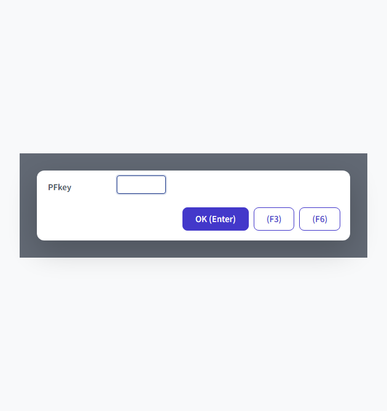

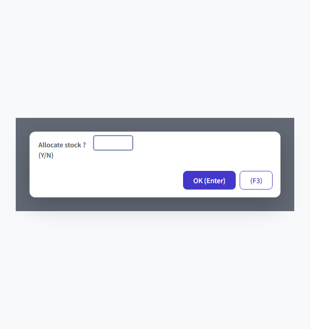

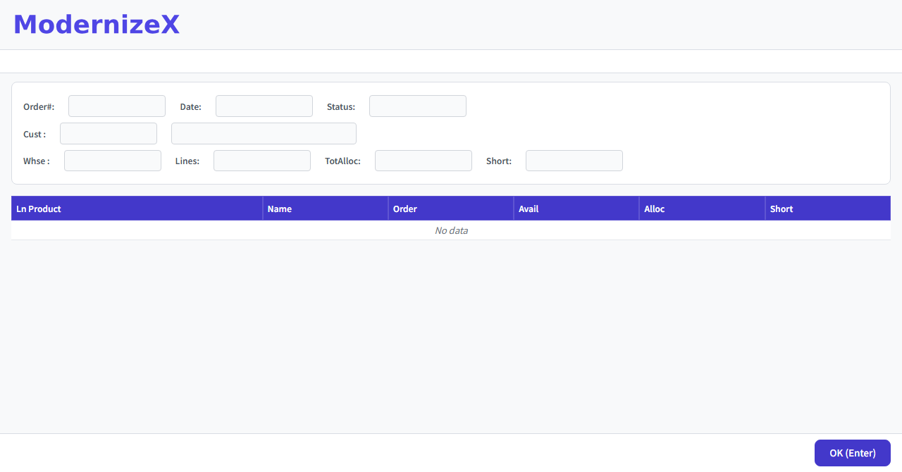

**項目詳細**

| № | コントロール名 | コントロールID | 種別 | Class／データ型 | Tab | 配置 | 文字数 | 値種別 | 初期表示 | 機能／表示データ（DBマッピング） | 取得元／条件 | 入力規則 | 備考 |
|---|---|---|---|---|---|---|---|---|---|---|---|---|---|
| **キー入力画面** ||||||||||||||
| 1 | Order No | WK-SEL-NO | 入力 | 9(10) | 1 | 左 | 10 | 数値 | 空 | Order No（-） | 画面入力 | 必須／コード検証 | |
| **照会画面** ||||||||||||||
| 2 | Allocate stock ? (Y/N) | WK-CONFIRM | 入力 | X(1) | 1 | 左 | 1 | 英数 | 空 | Allocate stock ? (Y/N)（-） | 画面入力 | 入力 | |
| 3 | PFkey | WK-DUMMY | 入力 | X(1) | 2 | 左 | 1 | 英数 | 空 | PFkey（-） | 画面入力 | 入力 | |
| 4 | Order# | OH-NO | 表示 | - | - | 左 | 10 | 英数 | 空 | Order#（受注ヘッダ(ORDHF)） | マスタ照合表示 | - | |
| 5 | Date | OH-DATE | 表示 | - | - | 左 | 8 | 英数 | 空 | Date（受注ヘッダ(ORDHF)） | マスタ照合表示 | - | |
| 6 | Status | WK-STAT-TEXT | 表示 | - | - | 左 | 12 | 英数 | 空 | Status（-） | マスタ照合表示 | - | |
| 7 | Cust | OH-CUST | 表示 | - | - | 左 | 6 | 英数 | 空 | Cust（受注ヘッダ(ORDHF)） | マスタ照合表示 | - | |
| 8 | Cust | WK-CUST-NAME | 表示 | - | - | 左 | 34 | 英数 | 空 | Cust（-） | マスタ照合表示 | - | |
| 9 | Whse | OH-WHSE | 表示 | - | - | 左 | 3 | 英数 | 空 | Whse（受注ヘッダ(ORDHF)） | マスタ照合表示 | - | |
| 10 | Lines | WK-DCNT | 表示 | - | - | 左 | 3 | 英数 | 空 | Lines（-） | マスタ照合表示 | - | |
| 11 | TotAlloc | WK-TOT-ALLOC | 表示 | - | - | 左 | 11 | 英数 | 空 | TotAlloc（-） | マスタ照合表示 | - | |
| 12 | Short | WK-TOT-SHORT | 表示 | - | - | 左 | 11 | 英数 | 空 | Short（-） | マスタ照合表示 | - | |
| 13 | - | WW-LINE(1) | 表示 | - | - | 左 | 3 | 英数 | 空 | -（-） | マスタ照合表示 | - | |
| 14 | - | WW-PROD(1) | 表示 | - | - | 左 | 8 | 英数 | 空 | -（-） | マスタ照合表示 | - | |
| 15 | - | WW-NAME(1) | 表示 | - | - | 左 | 14 | 英数 | 空 | -（-） | マスタ照合表示 | - | |
| 16 | - | WW-ORD(1) | 表示 | - | - | 左 | 7 | 英数 | 空 | -（-） | マスタ照合表示 | - | |
| 17 | - | WW-AVAIL(1) | 表示 | - | - | 左 | 7 | 英数 | 空 | -（-） | マスタ照合表示 | - | |
| 18 | - | WW-ALLOC(1) | 表示 | - | - | 左 | 7 | 英数 | 空 | -（-） | マスタ照合表示 | - | |
| 19 | - | WW-SHORT(1) | 表示 | - | - | 左 | 7 | 英数 | 空 | -（-） | マスタ照合表示 | - | |
| 20 | - | WW-LINE(2) | 表示 | - | - | 左 | 3 | 英数 | 空 | -（-） | マスタ照合表示 | - | |
| 21 | - | WW-PROD(2) | 表示 | - | - | 左 | 8 | 英数 | 空 | -（-） | マスタ照合表示 | - | |
| 22 | - | WW-NAME(2) | 表示 | - | - | 左 | 14 | 英数 | 空 | -（-） | マスタ照合表示 | - | |
| 23 | - | WW-ORD(2) | 表示 | - | - | 左 | 7 | 英数 | 空 | -（-） | マスタ照合表示 | - | |
| 24 | - | WW-AVAIL(2) | 表示 | - | - | 左 | 7 | 英数 | 空 | -（-） | マスタ照合表示 | - | |
| 25 | - | WW-ALLOC(2) | 表示 | - | - | 左 | 7 | 英数 | 空 | -（-） | マスタ照合表示 | - | |
| 26 | - | WW-SHORT(2) | 表示 | - | - | 左 | 7 | 英数 | 空 | -（-） | マスタ照合表示 | - | |
| 27 | - | WW-LINE(3) | 表示 | - | - | 左 | 3 | 英数 | 空 | -（-） | マスタ照合表示 | - | |
| 28 | - | WW-PROD(3) | 表示 | - | - | 左 | 8 | 英数 | 空 | -（-） | マスタ照合表示 | - | |
| 29 | - | WW-NAME(3) | 表示 | - | - | 左 | 14 | 英数 | 空 | -（-） | マスタ照合表示 | - | |
| 30 | - | WW-ORD(3) | 表示 | - | - | 左 | 7 | 英数 | 空 | -（-） | マスタ照合表示 | - | |
| 31 | - | WW-AVAIL(3) | 表示 | - | - | 左 | 7 | 英数 | 空 | -（-） | マスタ照合表示 | - | |
| 32 | - | WW-ALLOC(3) | 表示 | - | - | 左 | 7 | 英数 | 空 | -（-） | マスタ照合表示 | - | |
| 33 | - | WW-SHORT(3) | 表示 | - | - | 左 | 7 | 英数 | 空 | -（-） | マスタ照合表示 | - | |
| 34 | - | WW-LINE(4) | 表示 | - | - | 左 | 3 | 英数 | 空 | -（-） | マスタ照合表示 | - | |
| 35 | - | WW-PROD(4) | 表示 | - | - | 左 | 8 | 英数 | 空 | -（-） | マスタ照合表示 | - | |
| 36 | - | WW-NAME(4) | 表示 | - | - | 左 | 14 | 英数 | 空 | -（-） | マスタ照合表示 | - | |
| 37 | - | WW-ORD(4) | 表示 | - | - | 左 | 7 | 英数 | 空 | -（-） | マスタ照合表示 | - | |
| 38 | - | WW-AVAIL(4) | 表示 | - | - | 左 | 7 | 英数 | 空 | -（-） | マスタ照合表示 | - | |
| 39 | - | WW-ALLOC(4) | 表示 | - | - | 左 | 7 | 英数 | 空 | -（-） | マスタ照合表示 | - | |
| 40 | - | WW-SHORT(4) | 表示 | - | - | 左 | 7 | 英数 | 空 | -（-） | マスタ照合表示 | - | |
| 41 | - | WW-LINE(5) | 表示 | - | - | 左 | 3 | 英数 | 空 | -（-） | マスタ照合表示 | - | |
| 42 | - | WW-PROD(5) | 表示 | - | - | 左 | 8 | 英数 | 空 | -（-） | マスタ照合表示 | - | |
| 43 | - | WW-NAME(5) | 表示 | - | - | 左 | 14 | 英数 | 空 | -（-） | マスタ照合表示 | - | |
| 44 | - | WW-ORD(5) | 表示 | - | - | 左 | 7 | 英数 | 空 | -（-） | マスタ照合表示 | - | |
| 45 | - | WW-AVAIL(5) | 表示 | - | - | 左 | 7 | 英数 | 空 | -（-） | マスタ照合表示 | - | |
| 46 | - | WW-ALLOC(5) | 表示 | - | - | 左 | 7 | 英数 | 空 | -（-） | マスタ照合表示 | - | |
| 47 | - | WW-SHORT(5) | 表示 | - | - | 左 | 7 | 英数 | 空 | -（-） | マスタ照合表示 | - | |
| 48 | - | WW-LINE(6) | 表示 | - | - | 左 | 3 | 英数 | 空 | -（-） | マスタ照合表示 | - | |
| 49 | - | WW-PROD(6) | 表示 | - | - | 左 | 8 | 英数 | 空 | -（-） | マスタ照合表示 | - | |
| 50 | - | WW-NAME(6) | 表示 | - | - | 左 | 14 | 英数 | 空 | -（-） | マスタ照合表示 | - | |
| 51 | - | WW-ORD(6) | 表示 | - | - | 左 | 7 | 英数 | 空 | -（-） | マスタ照合表示 | - | |
| 52 | - | WW-AVAIL(6) | 表示 | - | - | 左 | 7 | 英数 | 空 | -（-） | マスタ照合表示 | - | |
| 53 | - | WW-ALLOC(6) | 表示 | - | - | 左 | 7 | 英数 | 空 | -（-） | マスタ照合表示 | - | |
| 54 | - | WW-SHORT(6) | 表示 | - | - | 左 | 7 | 英数 | 空 | -（-） | マスタ照合表示 | - | |
| 55 | - | WW-LINE(7) | 表示 | - | - | 左 | 3 | 英数 | 空 | -（-） | マスタ照合表示 | - | |
| 56 | - | WW-PROD(7) | 表示 | - | - | 左 | 8 | 英数 | 空 | -（-） | マスタ照合表示 | - | |
| 57 | - | WW-NAME(7) | 表示 | - | - | 左 | 14 | 英数 | 空 | -（-） | マスタ照合表示 | - | |
| 58 | - | WW-ORD(7) | 表示 | - | - | 左 | 7 | 英数 | 空 | -（-） | マスタ照合表示 | - | |
| 59 | - | WW-AVAIL(7) | 表示 | - | - | 左 | 7 | 英数 | 空 | -（-） | マスタ照合表示 | - | |
| 60 | - | WW-ALLOC(7) | 表示 | - | - | 左 | 7 | 英数 | 空 | -（-） | マスタ照合表示 | - | |
| 61 | - | WW-SHORT(7) | 表示 | - | - | 左 | 7 | 英数 | 空 | -（-） | マスタ照合表示 | - | |
| 62 | - | WW-LINE(8) | 表示 | - | - | 左 | 3 | 英数 | 空 | -（-） | マスタ照合表示 | - | |
| 63 | - | WW-PROD(8) | 表示 | - | - | 左 | 8 | 英数 | 空 | -（-） | マスタ照合表示 | - | |
| 64 | - | WW-NAME(8) | 表示 | - | - | 左 | 14 | 英数 | 空 | -（-） | マスタ照合表示 | - | |
| 65 | - | WW-ORD(8) | 表示 | - | - | 左 | 7 | 英数 | 空 | -（-） | マスタ照合表示 | - | |
| 66 | - | WW-AVAIL(8) | 表示 | - | - | 左 | 7 | 英数 | 空 | -（-） | マスタ照合表示 | - | |
| 67 | - | WW-ALLOC(8) | 表示 | - | - | 左 | 7 | 英数 | 空 | -（-） | マスタ照合表示 | - | |
| 68 | - | WW-SHORT(8) | 表示 | - | - | 左 | 7 | 英数 | 空 | -（-） | マスタ照合表示 | - | |
| 69 | - | WW-LINE(9) | 表示 | - | - | 左 | 3 | 英数 | 空 | -（-） | マスタ照合表示 | - | |
| 70 | - | WW-PROD(9) | 表示 | - | - | 左 | 8 | 英数 | 空 | -（-） | マスタ照合表示 | - | |
| 71 | - | WW-NAME(9) | 表示 | - | - | 左 | 14 | 英数 | 空 | -（-） | マスタ照合表示 | - | |
| 72 | - | WW-ORD(9) | 表示 | - | - | 左 | 7 | 英数 | 空 | -（-） | マスタ照合表示 | - | |
| 73 | - | WW-AVAIL(9) | 表示 | - | - | 左 | 7 | 英数 | 空 | -（-） | マスタ照合表示 | - | |
| 74 | - | WW-ALLOC(9) | 表示 | - | - | 左 | 7 | 英数 | 空 | -（-） | マスタ照合表示 | - | |
| 75 | - | WW-SHORT(9) | 表示 | - | - | 左 | 7 | 英数 | 空 | -（-） | マスタ照合表示 | - | |
| 76 | - | WW-LINE(10) | 表示 | - | - | 左 | 3 | 英数 | 空 | -（-） | マスタ照合表示 | - | |
| 77 | - | WW-PROD(10) | 表示 | - | - | 左 | 8 | 英数 | 空 | -（-） | マスタ照合表示 | - | |
| 78 | - | WW-NAME(10) | 表示 | - | - | 左 | 14 | 英数 | 空 | -（-） | マスタ照合表示 | - | |
| 79 | - | WW-ORD(10) | 表示 | - | - | 左 | 7 | 英数 | 空 | -（-） | マスタ照合表示 | - | |
| 80 | - | WW-AVAIL(10) | 表示 | - | - | 左 | 7 | 英数 | 空 | -（-） | マスタ照合表示 | - | |
| 81 | - | WW-ALLOC(10) | 表示 | - | - | 左 | 7 | 英数 | 空 | -（-） | マスタ照合表示 | - | |
| 82 | - | WW-SHORT(10) | 表示 | - | - | 左 | 7 | 英数 | 空 | -（-） | マスタ照合表示 | - | |
| 83 | - | WW-LINE(11) | 表示 | - | - | 左 | 3 | 英数 | 空 | -（-） | マスタ照合表示 | - | |
| 84 | - | WW-PROD(11) | 表示 | - | - | 左 | 8 | 英数 | 空 | -（-） | マスタ照合表示 | - | |
| 85 | - | WW-NAME(11) | 表示 | - | - | 左 | 14 | 英数 | 空 | -（-） | マスタ照合表示 | - | |
| 86 | - | WW-ORD(11) | 表示 | - | - | 左 | 7 | 英数 | 空 | -（-） | マスタ照合表示 | - | |
| 87 | - | WW-AVAIL(11) | 表示 | - | - | 左 | 7 | 英数 | 空 | -（-） | マスタ照合表示 | - | |
| 88 | - | WW-ALLOC(11) | 表示 | - | - | 左 | 7 | 英数 | 空 | -（-） | マスタ照合表示 | - | |
| 89 | - | WW-SHORT(11) | 表示 | - | - | 左 | 7 | 英数 | 空 | -（-） | マスタ照合表示 | - | |
| 90 | - | WW-LINE(12) | 表示 | - | - | 左 | 3 | 英数 | 空 | -（-） | マスタ照合表示 | - | |
| 91 | - | WW-PROD(12) | 表示 | - | - | 左 | 8 | 英数 | 空 | -（-） | マスタ照合表示 | - | |
| 92 | - | WW-NAME(12) | 表示 | - | - | 左 | 14 | 英数 | 空 | -（-） | マスタ照合表示 | - | |
| 93 | - | WW-ORD(12) | 表示 | - | - | 左 | 7 | 英数 | 空 | -（-） | マスタ照合表示 | - | |
| 94 | - | WW-AVAIL(12) | 表示 | - | - | 左 | 7 | 英数 | 空 | -（-） | マスタ照合表示 | - | |
| 95 | - | WW-ALLOC(12) | 表示 | - | - | 左 | 7 | 英数 | 空 | -（-） | マスタ照合表示 | - | |
| 96 | - | WW-SHORT(12) | 表示 | - | - | 左 | 7 | 英数 | 空 | -（-） | マスタ照合表示 | - | |
| 97 | - | WW-LINE(13) | 表示 | - | - | 左 | 3 | 英数 | 空 | -（-） | マスタ照合表示 | - | |
| 98 | - | WW-PROD(13) | 表示 | - | - | 左 | 8 | 英数 | 空 | -（-） | マスタ照合表示 | - | |
| 99 | - | WW-NAME(13) | 表示 | - | - | 左 | 14 | 英数 | 空 | -（-） | マスタ照合表示 | - | |
| 100 | - | WW-ORD(13) | 表示 | - | - | 左 | 7 | 英数 | 空 | -（-） | マスタ照合表示 | - | |
| 101 | - | WW-AVAIL(13) | 表示 | - | - | 左 | 7 | 英数 | 空 | -（-） | マスタ照合表示 | - | |
| 102 | - | WW-ALLOC(13) | 表示 | - | - | 左 | 7 | 英数 | 空 | -（-） | マスタ照合表示 | - | |
| 103 | - | WW-SHORT(13) | 表示 | - | - | 左 | 7 | 英数 | 空 | -（-） | マスタ照合表示 | - | |
| 104 | Page | WK-PAGE-NO | 表示 | - | - | 左 | 3 | 英数 | 空 | Page（-） | マスタ照合表示 | - | |
| 105 | / | WK-PAGE-CNT | 表示 | - | - | 左 | 3 | 英数 | 空 | /（-） | マスタ照合表示 | - | |

**項目状態**

> 記号: `レ`=フォーカス｜`必`=使用可（必須）｜`略`=使用可（省略可）｜`○`=使用可｜`×`=非表示｜`□`=表示のみ

| № | コントロール名 | 初期表示 | 入力／編集 | 確認 | 参照 |
|---|---|---|---|---|---|
| **キー入力画面** ||||||
| 1 | Order No | ○ | 必 | □ | □ |
| **照会画面** ||||||
| 2 | Allocate stock ? (Y/N) | ○ | 必 | □ | □ |
| 3 | PFkey | ○ | 必 | □ | □ |
| 4 | Order# | □ | □ | □ | □ |
| 5 | Date | □ | □ | □ | □ |
| 6 | Status | □ | □ | □ | □ |
| 7 | Cust | □ | □ | □ | □ |
| 8 | Cust | □ | □ | □ | □ |
| 9 | Whse | □ | □ | □ | □ |
| 10 | Lines | □ | □ | □ | □ |
| 11 | TotAlloc | □ | □ | □ | □ |
| 12 | Short | □ | □ | □ | □ |
| 13 | - | □ | □ | □ | □ |
| 14 | - | □ | □ | □ | □ |
| 15 | - | □ | □ | □ | □ |
| 16 | - | □ | □ | □ | □ |
| 17 | - | □ | □ | □ | □ |
| 18 | - | □ | □ | □ | □ |
| 19 | - | □ | □ | □ | □ |
| 20 | - | □ | □ | □ | □ |
| 21 | - | □ | □ | □ | □ |
| 22 | - | □ | □ | □ | □ |
| 23 | - | □ | □ | □ | □ |
| 24 | - | □ | □ | □ | □ |
| 25 | - | □ | □ | □ | □ |
| 26 | - | □ | □ | □ | □ |
| 27 | - | □ | □ | □ | □ |
| 28 | - | □ | □ | □ | □ |
| 29 | - | □ | □ | □ | □ |
| 30 | - | □ | □ | □ | □ |
| 31 | - | □ | □ | □ | □ |
| 32 | - | □ | □ | □ | □ |
| 33 | - | □ | □ | □ | □ |
| 34 | - | □ | □ | □ | □ |
| 35 | - | □ | □ | □ | □ |
| 36 | - | □ | □ | □ | □ |
| 37 | - | □ | □ | □ | □ |
| 38 | - | □ | □ | □ | □ |
| 39 | - | □ | □ | □ | □ |
| 40 | - | □ | □ | □ | □ |
| 41 | - | □ | □ | □ | □ |
| 42 | - | □ | □ | □ | □ |
| 43 | - | □ | □ | □ | □ |
| 44 | - | □ | □ | □ | □ |
| 45 | - | □ | □ | □ | □ |
| 46 | - | □ | □ | □ | □ |
| 47 | - | □ | □ | □ | □ |
| 48 | - | □ | □ | □ | □ |
| 49 | - | □ | □ | □ | □ |
| 50 | - | □ | □ | □ | □ |
| 51 | - | □ | □ | □ | □ |
| 52 | - | □ | □ | □ | □ |
| 53 | - | □ | □ | □ | □ |
| 54 | - | □ | □ | □ | □ |
| 55 | - | □ | □ | □ | □ |
| 56 | - | □ | □ | □ | □ |
| 57 | - | □ | □ | □ | □ |
| 58 | - | □ | □ | □ | □ |
| 59 | - | □ | □ | □ | □ |
| 60 | - | □ | □ | □ | □ |
| 61 | - | □ | □ | □ | □ |
| 62 | - | □ | □ | □ | □ |
| 63 | - | □ | □ | □ | □ |
| 64 | - | □ | □ | □ | □ |
| 65 | - | □ | □ | □ | □ |
| 66 | - | □ | □ | □ | □ |
| 67 | - | □ | □ | □ | □ |
| 68 | - | □ | □ | □ | □ |
| 69 | - | □ | □ | □ | □ |
| 70 | - | □ | □ | □ | □ |
| 71 | - | □ | □ | □ | □ |
| 72 | - | □ | □ | □ | □ |
| 73 | - | □ | □ | □ | □ |
| 74 | - | □ | □ | □ | □ |
| 75 | - | □ | □ | □ | □ |
| 76 | - | □ | □ | □ | □ |
| 77 | - | □ | □ | □ | □ |
| 78 | - | □ | □ | □ | □ |
| 79 | - | □ | □ | □ | □ |
| 80 | - | □ | □ | □ | □ |
| 81 | - | □ | □ | □ | □ |
| 82 | - | □ | □ | □ | □ |
| 83 | - | □ | □ | □ | □ |
| 84 | - | □ | □ | □ | □ |
| 85 | - | □ | □ | □ | □ |
| 86 | - | □ | □ | □ | □ |
| 87 | - | □ | □ | □ | □ |
| 88 | - | □ | □ | □ | □ |
| 89 | - | □ | □ | □ | □ |
| 90 | - | □ | □ | □ | □ |
| 91 | - | □ | □ | □ | □ |
| 92 | - | □ | □ | □ | □ |
| 93 | - | □ | □ | □ | □ |
| 94 | - | □ | □ | □ | □ |
| 95 | - | □ | □ | □ | □ |
| 96 | - | □ | □ | □ | □ |
| 97 | - | □ | □ | □ | □ |
| 98 | - | □ | □ | □ | □ |
| 99 | - | □ | □ | □ | □ |
| 100 | - | □ | □ | □ | □ |
| 101 | - | □ | □ | □ | □ |
| 102 | - | □ | □ | □ | □ |
| 103 | - | □ | □ | □ | □ |
| 104 | Page | □ | □ | □ | □ |
| 105 | / | □ | □ | □ | □ |

### 2.17 OE0040 — 受注保守

**レイアウト**

モダナイズ後の画面（Vue SFC `src/programs/oe0040/` を WebSocket ターミナルランタイムでレンダリング）。

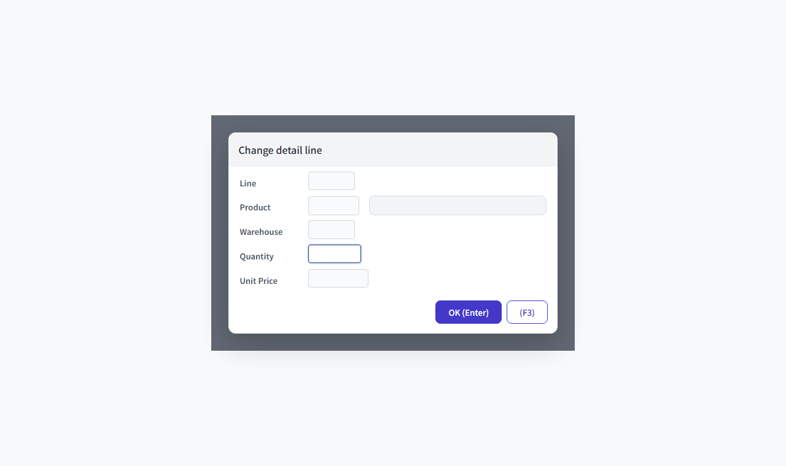

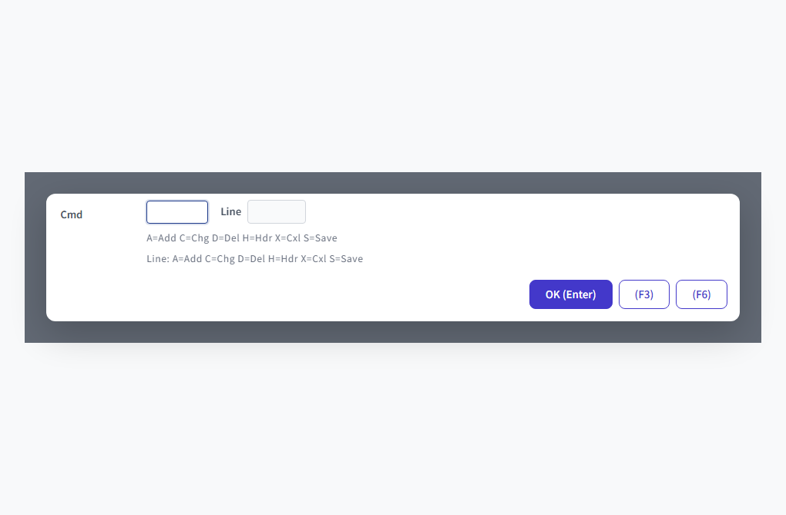

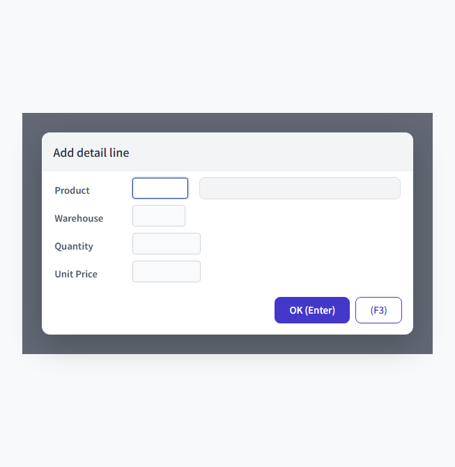

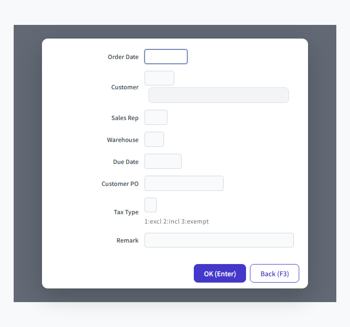

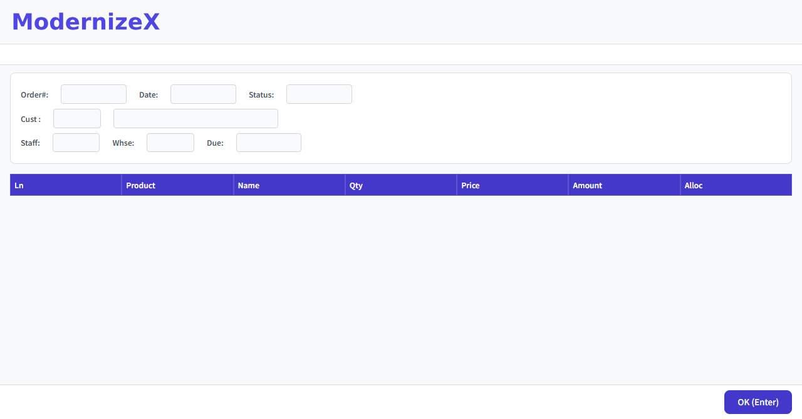

**項目詳細**

| № | コントロール名 | コントロールID | 種別 | Class／データ型 | Tab | 配置 | 文字数 | 値種別 | 初期表示 | 機能／表示データ（DBマッピング） | 取得元／条件 | 入力規則 | 備考 |
|---|---|---|---|---|---|---|---|---|---|---|---|---|---|
| **キー入力画面** ||||||||||||||
| 1 | Order Number | WK-SEL-ORD | 入力 | 9(10) | 1 | 左 | 10 | 数値 | 空 | Order Number（-） | 画面入力 | 必須／コード検証 | |
| **照会画面** ||||||||||||||
| 2 | Cmd | WK-CMD | 入力 | X(1) | 1 | 左 | 1 | 英数 | 空 | Cmd（-） | 画面入力 | 入力 | |
| 3 | Line | WK-CMD-ARG | 入力 | 9(3) | 2 | 左 | 3 | 数値 | 空 | Line（-） | 画面入力 | 必須／コード検証 | |
| 4 | Order# | OH-NO | 表示 | - | - | 左 | 10 | 英数 | 空 | Order#（受注ヘッダ(ORDHF)） | マスタ照合表示 | - | |
| 5 | Date | OH-DATE | 表示 | - | - | 左 | 10 | 英数 | 空 | Date（受注ヘッダ(ORDHF)） | マスタ照合表示 | - | |
| 6 | Status | WK-STAT-TXT | 表示 | - | - | 左 | 10 | 英数 | 空 | Status（-） | マスタ照合表示 | - | |
| 7 | Cust | OH-CUST | 表示 | - | - | 左 | 6 | 英数 | 空 | Cust（受注ヘッダ(ORDHF)） | マスタ照合表示 | - | |
| 8 | Cust | WK-CUST-NAME | 表示 | - | - | 左 | 34 | 英数 | 空 | Cust（-） | マスタ照合表示 | - | |
| 9 | Staff | OH-STAFF | 表示 | - | - | 左 | 4 | 英数 | 空 | Staff（受注ヘッダ(ORDHF)） | マスタ照合表示 | - | |
| 10 | Whse | OH-WHSE | 表示 | - | - | 左 | 3 | 英数 | 空 | Whse（受注ヘッダ(ORDHF)） | マスタ照合表示 | - | |
| 11 | Due | OH-DUE-DATE | 表示 | - | - | 左 | 10 | 英数 | 空 | Due（受注ヘッダ(ORDHF)） | マスタ照合表示 | - | |
| 12 | - | WW-LINE(1) | 表示 | - | - | 左 | 3 | 英数 | 空 | -（-） | マスタ照合表示 | - | |
| 13 | - | WW-PROD(1) | 表示 | - | - | 左 | 8 | 英数 | 空 | -（-） | マスタ照合表示 | - | |
| 14 | - | WW-NAME(1) | 表示 | - | - | 左 | 16 | 英数 | 空 | -（-） | マスタ照合表示 | - | |
| 15 | - | WW-QTY(1) | 表示 | - | - | 左 | 7 | 英数 | 空 | -（-） | マスタ照合表示 | - | |
| 16 | - | WW-PRICE(1) | 表示 | - | - | 左 | 10 | 英数 | 空 | -（-） | マスタ照合表示 | - | |
| 17 | - | WW-AMT(1) | 表示 | - | - | 左 | 12 | 英数 | 空 | -（-） | マスタ照合表示 | - | |
| 18 | - | WW-ALLOC(1) | 表示 | - | - | 左 | 7 | 英数 | 空 | -（-） | マスタ照合表示 | - | |
| 19 | - | WW-LINE(2) | 表示 | - | - | 左 | 3 | 英数 | 空 | -（-） | マスタ照合表示 | - | |
| 20 | - | WW-PROD(2) | 表示 | - | - | 左 | 8 | 英数 | 空 | -（-） | マスタ照合表示 | - | |
| 21 | - | WW-NAME(2) | 表示 | - | - | 左 | 16 | 英数 | 空 | -（-） | マスタ照合表示 | - | |
| 22 | - | WW-QTY(2) | 表示 | - | - | 左 | 7 | 英数 | 空 | -（-） | マスタ照合表示 | - | |
| 23 | - | WW-PRICE(2) | 表示 | - | - | 左 | 10 | 英数 | 空 | -（-） | マスタ照合表示 | - | |
| 24 | - | WW-AMT(2) | 表示 | - | - | 左 | 12 | 英数 | 空 | -（-） | マスタ照合表示 | - | |
| 25 | - | WW-ALLOC(2) | 表示 | - | - | 左 | 7 | 英数 | 空 | -（-） | マスタ照合表示 | - | |
| 26 | - | WW-LINE(3) | 表示 | - | - | 左 | 3 | 英数 | 空 | -（-） | マスタ照合表示 | - | |
| 27 | - | WW-PROD(3) | 表示 | - | - | 左 | 8 | 英数 | 空 | -（-） | マスタ照合表示 | - | |
| 28 | - | WW-NAME(3) | 表示 | - | - | 左 | 16 | 英数 | 空 | -（-） | マスタ照合表示 | - | |
| 29 | - | WW-QTY(3) | 表示 | - | - | 左 | 7 | 英数 | 空 | -（-） | マスタ照合表示 | - | |
| 30 | - | WW-PRICE(3) | 表示 | - | - | 左 | 10 | 英数 | 空 | -（-） | マスタ照合表示 | - | |
| 31 | - | WW-AMT(3) | 表示 | - | - | 左 | 12 | 英数 | 空 | -（-） | マスタ照合表示 | - | |
| 32 | - | WW-ALLOC(3) | 表示 | - | - | 左 | 7 | 英数 | 空 | -（-） | マスタ照合表示 | - | |
| 33 | - | WW-LINE(4) | 表示 | - | - | 左 | 3 | 英数 | 空 | -（-） | マスタ照合表示 | - | |
| 34 | - | WW-PROD(4) | 表示 | - | - | 左 | 8 | 英数 | 空 | -（-） | マスタ照合表示 | - | |
| 35 | - | WW-NAME(4) | 表示 | - | - | 左 | 16 | 英数 | 空 | -（-） | マスタ照合表示 | - | |
| 36 | - | WW-QTY(4) | 表示 | - | - | 左 | 7 | 英数 | 空 | -（-） | マスタ照合表示 | - | |
| 37 | - | WW-PRICE(4) | 表示 | - | - | 左 | 10 | 英数 | 空 | -（-） | マスタ照合表示 | - | |
| 38 | - | WW-AMT(4) | 表示 | - | - | 左 | 12 | 英数 | 空 | -（-） | マスタ照合表示 | - | |
| 39 | - | WW-ALLOC(4) | 表示 | - | - | 左 | 7 | 英数 | 空 | -（-） | マスタ照合表示 | - | |
| 40 | - | WW-LINE(5) | 表示 | - | - | 左 | 3 | 英数 | 空 | -（-） | マスタ照合表示 | - | |
| 41 | - | WW-PROD(5) | 表示 | - | - | 左 | 8 | 英数 | 空 | -（-） | マスタ照合表示 | - | |
| 42 | - | WW-NAME(5) | 表示 | - | - | 左 | 16 | 英数 | 空 | -（-） | マスタ照合表示 | - | |
| 43 | - | WW-QTY(5) | 表示 | - | - | 左 | 7 | 英数 | 空 | -（-） | マスタ照合表示 | - | |
| 44 | - | WW-PRICE(5) | 表示 | - | - | 左 | 10 | 英数 | 空 | -（-） | マスタ照合表示 | - | |
| 45 | - | WW-AMT(5) | 表示 | - | - | 左 | 12 | 英数 | 空 | -（-） | マスタ照合表示 | - | |
| 46 | - | WW-ALLOC(5) | 表示 | - | - | 左 | 7 | 英数 | 空 | -（-） | マスタ照合表示 | - | |
| 47 | - | WW-LINE(6) | 表示 | - | - | 左 | 3 | 英数 | 空 | -（-） | マスタ照合表示 | - | |
| 48 | - | WW-PROD(6) | 表示 | - | - | 左 | 8 | 英数 | 空 | -（-） | マスタ照合表示 | - | |
| 49 | - | WW-NAME(6) | 表示 | - | - | 左 | 16 | 英数 | 空 | -（-） | マスタ照合表示 | - | |
| 50 | - | WW-QTY(6) | 表示 | - | - | 左 | 7 | 英数 | 空 | -（-） | マスタ照合表示 | - | |
| 51 | - | WW-PRICE(6) | 表示 | - | - | 左 | 10 | 英数 | 空 | -（-） | マスタ照合表示 | - | |
| 52 | - | WW-AMT(6) | 表示 | - | - | 左 | 12 | 英数 | 空 | -（-） | マスタ照合表示 | - | |
| 53 | - | WW-ALLOC(6) | 表示 | - | - | 左 | 7 | 英数 | 空 | -（-） | マスタ照合表示 | - | |
| 54 | - | WW-LINE(7) | 表示 | - | - | 左 | 3 | 英数 | 空 | -（-） | マスタ照合表示 | - | |
| 55 | - | WW-PROD(7) | 表示 | - | - | 左 | 8 | 英数 | 空 | -（-） | マスタ照合表示 | - | |
| 56 | - | WW-NAME(7) | 表示 | - | - | 左 | 16 | 英数 | 空 | -（-） | マスタ照合表示 | - | |
| 57 | - | WW-QTY(7) | 表示 | - | - | 左 | 7 | 英数 | 空 | -（-） | マスタ照合表示 | - | |
| 58 | - | WW-PRICE(7) | 表示 | - | - | 左 | 10 | 英数 | 空 | -（-） | マスタ照合表示 | - | |
| 59 | - | WW-AMT(7) | 表示 | - | - | 左 | 12 | 英数 | 空 | -（-） | マスタ照合表示 | - | |
| 60 | - | WW-ALLOC(7) | 表示 | - | - | 左 | 7 | 英数 | 空 | -（-） | マスタ照合表示 | - | |
| 61 | - | WW-LINE(8) | 表示 | - | - | 左 | 3 | 英数 | 空 | -（-） | マスタ照合表示 | - | |
| 62 | - | WW-PROD(8) | 表示 | - | - | 左 | 8 | 英数 | 空 | -（-） | マスタ照合表示 | - | |
| 63 | - | WW-NAME(8) | 表示 | - | - | 左 | 16 | 英数 | 空 | -（-） | マスタ照合表示 | - | |
| 64 | - | WW-QTY(8) | 表示 | - | - | 左 | 7 | 英数 | 空 | -（-） | マスタ照合表示 | - | |
| 65 | - | WW-PRICE(8) | 表示 | - | - | 左 | 10 | 英数 | 空 | -（-） | マスタ照合表示 | - | |
| 66 | - | WW-AMT(8) | 表示 | - | - | 左 | 12 | 英数 | 空 | -（-） | マスタ照合表示 | - | |
| 67 | - | WW-ALLOC(8) | 表示 | - | - | 左 | 7 | 英数 | 空 | -（-） | マスタ照合表示 | - | |
| 68 | - | WW-LINE(9) | 表示 | - | - | 左 | 3 | 英数 | 空 | -（-） | マスタ照合表示 | - | |
| 69 | - | WW-PROD(9) | 表示 | - | - | 左 | 8 | 英数 | 空 | -（-） | マスタ照合表示 | - | |
| 70 | - | WW-NAME(9) | 表示 | - | - | 左 | 16 | 英数 | 空 | -（-） | マスタ照合表示 | - | |
| 71 | - | WW-QTY(9) | 表示 | - | - | 左 | 7 | 英数 | 空 | -（-） | マスタ照合表示 | - | |
| 72 | - | WW-PRICE(9) | 表示 | - | - | 左 | 10 | 英数 | 空 | -（-） | マスタ照合表示 | - | |
| 73 | - | WW-AMT(9) | 表示 | - | - | 左 | 12 | 英数 | 空 | -（-） | マスタ照合表示 | - | |
| 74 | - | WW-ALLOC(9) | 表示 | - | - | 左 | 7 | 英数 | 空 | -（-） | マスタ照合表示 | - | |
| 75 | - | WW-LINE(10) | 表示 | - | - | 左 | 3 | 英数 | 空 | -（-） | マスタ照合表示 | - | |
| 76 | - | WW-PROD(10) | 表示 | - | - | 左 | 8 | 英数 | 空 | -（-） | マスタ照合表示 | - | |
| 77 | - | WW-NAME(10) | 表示 | - | - | 左 | 16 | 英数 | 空 | -（-） | マスタ照合表示 | - | |
| 78 | - | WW-QTY(10) | 表示 | - | - | 左 | 7 | 英数 | 空 | -（-） | マスタ照合表示 | - | |
| 79 | - | WW-PRICE(10) | 表示 | - | - | 左 | 10 | 英数 | 空 | -（-） | マスタ照合表示 | - | |
| 80 | - | WW-AMT(10) | 表示 | - | - | 左 | 12 | 英数 | 空 | -（-） | マスタ照合表示 | - | |
| 81 | - | WW-ALLOC(10) | 表示 | - | - | 左 | 7 | 英数 | 空 | -（-） | マスタ照合表示 | - | |
| 82 | Net | WK-NET-TOTAL | 表示 | - | - | 左 | 15 | 英数 | 空 | Net（-） | マスタ照合表示 | - | |
| 83 | Tax | WK-TAX-TOTAL | 表示 | - | - | 左 | 11 | 英数 | 空 | Tax（-） | マスタ照合表示 | - | |
| 84 | Total | WK-GRS-TOTAL | 表示 | - | - | 左 | 15 | 英数 | 空 | Total（-） | マスタ照合表示 | - | |
| 85 | Lines | WK-DCNT | 表示 | - | - | 左 | 3 | 英数 | 空 | Lines（-） | マスタ照合表示 | - | |
| 86 | Page | WK-PAGE-NO | 表示 | - | - | 左 | 3 | 英数 | 空 | Page（-） | マスタ照合表示 | - | |
| 87 | / | WK-PAGE-CNT | 表示 | - | - | 左 | 3 | 英数 | 空 | /（-） | マスタ照合表示 | - | |
| **受注編集画面** ||||||||||||||
| 88 | Order Date | OH-DATE | 入力 | 9(8) | 1 | 左 | 8 | 数値 | 空 | Order Date（受注ヘッダ(ORDHF)） | 画面入力 | 必須／コード検証 | |
| 89 | Customer | OH-CUST | 入力 | 9(6) | 2 | 左 | 6 | 数値 | 空 | Customer（受注ヘッダ(ORDHF)） | 画面入力 | 必須／コード検証 | |
| 90 | Sales Rep | OH-STAFF | 入力 | 9(4) | 3 | 左 | 4 | 数値 | 空 | Sales Rep（受注ヘッダ(ORDHF)） | 画面入力 | 必須／コード検証 | |
| 91 | Warehouse | OH-WHSE | 入力 | 9(3) | 4 | 左 | 3 | 数値 | 空 | Warehouse（受注ヘッダ(ORDHF)） | 画面入力 | 必須／コード検証 | |
| 92 | Due Date | OH-DUE-DATE | 入力 | 9(8) | 5 | 左 | 8 | 数値 | 空 | Due Date（受注ヘッダ(ORDHF)） | 画面入力 | 必須／コード検証 | |
| 93 | Customer PO | OH-CUST-PO | 入力 | X(20) | 6 | 左 | 20 | 英数 | 空 | Customer PO（受注ヘッダ(ORDHF)） | 画面入力 | 入力 | |
| 94 | Tax Type | OH-TAX-TYPE | 入力 | 9(1) | 7 | 左 | 1 | 数値 | 空 | Tax Type（受注ヘッダ(ORDHF)） | 画面入力 | 必須／コード検証 | |
| 95 | Remark | OH-REMARK | 入力 | X(40) | 8 | 左 | 40 | 英数 | 空 | Remark（受注ヘッダ(ORDHF)） | 画面入力 | 入力 | |
| 96 | Product | WK-D-PROD | 入力 | 9(8) | 9 | 左 | 8 | 数値 | 空 | Product（-） | 画面入力 | 必須／コード検証 | |
| 97 | Warehouse | WK-D-WHSE | 入力 | 9(3) | 10 | 左 | 3 | 数値 | 空 | Warehouse（-） | 画面入力 | 必須／コード検証 | |
| 98 | Quantity | WK-D-QTY | 入力 | S9(9) | 11 | 左 | 9 | 数値 | 空 | Quantity（-） | 画面入力 | 必須／コード検証 | |
| 99 | Unit Price | WK-D-PRICE | 入力 | S9(9)V9(2) | 12 | 左 | 11 | 数値 | 空 | Unit Price（-） | 画面入力 | 必須／コード検証 | |
| 100 | Confirm (Y/N) | WK-CONFIRM | 入力 | X(1) | 13 | 左 | 1 | 英数 | 空 | Confirm (Y/N)（-） | 画面入力 | 入力 | |
| 101 | Customer | WK-CUST-NAME | 表示 | - | - | 左 | 40 | 英数 | 空 | Customer（-） | マスタ照合表示 | - | |
| 102 | Product | WK-D-NAME | 表示 | - | - | 左 | 40 | 英数 | 空 | Product（-） | マスタ照合表示 | - | |
| **明細変更画面** ||||||||||||||
| 103 | Quantity | WK-D-QTY | 入力 | S9(9) | 1 | 左 | 9 | 数値 | 空 | Quantity（-） | 画面入力 | 必須／コード検証 | |
| 104 | Unit Price | WK-D-PRICE | 入力 | S9(9)V9(2) | 2 | 左 | 11 | 数値 | 空 | Unit Price（-） | 画面入力 | 必須／コード検証 | |
| 105 | Line | WK-CMD-ARG | 表示 | - | - | 左 | 3 | 英数 | 空 | Line（-） | マスタ照合表示 | - | |
| 106 | Product | WK-D-PROD | 表示 | - | - | 左 | 8 | 英数 | 空 | Product（-） | マスタ照合表示 | - | |
| 107 | Product | WK-D-NAME | 表示 | - | - | 左 | 40 | 英数 | 空 | Product（-） | マスタ照合表示 | - | |
| 108 | Warehouse | WK-D-WHSE | 表示 | - | - | 左 | 3 | 英数 | 空 | Warehouse（-） | マスタ照合表示 | - | |

**項目状態**

> 記号: `レ`=フォーカス｜`必`=使用可（必須）｜`略`=使用可（省略可）｜`○`=使用可｜`×`=非表示｜`□`=表示のみ

| № | コントロール名 | 初期表示 | 入力／編集 | 確認 | 参照 |
|---|---|---|---|---|---|
| **キー入力画面** ||||||
| 1 | Order Number | ○ | 必 | □ | □ |
| **照会画面** ||||||
| 2 | Cmd | ○ | 必 | □ | □ |
| 3 | Line | ○ | 必 | □ | □ |
| 4 | Order# | □ | □ | □ | □ |
| 5 | Date | □ | □ | □ | □ |
| 6 | Status | □ | □ | □ | □ |
| 7 | Cust | □ | □ | □ | □ |
| 8 | Cust | □ | □ | □ | □ |
| 9 | Staff | □ | □ | □ | □ |
| 10 | Whse | □ | □ | □ | □ |
| 11 | Due | □ | □ | □ | □ |
| 12 | - | □ | □ | □ | □ |
| 13 | - | □ | □ | □ | □ |
| 14 | - | □ | □ | □ | □ |
| 15 | - | □ | □ | □ | □ |
| 16 | - | □ | □ | □ | □ |
| 17 | - | □ | □ | □ | □ |
| 18 | - | □ | □ | □ | □ |
| 19 | - | □ | □ | □ | □ |
| 20 | - | □ | □ | □ | □ |
| 21 | - | □ | □ | □ | □ |
| 22 | - | □ | □ | □ | □ |
| 23 | - | □ | □ | □ | □ |
| 24 | - | □ | □ | □ | □ |
| 25 | - | □ | □ | □ | □ |
| 26 | - | □ | □ | □ | □ |
| 27 | - | □ | □ | □ | □ |
| 28 | - | □ | □ | □ | □ |
| 29 | - | □ | □ | □ | □ |
| 30 | - | □ | □ | □ | □ |
| 31 | - | □ | □ | □ | □ |
| 32 | - | □ | □ | □ | □ |
| 33 | - | □ | □ | □ | □ |
| 34 | - | □ | □ | □ | □ |
| 35 | - | □ | □ | □ | □ |
| 36 | - | □ | □ | □ | □ |
| 37 | - | □ | □ | □ | □ |
| 38 | - | □ | □ | □ | □ |
| 39 | - | □ | □ | □ | □ |
| 40 | - | □ | □ | □ | □ |
| 41 | - | □ | □ | □ | □ |
| 42 | - | □ | □ | □ | □ |
| 43 | - | □ | □ | □ | □ |
| 44 | - | □ | □ | □ | □ |
| 45 | - | □ | □ | □ | □ |
| 46 | - | □ | □ | □ | □ |
| 47 | - | □ | □ | □ | □ |
| 48 | - | □ | □ | □ | □ |
| 49 | - | □ | □ | □ | □ |
| 50 | - | □ | □ | □ | □ |
| 51 | - | □ | □ | □ | □ |
| 52 | - | □ | □ | □ | □ |
| 53 | - | □ | □ | □ | □ |
| 54 | - | □ | □ | □ | □ |
| 55 | - | □ | □ | □ | □ |
| 56 | - | □ | □ | □ | □ |
| 57 | - | □ | □ | □ | □ |
| 58 | - | □ | □ | □ | □ |
| 59 | - | □ | □ | □ | □ |
| 60 | - | □ | □ | □ | □ |
| 61 | - | □ | □ | □ | □ |
| 62 | - | □ | □ | □ | □ |
| 63 | - | □ | □ | □ | □ |
| 64 | - | □ | □ | □ | □ |
| 65 | - | □ | □ | □ | □ |
| 66 | - | □ | □ | □ | □ |
| 67 | - | □ | □ | □ | □ |
| 68 | - | □ | □ | □ | □ |
| 69 | - | □ | □ | □ | □ |
| 70 | - | □ | □ | □ | □ |
| 71 | - | □ | □ | □ | □ |
| 72 | - | □ | □ | □ | □ |
| 73 | - | □ | □ | □ | □ |
| 74 | - | □ | □ | □ | □ |
| 75 | - | □ | □ | □ | □ |
| 76 | - | □ | □ | □ | □ |
| 77 | - | □ | □ | □ | □ |
| 78 | - | □ | □ | □ | □ |
| 79 | - | □ | □ | □ | □ |
| 80 | - | □ | □ | □ | □ |
| 81 | - | □ | □ | □ | □ |
| 82 | Net | □ | □ | □ | □ |
| 83 | Tax | □ | □ | □ | □ |
| 84 | Total | □ | □ | □ | □ |
| 85 | Lines | □ | □ | □ | □ |
| 86 | Page | □ | □ | □ | □ |
| 87 | / | □ | □ | □ | □ |
| **受注編集画面** ||||||
| 88 | Order Date | ○ | 必 | □ | □ |
| 89 | Customer | ○ | 必 | □ | □ |
| 90 | Sales Rep | ○ | 必 | □ | □ |
| 91 | Warehouse | ○ | 必 | □ | □ |
| 92 | Due Date | ○ | 必 | □ | □ |
| 93 | Customer PO | ○ | 必 | □ | □ |
| 94 | Tax Type | ○ | 必 | □ | □ |
| 95 | Remark | ○ | 必 | □ | □ |
| 96 | Product | ○ | 必 | □ | □ |
| 97 | Warehouse | ○ | 必 | □ | □ |
| 98 | Quantity | ○ | 必 | □ | □ |
| 99 | Unit Price | ○ | 必 | □ | □ |
| 100 | Confirm (Y/N) | ○ | 必 | □ | □ |
| 101 | Customer | □ | □ | □ | □ |
| 102 | Product | □ | □ | □ | □ |
| **明細変更画面** ||||||
| 103 | Quantity | ○ | 必 | □ | □ |
| 104 | Unit Price | ○ | 必 | □ | □ |
| 105 | Line | □ | □ | □ | □ |
| 106 | Product | □ | □ | □ | □ |
| 107 | Product | □ | □ | □ | □ |
| 108 | Warehouse | □ | □ | □ | □ |

### 2.18 SL0010 — 売上・請求入力

**レイアウト**

モダナイズ後の画面（Vue SFC `src/programs/sl0010/` を WebSocket ターミナルランタイムでレンダリング）。

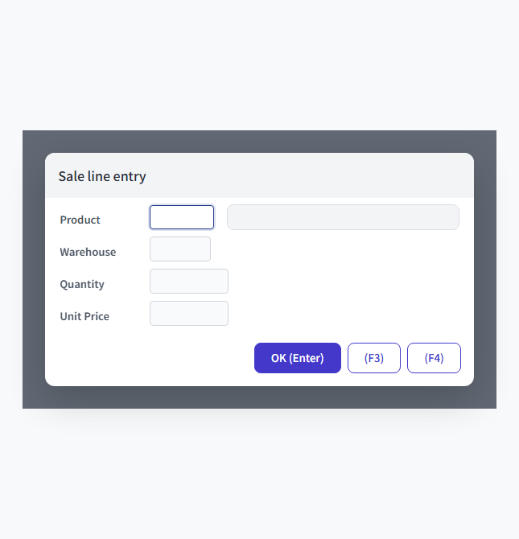

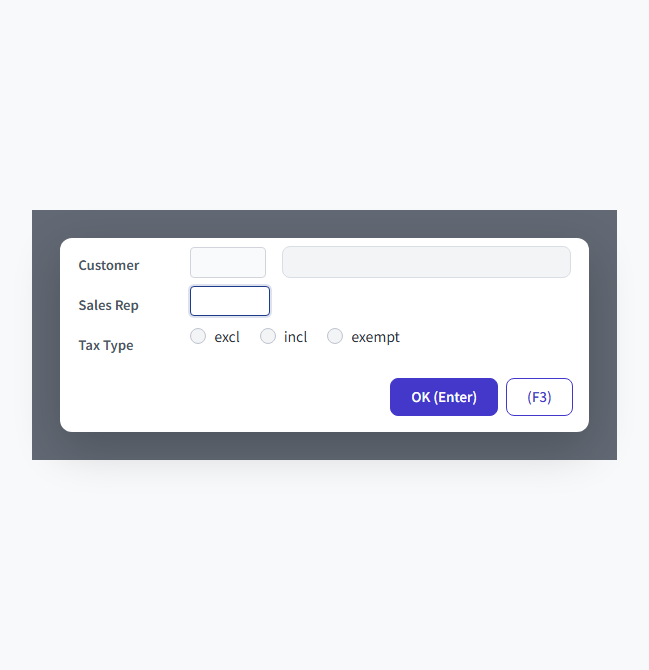

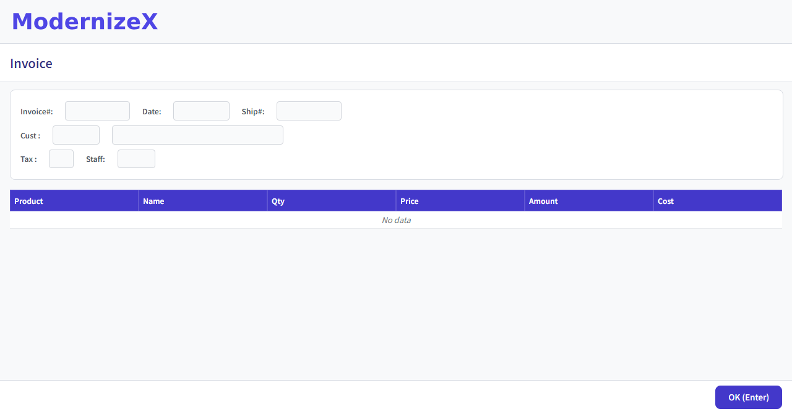

**項目詳細**

| № | コントロール名 | コントロールID | 種別 | Class／データ型 | Tab | 配置 | 文字数 | 値種別 | 初期表示 | 機能／表示データ（DBマッピング） | 取得元／条件 | 入力規則 | 備考 |
|---|---|---|---|---|---|---|---|---|---|---|---|---|---|
| **入力画面** ||||||||||||||
| 1 | Shipment No | WK-SEL-SHIP | 入力 | 9(10) | 1 | 左 | 10 | 数値 | 空 | Shipment No（-） | 画面入力 | 必須／コード検証 | |
| 2 | Customer | WK-SEL-CUST | 入力 | 9(6) | 2 | 左 | 6 | 数値 | 空 | Customer（-） | 画面入力 | 必須／コード検証 | |
| 3 | Product | WK-D-PROD | 入力 | 9(8) | 3 | 左 | 8 | 数値 | 空 | Product（-） | 画面入力 | 必須／コード検証 | |
| 4 | Warehouse | WK-D-WHSE | 入力 | 9(3) | 4 | 左 | 3 | 数値 | 空 | Warehouse（-） | 画面入力 | 必須／コード検証 | |
| 5 | Quantity | WK-D-QTY | 入力 | S9(9) | 5 | 左 | 9 | 数値 | 空 | Quantity（-） | 画面入力 | 必須／コード検証 | |
| 6 | Unit Price | WK-D-PRICE | 入力 | S9(9)V9(2) | 6 | 左 | 11 | 数値 | 空 | Unit Price（-） | 画面入力 | 必須／コード検証 | |
| 7 | Post invoice ? (Y/N) | WK-CONFIRM | 入力 | X(1) | 7 | 左 | 1 | 英数 | 空 | Post invoice ? (Y/N)（-） | 画面入力 | 入力 | |
| 8 | Customer | WK-CUST-NAME | 表示 | - | - | 左 | 40 | 英数 | 空 | Customer（-） | マスタ照合表示 | - | |
| 9 | Product | WK-D-NAME | 表示 | - | - | 左 | 40 | 英数 | 空 | Product（-） | マスタ照合表示 | - | |
| 10 | Lines | WK-DCNT | 表示 | - | - | 左 | 3 | 英数 | 空 | Lines（-） | マスタ照合表示 | - | |
| 11 | Net Total | WK-NET-TOTAL | 表示 | - | - | 左 | 15 | 英数 | 空 | Net Total（-） | マスタ照合表示 | - | |
| **照会画面** ||||||||||||||
| 12 | PFkey | WK-DUMMY | 入力 | X(1) | 1 | 左 | 1 | 英数 | 空 | PFkey（-） | 画面入力 | 入力 | |
| 13 | Invoice# | WK-INV-NO | 表示 | - | - | 左 | 10 | 英数 | 空 | Invoice#（-） | マスタ照合表示 | - | |
| 14 | Date | WK-SYSDATE | 表示 | - | - | 左 | 8 | 英数 | 空 | Date（-） | マスタ照合表示 | - | |
| 15 | Ship# | WK-SEL-SHIP | 表示 | - | - | 左 | 10 | 英数 | 空 | Ship#（-） | マスタ照合表示 | - | |
| 16 | Cust | WK-SEL-CUST | 表示 | - | - | 左 | 6 | 英数 | 空 | Cust（-） | マスタ照合表示 | - | |
| 17 | Cust | WK-CUST-NAME | 表示 | - | - | 左 | 34 | 英数 | 空 | Cust（-） | マスタ照合表示 | - | |
| 18 | Tax | WK-TAXTYPE-IN | 表示 | - | - | 左 | 1 | 英数 | 空 | Tax（-） | マスタ照合表示 | - | |
| 19 | Staff | WK-STAFF-IN | 表示 | - | - | 左 | 4 | 英数 | 空 | Staff（-） | マスタ照合表示 | - | |
| 20 | - | WW-PROD(1) | 表示 | - | - | 左 | 8 | 英数 | 空 | -（-） | マスタ照合表示 | - | |
| 21 | - | WW-NAME(1) | 表示 | - | - | 左 | 16 | 英数 | 空 | -（-） | マスタ照合表示 | - | |
| 22 | - | WW-QTY(1) | 表示 | - | - | 左 | 7 | 英数 | 空 | -（-） | マスタ照合表示 | - | |
| 23 | - | WW-PRICE(1) | 表示 | - | - | 左 | 10 | 英数 | 空 | -（-） | マスタ照合表示 | - | |
| 24 | - | WW-AMT(1) | 表示 | - | - | 左 | 12 | 英数 | 空 | -（-） | マスタ照合表示 | - | |
| 25 | - | WW-COSTAMT(1) | 表示 | - | - | 左 | 12 | 英数 | 空 | -（-） | マスタ照合表示 | - | |
| 26 | - | WW-PROD(2) | 表示 | - | - | 左 | 8 | 英数 | 空 | -（-） | マスタ照合表示 | - | |
| 27 | - | WW-NAME(2) | 表示 | - | - | 左 | 16 | 英数 | 空 | -（-） | マスタ照合表示 | - | |
| 28 | - | WW-QTY(2) | 表示 | - | - | 左 | 7 | 英数 | 空 | -（-） | マスタ照合表示 | - | |
| 29 | - | WW-PRICE(2) | 表示 | - | - | 左 | 10 | 英数 | 空 | -（-） | マスタ照合表示 | - | |
| 30 | - | WW-AMT(2) | 表示 | - | - | 左 | 12 | 英数 | 空 | -（-） | マスタ照合表示 | - | |
| 31 | - | WW-COSTAMT(2) | 表示 | - | - | 左 | 12 | 英数 | 空 | -（-） | マスタ照合表示 | - | |
| 32 | - | WW-PROD(3) | 表示 | - | - | 左 | 8 | 英数 | 空 | -（-） | マスタ照合表示 | - | |
| 33 | - | WW-NAME(3) | 表示 | - | - | 左 | 16 | 英数 | 空 | -（-） | マスタ照合表示 | - | |
| 34 | - | WW-QTY(3) | 表示 | - | - | 左 | 7 | 英数 | 空 | -（-） | マスタ照合表示 | - | |
| 35 | - | WW-PRICE(3) | 表示 | - | - | 左 | 10 | 英数 | 空 | -（-） | マスタ照合表示 | - | |
| 36 | - | WW-AMT(3) | 表示 | - | - | 左 | 12 | 英数 | 空 | -（-） | マスタ照合表示 | - | |
| 37 | - | WW-COSTAMT(3) | 表示 | - | - | 左 | 12 | 英数 | 空 | -（-） | マスタ照合表示 | - | |
| 38 | - | WW-PROD(4) | 表示 | - | - | 左 | 8 | 英数 | 空 | -（-） | マスタ照合表示 | - | |
| 39 | - | WW-NAME(4) | 表示 | - | - | 左 | 16 | 英数 | 空 | -（-） | マスタ照合表示 | - | |
| 40 | - | WW-QTY(4) | 表示 | - | - | 左 | 7 | 英数 | 空 | -（-） | マスタ照合表示 | - | |
| 41 | - | WW-PRICE(4) | 表示 | - | - | 左 | 10 | 英数 | 空 | -（-） | マスタ照合表示 | - | |
| 42 | - | WW-AMT(4) | 表示 | - | - | 左 | 12 | 英数 | 空 | -（-） | マスタ照合表示 | - | |
| 43 | - | WW-COSTAMT(4) | 表示 | - | - | 左 | 12 | 英数 | 空 | -（-） | マスタ照合表示 | - | |
| 44 | - | WW-PROD(5) | 表示 | - | - | 左 | 8 | 英数 | 空 | -（-） | マスタ照合表示 | - | |
| 45 | - | WW-NAME(5) | 表示 | - | - | 左 | 16 | 英数 | 空 | -（-） | マスタ照合表示 | - | |
| 46 | - | WW-QTY(5) | 表示 | - | - | 左 | 7 | 英数 | 空 | -（-） | マスタ照合表示 | - | |
| 47 | - | WW-PRICE(5) | 表示 | - | - | 左 | 10 | 英数 | 空 | -（-） | マスタ照合表示 | - | |
| 48 | - | WW-AMT(5) | 表示 | - | - | 左 | 12 | 英数 | 空 | -（-） | マスタ照合表示 | - | |
| 49 | - | WW-COSTAMT(5) | 表示 | - | - | 左 | 12 | 英数 | 空 | -（-） | マスタ照合表示 | - | |
| 50 | - | WW-PROD(6) | 表示 | - | - | 左 | 8 | 英数 | 空 | -（-） | マスタ照合表示 | - | |
| 51 | - | WW-NAME(6) | 表示 | - | - | 左 | 16 | 英数 | 空 | -（-） | マスタ照合表示 | - | |
| 52 | - | WW-QTY(6) | 表示 | - | - | 左 | 7 | 英数 | 空 | -（-） | マスタ照合表示 | - | |
| 53 | - | WW-PRICE(6) | 表示 | - | - | 左 | 10 | 英数 | 空 | -（-） | マスタ照合表示 | - | |
| 54 | - | WW-AMT(6) | 表示 | - | - | 左 | 12 | 英数 | 空 | -（-） | マスタ照合表示 | - | |
| 55 | - | WW-COSTAMT(6) | 表示 | - | - | 左 | 12 | 英数 | 空 | -（-） | マスタ照合表示 | - | |
| 56 | - | WW-PROD(7) | 表示 | - | - | 左 | 8 | 英数 | 空 | -（-） | マスタ照合表示 | - | |
| 57 | - | WW-NAME(7) | 表示 | - | - | 左 | 16 | 英数 | 空 | -（-） | マスタ照合表示 | - | |
| 58 | - | WW-QTY(7) | 表示 | - | - | 左 | 7 | 英数 | 空 | -（-） | マスタ照合表示 | - | |
| 59 | - | WW-PRICE(7) | 表示 | - | - | 左 | 10 | 英数 | 空 | -（-） | マスタ照合表示 | - | |
| 60 | - | WW-AMT(7) | 表示 | - | - | 左 | 12 | 英数 | 空 | -（-） | マスタ照合表示 | - | |
| 61 | - | WW-COSTAMT(7) | 表示 | - | - | 左 | 12 | 英数 | 空 | -（-） | マスタ照合表示 | - | |
| 62 | - | WW-PROD(8) | 表示 | - | - | 左 | 8 | 英数 | 空 | -（-） | マスタ照合表示 | - | |
| 63 | - | WW-NAME(8) | 表示 | - | - | 左 | 16 | 英数 | 空 | -（-） | マスタ照合表示 | - | |
| 64 | - | WW-QTY(8) | 表示 | - | - | 左 | 7 | 英数 | 空 | -（-） | マスタ照合表示 | - | |
| 65 | - | WW-PRICE(8) | 表示 | - | - | 左 | 10 | 英数 | 空 | -（-） | マスタ照合表示 | - | |
| 66 | - | WW-AMT(8) | 表示 | - | - | 左 | 12 | 英数 | 空 | -（-） | マスタ照合表示 | - | |
| 67 | - | WW-COSTAMT(8) | 表示 | - | - | 左 | 12 | 英数 | 空 | -（-） | マスタ照合表示 | - | |
| 68 | - | WW-PROD(9) | 表示 | - | - | 左 | 8 | 英数 | 空 | -（-） | マスタ照合表示 | - | |
| 69 | - | WW-NAME(9) | 表示 | - | - | 左 | 16 | 英数 | 空 | -（-） | マスタ照合表示 | - | |
| 70 | - | WW-QTY(9) | 表示 | - | - | 左 | 7 | 英数 | 空 | -（-） | マスタ照合表示 | - | |
| 71 | - | WW-PRICE(9) | 表示 | - | - | 左 | 10 | 英数 | 空 | -（-） | マスタ照合表示 | - | |
| 72 | - | WW-AMT(9) | 表示 | - | - | 左 | 12 | 英数 | 空 | -（-） | マスタ照合表示 | - | |
| 73 | - | WW-COSTAMT(9) | 表示 | - | - | 左 | 12 | 英数 | 空 | -（-） | マスタ照合表示 | - | |
| 74 | - | WW-PROD(10) | 表示 | - | - | 左 | 8 | 英数 | 空 | -（-） | マスタ照合表示 | - | |
| 75 | - | WW-NAME(10) | 表示 | - | - | 左 | 16 | 英数 | 空 | -（-） | マスタ照合表示 | - | |
| 76 | - | WW-QTY(10) | 表示 | - | - | 左 | 7 | 英数 | 空 | -（-） | マスタ照合表示 | - | |
| 77 | - | WW-PRICE(10) | 表示 | - | - | 左 | 10 | 英数 | 空 | -（-） | マスタ照合表示 | - | |
| 78 | - | WW-AMT(10) | 表示 | - | - | 左 | 12 | 英数 | 空 | -（-） | マスタ照合表示 | - | |
| 79 | - | WW-COSTAMT(10) | 表示 | - | - | 左 | 12 | 英数 | 空 | -（-） | マスタ照合表示 | - | |
| 80 | - | WW-PROD(11) | 表示 | - | - | 左 | 8 | 英数 | 空 | -（-） | マスタ照合表示 | - | |
| 81 | - | WW-NAME(11) | 表示 | - | - | 左 | 16 | 英数 | 空 | -（-） | マスタ照合表示 | - | |
| 82 | - | WW-QTY(11) | 表示 | - | - | 左 | 7 | 英数 | 空 | -（-） | マスタ照合表示 | - | |
| 83 | - | WW-PRICE(11) | 表示 | - | - | 左 | 10 | 英数 | 空 | -（-） | マスタ照合表示 | - | |
| 84 | - | WW-AMT(11) | 表示 | - | - | 左 | 12 | 英数 | 空 | -（-） | マスタ照合表示 | - | |
| 85 | - | WW-COSTAMT(11) | 表示 | - | - | 左 | 12 | 英数 | 空 | -（-） | マスタ照合表示 | - | |
| 86 | - | WW-PROD(12) | 表示 | - | - | 左 | 8 | 英数 | 空 | -（-） | マスタ照合表示 | - | |
| 87 | - | WW-NAME(12) | 表示 | - | - | 左 | 16 | 英数 | 空 | -（-） | マスタ照合表示 | - | |
| 88 | - | WW-QTY(12) | 表示 | - | - | 左 | 7 | 英数 | 空 | -（-） | マスタ照合表示 | - | |
| 89 | - | WW-PRICE(12) | 表示 | - | - | 左 | 10 | 英数 | 空 | -（-） | マスタ照合表示 | - | |
| 90 | - | WW-AMT(12) | 表示 | - | - | 左 | 12 | 英数 | 空 | -（-） | マスタ照合表示 | - | |
| 91 | - | WW-COSTAMT(12) | 表示 | - | - | 左 | 12 | 英数 | 空 | -（-） | マスタ照合表示 | - | |
| 92 | Net | WK-NET-TOTAL | 表示 | - | - | 左 | 15 | 英数 | 空 | Net（-） | マスタ照合表示 | - | |
| 93 | Tax | WK-TAX-TOTAL | 表示 | - | - | 左 | 11 | 英数 | 空 | Tax（-） | マスタ照合表示 | - | |
| 94 | Total | WK-GRS-TOTAL | 表示 | - | - | 左 | 15 | 英数 | 空 | Total（-） | マスタ照合表示 | - | |
| 95 | Cost | WK-COST-TOTAL | 表示 | - | - | 左 | 15 | 英数 | 空 | Cost（-） | マスタ照合表示 | - | |
| 96 | Page | WK-PAGE-NO | 表示 | - | - | 左 | 3 | 英数 | 空 | Page（-） | マスタ照合表示 | - | |
| 97 | / | WK-PAGE-CNT | 表示 | - | - | 左 | 3 | 英数 | 空 | /（-） | マスタ照合表示 | - | |

**項目状態**

> 記号: `レ`=フォーカス｜`必`=使用可（必須）｜`略`=使用可（省略可）｜`○`=使用可｜`×`=非表示｜`□`=表示のみ

| № | コントロール名 | 初期表示 | 入力／編集 | 確認 | 参照 |
|---|---|---|---|---|---|
| **入力画面** ||||||
| 1 | Shipment No | ○ | 必 | □ | □ |
| 2 | Customer | ○ | 必 | □ | □ |
| 3 | Product | ○ | 必 | □ | □ |
| 4 | Warehouse | ○ | 必 | □ | □ |
| 5 | Quantity | ○ | 必 | □ | □ |
| 6 | Unit Price | ○ | 必 | □ | □ |
| 7 | Post invoice ? (Y/N) | ○ | 必 | □ | □ |
| 8 | Customer | □ | □ | □ | □ |
| 9 | Product | □ | □ | □ | □ |
| 10 | Lines | □ | □ | □ | □ |
| 11 | Net Total | □ | □ | □ | □ |
| **照会画面** ||||||
| 12 | PFkey | ○ | 必 | □ | □ |
| 13 | Invoice# | □ | □ | □ | □ |
| 14 | Date | □ | □ | □ | □ |
| 15 | Ship# | □ | □ | □ | □ |
| 16 | Cust | □ | □ | □ | □ |
| 17 | Cust | □ | □ | □ | □ |
| 18 | Tax | □ | □ | □ | □ |
| 19 | Staff | □ | □ | □ | □ |
| 20 | - | □ | □ | □ | □ |
| 21 | - | □ | □ | □ | □ |
| 22 | - | □ | □ | □ | □ |
| 23 | - | □ | □ | □ | □ |
| 24 | - | □ | □ | □ | □ |
| 25 | - | □ | □ | □ | □ |
| 26 | - | □ | □ | □ | □ |
| 27 | - | □ | □ | □ | □ |
| 28 | - | □ | □ | □ | □ |
| 29 | - | □ | □ | □ | □ |
| 30 | - | □ | □ | □ | □ |
| 31 | - | □ | □ | □ | □ |
| 32 | - | □ | □ | □ | □ |
| 33 | - | □ | □ | □ | □ |
| 34 | - | □ | □ | □ | □ |
| 35 | - | □ | □ | □ | □ |
| 36 | - | □ | □ | □ | □ |
| 37 | - | □ | □ | □ | □ |
| 38 | - | □ | □ | □ | □ |
| 39 | - | □ | □ | □ | □ |
| 40 | - | □ | □ | □ | □ |
| 41 | - | □ | □ | □ | □ |
| 42 | - | □ | □ | □ | □ |
| 43 | - | □ | □ | □ | □ |
| 44 | - | □ | □ | □ | □ |
| 45 | - | □ | □ | □ | □ |
| 46 | - | □ | □ | □ | □ |
| 47 | - | □ | □ | □ | □ |
| 48 | - | □ | □ | □ | □ |
| 49 | - | □ | □ | □ | □ |
| 50 | - | □ | □ | □ | □ |
| 51 | - | □ | □ | □ | □ |
| 52 | - | □ | □ | □ | □ |
| 53 | - | □ | □ | □ | □ |
| 54 | - | □ | □ | □ | □ |
| 55 | - | □ | □ | □ | □ |
| 56 | - | □ | □ | □ | □ |
| 57 | - | □ | □ | □ | □ |
| 58 | - | □ | □ | □ | □ |
| 59 | - | □ | □ | □ | □ |
| 60 | - | □ | □ | □ | □ |
| 61 | - | □ | □ | □ | □ |
| 62 | - | □ | □ | □ | □ |
| 63 | - | □ | □ | □ | □ |
| 64 | - | □ | □ | □ | □ |
| 65 | - | □ | □ | □ | □ |
| 66 | - | □ | □ | □ | □ |
| 67 | - | □ | □ | □ | □ |
| 68 | - | □ | □ | □ | □ |
| 69 | - | □ | □ | □ | □ |
| 70 | - | □ | □ | □ | □ |
| 71 | - | □ | □ | □ | □ |
| 72 | - | □ | □ | □ | □ |
| 73 | - | □ | □ | □ | □ |
| 74 | - | □ | □ | □ | □ |
| 75 | - | □ | □ | □ | □ |
| 76 | - | □ | □ | □ | □ |
| 77 | - | □ | □ | □ | □ |
| 78 | - | □ | □ | □ | □ |
| 79 | - | □ | □ | □ | □ |
| 80 | - | □ | □ | □ | □ |
| 81 | - | □ | □ | □ | □ |
| 82 | - | □ | □ | □ | □ |
| 83 | - | □ | □ | □ | □ |
| 84 | - | □ | □ | □ | □ |
| 85 | - | □ | □ | □ | □ |
| 86 | - | □ | □ | □ | □ |
| 87 | - | □ | □ | □ | □ |
| 88 | - | □ | □ | □ | □ |
| 89 | - | □ | □ | □ | □ |
| 90 | - | □ | □ | □ | □ |
| 91 | - | □ | □ | □ | □ |
| 92 | Net | □ | □ | □ | □ |
| 93 | Tax | □ | □ | □ | □ |
| 94 | Total | □ | □ | □ | □ |
| 95 | Cost | □ | □ | □ | □ |
| 96 | Page | □ | □ | □ | □ |
| 97 | / | □ | □ | □ | □ |

### 2.19 SL0020 — 売上・請求照会

**レイアウト**

モダナイズ後の画面（Vue SFC `src/programs/sl0020/` を WebSocket ターミナルランタイムでレンダリング）。

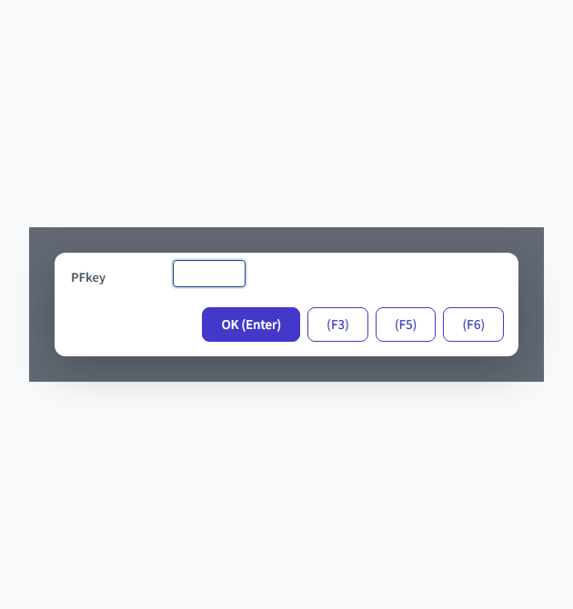

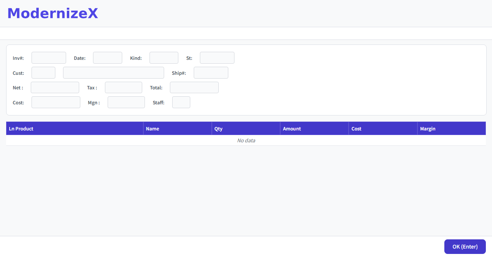

**項目詳細**

| № | コントロール名 | コントロールID | 種別 | Class／データ型 | Tab | 配置 | 文字数 | 値種別 | 初期表示 | 機能／表示データ（DBマッピング） | 取得元／条件 | 入力規則 | 備考 |
|---|---|---|---|---|---|---|---|---|---|---|---|---|---|
| **キー入力画面** ||||||||||||||
| 1 | Invoice No | WK-SEL-NO | 入力 | 9(10) | 1 | 左 | 10 | 数値 | 空 | Invoice No（-） | 画面入力 | 必須／コード検証 | |
| 2 | Customer | WK-SEL-CUST | 入力 | 9(6) | 2 | 左 | 6 | 数値 | 空 | Customer（-） | 画面入力 | 必須／コード検証 | |
| 3 | From Date | WK-SEL-DATE | 入力 | 9(8) | 3 | 左 | 8 | 数値 | 空 | From Date（-） | 画面入力 | 必須／コード検証 | |
| 4 | Customer | WK-CUST-NAME | 表示 | - | - | 左 | 40 | 英数 | 空 | Customer（-） | マスタ照合表示 | - | |
| **照会画面** ||||||||||||||
| 5 | PFkey | WK-DUMMY | 入力 | X(1) | 1 | 左 | 1 | 英数 | 空 | PFkey（-） | 画面入力 | 入力 | |
| 6 | Inv# | IH-NO | 表示 | - | - | 左 | 10 | 英数 | 空 | Inv#（売上ヘッダ(INVHF)） | マスタ照合表示 | - | |
| 7 | Date | IH-DATE | 表示 | - | - | 左 | 8 | 英数 | 空 | Date（売上ヘッダ(INVHF)） | マスタ照合表示 | - | |
| 8 | Kind | WK-KIND-TEXT | 表示 | - | - | 左 | 8 | 英数 | 空 | Kind（-） | マスタ照合表示 | - | |
| 9 | St | WK-STAT-TEXT | 表示 | - | - | 左 | 10 | 英数 | 空 | St（-） | マスタ照合表示 | - | |
| 10 | Cust | IH-CUST | 表示 | - | - | 左 | 6 | 英数 | 空 | Cust（売上ヘッダ(INVHF)） | マスタ照合表示 | - | |
| 11 | Cust | WK-CUST-NAME | 表示 | - | - | 左 | 34 | 英数 | 空 | Cust（-） | マスタ照合表示 | - | |
| 12 | Ship# | IH-SHIP-NO | 表示 | - | - | 左 | 10 | 英数 | 空 | Ship#（売上ヘッダ(INVHF)） | マスタ照合表示 | - | |
| 13 | Net | IH-AMOUNT | 表示 | - | - | 左 | 15 | 英数 | 空 | Net（売上ヘッダ(INVHF)） | マスタ照合表示 | - | |
| 14 | Tax | IH-TAX-AMOUNT | 表示 | - | - | 左 | 11 | 英数 | 空 | Tax（売上ヘッダ(INVHF)） | マスタ照合表示 | - | |
| 15 | Total | IH-TOTAL | 表示 | - | - | 左 | 15 | 英数 | 空 | Total（売上ヘッダ(INVHF)） | マスタ照合表示 | - | |
| 16 | Cost | IH-COST-TOTAL | 表示 | - | - | 左 | 15 | 英数 | 空 | Cost（売上ヘッダ(INVHF)） | マスタ照合表示 | - | |
| 17 | Mgn | WK-MARGIN-TOT | 表示 | - | - | 左 | 11 | 英数 | 空 | Mgn（-） | マスタ照合表示 | - | |
| 18 | Staff | IH-STAFF | 表示 | - | - | 左 | 4 | 英数 | 空 | Staff（売上ヘッダ(INVHF)） | マスタ照合表示 | - | |
| 19 | - | WW-LINE(1) | 表示 | - | - | 左 | 3 | 英数 | 空 | -（-） | マスタ照合表示 | - | |
| 20 | - | WW-PROD(1) | 表示 | - | - | 左 | 8 | 英数 | 空 | -（-） | マスタ照合表示 | - | |
| 21 | - | WW-NAME(1) | 表示 | - | - | 左 | 12 | 英数 | 空 | -（-） | マスタ照合表示 | - | |
| 22 | - | WW-QTY(1) | 表示 | - | - | 左 | 7 | 英数 | 空 | -（-） | マスタ照合表示 | - | |
| 23 | - | WW-AMT(1) | 表示 | - | - | 左 | 12 | 英数 | 空 | -（-） | マスタ照合表示 | - | |
| 24 | - | WW-COSTAMT(1) | 表示 | - | - | 左 | 12 | 英数 | 空 | -（-） | マスタ照合表示 | - | |
| 25 | - | WW-MARGIN(1) | 表示 | - | - | 左 | 11 | 英数 | 空 | -（-） | マスタ照合表示 | - | |
| 26 | - | WW-LINE(2) | 表示 | - | - | 左 | 3 | 英数 | 空 | -（-） | マスタ照合表示 | - | |
| 27 | - | WW-PROD(2) | 表示 | - | - | 左 | 8 | 英数 | 空 | -（-） | マスタ照合表示 | - | |
| 28 | - | WW-NAME(2) | 表示 | - | - | 左 | 12 | 英数 | 空 | -（-） | マスタ照合表示 | - | |
| 29 | - | WW-QTY(2) | 表示 | - | - | 左 | 7 | 英数 | 空 | -（-） | マスタ照合表示 | - | |
| 30 | - | WW-AMT(2) | 表示 | - | - | 左 | 12 | 英数 | 空 | -（-） | マスタ照合表示 | - | |
| 31 | - | WW-COSTAMT(2) | 表示 | - | - | 左 | 12 | 英数 | 空 | -（-） | マスタ照合表示 | - | |
| 32 | - | WW-MARGIN(2) | 表示 | - | - | 左 | 11 | 英数 | 空 | -（-） | マスタ照合表示 | - | |
| 33 | - | WW-LINE(3) | 表示 | - | - | 左 | 3 | 英数 | 空 | -（-） | マスタ照合表示 | - | |
| 34 | - | WW-PROD(3) | 表示 | - | - | 左 | 8 | 英数 | 空 | -（-） | マスタ照合表示 | - | |
| 35 | - | WW-NAME(3) | 表示 | - | - | 左 | 12 | 英数 | 空 | -（-） | マスタ照合表示 | - | |
| 36 | - | WW-QTY(3) | 表示 | - | - | 左 | 7 | 英数 | 空 | -（-） | マスタ照合表示 | - | |
| 37 | - | WW-AMT(3) | 表示 | - | - | 左 | 12 | 英数 | 空 | -（-） | マスタ照合表示 | - | |
| 38 | - | WW-COSTAMT(3) | 表示 | - | - | 左 | 12 | 英数 | 空 | -（-） | マスタ照合表示 | - | |
| 39 | - | WW-MARGIN(3) | 表示 | - | - | 左 | 11 | 英数 | 空 | -（-） | マスタ照合表示 | - | |
| 40 | - | WW-LINE(4) | 表示 | - | - | 左 | 3 | 英数 | 空 | -（-） | マスタ照合表示 | - | |
| 41 | - | WW-PROD(4) | 表示 | - | - | 左 | 8 | 英数 | 空 | -（-） | マスタ照合表示 | - | |
| 42 | - | WW-NAME(4) | 表示 | - | - | 左 | 12 | 英数 | 空 | -（-） | マスタ照合表示 | - | |
| 43 | - | WW-QTY(4) | 表示 | - | - | 左 | 7 | 英数 | 空 | -（-） | マスタ照合表示 | - | |
| 44 | - | WW-AMT(4) | 表示 | - | - | 左 | 12 | 英数 | 空 | -（-） | マスタ照合表示 | - | |
| 45 | - | WW-COSTAMT(4) | 表示 | - | - | 左 | 12 | 英数 | 空 | -（-） | マスタ照合表示 | - | |
| 46 | - | WW-MARGIN(4) | 表示 | - | - | 左 | 11 | 英数 | 空 | -（-） | マスタ照合表示 | - | |
| 47 | - | WW-LINE(5) | 表示 | - | - | 左 | 3 | 英数 | 空 | -（-） | マスタ照合表示 | - | |
| 48 | - | WW-PROD(5) | 表示 | - | - | 左 | 8 | 英数 | 空 | -（-） | マスタ照合表示 | - | |
| 49 | - | WW-NAME(5) | 表示 | - | - | 左 | 12 | 英数 | 空 | -（-） | マスタ照合表示 | - | |
| 50 | - | WW-QTY(5) | 表示 | - | - | 左 | 7 | 英数 | 空 | -（-） | マスタ照合表示 | - | |
| 51 | - | WW-AMT(5) | 表示 | - | - | 左 | 12 | 英数 | 空 | -（-） | マスタ照合表示 | - | |
| 52 | - | WW-COSTAMT(5) | 表示 | - | - | 左 | 12 | 英数 | 空 | -（-） | マスタ照合表示 | - | |
| 53 | - | WW-MARGIN(5) | 表示 | - | - | 左 | 11 | 英数 | 空 | -（-） | マスタ照合表示 | - | |
| 54 | - | WW-LINE(6) | 表示 | - | - | 左 | 3 | 英数 | 空 | -（-） | マスタ照合表示 | - | |
| 55 | - | WW-PROD(6) | 表示 | - | - | 左 | 8 | 英数 | 空 | -（-） | マスタ照合表示 | - | |
| 56 | - | WW-NAME(6) | 表示 | - | - | 左 | 12 | 英数 | 空 | -（-） | マスタ照合表示 | - | |
| 57 | - | WW-QTY(6) | 表示 | - | - | 左 | 7 | 英数 | 空 | -（-） | マスタ照合表示 | - | |
| 58 | - | WW-AMT(6) | 表示 | - | - | 左 | 12 | 英数 | 空 | -（-） | マスタ照合表示 | - | |
| 59 | - | WW-COSTAMT(6) | 表示 | - | - | 左 | 12 | 英数 | 空 | -（-） | マスタ照合表示 | - | |
| 60 | - | WW-MARGIN(6) | 表示 | - | - | 左 | 11 | 英数 | 空 | -（-） | マスタ照合表示 | - | |
| 61 | - | WW-LINE(7) | 表示 | - | - | 左 | 3 | 英数 | 空 | -（-） | マスタ照合表示 | - | |
| 62 | - | WW-PROD(7) | 表示 | - | - | 左 | 8 | 英数 | 空 | -（-） | マスタ照合表示 | - | |
| 63 | - | WW-NAME(7) | 表示 | - | - | 左 | 12 | 英数 | 空 | -（-） | マスタ照合表示 | - | |
| 64 | - | WW-QTY(7) | 表示 | - | - | 左 | 7 | 英数 | 空 | -（-） | マスタ照合表示 | - | |
| 65 | - | WW-AMT(7) | 表示 | - | - | 左 | 12 | 英数 | 空 | -（-） | マスタ照合表示 | - | |
| 66 | - | WW-COSTAMT(7) | 表示 | - | - | 左 | 12 | 英数 | 空 | -（-） | マスタ照合表示 | - | |
| 67 | - | WW-MARGIN(7) | 表示 | - | - | 左 | 11 | 英数 | 空 | -（-） | マスタ照合表示 | - | |
| 68 | - | WW-LINE(8) | 表示 | - | - | 左 | 3 | 英数 | 空 | -（-） | マスタ照合表示 | - | |
| 69 | - | WW-PROD(8) | 表示 | - | - | 左 | 8 | 英数 | 空 | -（-） | マスタ照合表示 | - | |
| 70 | - | WW-NAME(8) | 表示 | - | - | 左 | 12 | 英数 | 空 | -（-） | マスタ照合表示 | - | |
| 71 | - | WW-QTY(8) | 表示 | - | - | 左 | 7 | 英数 | 空 | -（-） | マスタ照合表示 | - | |
| 72 | - | WW-AMT(8) | 表示 | - | - | 左 | 12 | 英数 | 空 | -（-） | マスタ照合表示 | - | |
| 73 | - | WW-COSTAMT(8) | 表示 | - | - | 左 | 12 | 英数 | 空 | -（-） | マスタ照合表示 | - | |
| 74 | - | WW-MARGIN(8) | 表示 | - | - | 左 | 11 | 英数 | 空 | -（-） | マスタ照合表示 | - | |
| 75 | - | WW-LINE(9) | 表示 | - | - | 左 | 3 | 英数 | 空 | -（-） | マスタ照合表示 | - | |
| 76 | - | WW-PROD(9) | 表示 | - | - | 左 | 8 | 英数 | 空 | -（-） | マスタ照合表示 | - | |
| 77 | - | WW-NAME(9) | 表示 | - | - | 左 | 12 | 英数 | 空 | -（-） | マスタ照合表示 | - | |
| 78 | - | WW-QTY(9) | 表示 | - | - | 左 | 7 | 英数 | 空 | -（-） | マスタ照合表示 | - | |
| 79 | - | WW-AMT(9) | 表示 | - | - | 左 | 12 | 英数 | 空 | -（-） | マスタ照合表示 | - | |
| 80 | - | WW-COSTAMT(9) | 表示 | - | - | 左 | 12 | 英数 | 空 | -（-） | マスタ照合表示 | - | |
| 81 | - | WW-MARGIN(9) | 表示 | - | - | 左 | 11 | 英数 | 空 | -（-） | マスタ照合表示 | - | |
| 82 | - | WW-LINE(10) | 表示 | - | - | 左 | 3 | 英数 | 空 | -（-） | マスタ照合表示 | - | |
| 83 | - | WW-PROD(10) | 表示 | - | - | 左 | 8 | 英数 | 空 | -（-） | マスタ照合表示 | - | |
| 84 | - | WW-NAME(10) | 表示 | - | - | 左 | 12 | 英数 | 空 | -（-） | マスタ照合表示 | - | |
| 85 | - | WW-QTY(10) | 表示 | - | - | 左 | 7 | 英数 | 空 | -（-） | マスタ照合表示 | - | |
| 86 | - | WW-AMT(10) | 表示 | - | - | 左 | 12 | 英数 | 空 | -（-） | マスタ照合表示 | - | |
| 87 | - | WW-COSTAMT(10) | 表示 | - | - | 左 | 12 | 英数 | 空 | -（-） | マスタ照合表示 | - | |
| 88 | - | WW-MARGIN(10) | 表示 | - | - | 左 | 11 | 英数 | 空 | -（-） | マスタ照合表示 | - | |
| 89 | - | WW-LINE(11) | 表示 | - | - | 左 | 3 | 英数 | 空 | -（-） | マスタ照合表示 | - | |
| 90 | - | WW-PROD(11) | 表示 | - | - | 左 | 8 | 英数 | 空 | -（-） | マスタ照合表示 | - | |
| 91 | - | WW-NAME(11) | 表示 | - | - | 左 | 12 | 英数 | 空 | -（-） | マスタ照合表示 | - | |
| 92 | - | WW-QTY(11) | 表示 | - | - | 左 | 7 | 英数 | 空 | -（-） | マスタ照合表示 | - | |
| 93 | - | WW-AMT(11) | 表示 | - | - | 左 | 12 | 英数 | 空 | -（-） | マスタ照合表示 | - | |
| 94 | - | WW-COSTAMT(11) | 表示 | - | - | 左 | 12 | 英数 | 空 | -（-） | マスタ照合表示 | - | |
| 95 | - | WW-MARGIN(11) | 表示 | - | - | 左 | 11 | 英数 | 空 | -（-） | マスタ照合表示 | - | |
| 96 | Lines | WK-DCNT | 表示 | - | - | 左 | 3 | 英数 | 空 | Lines（-） | マスタ照合表示 | - | |
| 97 | Page | WK-PAGE-NO | 表示 | - | - | 左 | 3 | 英数 | 空 | Page（-） | マスタ照合表示 | - | |
| 98 | / | WK-PAGE-CNT | 表示 | - | - | 左 | 3 | 英数 | 空 | /（-） | マスタ照合表示 | - | |

**項目状態**

> 記号: `レ`=フォーカス｜`必`=使用可（必須）｜`略`=使用可（省略可）｜`○`=使用可｜`×`=非表示｜`□`=表示のみ

| № | コントロール名 | 初期表示 | 入力／編集 | 確認 | 参照 |
|---|---|---|---|---|---|
| **キー入力画面** ||||||
| 1 | Invoice No | ○ | 必 | □ | □ |
| 2 | Customer | ○ | 必 | □ | □ |
| 3 | From Date | ○ | 必 | □ | □ |
| 4 | Customer | □ | □ | □ | □ |
| **照会画面** ||||||
| 5 | PFkey | ○ | 必 | □ | □ |
| 6 | Inv# | □ | □ | □ | □ |
| 7 | Date | □ | □ | □ | □ |
| 8 | Kind | □ | □ | □ | □ |
| 9 | St | □ | □ | □ | □ |
| 10 | Cust | □ | □ | □ | □ |
| 11 | Cust | □ | □ | □ | □ |
| 12 | Ship# | □ | □ | □ | □ |
| 13 | Net | □ | □ | □ | □ |
| 14 | Tax | □ | □ | □ | □ |
| 15 | Total | □ | □ | □ | □ |
| 16 | Cost | □ | □ | □ | □ |
| 17 | Mgn | □ | □ | □ | □ |
| 18 | Staff | □ | □ | □ | □ |
| 19 | - | □ | □ | □ | □ |
| 20 | - | □ | □ | □ | □ |
| 21 | - | □ | □ | □ | □ |
| 22 | - | □ | □ | □ | □ |
| 23 | - | □ | □ | □ | □ |
| 24 | - | □ | □ | □ | □ |
| 25 | - | □ | □ | □ | □ |
| 26 | - | □ | □ | □ | □ |
| 27 | - | □ | □ | □ | □ |
| 28 | - | □ | □ | □ | □ |
| 29 | - | □ | □ | □ | □ |
| 30 | - | □ | □ | □ | □ |
| 31 | - | □ | □ | □ | □ |
| 32 | - | □ | □ | □ | □ |
| 33 | - | □ | □ | □ | □ |
| 34 | - | □ | □ | □ | □ |
| 35 | - | □ | □ | □ | □ |
| 36 | - | □ | □ | □ | □ |
| 37 | - | □ | □ | □ | □ |
| 38 | - | □ | □ | □ | □ |
| 39 | - | □ | □ | □ | □ |
| 40 | - | □ | □ | □ | □ |
| 41 | - | □ | □ | □ | □ |
| 42 | - | □ | □ | □ | □ |
| 43 | - | □ | □ | □ | □ |
| 44 | - | □ | □ | □ | □ |
| 45 | - | □ | □ | □ | □ |
| 46 | - | □ | □ | □ | □ |
| 47 | - | □ | □ | □ | □ |
| 48 | - | □ | □ | □ | □ |
| 49 | - | □ | □ | □ | □ |
| 50 | - | □ | □ | □ | □ |
| 51 | - | □ | □ | □ | □ |
| 52 | - | □ | □ | □ | □ |
| 53 | - | □ | □ | □ | □ |
| 54 | - | □ | □ | □ | □ |
| 55 | - | □ | □ | □ | □ |
| 56 | - | □ | □ | □ | □ |
| 57 | - | □ | □ | □ | □ |
| 58 | - | □ | □ | □ | □ |
| 59 | - | □ | □ | □ | □ |
| 60 | - | □ | □ | □ | □ |
| 61 | - | □ | □ | □ | □ |
| 62 | - | □ | □ | □ | □ |
| 63 | - | □ | □ | □ | □ |
| 64 | - | □ | □ | □ | □ |
| 65 | - | □ | □ | □ | □ |
| 66 | - | □ | □ | □ | □ |
| 67 | - | □ | □ | □ | □ |
| 68 | - | □ | □ | □ | □ |
| 69 | - | □ | □ | □ | □ |
| 70 | - | □ | □ | □ | □ |
| 71 | - | □ | □ | □ | □ |
| 72 | - | □ | □ | □ | □ |
| 73 | - | □ | □ | □ | □ |
| 74 | - | □ | □ | □ | □ |
| 75 | - | □ | □ | □ | □ |
| 76 | - | □ | □ | □ | □ |
| 77 | - | □ | □ | □ | □ |
| 78 | - | □ | □ | □ | □ |
| 79 | - | □ | □ | □ | □ |
| 80 | - | □ | □ | □ | □ |
| 81 | - | □ | □ | □ | □ |
| 82 | - | □ | □ | □ | □ |
| 83 | - | □ | □ | □ | □ |
| 84 | - | □ | □ | □ | □ |
| 85 | - | □ | □ | □ | □ |
| 86 | - | □ | □ | □ | □ |
| 87 | - | □ | □ | □ | □ |
| 88 | - | □ | □ | □ | □ |
| 89 | - | □ | □ | □ | □ |
| 90 | - | □ | □ | □ | □ |
| 91 | - | □ | □ | □ | □ |
| 92 | - | □ | □ | □ | □ |
| 93 | - | □ | □ | □ | □ |
| 94 | - | □ | □ | □ | □ |
| 95 | - | □ | □ | □ | □ |
| 96 | Lines | □ | □ | □ | □ |
| 97 | Page | □ | □ | □ | □ |
| 98 | / | □ | □ | □ | □ |

### 2.20 SL0030 — 売上返品入力

**レイアウト**

モダナイズ後の画面（Vue SFC `src/programs/sl0030/` を WebSocket ターミナルランタイムでレンダリング）。

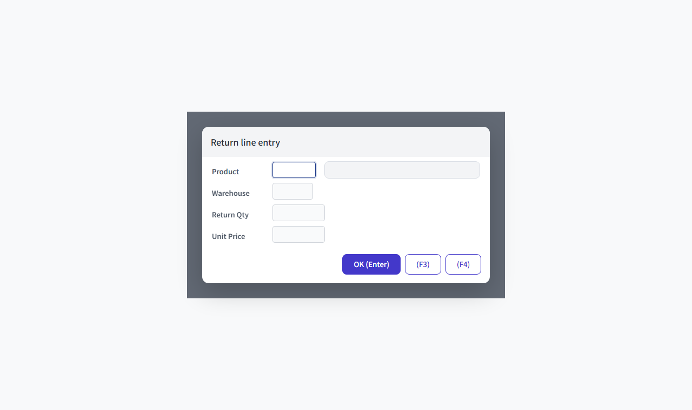

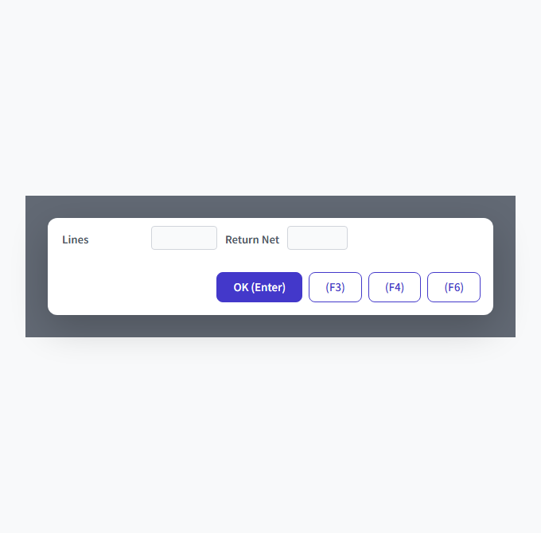

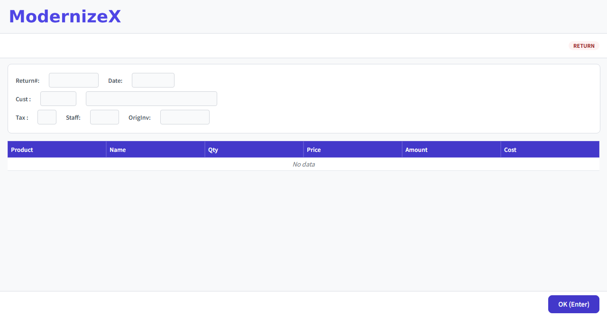

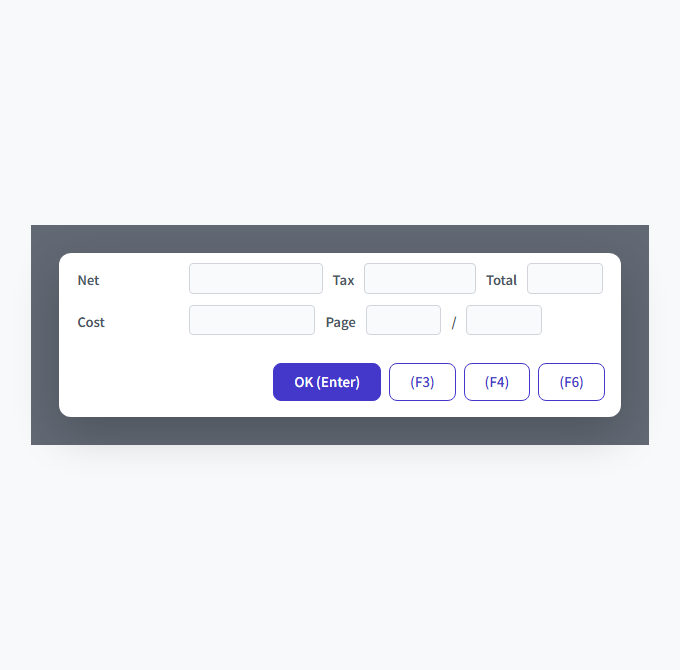

**項目詳細**

| № | コントロール名 | コントロールID | 種別 | Class／データ型 | Tab | 配置 | 文字数 | 値種別 | 初期表示 | 機能／表示データ（DBマッピング） | 取得元／条件 | 入力規則 | 備考 |
|---|---|---|---|---|---|---|---|---|---|---|---|---|---|
| **入力画面** ||||||||||||||
| 1 | Customer | WK-SEL-CUST | 入力 | 9(6) | 1 | 左 | 6 | 数値 | 空 | Customer（-） | 画面入力 | 必須／コード検証 | |
| 2 | Orig Inv# | WK-ORIG-INV | 入力 | 9(10) | 2 | 左 | 10 | 数値 | 空 | Orig Inv#（-） | 画面入力 | 必須／コード検証 | |
| 3 | Product | WK-D-PROD | 入力 | 9(8) | 3 | 左 | 8 | 数値 | 空 | Product（-） | 画面入力 | 必須／コード検証 | |
| 4 | Warehouse | WK-D-WHSE | 入力 | 9(3) | 4 | 左 | 3 | 数値 | 空 | Warehouse（-） | 画面入力 | 必須／コード検証 | |
| 5 | Return Qty | WK-D-QTY | 入力 | S9(9) | 5 | 左 | 9 | 数値 | 空 | Return Qty（-） | 画面入力 | 必須／コード検証 | |
| 6 | Unit Price | WK-D-PRICE | 入力 | S9(9)V9(2) | 6 | 左 | 11 | 数値 | 空 | Unit Price（-） | 画面入力 | 必須／コード検証 | |
| 7 | Post return ? (Y/N) | WK-CONFIRM | 入力 | X(1) | 7 | 左 | 1 | 英数 | 空 | Post return ? (Y/N)（-） | 画面入力 | 入力 | |
| 8 | Customer | WK-CUST-NAME | 表示 | - | - | 左 | 40 | 英数 | 空 | Customer（-） | マスタ照合表示 | - | |
| 9 | Product | WK-D-NAME | 表示 | - | - | 左 | 40 | 英数 | 空 | Product（-） | マスタ照合表示 | - | |
| 10 | Lines | WK-DCNT | 表示 | - | - | 左 | 3 | 英数 | 空 | Lines（-） | マスタ照合表示 | - | |
| 11 | Return Net | WK-NET-TOTAL | 表示 | - | - | 左 | 15 | 英数 | 空 | Return Net（-） | マスタ照合表示 | - | |
| **照会画面** ||||||||||||||
| 12 | PFkey | WK-DUMMY | 入力 | X(1) | 1 | 左 | 1 | 英数 | 空 | PFkey（-） | 画面入力 | 入力 | |
| 13 | Return# | WK-INV-NO | 表示 | - | - | 左 | 10 | 英数 | 空 | Return#（-） | マスタ照合表示 | - | |
| 14 | Date | WK-SYSDATE | 表示 | - | - | 左 | 8 | 英数 | 空 | Date（-） | マスタ照合表示 | - | |
| 15 | Cust | WK-SEL-CUST | 表示 | - | - | 左 | 6 | 英数 | 空 | Cust（-） | マスタ照合表示 | - | |
| 16 | Cust | WK-CUST-NAME | 表示 | - | - | 左 | 34 | 英数 | 空 | Cust（-） | マスタ照合表示 | - | |
| 17 | Tax | WK-TAXTYPE-IN | 表示 | - | - | 左 | 1 | 英数 | 空 | Tax（-） | マスタ照合表示 | - | |
| 18 | Staff | WK-STAFF-IN | 表示 | - | - | 左 | 4 | 英数 | 空 | Staff（-） | マスタ照合表示 | - | |
| 19 | OrigInv | WK-ORIG-INV | 表示 | - | - | 左 | 10 | 英数 | 空 | OrigInv（-） | マスタ照合表示 | - | |
| 20 | - | WW-PROD(1) | 表示 | - | - | 左 | 8 | 英数 | 空 | -（-） | マスタ照合表示 | - | |
| 21 | - | WW-NAME(1) | 表示 | - | - | 左 | 16 | 英数 | 空 | -（-） | マスタ照合表示 | - | |
| 22 | - | WW-QTY(1) | 表示 | - | - | 左 | 7 | 英数 | 空 | -（-） | マスタ照合表示 | - | |
| 23 | - | WW-PRICE(1) | 表示 | - | - | 左 | 10 | 英数 | 空 | -（-） | マスタ照合表示 | - | |
| 24 | - | WW-AMT(1) | 表示 | - | - | 左 | 12 | 英数 | 空 | -（-） | マスタ照合表示 | - | |
| 25 | - | WW-COSTAMT(1) | 表示 | - | - | 左 | 12 | 英数 | 空 | -（-） | マスタ照合表示 | - | |
| 26 | - | WW-PROD(2) | 表示 | - | - | 左 | 8 | 英数 | 空 | -（-） | マスタ照合表示 | - | |
| 27 | - | WW-NAME(2) | 表示 | - | - | 左 | 16 | 英数 | 空 | -（-） | マスタ照合表示 | - | |
| 28 | - | WW-QTY(2) | 表示 | - | - | 左 | 7 | 英数 | 空 | -（-） | マスタ照合表示 | - | |
| 29 | - | WW-PRICE(2) | 表示 | - | - | 左 | 10 | 英数 | 空 | -（-） | マスタ照合表示 | - | |
| 30 | - | WW-AMT(2) | 表示 | - | - | 左 | 12 | 英数 | 空 | -（-） | マスタ照合表示 | - | |
| 31 | - | WW-COSTAMT(2) | 表示 | - | - | 左 | 12 | 英数 | 空 | -（-） | マスタ照合表示 | - | |
| 32 | - | WW-PROD(3) | 表示 | - | - | 左 | 8 | 英数 | 空 | -（-） | マスタ照合表示 | - | |
| 33 | - | WW-NAME(3) | 表示 | - | - | 左 | 16 | 英数 | 空 | -（-） | マスタ照合表示 | - | |
| 34 | - | WW-QTY(3) | 表示 | - | - | 左 | 7 | 英数 | 空 | -（-） | マスタ照合表示 | - | |
| 35 | - | WW-PRICE(3) | 表示 | - | - | 左 | 10 | 英数 | 空 | -（-） | マスタ照合表示 | - | |
| 36 | - | WW-AMT(3) | 表示 | - | - | 左 | 12 | 英数 | 空 | -（-） | マスタ照合表示 | - | |
| 37 | - | WW-COSTAMT(3) | 表示 | - | - | 左 | 12 | 英数 | 空 | -（-） | マスタ照合表示 | - | |
| 38 | - | WW-PROD(4) | 表示 | - | - | 左 | 8 | 英数 | 空 | -（-） | マスタ照合表示 | - | |
| 39 | - | WW-NAME(4) | 表示 | - | - | 左 | 16 | 英数 | 空 | -（-） | マスタ照合表示 | - | |
| 40 | - | WW-QTY(4) | 表示 | - | - | 左 | 7 | 英数 | 空 | -（-） | マスタ照合表示 | - | |
| 41 | - | WW-PRICE(4) | 表示 | - | - | 左 | 10 | 英数 | 空 | -（-） | マスタ照合表示 | - | |
| 42 | - | WW-AMT(4) | 表示 | - | - | 左 | 12 | 英数 | 空 | -（-） | マスタ照合表示 | - | |
| 43 | - | WW-COSTAMT(4) | 表示 | - | - | 左 | 12 | 英数 | 空 | -（-） | マスタ照合表示 | - | |
| 44 | - | WW-PROD(5) | 表示 | - | - | 左 | 8 | 英数 | 空 | -（-） | マスタ照合表示 | - | |
| 45 | - | WW-NAME(5) | 表示 | - | - | 左 | 16 | 英数 | 空 | -（-） | マスタ照合表示 | - | |
| 46 | - | WW-QTY(5) | 表示 | - | - | 左 | 7 | 英数 | 空 | -（-） | マスタ照合表示 | - | |
| 47 | - | WW-PRICE(5) | 表示 | - | - | 左 | 10 | 英数 | 空 | -（-） | マスタ照合表示 | - | |
| 48 | - | WW-AMT(5) | 表示 | - | - | 左 | 12 | 英数 | 空 | -（-） | マスタ照合表示 | - | |
| 49 | - | WW-COSTAMT(5) | 表示 | - | - | 左 | 12 | 英数 | 空 | -（-） | マスタ照合表示 | - | |
| 50 | - | WW-PROD(6) | 表示 | - | - | 左 | 8 | 英数 | 空 | -（-） | マスタ照合表示 | - | |
| 51 | - | WW-NAME(6) | 表示 | - | - | 左 | 16 | 英数 | 空 | -（-） | マスタ照合表示 | - | |
| 52 | - | WW-QTY(6) | 表示 | - | - | 左 | 7 | 英数 | 空 | -（-） | マスタ照合表示 | - | |
| 53 | - | WW-PRICE(6) | 表示 | - | - | 左 | 10 | 英数 | 空 | -（-） | マスタ照合表示 | - | |
| 54 | - | WW-AMT(6) | 表示 | - | - | 左 | 12 | 英数 | 空 | -（-） | マスタ照合表示 | - | |
| 55 | - | WW-COSTAMT(6) | 表示 | - | - | 左 | 12 | 英数 | 空 | -（-） | マスタ照合表示 | - | |
| 56 | - | WW-PROD(7) | 表示 | - | - | 左 | 8 | 英数 | 空 | -（-） | マスタ照合表示 | - | |
| 57 | - | WW-NAME(7) | 表示 | - | - | 左 | 16 | 英数 | 空 | -（-） | マスタ照合表示 | - | |
| 58 | - | WW-QTY(7) | 表示 | - | - | 左 | 7 | 英数 | 空 | -（-） | マスタ照合表示 | - | |
| 59 | - | WW-PRICE(7) | 表示 | - | - | 左 | 10 | 英数 | 空 | -（-） | マスタ照合表示 | - | |
| 60 | - | WW-AMT(7) | 表示 | - | - | 左 | 12 | 英数 | 空 | -（-） | マスタ照合表示 | - | |
| 61 | - | WW-COSTAMT(7) | 表示 | - | - | 左 | 12 | 英数 | 空 | -（-） | マスタ照合表示 | - | |
| 62 | - | WW-PROD(8) | 表示 | - | - | 左 | 8 | 英数 | 空 | -（-） | マスタ照合表示 | - | |
| 63 | - | WW-NAME(8) | 表示 | - | - | 左 | 16 | 英数 | 空 | -（-） | マスタ照合表示 | - | |
| 64 | - | WW-QTY(8) | 表示 | - | - | 左 | 7 | 英数 | 空 | -（-） | マスタ照合表示 | - | |
| 65 | - | WW-PRICE(8) | 表示 | - | - | 左 | 10 | 英数 | 空 | -（-） | マスタ照合表示 | - | |
| 66 | - | WW-AMT(8) | 表示 | - | - | 左 | 12 | 英数 | 空 | -（-） | マスタ照合表示 | - | |
| 67 | - | WW-COSTAMT(8) | 表示 | - | - | 左 | 12 | 英数 | 空 | -（-） | マスタ照合表示 | - | |
| 68 | - | WW-PROD(9) | 表示 | - | - | 左 | 8 | 英数 | 空 | -（-） | マスタ照合表示 | - | |
| 69 | - | WW-NAME(9) | 表示 | - | - | 左 | 16 | 英数 | 空 | -（-） | マスタ照合表示 | - | |
| 70 | - | WW-QTY(9) | 表示 | - | - | 左 | 7 | 英数 | 空 | -（-） | マスタ照合表示 | - | |
| 71 | - | WW-PRICE(9) | 表示 | - | - | 左 | 10 | 英数 | 空 | -（-） | マスタ照合表示 | - | |
| 72 | - | WW-AMT(9) | 表示 | - | - | 左 | 12 | 英数 | 空 | -（-） | マスタ照合表示 | - | |
| 73 | - | WW-COSTAMT(9) | 表示 | - | - | 左 | 12 | 英数 | 空 | -（-） | マスタ照合表示 | - | |
| 74 | - | WW-PROD(10) | 表示 | - | - | 左 | 8 | 英数 | 空 | -（-） | マスタ照合表示 | - | |
| 75 | - | WW-NAME(10) | 表示 | - | - | 左 | 16 | 英数 | 空 | -（-） | マスタ照合表示 | - | |
| 76 | - | WW-QTY(10) | 表示 | - | - | 左 | 7 | 英数 | 空 | -（-） | マスタ照合表示 | - | |
| 77 | - | WW-PRICE(10) | 表示 | - | - | 左 | 10 | 英数 | 空 | -（-） | マスタ照合表示 | - | |
| 78 | - | WW-AMT(10) | 表示 | - | - | 左 | 12 | 英数 | 空 | -（-） | マスタ照合表示 | - | |
| 79 | - | WW-COSTAMT(10) | 表示 | - | - | 左 | 12 | 英数 | 空 | -（-） | マスタ照合表示 | - | |
| 80 | - | WW-PROD(11) | 表示 | - | - | 左 | 8 | 英数 | 空 | -（-） | マスタ照合表示 | - | |
| 81 | - | WW-NAME(11) | 表示 | - | - | 左 | 16 | 英数 | 空 | -（-） | マスタ照合表示 | - | |
| 82 | - | WW-QTY(11) | 表示 | - | - | 左 | 7 | 英数 | 空 | -（-） | マスタ照合表示 | - | |
| 83 | - | WW-PRICE(11) | 表示 | - | - | 左 | 10 | 英数 | 空 | -（-） | マスタ照合表示 | - | |
| 84 | - | WW-AMT(11) | 表示 | - | - | 左 | 12 | 英数 | 空 | -（-） | マスタ照合表示 | - | |
| 85 | - | WW-COSTAMT(11) | 表示 | - | - | 左 | 12 | 英数 | 空 | -（-） | マスタ照合表示 | - | |
| 86 | - | WW-PROD(12) | 表示 | - | - | 左 | 8 | 英数 | 空 | -（-） | マスタ照合表示 | - | |
| 87 | - | WW-NAME(12) | 表示 | - | - | 左 | 16 | 英数 | 空 | -（-） | マスタ照合表示 | - | |
| 88 | - | WW-QTY(12) | 表示 | - | - | 左 | 7 | 英数 | 空 | -（-） | マスタ照合表示 | - | |
| 89 | - | WW-PRICE(12) | 表示 | - | - | 左 | 10 | 英数 | 空 | -（-） | マスタ照合表示 | - | |
| 90 | - | WW-AMT(12) | 表示 | - | - | 左 | 12 | 英数 | 空 | -（-） | マスタ照合表示 | - | |
| 91 | - | WW-COSTAMT(12) | 表示 | - | - | 左 | 12 | 英数 | 空 | -（-） | マスタ照合表示 | - | |
| 92 | Net | WK-NET-TOTAL | 表示 | - | - | 左 | 15 | 英数 | 空 | Net（-） | マスタ照合表示 | - | |
| 93 | Tax | WK-TAX-TOTAL | 表示 | - | - | 左 | 11 | 英数 | 空 | Tax（-） | マスタ照合表示 | - | |
| 94 | Total | WK-GRS-TOTAL | 表示 | - | - | 左 | 15 | 英数 | 空 | Total（-） | マスタ照合表示 | - | |
| 95 | Cost | WK-COST-TOTAL | 表示 | - | - | 左 | 15 | 英数 | 空 | Cost（-） | マスタ照合表示 | - | |
| 96 | Page | WK-PAGE-NO | 表示 | - | - | 左 | 3 | 英数 | 空 | Page（-） | マスタ照合表示 | - | |
| 97 | / | WK-PAGE-CNT | 表示 | - | - | 左 | 3 | 英数 | 空 | /（-） | マスタ照合表示 | - | |

**項目状態**

> 記号: `レ`=フォーカス｜`必`=使用可（必須）｜`略`=使用可（省略可）｜`○`=使用可｜`×`=非表示｜`□`=表示のみ

| № | コントロール名 | 初期表示 | 入力／編集 | 確認 | 参照 |
|---|---|---|---|---|---|
| **入力画面** ||||||
| 1 | Customer | ○ | 必 | □ | □ |
| 2 | Orig Inv# | ○ | 必 | □ | □ |
| 3 | Product | ○ | 必 | □ | □ |
| 4 | Warehouse | ○ | 必 | □ | □ |
| 5 | Return Qty | ○ | 必 | □ | □ |
| 6 | Unit Price | ○ | 必 | □ | □ |
| 7 | Post return ? (Y/N) | ○ | 必 | □ | □ |
| 8 | Customer | □ | □ | □ | □ |
| 9 | Product | □ | □ | □ | □ |
| 10 | Lines | □ | □ | □ | □ |
| 11 | Return Net | □ | □ | □ | □ |
| **照会画面** ||||||
| 12 | PFkey | ○ | 必 | □ | □ |
| 13 | Return# | □ | □ | □ | □ |
| 14 | Date | □ | □ | □ | □ |
| 15 | Cust | □ | □ | □ | □ |
| 16 | Cust | □ | □ | □ | □ |
| 17 | Tax | □ | □ | □ | □ |
| 18 | Staff | □ | □ | □ | □ |
| 19 | OrigInv | □ | □ | □ | □ |
| 20 | - | □ | □ | □ | □ |
| 21 | - | □ | □ | □ | □ |
| 22 | - | □ | □ | □ | □ |
| 23 | - | □ | □ | □ | □ |
| 24 | - | □ | □ | □ | □ |
| 25 | - | □ | □ | □ | □ |
| 26 | - | □ | □ | □ | □ |
| 27 | - | □ | □ | □ | □ |
| 28 | - | □ | □ | □ | □ |
| 29 | - | □ | □ | □ | □ |
| 30 | - | □ | □ | □ | □ |
| 31 | - | □ | □ | □ | □ |
| 32 | - | □ | □ | □ | □ |
| 33 | - | □ | □ | □ | □ |
| 34 | - | □ | □ | □ | □ |
| 35 | - | □ | □ | □ | □ |
| 36 | - | □ | □ | □ | □ |
| 37 | - | □ | □ | □ | □ |
| 38 | - | □ | □ | □ | □ |
| 39 | - | □ | □ | □ | □ |
| 40 | - | □ | □ | □ | □ |
| 41 | - | □ | □ | □ | □ |
| 42 | - | □ | □ | □ | □ |
| 43 | - | □ | □ | □ | □ |
| 44 | - | □ | □ | □ | □ |
| 45 | - | □ | □ | □ | □ |
| 46 | - | □ | □ | □ | □ |
| 47 | - | □ | □ | □ | □ |
| 48 | - | □ | □ | □ | □ |
| 49 | - | □ | □ | □ | □ |
| 50 | - | □ | □ | □ | □ |
| 51 | - | □ | □ | □ | □ |
| 52 | - | □ | □ | □ | □ |
| 53 | - | □ | □ | □ | □ |
| 54 | - | □ | □ | □ | □ |
| 55 | - | □ | □ | □ | □ |
| 56 | - | □ | □ | □ | □ |
| 57 | - | □ | □ | □ | □ |
| 58 | - | □ | □ | □ | □ |
| 59 | - | □ | □ | □ | □ |
| 60 | - | □ | □ | □ | □ |
| 61 | - | □ | □ | □ | □ |
| 62 | - | □ | □ | □ | □ |
| 63 | - | □ | □ | □ | □ |
| 64 | - | □ | □ | □ | □ |
| 65 | - | □ | □ | □ | □ |
| 66 | - | □ | □ | □ | □ |
| 67 | - | □ | □ | □ | □ |
| 68 | - | □ | □ | □ | □ |
| 69 | - | □ | □ | □ | □ |
| 70 | - | □ | □ | □ | □ |
| 71 | - | □ | □ | □ | □ |
| 72 | - | □ | □ | □ | □ |
| 73 | - | □ | □ | □ | □ |
| 74 | - | □ | □ | □ | □ |
| 75 | - | □ | □ | □ | □ |
| 76 | - | □ | □ | □ | □ |
| 77 | - | □ | □ | □ | □ |
| 78 | - | □ | □ | □ | □ |
| 79 | - | □ | □ | □ | □ |
| 80 | - | □ | □ | □ | □ |
| 81 | - | □ | □ | □ | □ |
| 82 | - | □ | □ | □ | □ |
| 83 | - | □ | □ | □ | □ |
| 84 | - | □ | □ | □ | □ |
| 85 | - | □ | □ | □ | □ |
| 86 | - | □ | □ | □ | □ |
| 87 | - | □ | □ | □ | □ |
| 88 | - | □ | □ | □ | □ |
| 89 | - | □ | □ | □ | □ |
| 90 | - | □ | □ | □ | □ |
| 91 | - | □ | □ | □ | □ |
| 92 | Net | □ | □ | □ | □ |
| 93 | Tax | □ | □ | □ | □ |
| 94 | Total | □ | □ | □ | □ |
| 95 | Cost | □ | □ | □ | □ |
| 96 | Page | □ | □ | □ | □ |
| 97 | / | □ | □ | □ | □ |

### 2.21 SL0040 — 売上クレジットノート

**レイアウト**

モダナイズ後の画面（Vue SFC `src/programs/sl0040/` を WebSocket ターミナルランタイムでレンダリング）。

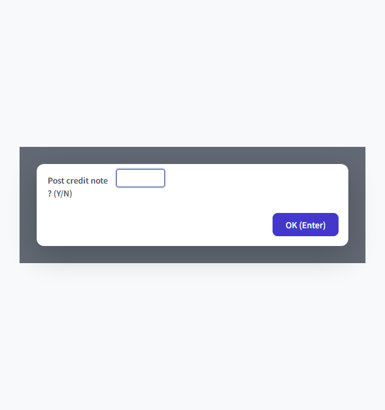

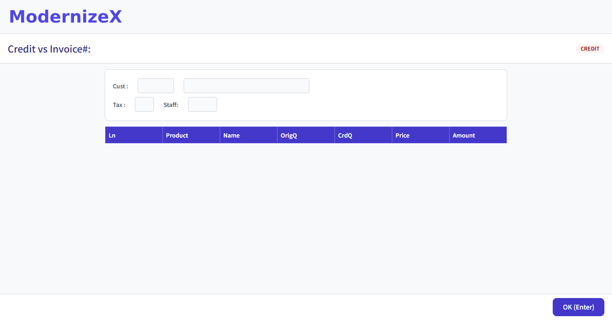

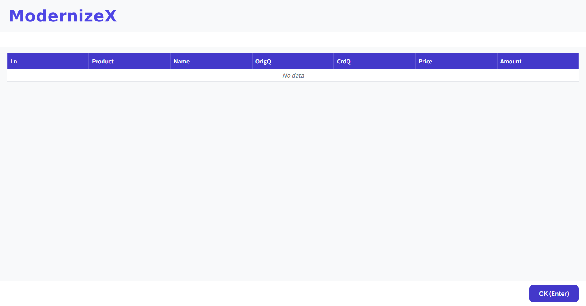

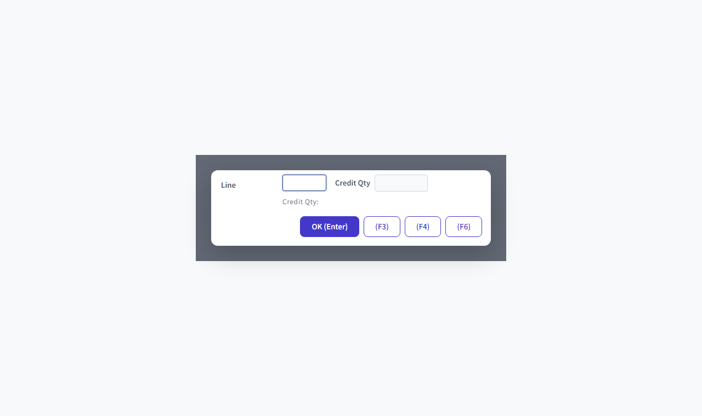

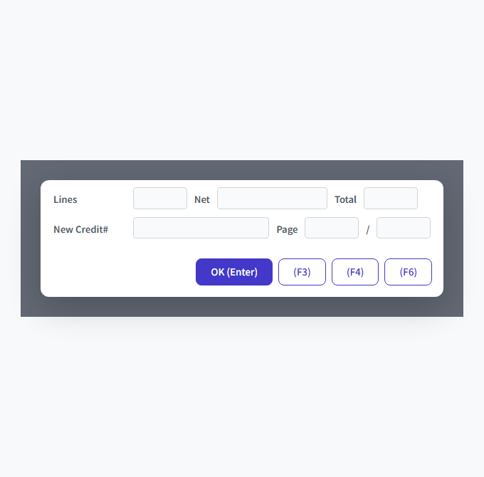

**項目詳細**

| № | コントロール名 | コントロールID | 種別 | Class／データ型 | Tab | 配置 | 文字数 | 値種別 | 初期表示 | 機能／表示データ（DBマッピング） | 取得元／条件 | 入力規則 | 備考 |
|---|---|---|---|---|---|---|---|---|---|---|---|---|---|
| **キー入力画面** ||||||||||||||
| 1 | Original Invoice# | WK-ORIG-INV | 入力 | 9(10) | 1 | 左 | 10 | 数値 | 空 | Original Invoice#（-） | 画面入力 | 必須／コード検証 | |
| **ピッキング画面** ||||||||||||||
| 2 | Line | WK-PICK-LINE | 入力 | 9(3) | 1 | 左 | 3 | 数値 | 空 | Line（-） | 画面入力 | 必須／コード検証 | |
| 3 | Credit Qty | WK-PICK-QTY | 入力 | S9(9) | 2 | 左 | 9 | 数値 | 空 | Credit Qty（-） | 画面入力 | 必須／コード検証 | |
| 4 | Post credit note ? (Y/N) | WK-CONFIRM | 入力 | X(1) | 3 | 左 | 1 | 英数 | 空 | Post credit note ? (Y/N)（-） | 画面入力 | 入力 | |
| 5 | Credit vs Invoice# | WK-ORIG-INV | 表示 | - | - | 左 | 10 | 英数 | 空 | Credit vs Invoice#（-） | マスタ照合表示 | - | |
| 6 | Cust | WK-SEL-CUST | 表示 | - | - | 左 | 6 | 英数 | 空 | Cust（-） | マスタ照合表示 | - | |
| 7 | Cust | WK-CUST-NAME | 表示 | - | - | 左 | 34 | 英数 | 空 | Cust（-） | マスタ照合表示 | - | |
| 8 | Tax | WK-TAXTYPE-IN | 表示 | - | - | 左 | 1 | 英数 | 空 | Tax（-） | マスタ照合表示 | - | |
| 9 | Staff | WK-STAFF-IN | 表示 | - | - | 左 | 4 | 英数 | 空 | Staff（-） | マスタ照合表示 | - | |
| 10 | - | WW-LINE(1) | 表示 | - | - | 左 | 3 | 英数 | 空 | -（-） | マスタ照合表示 | - | |
| 11 | - | WW-PROD(1) | 表示 | - | - | 左 | 8 | 英数 | 空 | -（-） | マスタ照合表示 | - | |
| 12 | - | WW-NAME(1) | 表示 | - | - | 左 | 16 | 英数 | 空 | -（-） | マスタ照合表示 | - | |
| 13 | - | WW-OQTY(1) | 表示 | - | - | 左 | 7 | 英数 | 空 | -（-） | マスタ照合表示 | - | |
| 14 | - | WW-CQTY(1) | 表示 | - | - | 左 | 7 | 英数 | 空 | -（-） | マスタ照合表示 | - | |
| 15 | - | WW-PRICE(1) | 表示 | - | - | 左 | 10 | 英数 | 空 | -（-） | マスタ照合表示 | - | |
| 16 | - | WW-AMT(1) | 表示 | - | - | 左 | 12 | 英数 | 空 | -（-） | マスタ照合表示 | - | |
| 17 | - | WW-LINE(2) | 表示 | - | - | 左 | 3 | 英数 | 空 | -（-） | マスタ照合表示 | - | |
| 18 | - | WW-PROD(2) | 表示 | - | - | 左 | 8 | 英数 | 空 | -（-） | マスタ照合表示 | - | |
| 19 | - | WW-NAME(2) | 表示 | - | - | 左 | 16 | 英数 | 空 | -（-） | マスタ照合表示 | - | |
| 20 | - | WW-OQTY(2) | 表示 | - | - | 左 | 7 | 英数 | 空 | -（-） | マスタ照合表示 | - | |
| 21 | - | WW-CQTY(2) | 表示 | - | - | 左 | 7 | 英数 | 空 | -（-） | マスタ照合表示 | - | |
| 22 | - | WW-PRICE(2) | 表示 | - | - | 左 | 10 | 英数 | 空 | -（-） | マスタ照合表示 | - | |
| 23 | - | WW-AMT(2) | 表示 | - | - | 左 | 12 | 英数 | 空 | -（-） | マスタ照合表示 | - | |
| 24 | - | WW-LINE(3) | 表示 | - | - | 左 | 3 | 英数 | 空 | -（-） | マスタ照合表示 | - | |
| 25 | - | WW-PROD(3) | 表示 | - | - | 左 | 8 | 英数 | 空 | -（-） | マスタ照合表示 | - | |
| 26 | - | WW-NAME(3) | 表示 | - | - | 左 | 16 | 英数 | 空 | -（-） | マスタ照合表示 | - | |
| 27 | - | WW-OQTY(3) | 表示 | - | - | 左 | 7 | 英数 | 空 | -（-） | マスタ照合表示 | - | |
| 28 | - | WW-CQTY(3) | 表示 | - | - | 左 | 7 | 英数 | 空 | -（-） | マスタ照合表示 | - | |
| 29 | - | WW-PRICE(3) | 表示 | - | - | 左 | 10 | 英数 | 空 | -（-） | マスタ照合表示 | - | |
| 30 | - | WW-AMT(3) | 表示 | - | - | 左 | 12 | 英数 | 空 | -（-） | マスタ照合表示 | - | |
| 31 | - | WW-LINE(4) | 表示 | - | - | 左 | 3 | 英数 | 空 | -（-） | マスタ照合表示 | - | |
| 32 | - | WW-PROD(4) | 表示 | - | - | 左 | 8 | 英数 | 空 | -（-） | マスタ照合表示 | - | |
| 33 | - | WW-NAME(4) | 表示 | - | - | 左 | 16 | 英数 | 空 | -（-） | マスタ照合表示 | - | |
| 34 | - | WW-OQTY(4) | 表示 | - | - | 左 | 7 | 英数 | 空 | -（-） | マスタ照合表示 | - | |
| 35 | - | WW-CQTY(4) | 表示 | - | - | 左 | 7 | 英数 | 空 | -（-） | マスタ照合表示 | - | |
| 36 | - | WW-PRICE(4) | 表示 | - | - | 左 | 10 | 英数 | 空 | -（-） | マスタ照合表示 | - | |
| 37 | - | WW-AMT(4) | 表示 | - | - | 左 | 12 | 英数 | 空 | -（-） | マスタ照合表示 | - | |
| 38 | - | WW-LINE(5) | 表示 | - | - | 左 | 3 | 英数 | 空 | -（-） | マスタ照合表示 | - | |
| 39 | - | WW-PROD(5) | 表示 | - | - | 左 | 8 | 英数 | 空 | -（-） | マスタ照合表示 | - | |
| 40 | - | WW-NAME(5) | 表示 | - | - | 左 | 16 | 英数 | 空 | -（-） | マスタ照合表示 | - | |
| 41 | - | WW-OQTY(5) | 表示 | - | - | 左 | 7 | 英数 | 空 | -（-） | マスタ照合表示 | - | |
| 42 | - | WW-CQTY(5) | 表示 | - | - | 左 | 7 | 英数 | 空 | -（-） | マスタ照合表示 | - | |
| 43 | - | WW-PRICE(5) | 表示 | - | - | 左 | 10 | 英数 | 空 | -（-） | マスタ照合表示 | - | |
| 44 | - | WW-AMT(5) | 表示 | - | - | 左 | 12 | 英数 | 空 | -（-） | マスタ照合表示 | - | |
| 45 | - | WW-LINE(6) | 表示 | - | - | 左 | 3 | 英数 | 空 | -（-） | マスタ照合表示 | - | |
| 46 | - | WW-PROD(6) | 表示 | - | - | 左 | 8 | 英数 | 空 | -（-） | マスタ照合表示 | - | |
| 47 | - | WW-NAME(6) | 表示 | - | - | 左 | 16 | 英数 | 空 | -（-） | マスタ照合表示 | - | |
| 48 | - | WW-OQTY(6) | 表示 | - | - | 左 | 7 | 英数 | 空 | -（-） | マスタ照合表示 | - | |
| 49 | - | WW-CQTY(6) | 表示 | - | - | 左 | 7 | 英数 | 空 | -（-） | マスタ照合表示 | - | |
| 50 | - | WW-PRICE(6) | 表示 | - | - | 左 | 10 | 英数 | 空 | -（-） | マスタ照合表示 | - | |
| 51 | - | WW-AMT(6) | 表示 | - | - | 左 | 12 | 英数 | 空 | -（-） | マスタ照合表示 | - | |
| 52 | - | WW-LINE(7) | 表示 | - | - | 左 | 3 | 英数 | 空 | -（-） | マスタ照合表示 | - | |
| 53 | - | WW-PROD(7) | 表示 | - | - | 左 | 8 | 英数 | 空 | -（-） | マスタ照合表示 | - | |
| 54 | - | WW-NAME(7) | 表示 | - | - | 左 | 16 | 英数 | 空 | -（-） | マスタ照合表示 | - | |
| 55 | - | WW-OQTY(7) | 表示 | - | - | 左 | 7 | 英数 | 空 | -（-） | マスタ照合表示 | - | |
| 56 | - | WW-CQTY(7) | 表示 | - | - | 左 | 7 | 英数 | 空 | -（-） | マスタ照合表示 | - | |
| 57 | - | WW-PRICE(7) | 表示 | - | - | 左 | 10 | 英数 | 空 | -（-） | マスタ照合表示 | - | |
| 58 | - | WW-AMT(7) | 表示 | - | - | 左 | 12 | 英数 | 空 | -（-） | マスタ照合表示 | - | |
| 59 | - | WW-LINE(8) | 表示 | - | - | 左 | 3 | 英数 | 空 | -（-） | マスタ照合表示 | - | |
| 60 | - | WW-PROD(8) | 表示 | - | - | 左 | 8 | 英数 | 空 | -（-） | マスタ照合表示 | - | |
| 61 | - | WW-NAME(8) | 表示 | - | - | 左 | 16 | 英数 | 空 | -（-） | マスタ照合表示 | - | |
| 62 | - | WW-OQTY(8) | 表示 | - | - | 左 | 7 | 英数 | 空 | -（-） | マスタ照合表示 | - | |
| 63 | - | WW-CQTY(8) | 表示 | - | - | 左 | 7 | 英数 | 空 | -（-） | マスタ照合表示 | - | |
| 64 | - | WW-PRICE(8) | 表示 | - | - | 左 | 10 | 英数 | 空 | -（-） | マスタ照合表示 | - | |
| 65 | - | WW-AMT(8) | 表示 | - | - | 左 | 12 | 英数 | 空 | -（-） | マスタ照合表示 | - | |
| 66 | - | WW-LINE(9) | 表示 | - | - | 左 | 3 | 英数 | 空 | -（-） | マスタ照合表示 | - | |
| 67 | - | WW-PROD(9) | 表示 | - | - | 左 | 8 | 英数 | 空 | -（-） | マスタ照合表示 | - | |
| 68 | - | WW-NAME(9) | 表示 | - | - | 左 | 16 | 英数 | 空 | -（-） | マスタ照合表示 | - | |
| 69 | - | WW-OQTY(9) | 表示 | - | - | 左 | 7 | 英数 | 空 | -（-） | マスタ照合表示 | - | |
| 70 | - | WW-CQTY(9) | 表示 | - | - | 左 | 7 | 英数 | 空 | -（-） | マスタ照合表示 | - | |
| 71 | - | WW-PRICE(9) | 表示 | - | - | 左 | 10 | 英数 | 空 | -（-） | マスタ照合表示 | - | |
| 72 | - | WW-AMT(9) | 表示 | - | - | 左 | 12 | 英数 | 空 | -（-） | マスタ照合表示 | - | |
| 73 | - | WW-LINE(10) | 表示 | - | - | 左 | 3 | 英数 | 空 | -（-） | マスタ照合表示 | - | |
| 74 | - | WW-PROD(10) | 表示 | - | - | 左 | 8 | 英数 | 空 | -（-） | マスタ照合表示 | - | |
| 75 | - | WW-NAME(10) | 表示 | - | - | 左 | 16 | 英数 | 空 | -（-） | マスタ照合表示 | - | |
| 76 | - | WW-OQTY(10) | 表示 | - | - | 左 | 7 | 英数 | 空 | -（-） | マスタ照合表示 | - | |
| 77 | - | WW-CQTY(10) | 表示 | - | - | 左 | 7 | 英数 | 空 | -（-） | マスタ照合表示 | - | |
| 78 | - | WW-PRICE(10) | 表示 | - | - | 左 | 10 | 英数 | 空 | -（-） | マスタ照合表示 | - | |
| 79 | - | WW-AMT(10) | 表示 | - | - | 左 | 12 | 英数 | 空 | -（-） | マスタ照合表示 | - | |
| 80 | Lines | WK-CR-LINES | 表示 | - | - | 左 | 3 | 英数 | 空 | Lines（-） | マスタ照合表示 | - | |
| 81 | Net | WK-NET-TOTAL | 表示 | - | - | 左 | 15 | 英数 | 空 | Net（-） | マスタ照合表示 | - | |
| 82 | Total | WK-GRS-TOTAL | 表示 | - | - | 左 | 15 | 英数 | 空 | Total（-） | マスタ照合表示 | - | |
| 83 | New Credit# | WK-INV-NO | 表示 | - | - | 左 | 10 | 英数 | 空 | New Credit#（-） | マスタ照合表示 | - | |
| 84 | Page | WK-PAGE-NO | 表示 | - | - | 左 | 3 | 英数 | 空 | Page（-） | マスタ照合表示 | - | |
| 85 | / | WK-PAGE-CNT | 表示 | - | - | 左 | 3 | 英数 | 空 | /（-） | マスタ照合表示 | - | |

**項目状態**

> 記号: `レ`=フォーカス｜`必`=使用可（必須）｜`略`=使用可（省略可）｜`○`=使用可｜`×`=非表示｜`□`=表示のみ

| № | コントロール名 | 初期表示 | 入力／編集 | 確認 | 参照 |
|---|---|---|---|---|---|
| **キー入力画面** ||||||
| 1 | Original Invoice# | ○ | 必 | □ | □ |
| **ピッキング画面** ||||||
| 2 | Line | ○ | 必 | □ | □ |
| 3 | Credit Qty | ○ | 必 | □ | □ |
| 4 | Post credit note ? (Y/N) | ○ | 必 | □ | □ |
| 5 | Credit vs Invoice# | □ | □ | □ | □ |
| 6 | Cust | □ | □ | □ | □ |
| 7 | Cust | □ | □ | □ | □ |
| 8 | Tax | □ | □ | □ | □ |
| 9 | Staff | □ | □ | □ | □ |
| 10 | - | □ | □ | □ | □ |
| 11 | - | □ | □ | □ | □ |
| 12 | - | □ | □ | □ | □ |
| 13 | - | □ | □ | □ | □ |
| 14 | - | □ | □ | □ | □ |
| 15 | - | □ | □ | □ | □ |
| 16 | - | □ | □ | □ | □ |
| 17 | - | □ | □ | □ | □ |
| 18 | - | □ | □ | □ | □ |
| 19 | - | □ | □ | □ | □ |
| 20 | - | □ | □ | □ | □ |
| 21 | - | □ | □ | □ | □ |
| 22 | - | □ | □ | □ | □ |
| 23 | - | □ | □ | □ | □ |
| 24 | - | □ | □ | □ | □ |
| 25 | - | □ | □ | □ | □ |
| 26 | - | □ | □ | □ | □ |
| 27 | - | □ | □ | □ | □ |
| 28 | - | □ | □ | □ | □ |
| 29 | - | □ | □ | □ | □ |
| 30 | - | □ | □ | □ | □ |
| 31 | - | □ | □ | □ | □ |
| 32 | - | □ | □ | □ | □ |
| 33 | - | □ | □ | □ | □ |
| 34 | - | □ | □ | □ | □ |
| 35 | - | □ | □ | □ | □ |
| 36 | - | □ | □ | □ | □ |
| 37 | - | □ | □ | □ | □ |
| 38 | - | □ | □ | □ | □ |
| 39 | - | □ | □ | □ | □ |
| 40 | - | □ | □ | □ | □ |
| 41 | - | □ | □ | □ | □ |
| 42 | - | □ | □ | □ | □ |
| 43 | - | □ | □ | □ | □ |
| 44 | - | □ | □ | □ | □ |
| 45 | - | □ | □ | □ | □ |
| 46 | - | □ | □ | □ | □ |
| 47 | - | □ | □ | □ | □ |
| 48 | - | □ | □ | □ | □ |
| 49 | - | □ | □ | □ | □ |
| 50 | - | □ | □ | □ | □ |
| 51 | - | □ | □ | □ | □ |
| 52 | - | □ | □ | □ | □ |
| 53 | - | □ | □ | □ | □ |
| 54 | - | □ | □ | □ | □ |
| 55 | - | □ | □ | □ | □ |
| 56 | - | □ | □ | □ | □ |
| 57 | - | □ | □ | □ | □ |
| 58 | - | □ | □ | □ | □ |
| 59 | - | □ | □ | □ | □ |
| 60 | - | □ | □ | □ | □ |
| 61 | - | □ | □ | □ | □ |
| 62 | - | □ | □ | □ | □ |
| 63 | - | □ | □ | □ | □ |
| 64 | - | □ | □ | □ | □ |
| 65 | - | □ | □ | □ | □ |
| 66 | - | □ | □ | □ | □ |
| 67 | - | □ | □ | □ | □ |
| 68 | - | □ | □ | □ | □ |
| 69 | - | □ | □ | □ | □ |
| 70 | - | □ | □ | □ | □ |
| 71 | - | □ | □ | □ | □ |
| 72 | - | □ | □ | □ | □ |
| 73 | - | □ | □ | □ | □ |
| 74 | - | □ | □ | □ | □ |
| 75 | - | □ | □ | □ | □ |
| 76 | - | □ | □ | □ | □ |
| 77 | - | □ | □ | □ | □ |
| 78 | - | □ | □ | □ | □ |
| 79 | - | □ | □ | □ | □ |
| 80 | Lines | □ | □ | □ | □ |
| 81 | Net | □ | □ | □ | □ |
| 82 | Total | □ | □ | □ | □ |
| 83 | New Credit# | □ | □ | □ | □ |
| 84 | Page | □ | □ | □ | □ |
| 85 | / | □ | □ | □ | □ |

### 2.22 SH0010 — 出荷入力（ピッキング／出庫）

**レイアウト**

モダナイズ後の画面（Vue SFC `src/programs/sh0010/` を WebSocket ターミナルランタイムでレンダリング）。

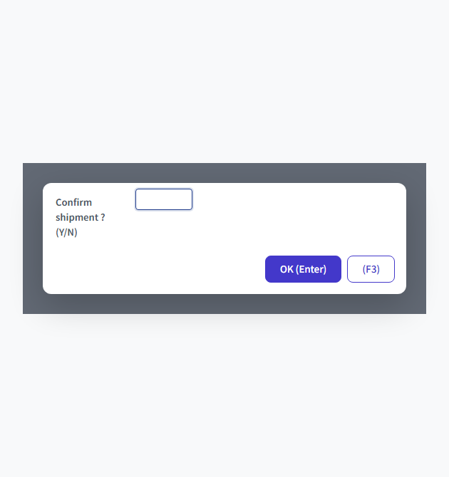

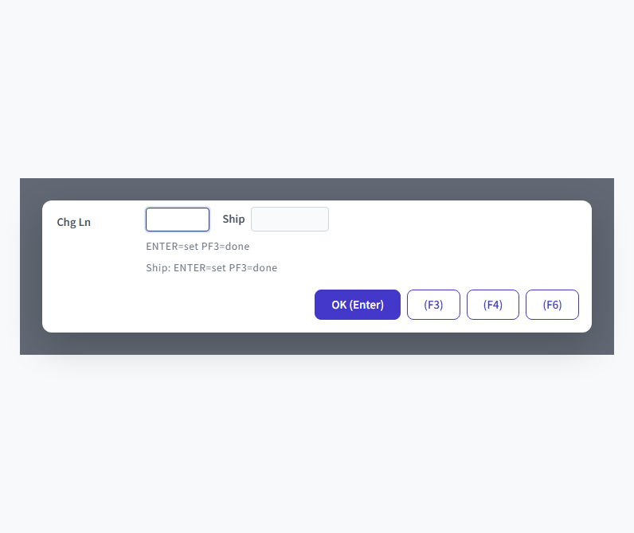

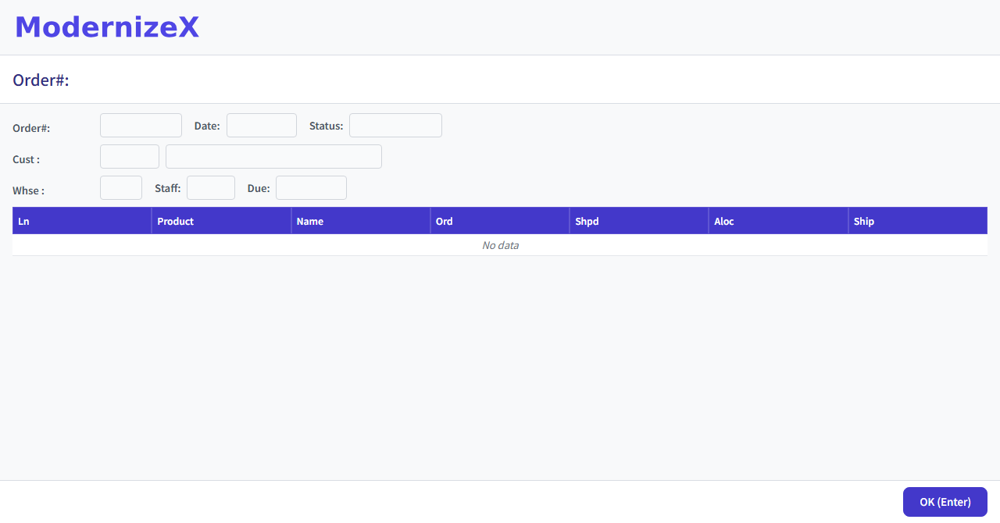

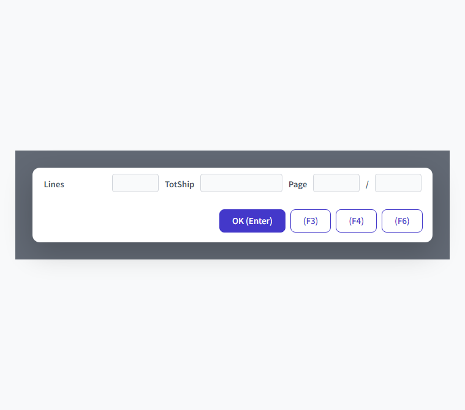

**項目詳細**

| № | コントロール名 | コントロールID | 種別 | Class／データ型 | Tab | 配置 | 文字数 | 値種別 | 初期表示 | 機能／表示データ（DBマッピング） | 取得元／条件 | 入力規則 | 備考 |
|---|---|---|---|---|---|---|---|---|---|---|---|---|---|
| **キー入力画面** ||||||||||||||
| 1 | Order No | WK-SEL-NO | 入力 | 9(10) | 1 | 左 | 10 | 数値 | 空 | Order No（-） | 画面入力 | 必須／コード検証 | |
| **出荷入力画面** ||||||||||||||
| 2 | Chg Ln | WK-EDIT-LN | 入力 | 9(3) | 1 | 左 | 3 | 数値 | 空 | Chg Ln（-） | 画面入力 | 必須／コード検証 | |
| 3 | Ship | WK-EDIT-QTY | 入力 | S9(9) | 2 | 左 | 9 | 数値 | 空 | Ship（-） | 画面入力 | 必須／コード検証 | |
| 4 | Ship | WK-CONFIRM | 入力 | X(1) | 3 | 左 | 1 | 英数 | 空 | Ship（-） | 画面入力 | 入力 | |
| 5 | Order# | OH-NO | 表示 | - | - | 左 | 10 | 英数 | 空 | Order#（受注ヘッダ(ORDHF)） | マスタ照合表示 | - | |
| 6 | Date | OH-DATE | 表示 | - | - | 左 | 8 | 英数 | 空 | Date（受注ヘッダ(ORDHF)） | マスタ照合表示 | - | |
| 7 | Status | WK-STAT-TEXT | 表示 | - | - | 左 | 12 | 英数 | 空 | Status（-） | マスタ照合表示 | - | |
| 8 | Cust | OH-CUST | 表示 | - | - | 左 | 6 | 英数 | 空 | Cust（受注ヘッダ(ORDHF)） | マスタ照合表示 | - | |
| 9 | Cust | WK-CUST-NAME | 表示 | - | - | 左 | 34 | 英数 | 空 | Cust（-） | マスタ照合表示 | - | |
| 10 | Whse | OH-WHSE | 表示 | - | - | 左 | 3 | 英数 | 空 | Whse（受注ヘッダ(ORDHF)） | マスタ照合表示 | - | |
| 11 | Staff | OH-STAFF | 表示 | - | - | 左 | 4 | 英数 | 空 | Staff（受注ヘッダ(ORDHF)） | マスタ照合表示 | - | |
| 12 | Due | OH-DUE-DATE | 表示 | - | - | 左 | 8 | 英数 | 空 | Due（受注ヘッダ(ORDHF)） | マスタ照合表示 | - | |
| 13 | - | WW-LINE(1) | 表示 | - | - | 左 | 3 | 英数 | 空 | -（-） | マスタ照合表示 | - | |
| 14 | - | WW-PROD(1) | 表示 | - | - | 左 | 8 | 英数 | 空 | -（-） | マスタ照合表示 | - | |
| 15 | - | WW-NAME(1) | 表示 | - | - | 左 | 14 | 英数 | 空 | -（-） | マスタ照合表示 | - | |
| 16 | - | WW-ORD(1) | 表示 | - | - | 左 | 7 | 英数 | 空 | -（-） | マスタ照合表示 | - | |
| 17 | - | WW-SHIPPED(1) | 表示 | - | - | 左 | 7 | 英数 | 空 | -（-） | マスタ照合表示 | - | |
| 18 | - | WW-ALLOC(1) | 表示 | - | - | 左 | 7 | 英数 | 空 | -（-） | マスタ照合表示 | - | |
| 19 | - | WW-SHIP(1) | 表示 | - | - | 左 | 7 | 英数 | 空 | -（-） | マスタ照合表示 | - | |
| 20 | - | WW-LINE(2) | 表示 | - | - | 左 | 3 | 英数 | 空 | -（-） | マスタ照合表示 | - | |
| 21 | - | WW-PROD(2) | 表示 | - | - | 左 | 8 | 英数 | 空 | -（-） | マスタ照合表示 | - | |
| 22 | - | WW-NAME(2) | 表示 | - | - | 左 | 14 | 英数 | 空 | -（-） | マスタ照合表示 | - | |
| 23 | - | WW-ORD(2) | 表示 | - | - | 左 | 7 | 英数 | 空 | -（-） | マスタ照合表示 | - | |
| 24 | - | WW-SHIPPED(2) | 表示 | - | - | 左 | 7 | 英数 | 空 | -（-） | マスタ照合表示 | - | |
| 25 | - | WW-ALLOC(2) | 表示 | - | - | 左 | 7 | 英数 | 空 | -（-） | マスタ照合表示 | - | |
| 26 | - | WW-SHIP(2) | 表示 | - | - | 左 | 7 | 英数 | 空 | -（-） | マスタ照合表示 | - | |
| 27 | - | WW-LINE(3) | 表示 | - | - | 左 | 3 | 英数 | 空 | -（-） | マスタ照合表示 | - | |
| 28 | - | WW-PROD(3) | 表示 | - | - | 左 | 8 | 英数 | 空 | -（-） | マスタ照合表示 | - | |
| 29 | - | WW-NAME(3) | 表示 | - | - | 左 | 14 | 英数 | 空 | -（-） | マスタ照合表示 | - | |
| 30 | - | WW-ORD(3) | 表示 | - | - | 左 | 7 | 英数 | 空 | -（-） | マスタ照合表示 | - | |
| 31 | - | WW-SHIPPED(3) | 表示 | - | - | 左 | 7 | 英数 | 空 | -（-） | マスタ照合表示 | - | |
| 32 | - | WW-ALLOC(3) | 表示 | - | - | 左 | 7 | 英数 | 空 | -（-） | マスタ照合表示 | - | |
| 33 | - | WW-SHIP(3) | 表示 | - | - | 左 | 7 | 英数 | 空 | -（-） | マスタ照合表示 | - | |
| 34 | - | WW-LINE(4) | 表示 | - | - | 左 | 3 | 英数 | 空 | -（-） | マスタ照合表示 | - | |
| 35 | - | WW-PROD(4) | 表示 | - | - | 左 | 8 | 英数 | 空 | -（-） | マスタ照合表示 | - | |
| 36 | - | WW-NAME(4) | 表示 | - | - | 左 | 14 | 英数 | 空 | -（-） | マスタ照合表示 | - | |
| 37 | - | WW-ORD(4) | 表示 | - | - | 左 | 7 | 英数 | 空 | -（-） | マスタ照合表示 | - | |
| 38 | - | WW-SHIPPED(4) | 表示 | - | - | 左 | 7 | 英数 | 空 | -（-） | マスタ照合表示 | - | |
| 39 | - | WW-ALLOC(4) | 表示 | - | - | 左 | 7 | 英数 | 空 | -（-） | マスタ照合表示 | - | |
| 40 | - | WW-SHIP(4) | 表示 | - | - | 左 | 7 | 英数 | 空 | -（-） | マスタ照合表示 | - | |
| 41 | - | WW-LINE(5) | 表示 | - | - | 左 | 3 | 英数 | 空 | -（-） | マスタ照合表示 | - | |
| 42 | - | WW-PROD(5) | 表示 | - | - | 左 | 8 | 英数 | 空 | -（-） | マスタ照合表示 | - | |
| 43 | - | WW-NAME(5) | 表示 | - | - | 左 | 14 | 英数 | 空 | -（-） | マスタ照合表示 | - | |
| 44 | - | WW-ORD(5) | 表示 | - | - | 左 | 7 | 英数 | 空 | -（-） | マスタ照合表示 | - | |
| 45 | - | WW-SHIPPED(5) | 表示 | - | - | 左 | 7 | 英数 | 空 | -（-） | マスタ照合表示 | - | |
| 46 | - | WW-ALLOC(5) | 表示 | - | - | 左 | 7 | 英数 | 空 | -（-） | マスタ照合表示 | - | |
| 47 | - | WW-SHIP(5) | 表示 | - | - | 左 | 7 | 英数 | 空 | -（-） | マスタ照合表示 | - | |
| 48 | - | WW-LINE(6) | 表示 | - | - | 左 | 3 | 英数 | 空 | -（-） | マスタ照合表示 | - | |
| 49 | - | WW-PROD(6) | 表示 | - | - | 左 | 8 | 英数 | 空 | -（-） | マスタ照合表示 | - | |
| 50 | - | WW-NAME(6) | 表示 | - | - | 左 | 14 | 英数 | 空 | -（-） | マスタ照合表示 | - | |
| 51 | - | WW-ORD(6) | 表示 | - | - | 左 | 7 | 英数 | 空 | -（-） | マスタ照合表示 | - | |
| 52 | - | WW-SHIPPED(6) | 表示 | - | - | 左 | 7 | 英数 | 空 | -（-） | マスタ照合表示 | - | |
| 53 | - | WW-ALLOC(6) | 表示 | - | - | 左 | 7 | 英数 | 空 | -（-） | マスタ照合表示 | - | |
| 54 | - | WW-SHIP(6) | 表示 | - | - | 左 | 7 | 英数 | 空 | -（-） | マスタ照合表示 | - | |
| 55 | - | WW-LINE(7) | 表示 | - | - | 左 | 3 | 英数 | 空 | -（-） | マスタ照合表示 | - | |
| 56 | - | WW-PROD(7) | 表示 | - | - | 左 | 8 | 英数 | 空 | -（-） | マスタ照合表示 | - | |
| 57 | - | WW-NAME(7) | 表示 | - | - | 左 | 14 | 英数 | 空 | -（-） | マスタ照合表示 | - | |
| 58 | - | WW-ORD(7) | 表示 | - | - | 左 | 7 | 英数 | 空 | -（-） | マスタ照合表示 | - | |
| 59 | - | WW-SHIPPED(7) | 表示 | - | - | 左 | 7 | 英数 | 空 | -（-） | マスタ照合表示 | - | |
| 60 | - | WW-ALLOC(7) | 表示 | - | - | 左 | 7 | 英数 | 空 | -（-） | マスタ照合表示 | - | |
| 61 | - | WW-SHIP(7) | 表示 | - | - | 左 | 7 | 英数 | 空 | -（-） | マスタ照合表示 | - | |
| 62 | - | WW-LINE(8) | 表示 | - | - | 左 | 3 | 英数 | 空 | -（-） | マスタ照合表示 | - | |
| 63 | - | WW-PROD(8) | 表示 | - | - | 左 | 8 | 英数 | 空 | -（-） | マスタ照合表示 | - | |
| 64 | - | WW-NAME(8) | 表示 | - | - | 左 | 14 | 英数 | 空 | -（-） | マスタ照合表示 | - | |
| 65 | - | WW-ORD(8) | 表示 | - | - | 左 | 7 | 英数 | 空 | -（-） | マスタ照合表示 | - | |
| 66 | - | WW-SHIPPED(8) | 表示 | - | - | 左 | 7 | 英数 | 空 | -（-） | マスタ照合表示 | - | |
| 67 | - | WW-ALLOC(8) | 表示 | - | - | 左 | 7 | 英数 | 空 | -（-） | マスタ照合表示 | - | |
| 68 | - | WW-SHIP(8) | 表示 | - | - | 左 | 7 | 英数 | 空 | -（-） | マスタ照合表示 | - | |
| 69 | - | WW-LINE(9) | 表示 | - | - | 左 | 3 | 英数 | 空 | -（-） | マスタ照合表示 | - | |
| 70 | - | WW-PROD(9) | 表示 | - | - | 左 | 8 | 英数 | 空 | -（-） | マスタ照合表示 | - | |
| 71 | - | WW-NAME(9) | 表示 | - | - | 左 | 14 | 英数 | 空 | -（-） | マスタ照合表示 | - | |
| 72 | - | WW-ORD(9) | 表示 | - | - | 左 | 7 | 英数 | 空 | -（-） | マスタ照合表示 | - | |
| 73 | - | WW-SHIPPED(9) | 表示 | - | - | 左 | 7 | 英数 | 空 | -（-） | マスタ照合表示 | - | |
| 74 | - | WW-ALLOC(9) | 表示 | - | - | 左 | 7 | 英数 | 空 | -（-） | マスタ照合表示 | - | |
| 75 | - | WW-SHIP(9) | 表示 | - | - | 左 | 7 | 英数 | 空 | -（-） | マスタ照合表示 | - | |
| 76 | - | WW-LINE(10) | 表示 | - | - | 左 | 3 | 英数 | 空 | -（-） | マスタ照合表示 | - | |
| 77 | - | WW-PROD(10) | 表示 | - | - | 左 | 8 | 英数 | 空 | -（-） | マスタ照合表示 | - | |
| 78 | - | WW-NAME(10) | 表示 | - | - | 左 | 14 | 英数 | 空 | -（-） | マスタ照合表示 | - | |
| 79 | - | WW-ORD(10) | 表示 | - | - | 左 | 7 | 英数 | 空 | -（-） | マスタ照合表示 | - | |
| 80 | - | WW-SHIPPED(10) | 表示 | - | - | 左 | 7 | 英数 | 空 | -（-） | マスタ照合表示 | - | |
| 81 | - | WW-ALLOC(10) | 表示 | - | - | 左 | 7 | 英数 | 空 | -（-） | マスタ照合表示 | - | |
| 82 | - | WW-SHIP(10) | 表示 | - | - | 左 | 7 | 英数 | 空 | -（-） | マスタ照合表示 | - | |
| 83 | - | WW-LINE(11) | 表示 | - | - | 左 | 3 | 英数 | 空 | -（-） | マスタ照合表示 | - | |
| 84 | - | WW-PROD(11) | 表示 | - | - | 左 | 8 | 英数 | 空 | -（-） | マスタ照合表示 | - | |
| 85 | - | WW-NAME(11) | 表示 | - | - | 左 | 14 | 英数 | 空 | -（-） | マスタ照合表示 | - | |
| 86 | - | WW-ORD(11) | 表示 | - | - | 左 | 7 | 英数 | 空 | -（-） | マスタ照合表示 | - | |
| 87 | - | WW-SHIPPED(11) | 表示 | - | - | 左 | 7 | 英数 | 空 | -（-） | マスタ照合表示 | - | |
| 88 | - | WW-ALLOC(11) | 表示 | - | - | 左 | 7 | 英数 | 空 | -（-） | マスタ照合表示 | - | |
| 89 | - | WW-SHIP(11) | 表示 | - | - | 左 | 7 | 英数 | 空 | -（-） | マスタ照合表示 | - | |
| 90 | - | WW-LINE(12) | 表示 | - | - | 左 | 3 | 英数 | 空 | -（-） | マスタ照合表示 | - | |
| 91 | - | WW-PROD(12) | 表示 | - | - | 左 | 8 | 英数 | 空 | -（-） | マスタ照合表示 | - | |
| 92 | - | WW-NAME(12) | 表示 | - | - | 左 | 14 | 英数 | 空 | -（-） | マスタ照合表示 | - | |
| 93 | - | WW-ORD(12) | 表示 | - | - | 左 | 7 | 英数 | 空 | -（-） | マスタ照合表示 | - | |
| 94 | - | WW-SHIPPED(12) | 表示 | - | - | 左 | 7 | 英数 | 空 | -（-） | マスタ照合表示 | - | |
| 95 | - | WW-ALLOC(12) | 表示 | - | - | 左 | 7 | 英数 | 空 | -（-） | マスタ照合表示 | - | |
| 96 | - | WW-SHIP(12) | 表示 | - | - | 左 | 7 | 英数 | 空 | -（-） | マスタ照合表示 | - | |
| 97 | - | WW-LINE(13) | 表示 | - | - | 左 | 3 | 英数 | 空 | -（-） | マスタ照合表示 | - | |
| 98 | - | WW-PROD(13) | 表示 | - | - | 左 | 8 | 英数 | 空 | -（-） | マスタ照合表示 | - | |
| 99 | - | WW-NAME(13) | 表示 | - | - | 左 | 14 | 英数 | 空 | -（-） | マスタ照合表示 | - | |
| 100 | - | WW-ORD(13) | 表示 | - | - | 左 | 7 | 英数 | 空 | -（-） | マスタ照合表示 | - | |
| 101 | - | WW-SHIPPED(13) | 表示 | - | - | 左 | 7 | 英数 | 空 | -（-） | マスタ照合表示 | - | |
| 102 | - | WW-ALLOC(13) | 表示 | - | - | 左 | 7 | 英数 | 空 | -（-） | マスタ照合表示 | - | |
| 103 | - | WW-SHIP(13) | 表示 | - | - | 左 | 7 | 英数 | 空 | -（-） | マスタ照合表示 | - | |
| 104 | Lines | WK-DCNT | 表示 | - | - | 左 | 3 | 英数 | 空 | Lines（-） | マスタ照合表示 | - | |
| 105 | TotShip | WK-TOT-SHIP | 表示 | - | - | 左 | 11 | 英数 | 空 | TotShip（-） | マスタ照合表示 | - | |
| 106 | Page | WK-PAGE-NO | 表示 | - | - | 左 | 3 | 英数 | 空 | Page（-） | マスタ照合表示 | - | |
| 107 | / | WK-PAGE-CNT | 表示 | - | - | 左 | 3 | 英数 | 空 | /（-） | マスタ照合表示 | - | |

**項目状態**

> 記号: `レ`=フォーカス｜`必`=使用可（必須）｜`略`=使用可（省略可）｜`○`=使用可｜`×`=非表示｜`□`=表示のみ

| № | コントロール名 | 初期表示 | 入力／編集 | 確認 | 参照 |
|---|---|---|---|---|---|
| **キー入力画面** ||||||
| 1 | Order No | ○ | 必 | □ | □ |
| **出荷入力画面** ||||||
| 2 | Chg Ln | ○ | 必 | □ | □ |
| 3 | Ship | ○ | 必 | □ | □ |
| 4 | Ship | ○ | 必 | □ | □ |
| 5 | Order# | □ | □ | □ | □ |
| 6 | Date | □ | □ | □ | □ |
| 7 | Status | □ | □ | □ | □ |
| 8 | Cust | □ | □ | □ | □ |
| 9 | Cust | □ | □ | □ | □ |
| 10 | Whse | □ | □ | □ | □ |
| 11 | Staff | □ | □ | □ | □ |
| 12 | Due | □ | □ | □ | □ |
| 13 | - | □ | □ | □ | □ |
| 14 | - | □ | □ | □ | □ |
| 15 | - | □ | □ | □ | □ |
| 16 | - | □ | □ | □ | □ |
| 17 | - | □ | □ | □ | □ |
| 18 | - | □ | □ | □ | □ |
| 19 | - | □ | □ | □ | □ |
| 20 | - | □ | □ | □ | □ |
| 21 | - | □ | □ | □ | □ |
| 22 | - | □ | □ | □ | □ |
| 23 | - | □ | □ | □ | □ |
| 24 | - | □ | □ | □ | □ |
| 25 | - | □ | □ | □ | □ |
| 26 | - | □ | □ | □ | □ |
| 27 | - | □ | □ | □ | □ |
| 28 | - | □ | □ | □ | □ |
| 29 | - | □ | □ | □ | □ |
| 30 | - | □ | □ | □ | □ |
| 31 | - | □ | □ | □ | □ |
| 32 | - | □ | □ | □ | □ |
| 33 | - | □ | □ | □ | □ |
| 34 | - | □ | □ | □ | □ |
| 35 | - | □ | □ | □ | □ |
| 36 | - | □ | □ | □ | □ |
| 37 | - | □ | □ | □ | □ |
| 38 | - | □ | □ | □ | □ |
| 39 | - | □ | □ | □ | □ |
| 40 | - | □ | □ | □ | □ |
| 41 | - | □ | □ | □ | □ |
| 42 | - | □ | □ | □ | □ |
| 43 | - | □ | □ | □ | □ |
| 44 | - | □ | □ | □ | □ |
| 45 | - | □ | □ | □ | □ |
| 46 | - | □ | □ | □ | □ |
| 47 | - | □ | □ | □ | □ |
| 48 | - | □ | □ | □ | □ |
| 49 | - | □ | □ | □ | □ |
| 50 | - | □ | □ | □ | □ |
| 51 | - | □ | □ | □ | □ |
| 52 | - | □ | □ | □ | □ |
| 53 | - | □ | □ | □ | □ |
| 54 | - | □ | □ | □ | □ |
| 55 | - | □ | □ | □ | □ |
| 56 | - | □ | □ | □ | □ |
| 57 | - | □ | □ | □ | □ |
| 58 | - | □ | □ | □ | □ |
| 59 | - | □ | □ | □ | □ |
| 60 | - | □ | □ | □ | □ |
| 61 | - | □ | □ | □ | □ |
| 62 | - | □ | □ | □ | □ |
| 63 | - | □ | □ | □ | □ |
| 64 | - | □ | □ | □ | □ |
| 65 | - | □ | □ | □ | □ |
| 66 | - | □ | □ | □ | □ |
| 67 | - | □ | □ | □ | □ |
| 68 | - | □ | □ | □ | □ |
| 69 | - | □ | □ | □ | □ |
| 70 | - | □ | □ | □ | □ |
| 71 | - | □ | □ | □ | □ |
| 72 | - | □ | □ | □ | □ |
| 73 | - | □ | □ | □ | □ |
| 74 | - | □ | □ | □ | □ |
| 75 | - | □ | □ | □ | □ |
| 76 | - | □ | □ | □ | □ |
| 77 | - | □ | □ | □ | □ |
| 78 | - | □ | □ | □ | □ |
| 79 | - | □ | □ | □ | □ |
| 80 | - | □ | □ | □ | □ |
| 81 | - | □ | □ | □ | □ |
| 82 | - | □ | □ | □ | □ |
| 83 | - | □ | □ | □ | □ |
| 84 | - | □ | □ | □ | □ |
| 85 | - | □ | □ | □ | □ |
| 86 | - | □ | □ | □ | □ |
| 87 | - | □ | □ | □ | □ |
| 88 | - | □ | □ | □ | □ |
| 89 | - | □ | □ | □ | □ |
| 90 | - | □ | □ | □ | □ |
| 91 | - | □ | □ | □ | □ |
| 92 | - | □ | □ | □ | □ |
| 93 | - | □ | □ | □ | □ |
| 94 | - | □ | □ | □ | □ |
| 95 | - | □ | □ | □ | □ |
| 96 | - | □ | □ | □ | □ |
| 97 | - | □ | □ | □ | □ |
| 98 | - | □ | □ | □ | □ |
| 99 | - | □ | □ | □ | □ |
| 100 | - | □ | □ | □ | □ |
| 101 | - | □ | □ | □ | □ |
| 102 | - | □ | □ | □ | □ |
| 103 | - | □ | □ | □ | □ |
| 104 | Lines | □ | □ | □ | □ |
| 105 | TotShip | □ | □ | □ | □ |
| 106 | Page | □ | □ | □ | □ |
| 107 | / | □ | □ | □ | □ |

### 2.23 PU0010 — 発注入力

**レイアウト**

モダナイズ後の画面（Vue SFC `src/programs/pu0010/` を WebSocket ターミナルランタイムでレンダリング）。

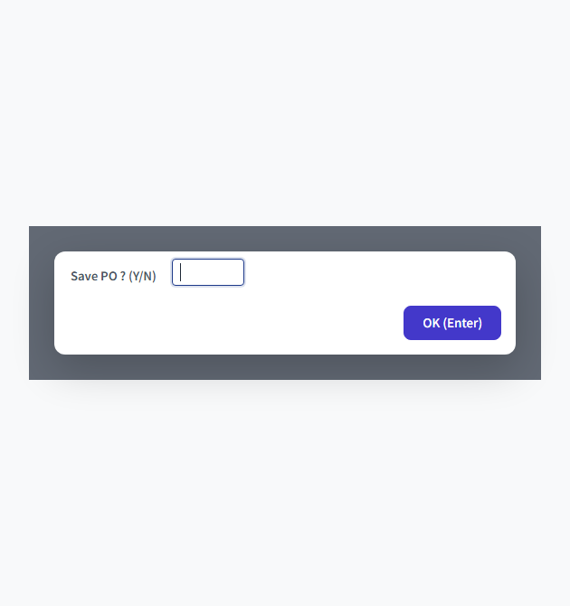

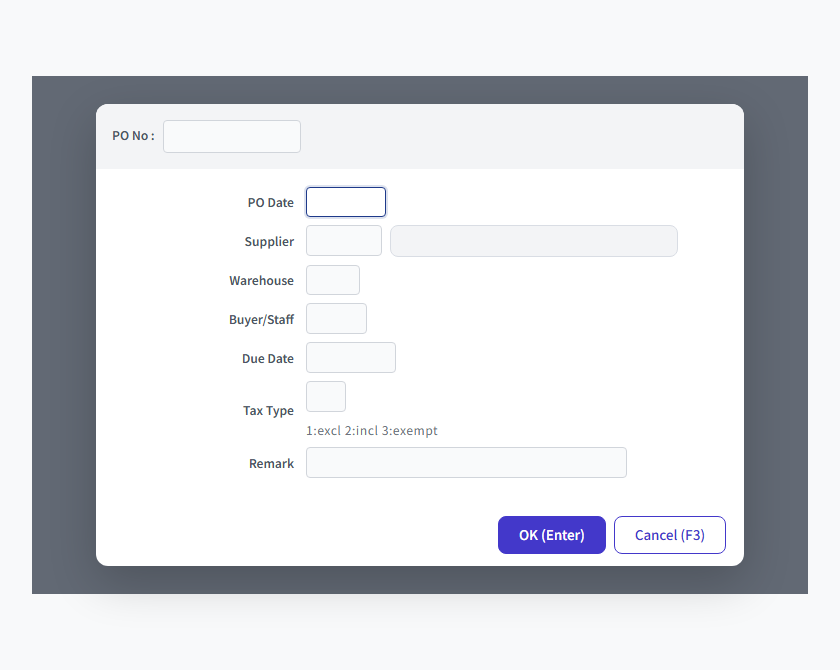

**項目詳細**

| № | コントロール名 | コントロールID | 種別 | Class／データ型 | Tab | 配置 | 文字数 | 値種別 | 初期表示 | 機能／表示データ（DBマッピング） | 取得元／条件 | 入力規則 | 備考 |
|---|---|---|---|---|---|---|---|---|---|---|---|---|---|
| **入力画面** ||||||||||||||
| 1 | PO Date | PH-DATE | 入力 | 9(8) | 1 | 左 | 8 | 数値 | 空 | PO Date（発注ヘッダ(POHF)） | 画面入力 | 必須／コード検証 | |
| 2 | Supplier | PH-SUPP | 入力 | 9(6) | 2 | 左 | 6 | 数値 | 空 | Supplier（発注ヘッダ(POHF)） | 画面入力 | 必須／コード検証 | |
| 3 | Warehouse | PH-WHSE | 入力 | 9(3) | 3 | 左 | 3 | 数値 | 空 | Warehouse（発注ヘッダ(POHF)） | 画面入力 | 必須／コード検証 | |
| 4 | Buyer/Staff | PH-STAFF | 入力 | 9(4) | 4 | 左 | 4 | 数値 | 空 | Buyer/Staff（発注ヘッダ(POHF)） | 画面入力 | 必須／コード検証 | |
| 5 | Due Date | PH-DUE-DATE | 入力 | 9(8) | 5 | 左 | 8 | 数値 | 空 | Due Date（発注ヘッダ(POHF)） | 画面入力 | 必須／コード検証 | |
| 6 | Tax Type | PH-TAX-TYPE | 入力 | 9(1) | 6 | 左 | 1 | 数値 | 空 | Tax Type（発注ヘッダ(POHF)） | 画面入力 | 必須／コード検証 | |
| 7 | Remark | PH-REMARK | 入力 | X(40) | 7 | 左 | 40 | 英数 | 空 | Remark（発注ヘッダ(POHF)） | 画面入力 | 入力 | |
| 8 | Product | WK-D-PROD | 入力 | 9(8) | 8 | 左 | 8 | 数値 | 空 | Product（-） | 画面入力 | 必須／コード検証 | |
| 9 | Warehouse | WK-D-WHSE | 入力 | 9(3) | 9 | 左 | 3 | 数値 | 空 | Warehouse（-） | 画面入力 | 必須／コード検証 | |
| 10 | Quantity | WK-D-QTY | 入力 | S9(9) | 10 | 左 | 9 | 数値 | 空 | Quantity（-） | 画面入力 | 必須／コード検証 | |
| 11 | Unit Cost | WK-D-COST | 入力 | S9(9)V9(2) | 11 | 左 | 11 | 数値 | 空 | Unit Cost（-） | 画面入力 | 必須／コード検証 | |
| 12 | Save PO ? (Y/N) | WK-CONFIRM | 入力 | X(1) | 12 | 左 | 1 | 英数 | 空 | Save PO ? (Y/N)（-） | 画面入力 | 入力 | |
| 13 | PO No | WK-PO-NO-D | 表示 | - | - | 左 | 10 | 英数 | 空 | PO No（-） | マスタ照合表示 | - | |
| 14 | Supplier | WK-SUPP-NAME | 表示 | - | - | 左 | 40 | 英数 | 空 | Supplier（-） | マスタ照合表示 | - | |
| 15 | Product | WK-D-NAME | 表示 | - | - | 左 | 40 | 英数 | 空 | Product（-） | マスタ照合表示 | - | |
| 16 | Lines | WK-LCNT | 表示 | - | - | 左 | 3 | 英数 | 空 | Lines（-） | マスタ照合表示 | - | |
| 17 | Net Total | WK-NET-TOTAL | 表示 | - | - | 左 | 15 | 英数 | 空 | Net Total（-） | マスタ照合表示 | - | |

**項目状態**

> 記号: `レ`=フォーカス｜`必`=使用可（必須）｜`略`=使用可（省略可）｜`○`=使用可｜`×`=非表示｜`□`=表示のみ

| № | コントロール名 | 初期表示 | 入力／編集 | 確認 | 参照 |
|---|---|---|---|---|---|
| **入力画面** ||||||
| 1 | PO Date | ○ | 必 | □ | □ |
| 2 | Supplier | ○ | 必 | □ | □ |
| 3 | Warehouse | ○ | 必 | □ | □ |
| 4 | Buyer/Staff | ○ | 必 | □ | □ |
| 5 | Due Date | ○ | 必 | □ | □ |
| 6 | Tax Type | ○ | 必 | □ | □ |
| 7 | Remark | ○ | 必 | □ | □ |
| 8 | Product | ○ | 必 | □ | □ |
| 9 | Warehouse | ○ | 必 | □ | □ |
| 10 | Quantity | ○ | 必 | □ | □ |
| 11 | Unit Cost | ○ | 必 | □ | □ |
| 12 | Save PO ? (Y/N) | ○ | 必 | □ | □ |
| 13 | PO No | □ | □ | □ | □ |
| 14 | Supplier | □ | □ | □ | □ |
| 15 | Product | □ | □ | □ | □ |
| 16 | Lines | □ | □ | □ | □ |
| 17 | Net Total | □ | □ | □ | □ |

### 2.24 PU0020 — 発注照会

**レイアウト**

モダナイズ後の画面（Vue SFC `src/programs/pu0020/` を WebSocket ターミナルランタイムでレンダリング）。

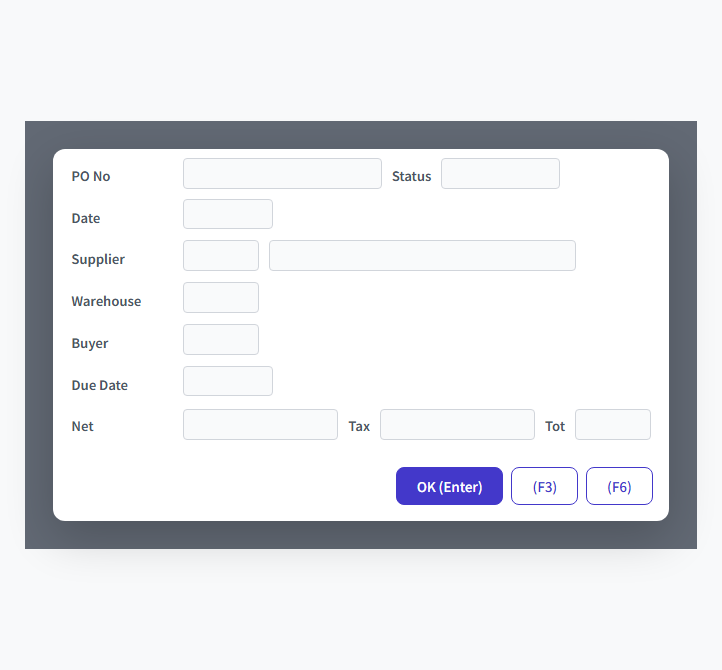

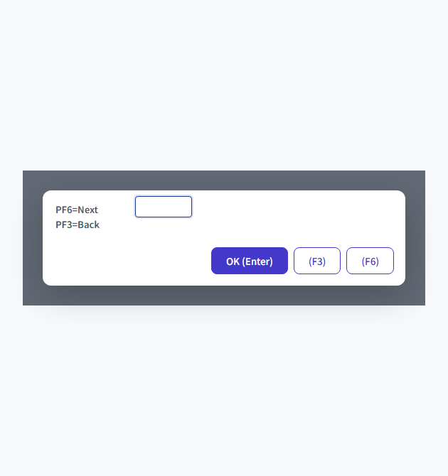

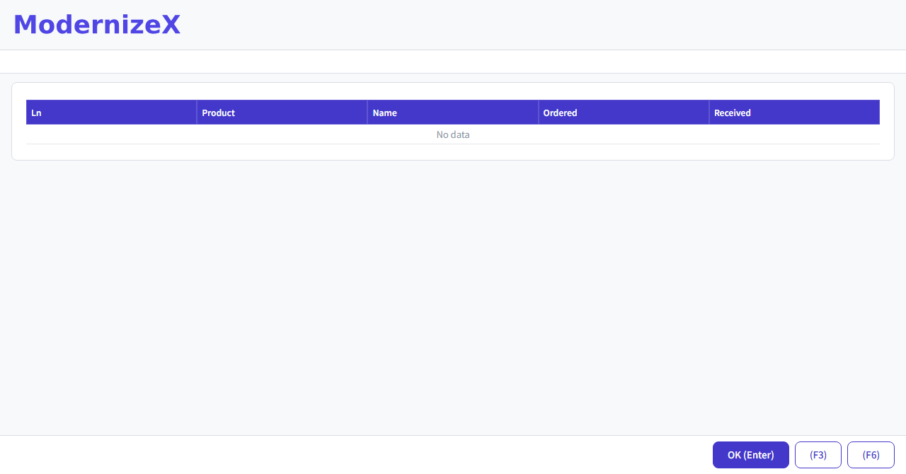

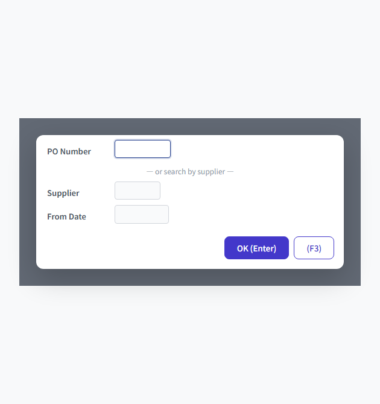

**項目詳細**

| № | コントロール名 | コントロールID | 種別 | Class／データ型 | Tab | 配置 | 文字数 | 値種別 | 初期表示 | 機能／表示データ（DBマッピング） | 取得元／条件 | 入力規則 | 備考 |
|---|---|---|---|---|---|---|---|---|---|---|---|---|---|
| **検索画面** ||||||||||||||
| 1 | PO Number | WK-SRCH-NO | 入力 | 9(10) | 1 | 左 | 10 | 数値 | 空 | PO Number（-） | 画面入力 | 必須／コード検証 | |
| 2 | Supplier | WK-SRCH-SUPP | 入力 | 9(6) | 2 | 左 | 6 | 数値 | 空 | Supplier（-） | 画面入力 | 必須／コード検証 | |
| 3 | From Date | WK-SRCH-DATE | 入力 | 9(8) | 3 | 左 | 8 | 数値 | 空 | From Date（-） | 画面入力 | 必須／コード検証 | |
| **照会画面** ||||||||||||||
| 4 | PF6=Next  PF3=Back | WK-NAV | 入力 | X(1) | 1 | 左 | 1 | 英数 | 空 | PF6=Next  PF3=Back（-） | 画面入力 | 入力 | |
| 5 | PO No | PH-NO | 表示 | - | - | 左 | 10 | 英数 | 空 | PO No（発注ヘッダ(POHF)） | マスタ照合表示 | - | |
| 6 | Status | WK-STAT-TEXT | 表示 | - | - | 左 | 12 | 英数 | 空 | Status（-） | マスタ照合表示 | - | |
| 7 | Date | PH-DATE | 表示 | - | - | 左 | 10 | 英数 | 空 | Date（発注ヘッダ(POHF)） | マスタ照合表示 | - | |
| 8 | Supplier | PH-SUPP | 表示 | - | - | 左 | 6 | 英数 | 空 | Supplier（発注ヘッダ(POHF)） | マスタ照合表示 | - | |
| 9 | Supplier | WK-SUPP-NAME | 表示 | - | - | 左 | 40 | 英数 | 空 | Supplier（-） | マスタ照合表示 | - | |
| 10 | Warehouse | PH-WHSE | 表示 | - | - | 左 | 3 | 英数 | 空 | Warehouse（発注ヘッダ(POHF)） | マスタ照合表示 | - | |
| 11 | Buyer | PH-STAFF | 表示 | - | - | 左 | 4 | 英数 | 空 | Buyer（発注ヘッダ(POHF)） | マスタ照合表示 | - | |
| 12 | Due Date | PH-DUE-DATE | 表示 | - | - | 左 | 10 | 英数 | 空 | Due Date（発注ヘッダ(POHF)） | マスタ照合表示 | - | |
| 13 | Net | PH-AMOUNT | 表示 | - | - | 左 | 15 | 英数 | 空 | Net（発注ヘッダ(POHF)） | マスタ照合表示 | - | |
| 14 | Tax | PH-TAX-AMOUNT | 表示 | - | - | 左 | 15 | 英数 | 空 | Tax（発注ヘッダ(POHF)） | マスタ照合表示 | - | |
| 15 | Tot | PH-TOTAL | 表示 | - | - | 左 | 15 | 英数 | 空 | Tot（発注ヘッダ(POHF)） | マスタ照合表示 | - | |
| 16 | - | WR-BUF(1) | 表示 | - | - | 左 | 69 | 英数 | 空 | -（-） | マスタ照合表示 | - | |
| 17 | - | WR-BUF(2) | 表示 | - | - | 左 | 69 | 英数 | 空 | -（-） | マスタ照合表示 | - | |
| 18 | - | WR-BUF(3) | 表示 | - | - | 左 | 69 | 英数 | 空 | -（-） | マスタ照合表示 | - | |
| 19 | - | WR-BUF(4) | 表示 | - | - | 左 | 69 | 英数 | 空 | -（-） | マスタ照合表示 | - | |
| 20 | - | WR-BUF(5) | 表示 | - | - | 左 | 69 | 英数 | 空 | -（-） | マスタ照合表示 | - | |
| 21 | - | WR-BUF(6) | 表示 | - | - | 左 | 69 | 英数 | 空 | -（-） | マスタ照合表示 | - | |
| 22 | - | WR-BUF(7) | 表示 | - | - | 左 | 69 | 英数 | 空 | -（-） | マスタ照合表示 | - | |
| 23 | - | WR-BUF(8) | 表示 | - | - | 左 | 69 | 英数 | 空 | -（-） | マスタ照合表示 | - | |
| 24 | - | WR-BUF(9) | 表示 | - | - | 左 | 69 | 英数 | 空 | -（-） | マスタ照合表示 | - | |

**項目状態**

> 記号: `レ`=フォーカス｜`必`=使用可（必須）｜`略`=使用可（省略可）｜`○`=使用可｜`×`=非表示｜`□`=表示のみ

| № | コントロール名 | 初期表示 | 入力／編集 | 確認 | 参照 |
|---|---|---|---|---|---|
| **検索画面** ||||||
| 1 | PO Number | ○ | 必 | □ | □ |
| 2 | Supplier | ○ | 必 | □ | □ |
| 3 | From Date | ○ | 必 | □ | □ |
| **照会画面** ||||||
| 4 | PF6=Next  PF3=Back | ○ | 必 | □ | □ |
| 5 | PO No | □ | □ | □ | □ |
| 6 | Status | □ | □ | □ | □ |
| 7 | Date | □ | □ | □ | □ |
| 8 | Supplier | □ | □ | □ | □ |
| 9 | Supplier | □ | □ | □ | □ |
| 10 | Warehouse | □ | □ | □ | □ |
| 11 | Buyer | □ | □ | □ | □ |
| 12 | Due Date | □ | □ | □ | □ |
| 13 | Net | □ | □ | □ | □ |
| 14 | Tax | □ | □ | □ | □ |
| 15 | Tot | □ | □ | □ | □ |
| 16 | - | □ | □ | □ | □ |
| 17 | - | □ | □ | □ | □ |
| 18 | - | □ | □ | □ | □ |
| 19 | - | □ | □ | □ | □ |
| 20 | - | □ | □ | □ | □ |
| 21 | - | □ | □ | □ | □ |
| 22 | - | □ | □ | □ | □ |
| 23 | - | □ | □ | □ | □ |
| 24 | - | □ | □ | □ | □ |

### 2.25 PU0030 — 仕入入力

**レイアウト**

モダナイズ後の画面（Vue SFC `src/programs/pu0030/` を WebSocket ターミナルランタイムでレンダリング）。

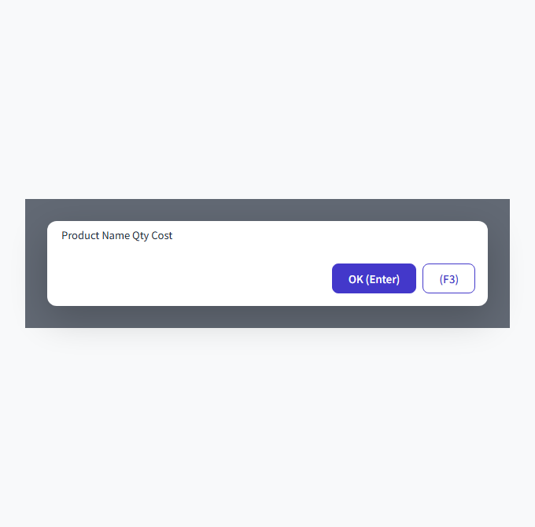

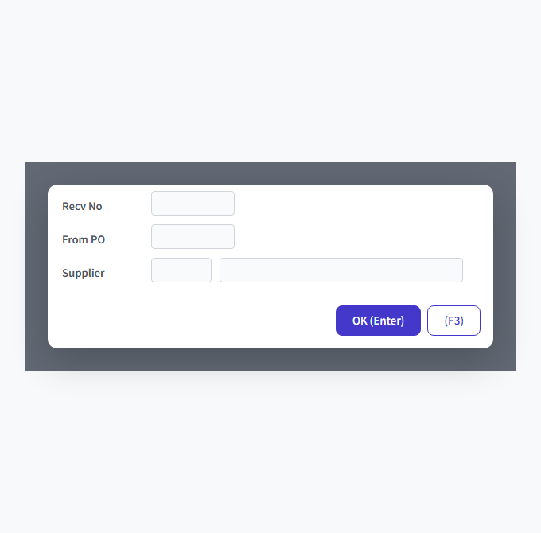

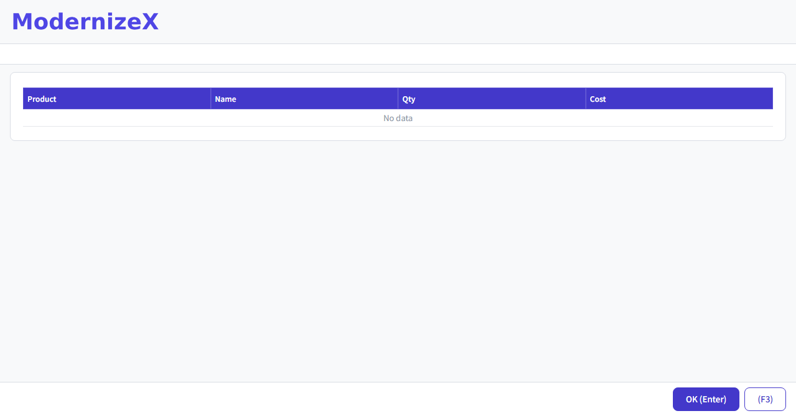

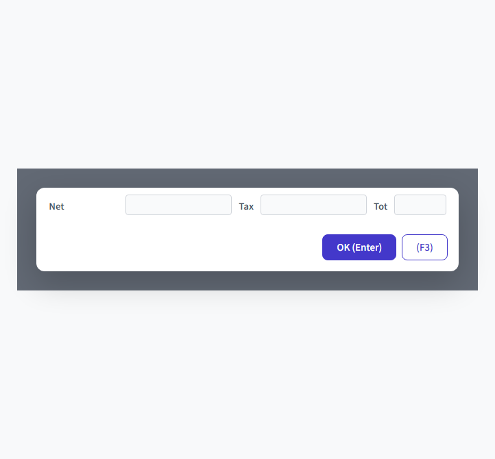

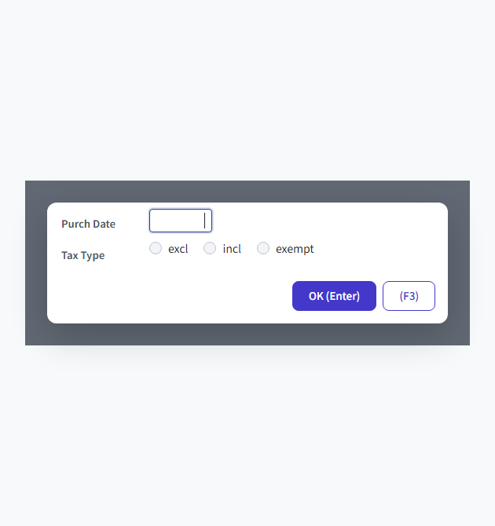

**項目詳細**

| № | コントロール名 | コントロールID | 種別 | Class／データ型 | Tab | 配置 | 文字数 | 値種別 | 初期表示 | 機能／表示データ（DBマッピング） | 取得元／条件 | 入力規則 | 備考 |
|---|---|---|---|---|---|---|---|---|---|---|---|---|---|
| **キー入力画面** ||||||||||||||
| 1 | Receiving No | WK-RECV-KEY | 入力 | 9(10) | 1 | 左 | 10 | 数値 | 空 | Receiving No（-） | 画面入力 | 必須／コード検証 | |
| **仕入計上画面** ||||||||||||||
| 2 | Purch Date | VH-DATE | 入力 | 9(8) | 1 | 左 | 8 | 数値 | 空 | Purch Date（仕入ヘッダ(PURHF)） | 画面入力 | 必須／コード検証 | |
| 3 | Tax Type | VH-TAX-TYPE | 入力 | 9(1) | 2 | 左 | 1 | 数値 | 空 | Tax Type（仕入ヘッダ(PURHF)） | 画面入力 | 必須／コード検証 | |
| 4 | Book purchase ? (Y/N) | WK-CONFIRM | 入力 | X(1) | 3 | 左 | 1 | 英数 | 空 | Book purchase ? (Y/N)（-） | 画面入力 | 入力 | |
| 5 | Recv No | RH-NO | 表示 | - | - | 左 | 10 | 英数 | 空 | Recv No（入荷ヘッダ(RCVHF)） | マスタ照合表示 | - | |
| 6 | From PO | RH-PO | 表示 | - | - | 左 | 10 | 英数 | 空 | From PO（入荷ヘッダ(RCVHF)） | マスタ照合表示 | - | |
| 7 | Supplier | RH-SUPP | 表示 | - | - | 左 | 6 | 英数 | 空 | Supplier（入荷ヘッダ(RCVHF)） | マスタ照合表示 | - | |
| 8 | Supplier | WK-SUPP-NAME | 表示 | - | - | 左 | 40 | 英数 | 空 | Supplier（-） | マスタ照合表示 | - | |
| 9 | - | WR-BUF(1) | 表示 | - | - | 左 | 66 | 英数 | 空 | -（-） | マスタ照合表示 | - | |
| 10 | - | WR-BUF(2) | 表示 | - | - | 左 | 66 | 英数 | 空 | -（-） | マスタ照合表示 | - | |
| 11 | - | WR-BUF(3) | 表示 | - | - | 左 | 66 | 英数 | 空 | -（-） | マスタ照合表示 | - | |
| 12 | - | WR-BUF(4) | 表示 | - | - | 左 | 66 | 英数 | 空 | -（-） | マスタ照合表示 | - | |
| 13 | - | WR-BUF(5) | 表示 | - | - | 左 | 66 | 英数 | 空 | -（-） | マスタ照合表示 | - | |
| 14 | - | WR-BUF(6) | 表示 | - | - | 左 | 66 | 英数 | 空 | -（-） | マスタ照合表示 | - | |
| 15 | - | WR-BUF(7) | 表示 | - | - | 左 | 66 | 英数 | 空 | -（-） | マスタ照合表示 | - | |
| 16 | - | WR-BUF(8) | 表示 | - | - | 左 | 66 | 英数 | 空 | -（-） | マスタ照合表示 | - | |
| 17 | - | WR-BUF(9) | 表示 | - | - | 左 | 66 | 英数 | 空 | -（-） | マスタ照合表示 | - | |
| 18 | Net | WK-NET-TOTAL | 表示 | - | - | 左 | 15 | 英数 | 空 | Net（-） | マスタ照合表示 | - | |
| 19 | Tax | WK-TAX-TOTAL | 表示 | - | - | 左 | 15 | 英数 | 空 | Tax（-） | マスタ照合表示 | - | |
| 20 | Tot | WK-GRS-TOTAL | 表示 | - | - | 左 | 15 | 英数 | 空 | Tot（-） | マスタ照合表示 | - | |

**項目状態**

> 記号: `レ`=フォーカス｜`必`=使用可（必須）｜`略`=使用可（省略可）｜`○`=使用可｜`×`=非表示｜`□`=表示のみ

| № | コントロール名 | 初期表示 | 入力／編集 | 確認 | 参照 |
|---|---|---|---|---|---|
| **キー入力画面** ||||||
| 1 | Receiving No | ○ | 必 | □ | □ |
| **仕入計上画面** ||||||
| 2 | Purch Date | ○ | 必 | □ | □ |
| 3 | Tax Type | ○ | 必 | □ | □ |
| 4 | Book purchase ? (Y/N) | ○ | 必 | □ | □ |
| 5 | Recv No | □ | □ | □ | □ |
| 6 | From PO | □ | □ | □ | □ |
| 7 | Supplier | □ | □ | □ | □ |
| 8 | Supplier | □ | □ | □ | □ |
| 9 | - | □ | □ | □ | □ |
| 10 | - | □ | □ | □ | □ |
| 11 | - | □ | □ | □ | □ |
| 12 | - | □ | □ | □ | □ |
| 13 | - | □ | □ | □ | □ |
| 14 | - | □ | □ | □ | □ |
| 15 | - | □ | □ | □ | □ |
| 16 | - | □ | □ | □ | □ |
| 17 | - | □ | □ | □ | □ |
| 18 | Net | □ | □ | □ | □ |
| 19 | Tax | □ | □ | □ | □ |
| 20 | Tot | □ | □ | □ | □ |

### 2.26 PU0040 — 仕入返品入力

**レイアウト**

モダナイズ後の画面（Vue SFC `src/programs/pu0040/` を WebSocket ターミナルランタイムでレンダリング）。

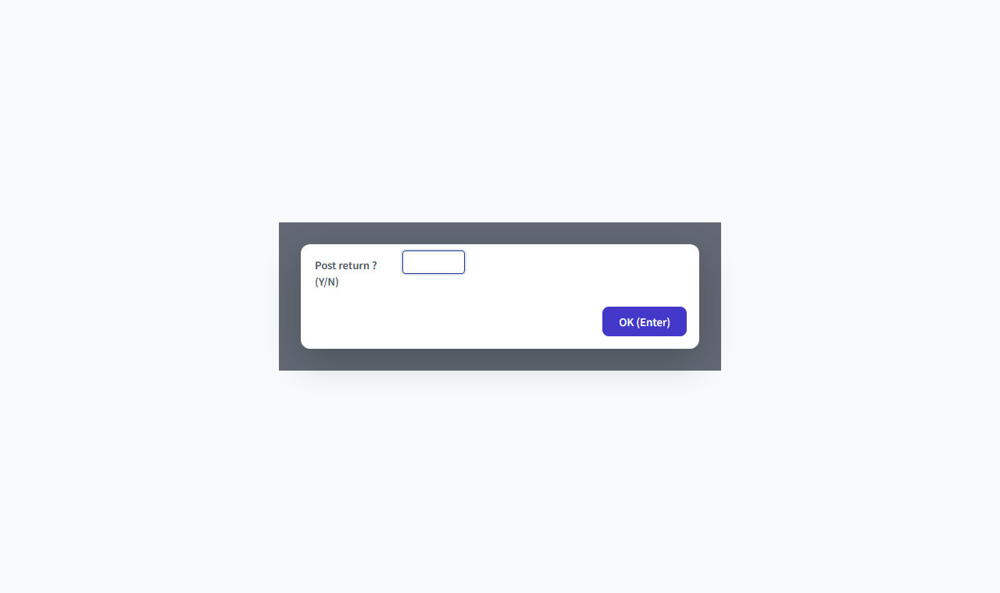

**項目詳細**

| № | コントロール名 | コントロールID | 種別 | Class／データ型 | Tab | 配置 | 文字数 | 値種別 | 初期表示 | 機能／表示データ（DBマッピング） | 取得元／条件 | 入力規則 | 備考 |
|---|---|---|---|---|---|---|---|---|---|---|---|---|---|
| **入力画面** ||||||||||||||
| 1 | Return Date | VH-DATE | 入力 | 9(8) | 1 | 左 | 8 | 数値 | 空 | Return Date（仕入ヘッダ(PURHF)） | 画面入力 | 必須／コード検証 | |
| 2 | Supplier | VH-SUPP | 入力 | 9(6) | 2 | 左 | 6 | 数値 | 空 | Supplier（仕入ヘッダ(PURHF)） | 画面入力 | 必須／コード検証 | |
| 3 | Tax Type | VH-TAX-TYPE | 入力 | 9(1) | 3 | 左 | 1 | 数値 | 空 | Tax Type（仕入ヘッダ(PURHF)） | 画面入力 | 必須／コード検証 | |
| 4 | Remark | VH-REMARK | 入力 | X(40) | 4 | 左 | 40 | 英数 | 空 | Remark（仕入ヘッダ(PURHF)） | 画面入力 | 入力 | |
| 5 | Product | WK-D-PROD | 入力 | 9(8) | 5 | 左 | 8 | 数値 | 空 | Product（-） | 画面入力 | 必須／コード検証 | |
| 6 | Warehouse | WK-D-WHSE | 入力 | 9(3) | 6 | 左 | 3 | 数値 | 空 | Warehouse（-） | 画面入力 | 必須／コード検証 | |
| 7 | Return Qty | WK-D-QTY | 入力 | S9(9) | 7 | 左 | 9 | 数値 | 空 | Return Qty（-） | 画面入力 | 必須／コード検証 | |
| 8 | Unit Cost | WK-D-COST | 入力 | S9(9)V9(2) | 8 | 左 | 11 | 数値 | 空 | Unit Cost（-） | 画面入力 | 必須／コード検証 | |
| 9 | Post return ? (Y/N) | WK-CONFIRM | 入力 | X(1) | 9 | 左 | 1 | 英数 | 空 | Post return ? (Y/N)（-） | 画面入力 | 入力 | |
| 10 | Return No | WK-VH-NO-D | 表示 | - | - | 左 | 10 | 英数 | 空 | Return No（-） | マスタ照合表示 | - | |
| 11 | Supplier | WK-SUPP-NAME | 表示 | - | - | 左 | 40 | 英数 | 空 | Supplier（-） | マスタ照合表示 | - | |
| 12 | Product | WK-D-NAME | 表示 | - | - | 左 | 40 | 英数 | 空 | Product（-） | マスタ照合表示 | - | |
| 13 | Lines | WK-LCNT | 表示 | - | - | 左 | 3 | 英数 | 空 | Lines（-） | マスタ照合表示 | - | |
| 14 | Return Net | WK-NET-TOTAL | 表示 | - | - | 左 | 15 | 英数 | 空 | Return Net（-） | マスタ照合表示 | - | |

**項目状態**

> 記号: `レ`=フォーカス｜`必`=使用可（必須）｜`略`=使用可（省略可）｜`○`=使用可｜`×`=非表示｜`□`=表示のみ

| № | コントロール名 | 初期表示 | 入力／編集 | 確認 | 参照 |
|---|---|---|---|---|---|
| **入力画面** ||||||
| 1 | Return Date | ○ | 必 | □ | □ |
| 2 | Supplier | ○ | 必 | □ | □ |
| 3 | Tax Type | ○ | 必 | □ | □ |
| 4 | Remark | ○ | 必 | □ | □ |
| 5 | Product | ○ | 必 | □ | □ |
| 6 | Warehouse | ○ | 必 | □ | □ |
| 7 | Return Qty | ○ | 必 | □ | □ |
| 8 | Unit Cost | ○ | 必 | □ | □ |
| 9 | Post return ? (Y/N) | ○ | 必 | □ | □ |
| 10 | Return No | □ | □ | □ | □ |
| 11 | Supplier | □ | □ | □ | □ |
| 12 | Product | □ | □ | □ | □ |
| 13 | Lines | □ | □ | □ | □ |
| 14 | Return Net | □ | □ | □ | □ |

### 2.27 RC0010 — 入荷入力

**レイアウト**

モダナイズ後の画面（Vue SFC `src/programs/rc0010/` を WebSocket ターミナルランタイムでレンダリング）。

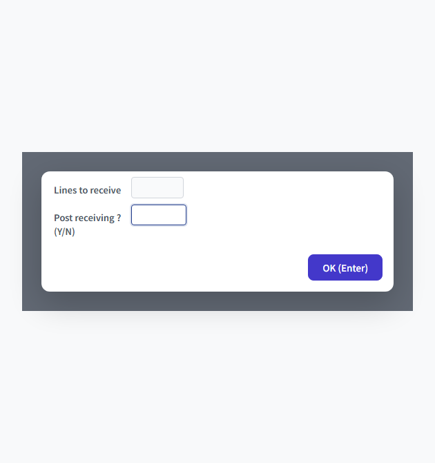

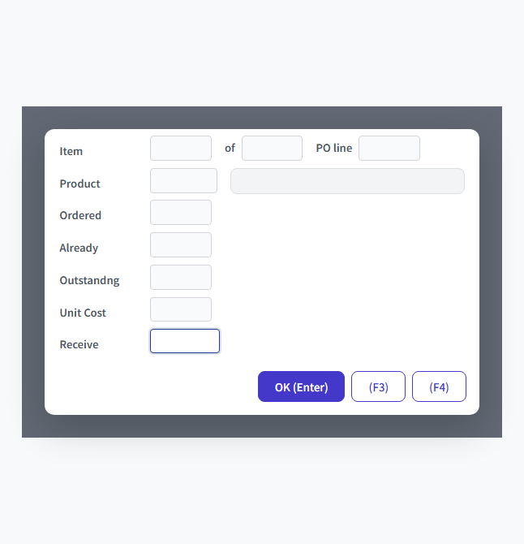

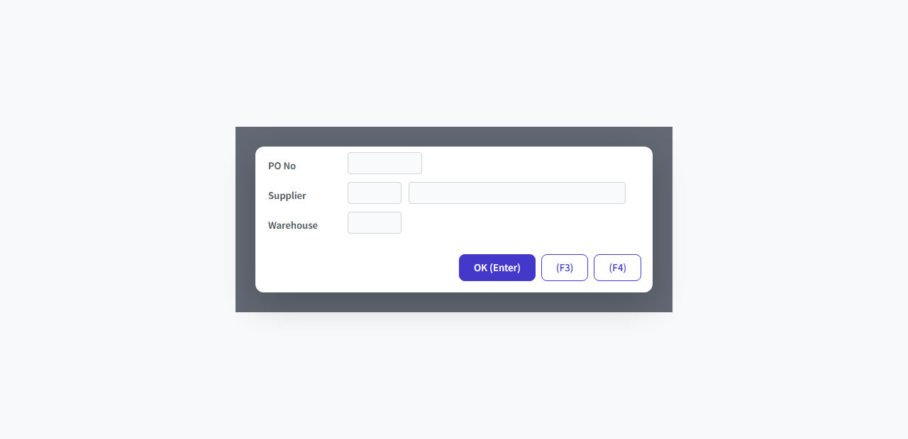

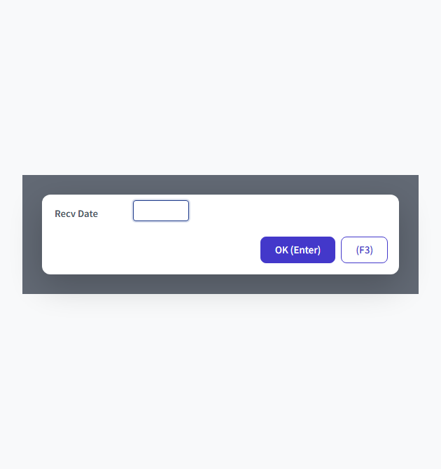

**項目詳細**

| № | コントロール名 | コントロールID | 種別 | Class／データ型 | Tab | 配置 | 文字数 | 値種別 | 初期表示 | 機能／表示データ（DBマッピング） | 取得元／条件 | 入力規則 | 備考 |
|---|---|---|---|---|---|---|---|---|---|---|---|---|---|
| **キー入力画面** ||||||||||||||
| 1 | PO Number | WK-PO-KEY | 入力 | 9(10) | 1 | 左 | 10 | 数値 | 空 | PO Number（-） | 画面入力 | 必須／コード検証 | |
| **入荷入力画面** ||||||||||||||
| 2 | Recv Date | RH-DATE | 入力 | 9(8) | 1 | 左 | 8 | 数値 | 空 | Recv Date（入荷ヘッダ(RCVHF)） | 画面入力 | 必須／コード検証 | |
| 3 | Receive | WK-D-RECV | 入力 | S9(9) | 2 | 左 | 9 | 数値 | 空 | Receive（-） | 画面入力 | 必須／コード検証 | |
| 4 | Post receiving ? (Y/N) | WK-CONFIRM | 入力 | X(1) | 3 | 左 | 1 | 英数 | 空 | Post receiving ? (Y/N)（-） | 画面入力 | 入力 | |
| 5 | PO No | PH-NO | 表示 | - | - | 左 | 10 | 英数 | 空 | PO No（発注ヘッダ(POHF)） | マスタ照合表示 | - | |
| 6 | Supplier | PH-SUPP | 表示 | - | - | 左 | 6 | 英数 | 空 | Supplier（発注ヘッダ(POHF)） | マスタ照合表示 | - | |
| 7 | Supplier | WK-SUPP-NAME | 表示 | - | - | 左 | 40 | 英数 | 空 | Supplier（-） | マスタ照合表示 | - | |
| 8 | Warehouse | PH-WHSE | 表示 | - | - | 左 | 3 | 英数 | 空 | Warehouse（発注ヘッダ(POHF)） | マスタ照合表示 | - | |
| 9 | Item | WK-L-POS | 表示 | - | - | 左 | 3 | 英数 | 空 | Item（-） | マスタ照合表示 | - | |
| 10 | of | WK-LCNT | 表示 | - | - | 左 | 3 | 英数 | 空 | of（-） | マスタ照合表示 | - | |
| 11 | PO line | WK-L-POLINE | 表示 | - | - | 左 | 3 | 英数 | 空 | PO line（-） | マスタ照合表示 | - | |
| 12 | Product | WK-L-PROD | 表示 | - | - | 左 | 8 | 英数 | 空 | Product（-） | マスタ照合表示 | - | |
| 13 | Product | WK-L-NAME | 表示 | - | - | 左 | 40 | 英数 | 空 | Product（-） | マスタ照合表示 | - | |
| 14 | Ordered | WK-L-ORD | 表示 | - | - | 左 | 12 | 英数 | 空 | Ordered（-） | マスタ照合表示 | - | |
| 15 | Already | WK-L-PRECV | 表示 | - | - | 左 | 12 | 英数 | 空 | Already（-） | マスタ照合表示 | - | |
| 16 | Outstandng | WK-L-OUT | 表示 | - | - | 左 | 12 | 英数 | 空 | Outstandng（-） | マスタ照合表示 | - | |
| 17 | Unit Cost | WK-L-COST | 表示 | - | - | 左 | 10 | 英数 | 空 | Unit Cost（-） | マスタ照合表示 | - | |
| 18 | Lines to receive | WK-RECV-CNT | 表示 | - | - | 左 | 3 | 英数 | 空 | Lines to receive（-） | マスタ照合表示 | - | |

**項目状態**

> 記号: `レ`=フォーカス｜`必`=使用可（必須）｜`略`=使用可（省略可）｜`○`=使用可｜`×`=非表示｜`□`=表示のみ

| № | コントロール名 | 初期表示 | 入力／編集 | 確認 | 参照 |
|---|---|---|---|---|---|
| **キー入力画面** ||||||
| 1 | PO Number | ○ | 必 | □ | □ |
| **入荷入力画面** ||||||
| 2 | Recv Date | ○ | 必 | □ | □ |
| 3 | Receive | ○ | 必 | □ | □ |
| 4 | Post receiving ? (Y/N) | ○ | 必 | □ | □ |
| 5 | PO No | □ | □ | □ | □ |
| 6 | Supplier | □ | □ | □ | □ |
| 7 | Supplier | □ | □ | □ | □ |
| 8 | Warehouse | □ | □ | □ | □ |
| 9 | Item | □ | □ | □ | □ |
| 10 | of | □ | □ | □ | □ |
| 11 | PO line | □ | □ | □ | □ |
| 12 | Product | □ | □ | □ | □ |
| 13 | Product | □ | □ | □ | □ |
| 14 | Ordered | □ | □ | □ | □ |
| 15 | Already | □ | □ | □ | □ |
| 16 | Outstandng | □ | □ | □ | □ |
| 17 | Unit Cost | □ | □ | □ | □ |
| 18 | Lines to receive | □ | □ | □ | □ |

### 2.28 IV0010 — 在庫残高照会

**レイアウト**

モダナイズ後の画面（Vue SFC `src/programs/iv0010/` を WebSocket ターミナルランタイムでレンダリング）。

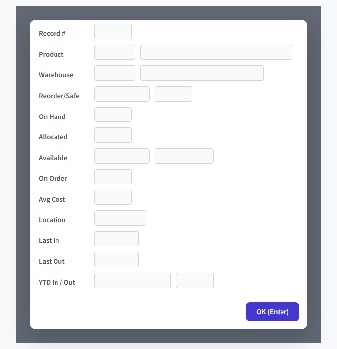

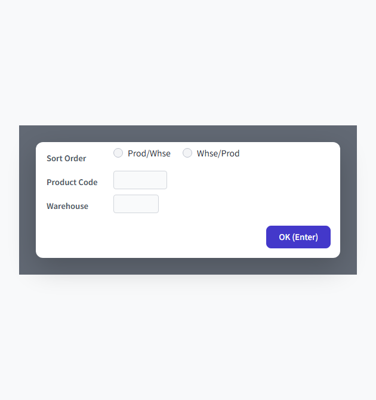

**項目詳細**

| № | コントロール名 | コントロールID | 種別 | Class／データ型 | Tab | 配置 | 文字数 | 値種別 | 初期表示 | 機能／表示データ（DBマッピング） | 取得元／条件 | 入力規則 | 備考 |
|---|---|---|---|---|---|---|---|---|---|---|---|---|---|
| **キー入力画面** ||||||||||||||
| 1 | Sort Order | WK-ORDER | 入力 | 9(1) | 1 | 左 | 1 | 数値 | 空 | Sort Order（-） | 画面入力 | 必須／コード検証 | |
| 2 | Product Code | WK-KEY-PROD | 入力 | 9(8) | 2 | 左 | 8 | 数値 | 空 | Product Code（-） | 画面入力 | 必須／コード検証 | |
| 3 | Warehouse | WK-KEY-WHSE | 入力 | 9(3) | 3 | 左 | 3 | 数値 | 空 | Warehouse（-） | 画面入力 | 必須／コード検証 | |
| **明細照会画面** ||||||||||||||
| 4 | Record # | WK-SEEN | 表示 | - | - | 左 | 5 | 英数 | 空 | Record #（-） | マスタ照合表示 | - | |
| 5 | Product | SK-PROD | 表示 | - | - | 左 | 8 | 英数 | 空 | Product（在庫残高(STOKF)） | マスタ照合表示 | - | |
| 6 | Product | WK-PR-NAME | 表示 | - | - | 左 | 40 | 英数 | 空 | Product（-） | マスタ照合表示 | - | |
| 7 | Warehouse | SK-WHSE | 表示 | - | - | 左 | 3 | 英数 | 空 | Warehouse（在庫残高(STOKF)） | マスタ照合表示 | - | |
| 8 | Warehouse | WK-WH-NAME | 表示 | - | - | 左 | 30 | 英数 | 空 | Warehouse（-） | マスタ照合表示 | - | |
| 9 | Reorder/Safe | WK-REORDER | 表示 | - | - | 左 | 11 | 英数 | 空 | Reorder/Safe（-） | マスタ照合表示 | - | |
| 10 | Reorder/Safe | WK-SAFETY | 表示 | - | - | 左 | 11 | 英数 | 空 | Reorder/Safe（-） | マスタ照合表示 | - | |
| 11 | On Hand | SK-ONHAND | 表示 | - | - | 左 | 11 | 英数 | 空 | On Hand（在庫残高(STOKF)） | マスタ照合表示 | - | |
| 12 | Allocated | SK-ALLOCATED | 表示 | - | - | 左 | 11 | 英数 | 空 | Allocated（在庫残高(STOKF)） | マスタ照合表示 | - | |
| 13 | Available | WK-AVAIL | 表示 | - | - | 左 | 11 | 英数 | 空 | Available（-） | マスタ照合表示 | - | |
| 14 | Available | WK-STAT | 表示 | - | - | 左 | 12 | 英数 | 空 | Available（-） | マスタ照合表示 | - | |
| 15 | On Order | SK-ON-ORDER | 表示 | - | - | 左 | 11 | 英数 | 空 | On Order（在庫残高(STOKF)） | マスタ照合表示 | - | |
| 16 | Avg Cost | SK-AVG-COST | 表示 | - | - | 左 | 14 | 英数 | 空 | Avg Cost（在庫残高(STOKF)） | マスタ照合表示 | - | |
| 17 | Location | SK-LOCATION | 表示 | - | - | 左 | 10 | 英数 | 空 | Location（在庫残高(STOKF)） | マスタ照合表示 | - | |
| 18 | Last In | SK-LAST-IN-DATE | 表示 | - | - | 左 | 10 | 英数 | 空 | Last In（在庫残高(STOKF)） | マスタ照合表示 | - | |
| 19 | Last Out | SK-LAST-OUT-DATE | 表示 | - | - | 左 | 10 | 英数 | 空 | Last Out（在庫残高(STOKF)） | マスタ照合表示 | - | |
| 20 | YTD In / Out | SK-YTD-IN | 表示 | - | - | 左 | 15 | 英数 | 空 | YTD In / Out（在庫残高(STOKF)） | マスタ照合表示 | - | |
| 21 | YTD In / Out | SK-YTD-OUT | 表示 | - | - | 左 | 15 | 英数 | 空 | YTD In / Out（在庫残高(STOKF)） | マスタ照合表示 | - | |

**項目状態**

> 記号: `レ`=フォーカス｜`必`=使用可（必須）｜`略`=使用可（省略可）｜`○`=使用可｜`×`=非表示｜`□`=表示のみ

| № | コントロール名 | 初期表示 | 入力／編集 | 確認 | 参照 |
|---|---|---|---|---|---|
| **キー入力画面** ||||||
| 1 | Sort Order | ○ | 必 | □ | □ |
| 2 | Product Code | ○ | 必 | □ | □ |
| 3 | Warehouse | ○ | 必 | □ | □ |
| **明細照会画面** ||||||
| 4 | Record # | □ | □ | □ | □ |
| 5 | Product | □ | □ | □ | □ |
| 6 | Product | □ | □ | □ | □ |
| 7 | Warehouse | □ | □ | □ | □ |
| 8 | Warehouse | □ | □ | □ | □ |
| 9 | Reorder/Safe | □ | □ | □ | □ |
| 10 | Reorder/Safe | □ | □ | □ | □ |
| 11 | On Hand | □ | □ | □ | □ |
| 12 | Allocated | □ | □ | □ | □ |
| 13 | Available | □ | □ | □ | □ |
| 14 | Available | □ | □ | □ | □ |
| 15 | On Order | □ | □ | □ | □ |
| 16 | Avg Cost | □ | □ | □ | □ |
| 17 | Location | □ | □ | □ | □ |
| 18 | Last In | □ | □ | □ | □ |
| 19 | Last Out | □ | □ | □ | □ |
| 20 | YTD In / Out | □ | □ | □ | □ |
| 21 | YTD In / Out | □ | □ | □ | □ |

### 2.29 IV0020 — 在庫調整

**レイアウト**

モダナイズ後の画面（Vue SFC `src/programs/iv0020/` を WebSocket ターミナルランタイムでレンダリング）。

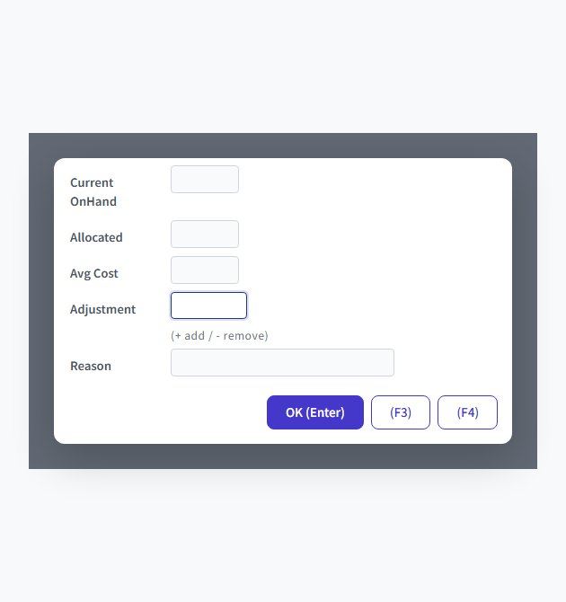

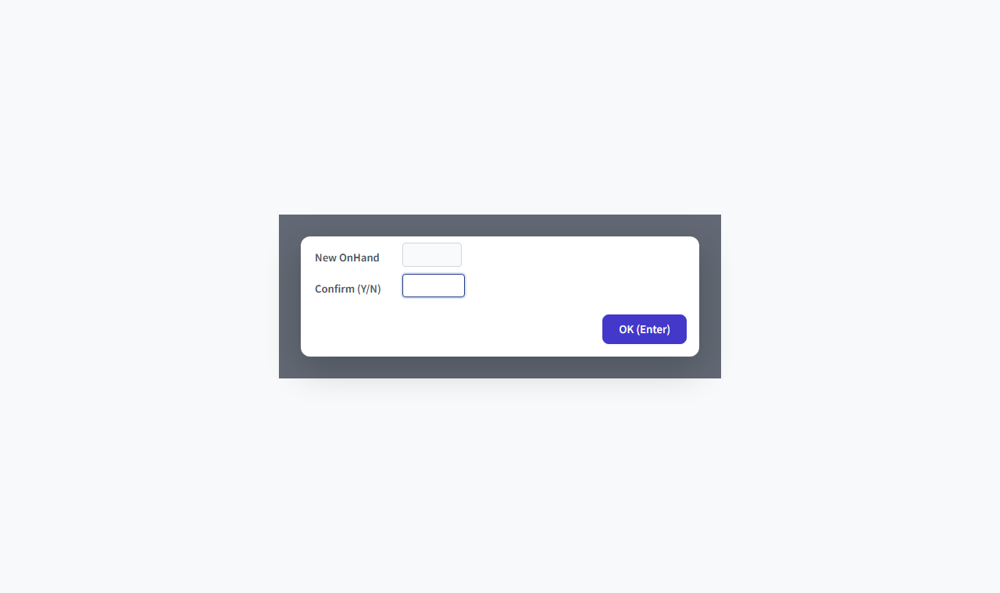

**項目詳細**

| № | コントロール名 | コントロールID | 種別 | Class／データ型 | Tab | 配置 | 文字数 | 値種別 | 初期表示 | 機能／表示データ（DBマッピング） | 取得元／条件 | 入力規則 | 備考 |
|---|---|---|---|---|---|---|---|---|---|---|---|---|---|
| **保守画面** ||||||||||||||
| 1 | Product Code | WK-KEY-PROD | 入力 | 9(8) | 1 | 左 | 8 | 数値 | 空 | Product Code（-） | 画面入力 | 必須／コード検証 | |
| 2 | Warehouse | WK-KEY-WHSE | 入力 | 9(3) | 2 | 左 | 3 | 数値 | 空 | Warehouse（-） | 画面入力 | 必須／コード検証 | |
| 3 | Adjustment | WK-ADJ-QTY | 入力 | S9(9) | 3 | 左 | 9 | 数値 | 空 | Adjustment（-） | 画面入力 | 必須／コード検証 | |
| 4 | Reason | WK-REASON | 入力 | X(30) | 4 | 左 | 30 | 英数 | 空 | Reason（-） | 画面入力 | 入力 | |
| 5 | Confirm (Y/N) | WK-CONFIRM | 入力 | X(1) | 5 | 左 | 1 | 英数 | 空 | Confirm (Y/N)（-） | 画面入力 | 入力 | |
| 6 | Product Code | WK-PR-NAME | 表示 | - | - | 左 | 40 | 英数 | 空 | Product Code（-） | マスタ照合表示 | - | |
| 7 | Warehouse | WK-WH-NAME | 表示 | - | - | 左 | 30 | 英数 | 空 | Warehouse（-） | マスタ照合表示 | - | |
| 8 | Current OnHand | SK-ONHAND | 表示 | - | - | 左 | 11 | 英数 | 空 | Current OnHand（在庫残高(STOKF)） | マスタ照合表示 | - | |
| 9 | Allocated | SK-ALLOCATED | 表示 | - | - | 左 | 11 | 英数 | 空 | Allocated（在庫残高(STOKF)） | マスタ照合表示 | - | |
| 10 | Avg Cost | SK-AVG-COST | 表示 | - | - | 左 | 14 | 英数 | 空 | Avg Cost（在庫残高(STOKF)） | マスタ照合表示 | - | |
| 11 | New OnHand | WK-NEW-ONHAND | 表示 | - | - | 左 | 11 | 英数 | 空 | New OnHand（-） | マスタ照合表示 | - | |

**項目状態**

> 記号: `レ`=フォーカス｜`必`=使用可（必須）｜`略`=使用可（省略可）｜`○`=使用可｜`×`=非表示｜`□`=表示のみ

| № | コントロール名 | 初期表示 | 入力／編集 | 確認 | 参照 |
|---|---|---|---|---|---|
| **保守画面** ||||||
| 1 | Product Code | ○ | 必 | □ | □ |
| 2 | Warehouse | ○ | 必 | □ | □ |
| 3 | Adjustment | ○ | 必 | □ | □ |
| 4 | Reason | ○ | 必 | □ | □ |
| 5 | Confirm (Y/N) | ○ | 必 | □ | □ |
| 6 | Product Code | □ | □ | □ | □ |
| 7 | Warehouse | □ | □ | □ | □ |
| 8 | Current OnHand | □ | □ | □ | □ |
| 9 | Allocated | □ | □ | □ | □ |
| 10 | Avg Cost | □ | □ | □ | □ |
| 11 | New OnHand | □ | □ | □ | □ |

### 2.30 IV0030 — 棚卸（実地棚卸）

**レイアウト**

モダナイズ後の画面（Vue SFC `src/programs/iv0030/` を WebSocket ターミナルランタイムでレンダリング）。

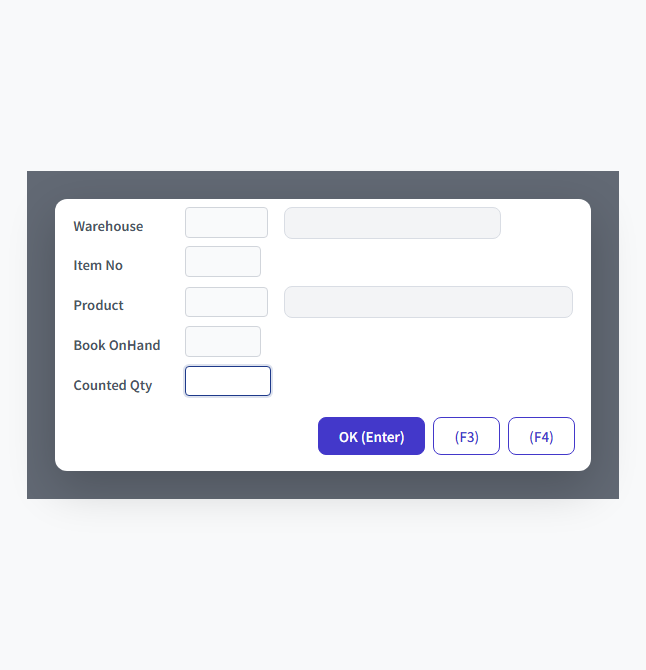

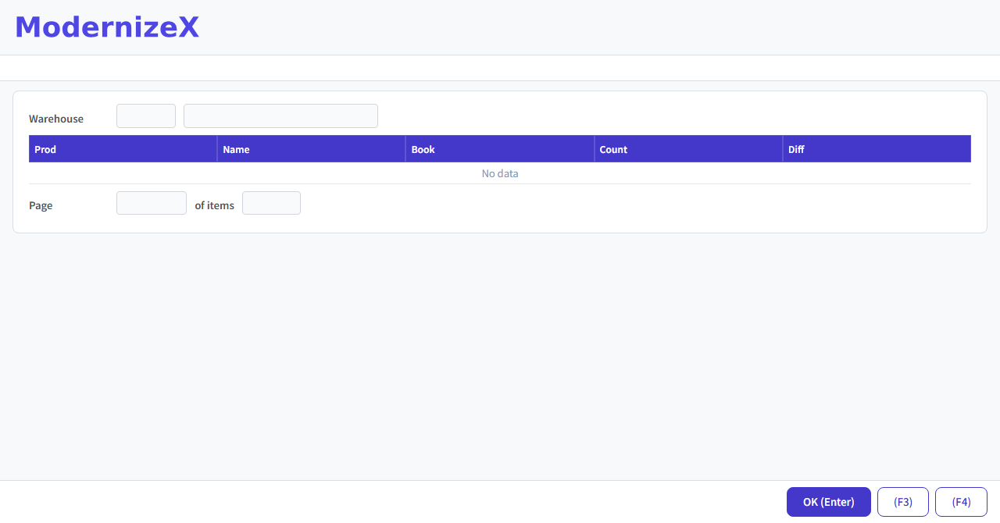

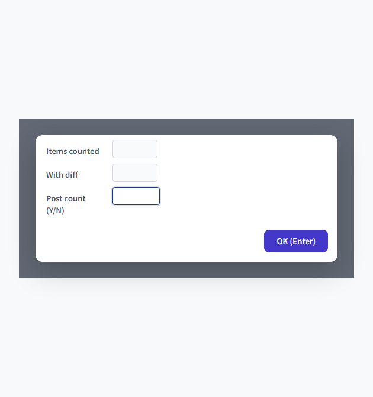

**項目詳細**

| № | コントロール名 | コントロールID | 種別 | Class／データ型 | Tab | 配置 | 文字数 | 値種別 | 初期表示 | 機能／表示データ（DBマッピング） | 取得元／条件 | 入力規則 | 備考 |
|---|---|---|---|---|---|---|---|---|---|---|---|---|---|
| **倉庫選択画面** ||||||||||||||
| 1 | Warehouse | WK-WHSE-IN | 入力 | 9(3) | 1 | 左 | 3 | 数値 | 空 | Warehouse（-） | 画面入力 | 必須／コード検証 | |
| 2 | Warehouse | WK-WH-NAME | 表示 | - | - | 左 | 30 | 英数 | 空 | Warehouse（-） | マスタ照合表示 | - | |
| **棚卸入力画面** ||||||||||||||
| 3 | Counted Qty | WK-COUNTED | 入力 | S9(9) | 1 | 左 | 9 | 数値 | 空 | Counted Qty（-） | 画面入力 | 必須／コード検証 | |
| 4 | Post count (Y/N) | WK-CONFIRM | 入力 | X(1) | 2 | 左 | 1 | 英数 | 空 | Post count (Y/N)（-） | 画面入力 | 入力 | |
| 5 | Warehouse | WK-WHSE-IN | 表示 | - | - | 左 | 3 | 英数 | 空 | Warehouse（-） | マスタ照合表示 | - | |
| 6 | Warehouse | WK-WH-NAME | 表示 | - | - | 左 | 30 | 英数 | 空 | Warehouse（-） | マスタ照合表示 | - | |
| 7 | Item No | WK-SHOW-NO | 表示 | - | - | 左 | 4 | 英数 | 空 | Item No（-） | マスタ照合表示 | - | |
| 8 | Product | SK-PROD | 表示 | - | - | 左 | 8 | 英数 | 空 | Product（在庫残高(STOKF)） | マスタ照合表示 | - | |
| 9 | Product | WK-PR-NAME | 表示 | - | - | 左 | 40 | 英数 | 空 | Product（-） | マスタ照合表示 | - | |
| 10 | Book OnHand | WK-BOOK | 表示 | - | - | 左 | 11 | 英数 | 空 | Book OnHand（-） | マスタ照合表示 | - | |
| 11 | Items counted | WK-TCNT | 表示 | - | - | 左 | 4 | 英数 | 空 | Items counted（-） | マスタ照合表示 | - | |
| 12 | With diff | WK-DCNT | 表示 | - | - | 左 | 4 | 英数 | 空 | With diff（-） | マスタ照合表示 | - | |
| **棚卸確認画面** ||||||||||||||
| 13 | Warehouse | WK-WHSE-IN | 表示 | - | - | 左 | 3 | 英数 | 空 | Warehouse（-） | マスタ照合表示 | - | |
| 14 | Warehouse | WK-WH-NAME | 表示 | - | - | 左 | 30 | 英数 | 空 | Warehouse（-） | マスタ照合表示 | - | |
| 15 | - | WK-LIST(1) | 表示 | - | - | 左 | 78 | 英数 | 空 | -（-） | マスタ照合表示 | - | |
| 16 | - | WK-LIST(2) | 表示 | - | - | 左 | 78 | 英数 | 空 | -（-） | マスタ照合表示 | - | |
| 17 | - | WK-LIST(3) | 表示 | - | - | 左 | 78 | 英数 | 空 | -（-） | マスタ照合表示 | - | |
| 18 | - | WK-LIST(4) | 表示 | - | - | 左 | 78 | 英数 | 空 | -（-） | マスタ照合表示 | - | |
| 19 | - | WK-LIST(5) | 表示 | - | - | 左 | 78 | 英数 | 空 | -（-） | マスタ照合表示 | - | |
| 20 | - | WK-LIST(6) | 表示 | - | - | 左 | 78 | 英数 | 空 | -（-） | マスタ照合表示 | - | |
| 21 | - | WK-LIST(7) | 表示 | - | - | 左 | 78 | 英数 | 空 | -（-） | マスタ照合表示 | - | |
| 22 | - | WK-LIST(8) | 表示 | - | - | 左 | 78 | 英数 | 空 | -（-） | マスタ照合表示 | - | |
| 23 | - | WK-LIST(9) | 表示 | - | - | 左 | 78 | 英数 | 空 | -（-） | マスタ照合表示 | - | |
| 24 | - | WK-LIST(10) | 表示 | - | - | 左 | 78 | 英数 | 空 | -（-） | マスタ照合表示 | - | |
| 25 | - | WK-LIST(11) | 表示 | - | - | 左 | 78 | 英数 | 空 | -（-） | マスタ照合表示 | - | |
| 26 | - | WK-LIST(12) | 表示 | - | - | 左 | 78 | 英数 | 空 | -（-） | マスタ照合表示 | - | |
| 27 | Page | WK-RPAGE | 表示 | - | - | 左 | 4 | 英数 | 空 | Page（-） | マスタ照合表示 | - | |
| 28 | of items | WK-TCNT | 表示 | - | - | 左 | 4 | 英数 | 空 | of items（-） | マスタ照合表示 | - | |

**項目状態**

> 記号: `レ`=フォーカス｜`必`=使用可（必須）｜`略`=使用可（省略可）｜`○`=使用可｜`×`=非表示｜`□`=表示のみ

| № | コントロール名 | 初期表示 | 入力／編集 | 確認 | 参照 |
|---|---|---|---|---|---|
| **倉庫選択画面** ||||||
| 1 | Warehouse | ○ | 必 | □ | □ |
| 2 | Warehouse | □ | □ | □ | □ |
| **棚卸入力画面** ||||||
| 3 | Counted Qty | ○ | 必 | □ | □ |
| 4 | Post count (Y/N) | ○ | 必 | □ | □ |
| 5 | Warehouse | □ | □ | □ | □ |
| 6 | Warehouse | □ | □ | □ | □ |
| 7 | Item No | □ | □ | □ | □ |
| 8 | Product | □ | □ | □ | □ |
| 9 | Product | □ | □ | □ | □ |
| 10 | Book OnHand | □ | □ | □ | □ |
| 11 | Items counted | □ | □ | □ | □ |
| 12 | With diff | □ | □ | □ | □ |
| **棚卸確認画面** ||||||
| 13 | Warehouse | □ | □ | □ | □ |
| 14 | Warehouse | □ | □ | □ | □ |
| 15 | - | □ | □ | □ | □ |
| 16 | - | □ | □ | □ | □ |
| 17 | - | □ | □ | □ | □ |
| 18 | - | □ | □ | □ | □ |
| 19 | - | □ | □ | □ | □ |
| 20 | - | □ | □ | □ | □ |
| 21 | - | □ | □ | □ | □ |
| 22 | - | □ | □ | □ | □ |
| 23 | - | □ | □ | □ | □ |
| 24 | - | □ | □ | □ | □ |
| 25 | - | □ | □ | □ | □ |
| 26 | - | □ | □ | □ | □ |
| 27 | Page | □ | □ | □ | □ |
| 28 | of items | □ | □ | □ | □ |

### 2.31 IV0040 — 在庫移動履歴照会

**レイアウト**

モダナイズ後の画面（Vue SFC `src/programs/iv0040/` を WebSocket ターミナルランタイムでレンダリング）。

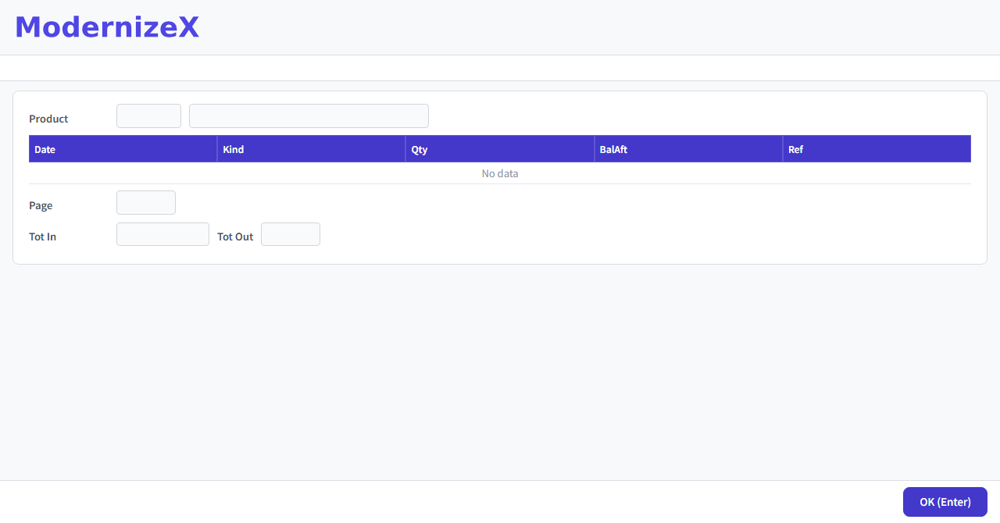

**項目詳細**

| № | コントロール名 | コントロールID | 種別 | Class／データ型 | Tab | 配置 | 文字数 | 値種別 | 初期表示 | 機能／表示データ（DBマッピング） | 取得元／条件 | 入力規則 | 備考 |
|---|---|---|---|---|---|---|---|---|---|---|---|---|---|
| **キー入力画面** ||||||||||||||
| 1 | Product Code | WK-KEY-PROD | 入力 | 9(8) | 1 | 左 | 8 | 数値 | 空 | Product Code（-） | 画面入力 | 必須／コード検証 | |
| 2 | From Date | WK-KEY-DATE | 入力 | 9(8) | 2 | 左 | 8 | 数値 | 空 | From Date（-） | 画面入力 | 必須／コード検証 | |
| **一覧画面** ||||||||||||||
| 3 | Product | WK-KEY-PROD | 表示 | - | - | 左 | 8 | 英数 | 空 | Product（-） | マスタ照合表示 | - | |
| 4 | Product | WK-PR-NAME | 表示 | - | - | 左 | 40 | 英数 | 空 | Product（-） | マスタ照合表示 | - | |
| 5 | - | WK-LIST(1) | 表示 | - | - | 左 | 78 | 英数 | 空 | -（-） | マスタ照合表示 | - | |
| 6 | - | WK-LIST(2) | 表示 | - | - | 左 | 78 | 英数 | 空 | -（-） | マスタ照合表示 | - | |
| 7 | - | WK-LIST(3) | 表示 | - | - | 左 | 78 | 英数 | 空 | -（-） | マスタ照合表示 | - | |
| 8 | - | WK-LIST(4) | 表示 | - | - | 左 | 78 | 英数 | 空 | -（-） | マスタ照合表示 | - | |
| 9 | - | WK-LIST(5) | 表示 | - | - | 左 | 78 | 英数 | 空 | -（-） | マスタ照合表示 | - | |
| 10 | - | WK-LIST(6) | 表示 | - | - | 左 | 78 | 英数 | 空 | -（-） | マスタ照合表示 | - | |
| 11 | - | WK-LIST(7) | 表示 | - | - | 左 | 78 | 英数 | 空 | -（-） | マスタ照合表示 | - | |
| 12 | - | WK-LIST(8) | 表示 | - | - | 左 | 78 | 英数 | 空 | -（-） | マスタ照合表示 | - | |
| 13 | - | WK-LIST(9) | 表示 | - | - | 左 | 78 | 英数 | 空 | -（-） | マスタ照合表示 | - | |
| 14 | - | WK-LIST(10) | 表示 | - | - | 左 | 78 | 英数 | 空 | -（-） | マスタ照合表示 | - | |
| 15 | - | WK-LIST(11) | 表示 | - | - | 左 | 78 | 英数 | 空 | -（-） | マスタ照合表示 | - | |
| 16 | - | WK-LIST(12) | 表示 | - | - | 左 | 78 | 英数 | 空 | -（-） | マスタ照合表示 | - | |
| 17 | Page | WK-PAGE-NO | 表示 | - | - | 左 | 4 | 英数 | 空 | Page（-） | マスタ照合表示 | - | |
| 18 | Tot In | WK-TOT-IN | 表示 | - | - | 左 | 11 | 英数 | 空 | Tot In（-） | マスタ照合表示 | - | |
| 19 | Tot Out | WK-TOT-OUT | 表示 | - | - | 左 | 11 | 英数 | 空 | Tot Out（-） | マスタ照合表示 | - | |

**項目状態**

> 記号: `レ`=フォーカス｜`必`=使用可（必須）｜`略`=使用可（省略可）｜`○`=使用可｜`×`=非表示｜`□`=表示のみ

| № | コントロール名 | 初期表示 | 入力／編集 | 確認 | 参照 |
|---|---|---|---|---|---|
| **キー入力画面** ||||||
| 1 | Product Code | ○ | 必 | □ | □ |
| 2 | From Date | ○ | 必 | □ | □ |
| **一覧画面** ||||||
| 3 | Product | □ | □ | □ | □ |
| 4 | Product | □ | □ | □ | □ |
| 5 | - | □ | □ | □ | □ |
| 6 | - | □ | □ | □ | □ |
| 7 | - | □ | □ | □ | □ |
| 8 | - | □ | □ | □ | □ |
| 9 | - | □ | □ | □ | □ |
| 10 | - | □ | □ | □ | □ |
| 11 | - | □ | □ | □ | □ |
| 12 | - | □ | □ | □ | □ |
| 13 | - | □ | □ | □ | □ |
| 14 | - | □ | □ | □ | □ |
| 15 | - | □ | □ | □ | □ |
| 16 | - | □ | □ | □ | □ |
| 17 | Page | □ | □ | □ | □ |
| 18 | Tot In | □ | □ | □ | □ |
| 19 | Tot Out | □ | □ | □ | □ |

### 2.32 IV0050 — 倉庫間在庫移動

**レイアウト**

モダナイズ後の画面（Vue SFC `src/programs/iv0050/` を WebSocket ターミナルランタイムでレンダリング）。

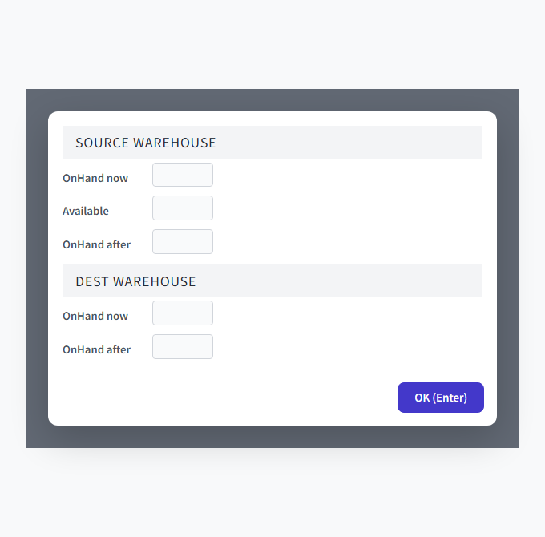

**項目詳細**

| № | コントロール名 | コントロールID | 種別 | Class／データ型 | Tab | 配置 | 文字数 | 値種別 | 初期表示 | 機能／表示データ（DBマッピング） | 取得元／条件 | 入力規則 | 備考 |
|---|---|---|---|---|---|---|---|---|---|---|---|---|---|
| **保守画面** ||||||||||||||
| 1 | Product Code | WK-KEY-PROD | 入力 | 9(8) | 1 | 左 | 8 | 数値 | 空 | Product Code（-） | 画面入力 | 必須／コード検証 | |
| 2 | From Whse | WK-FROM-WHSE | 入力 | 9(3) | 2 | 左 | 3 | 数値 | 空 | From Whse（-） | 画面入力 | 必須／コード検証 | |
| 3 | To   Whse | WK-TO-WHSE | 入力 | 9(3) | 3 | 左 | 3 | 数値 | 空 | To   Whse（-） | 画面入力 | 必須／コード検証 | |
| 4 | Transfer Qty | WK-TR-QTY | 入力 | S9(9) | 4 | 左 | 9 | 数値 | 空 | Transfer Qty（-） | 画面入力 | 必須／コード検証 | |
| 5 | Confirm transfer (Y/N) | WK-CONFIRM | 入力 | X(1) | 5 | 左 | 1 | 英数 | 空 | Confirm transfer (Y/N)（-） | 画面入力 | 入力 | |
| 6 | Product Code | WK-PR-NAME | 表示 | - | - | 左 | 40 | 英数 | 空 | Product Code（-） | マスタ照合表示 | - | |
| 7 | From Whse | WK-FROM-NAME | 表示 | - | - | 左 | 30 | 英数 | 空 | From Whse（-） | マスタ照合表示 | - | |
| 8 | To   Whse | WK-TO-NAME | 表示 | - | - | 左 | 30 | 英数 | 空 | To   Whse（-） | マスタ照合表示 | - | |
| 9 | OnHand now | WK-SRC-ONHAND | 表示 | - | - | 左 | 11 | 英数 | 空 | OnHand now（-） | マスタ照合表示 | - | |
| 10 | Available | WK-AVAIL | 表示 | - | - | 左 | 11 | 英数 | 空 | Available（-） | マスタ照合表示 | - | |
| 11 | OnHand after | WK-SRC-NEW | 表示 | - | - | 左 | 11 | 英数 | 空 | OnHand after（-） | マスタ照合表示 | - | |
| 12 | OnHand now | WK-DST-ONHAND | 表示 | - | - | 左 | 11 | 英数 | 空 | OnHand now（-） | マスタ照合表示 | - | |
| 13 | OnHand after | WK-DST-NEW | 表示 | - | - | 左 | 11 | 英数 | 空 | OnHand after（-） | マスタ照合表示 | - | |

**項目状態**

> 記号: `レ`=フォーカス｜`必`=使用可（必須）｜`略`=使用可（省略可）｜`○`=使用可｜`×`=非表示｜`□`=表示のみ

| № | コントロール名 | 初期表示 | 入力／編集 | 確認 | 参照 |
|---|---|---|---|---|---|
| **保守画面** ||||||
| 1 | Product Code | ○ | 必 | □ | □ |
| 2 | From Whse | ○ | 必 | □ | □ |
| 3 | To   Whse | ○ | 必 | □ | □ |
| 4 | Transfer Qty | ○ | 必 | □ | □ |
| 5 | Confirm transfer (Y/N) | ○ | 必 | □ | □ |
| 6 | Product Code | □ | □ | □ | □ |
| 7 | From Whse | □ | □ | □ | □ |
| 8 | To   Whse | □ | □ | □ | □ |
| 9 | OnHand now | □ | □ | □ | □ |
| 10 | Available | □ | □ | □ | □ |
| 11 | OnHand after | □ | □ | □ | □ |
| 12 | OnHand now | □ | □ | □ | □ |
| 13 | OnHand after | □ | □ | □ | □ |

### 2.33 AR0010 — 入金入力

**レイアウト**

モダナイズ後の画面（Vue SFC `src/programs/ar0010/` を WebSocket ターミナルランタイムでレンダリング）。

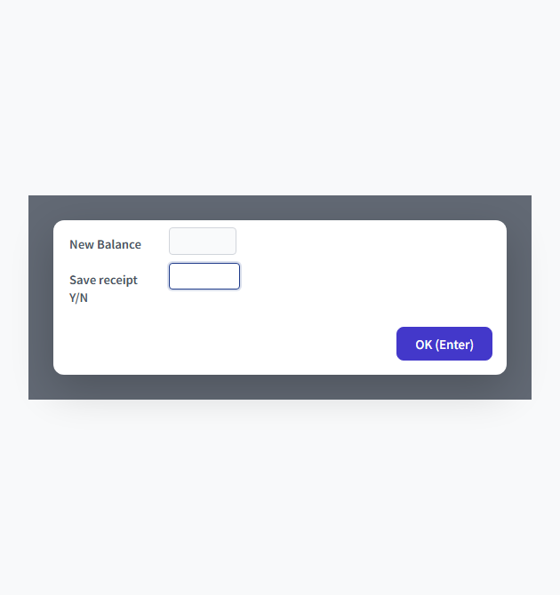

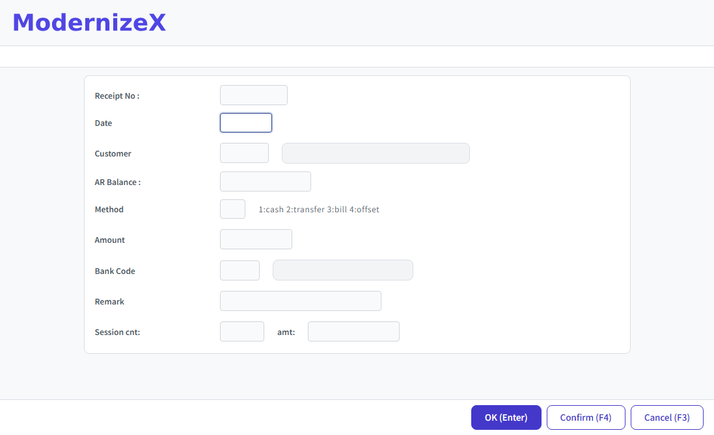

**項目詳細**

| № | コントロール名 | コントロールID | 種別 | Class／データ型 | Tab | 配置 | 文字数 | 値種別 | 初期表示 | 機能／表示データ（DBマッピング） | 取得元／条件 | 入力規則 | 備考 |
|---|---|---|---|---|---|---|---|---|---|---|---|---|---|
| **保守画面** ||||||||||||||
| 1 | Date | RE-DATE | 入力 | 9(8) | 1 | 左 | 8 | 数値 | 空 | Date（入金(RCPTF)） | 画面入力 | 必須／コード検証 | |
| 2 | Customer | RE-CUST | 入力 | 9(6) | 2 | 左 | 6 | 数値 | 空 | Customer（入金(RCPTF)） | 画面入力 | 必須／コード検証 | |
| 3 | Method | RE-METHOD | 入力 | 9(1) | 3 | 左 | 1 | 数値 | 空 | Method（入金(RCPTF)） | 画面入力 | 必須／コード検証 | |
| 4 | Amount | RE-AMOUNT | 入力 | S9(11) | 4 | 左 | 11 | 数値 | 空 | Amount（入金(RCPTF)） | 画面入力 | 必須／コード検証 | |
| 5 | Bank Code | RE-BANK-CODE | 入力 | 9(4) | 5 | 左 | 4 | 数値 | 空 | Bank Code（入金(RCPTF)） | 画面入力 | 必須／コード検証 | |
| 6 | Remark | RE-REMARK | 入力 | X(30) | 6 | 左 | 30 | 英数 | 空 | Remark（入金(RCPTF)） | 画面入力 | 入力 | |
| 7 | Save receipt Y/N | WK-CONFIRM | 入力 | X(1) | 7 | 左 | 1 | 英数 | 空 | Save receipt Y/N（-） | 画面入力 | 入力 | |
| 8 | Receipt No | WK-RE-NO-D | 表示 | - | - | 左 | 10 | 英数 | 空 | Receipt No（-） | マスタ照合表示 | - | |
| 9 | Customer | WK-CUST-NAME | 表示 | - | - | 左 | 40 | 英数 | 空 | Customer（-） | マスタ照合表示 | - | |
| 10 | AR Balance | WK-CUR-BAL | 表示 | - | - | 左 | 15 | 英数 | 空 | AR Balance（-） | マスタ照合表示 | - | |
| 11 | Bank Code | WK-BANK-NAME | 表示 | - | - | 左 | 30 | 英数 | 空 | Bank Code（-） | マスタ照合表示 | - | |
| 12 | Session cnt | WK-SESS-CNT | 表示 | - | - | 左 | 5 | 英数 | 空 | Session cnt（-） | マスタ照合表示 | - | |
| 13 | amt | WK-SESS-AMT | 表示 | - | - | 左 | 15 | 英数 | 空 | amt（-） | マスタ照合表示 | - | |
| 14 | New Balance | WK-NEW-BAL | 表示 | - | - | 左 | 15 | 英数 | 空 | New Balance（-） | マスタ照合表示 | - | |

**項目状態**

> 記号: `レ`=フォーカス｜`必`=使用可（必須）｜`略`=使用可（省略可）｜`○`=使用可｜`×`=非表示｜`□`=表示のみ

| № | コントロール名 | 初期表示 | 入力／編集 | 確認 | 参照 |
|---|---|---|---|---|---|
| **保守画面** ||||||
| 1 | Date | ○ | 必 | □ | □ |
| 2 | Customer | ○ | 必 | □ | □ |
| 3 | Method | ○ | 必 | □ | □ |
| 4 | Amount | ○ | 必 | □ | □ |
| 5 | Bank Code | ○ | 必 | □ | □ |
| 6 | Remark | ○ | 必 | □ | □ |
| 7 | Save receipt Y/N | ○ | 必 | □ | □ |
| 8 | Receipt No | □ | □ | □ | □ |
| 9 | Customer | □ | □ | □ | □ |
| 10 | AR Balance | □ | □ | □ | □ |
| 11 | Bank Code | □ | □ | □ | □ |
| 12 | Session cnt | □ | □ | □ | □ |
| 13 | amt | □ | □ | □ | □ |
| 14 | New Balance | □ | □ | □ | □ |

### 2.34 AR0020 — 売掛照会・年齢表

**レイアウト**

モダナイズ後の画面（Vue SFC `src/programs/ar0020/` を WebSocket ターミナルランタイムでレンダリング）。

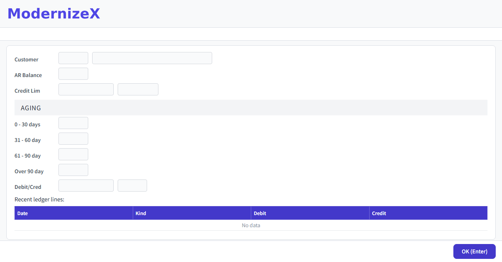

**項目詳細**

| № | コントロール名 | コントロールID | 種別 | Class／データ型 | Tab | 配置 | 文字数 | 値種別 | 初期表示 | 機能／表示データ（DBマッピング） | 取得元／条件 | 入力規則 | 備考 |
|---|---|---|---|---|---|---|---|---|---|---|---|---|---|
| **キー入力画面** ||||||||||||||
| 1 | Customer Code | WK-KEY-CUST | 入力 | 9(6) | 1 | 左 | 6 | 数値 | 空 | Customer Code（-） | 画面入力 | 必須／コード検証 | |
| **年齢表画面** ||||||||||||||
| 2 | Customer | WK-KEY-CUST | 表示 | - | - | 左 | 6 | 英数 | 空 | Customer（-） | マスタ照合表示 | - | |
| 3 | Customer | WK-CUST-NAME | 表示 | - | - | 左 | 40 | 英数 | 空 | Customer（-） | マスタ照合表示 | - | |
| 4 | AR Balance | WK-CUR-BAL | 表示 | - | - | 左 | 15 | 英数 | 空 | AR Balance（-） | マスタ照合表示 | - | |
| 5 | Credit Lim | WK-CR-LIMIT | 表示 | - | - | 左 | 15 | 英数 | 空 | Credit Lim（-） | マスタ照合表示 | - | |
| 6 | Credit Lim | WK-OVER | 表示 | - | - | 左 | 10 | 英数 | 空 | Credit Lim（-） | マスタ照合表示 | - | |
| 7 | 0 - 30 days | WK-B030 | 表示 | - | - | 左 | 15 | 英数 | 空 | 0 - 30 days（-） | マスタ照合表示 | - | |
| 8 | 31 - 60 day | WK-B060 | 表示 | - | - | 左 | 15 | 英数 | 空 | 31 - 60 day（-） | マスタ照合表示 | - | |
| 9 | 61 - 90 day | WK-B090 | 表示 | - | - | 左 | 15 | 英数 | 空 | 61 - 90 day（-） | マスタ照合表示 | - | |
| 10 | Over 90 day | WK-B90P | 表示 | - | - | 左 | 15 | 英数 | 空 | Over 90 day（-） | マスタ照合表示 | - | |
| 11 | Debit/Cred | WK-TOT-DR | 表示 | - | - | 左 | 15 | 英数 | 空 | Debit/Cred（-） | マスタ照合表示 | - | |
| 12 | Debit/Cred | WK-TOT-CR | 表示 | - | - | 左 | 15 | 英数 | 空 | Debit/Cred（-） | マスタ照合表示 | - | |
| 13 | - | WK-LIST(1) | 表示 | - | - | 左 | 78 | 英数 | 空 | -（-） | マスタ照合表示 | - | |
| 14 | - | WK-LIST(2) | 表示 | - | - | 左 | 78 | 英数 | 空 | -（-） | マスタ照合表示 | - | |
| 15 | - | WK-LIST(3) | 表示 | - | - | 左 | 78 | 英数 | 空 | -（-） | マスタ照合表示 | - | |
| 16 | - | WK-LIST(4) | 表示 | - | - | 左 | 78 | 英数 | 空 | -（-） | マスタ照合表示 | - | |
| 17 | - | WK-LIST(5) | 表示 | - | - | 左 | 78 | 英数 | 空 | -（-） | マスタ照合表示 | - | |
| 18 | - | WK-LIST(6) | 表示 | - | - | 左 | 78 | 英数 | 空 | -（-） | マスタ照合表示 | - | |
| 19 | - | WK-LIST(7) | 表示 | - | - | 左 | 78 | 英数 | 空 | -（-） | マスタ照合表示 | - | |
| 20 | - | WK-LIST(8) | 表示 | - | - | 左 | 78 | 英数 | 空 | -（-） | マスタ照合表示 | - | |

**項目状態**

> 記号: `レ`=フォーカス｜`必`=使用可（必須）｜`略`=使用可（省略可）｜`○`=使用可｜`×`=非表示｜`□`=表示のみ

| № | コントロール名 | 初期表示 | 入力／編集 | 確認 | 参照 |
|---|---|---|---|---|---|
| **キー入力画面** ||||||
| 1 | Customer Code | ○ | 必 | □ | □ |
| **年齢表画面** ||||||
| 2 | Customer | □ | □ | □ | □ |
| 3 | Customer | □ | □ | □ | □ |
| 4 | AR Balance | □ | □ | □ | □ |
| 5 | Credit Lim | □ | □ | □ | □ |
| 6 | Credit Lim | □ | □ | □ | □ |
| 7 | 0 - 30 days | □ | □ | □ | □ |
| 8 | 31 - 60 day | □ | □ | □ | □ |
| 9 | 61 - 90 day | □ | □ | □ | □ |
| 10 | Over 90 day | □ | □ | □ | □ |
| 11 | Debit/Cred | □ | □ | □ | □ |
| 12 | Debit/Cred | □ | □ | □ | □ |
| 13 | - | □ | □ | □ | □ |
| 14 | - | □ | □ | □ | □ |
| 15 | - | □ | □ | □ | □ |
| 16 | - | □ | □ | □ | □ |
| 17 | - | □ | □ | □ | □ |
| 18 | - | □ | □ | □ | □ |
| 19 | - | □ | □ | □ | □ |
| 20 | - | □ | □ | □ | □ |

### 2.35 AP0010 — 支払入力

**レイアウト**

モダナイズ後の画面（Vue SFC `src/programs/ap0010/` を WebSocket ターミナルランタイムでレンダリング）。

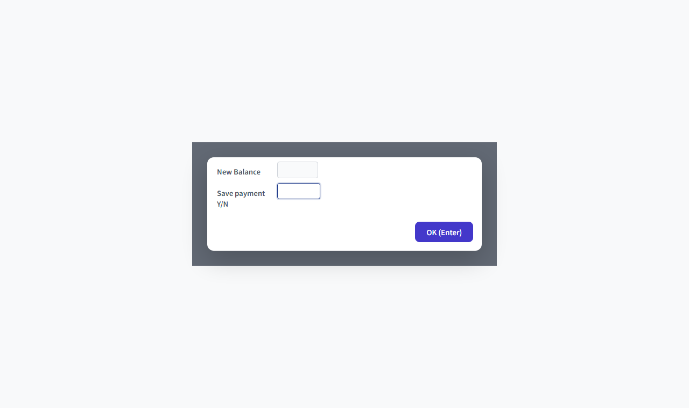

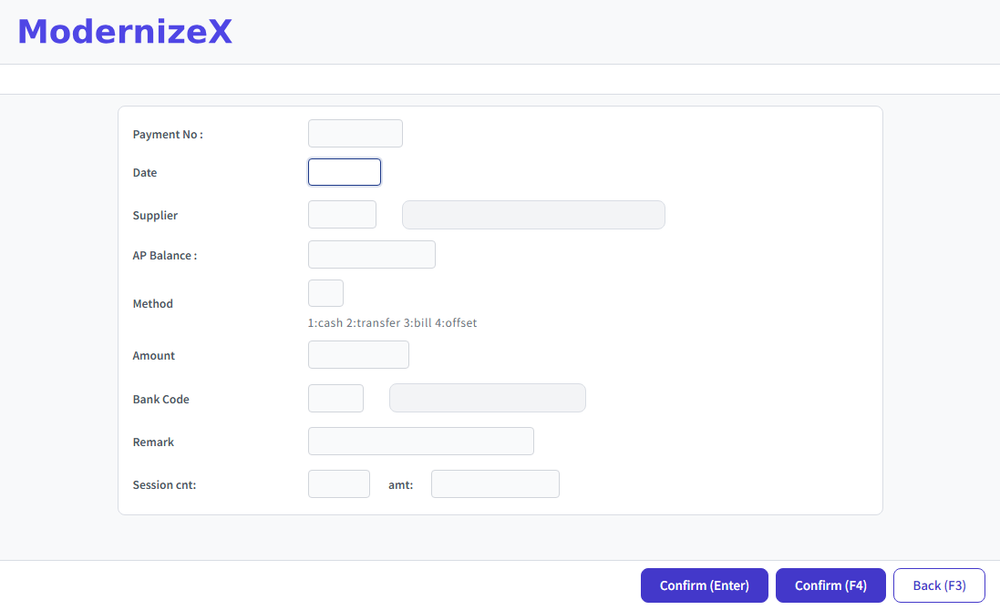

**項目詳細**

| № | コントロール名 | コントロールID | 種別 | Class／データ型 | Tab | 配置 | 文字数 | 値種別 | 初期表示 | 機能／表示データ（DBマッピング） | 取得元／条件 | 入力規則 | 備考 |
|---|---|---|---|---|---|---|---|---|---|---|---|---|---|
| **保守画面** ||||||||||||||
| 1 | Date | PY-DATE | 入力 | 9(8) | 1 | 左 | 8 | 数値 | 空 | Date（支払(PAYF)） | 画面入力 | 必須／コード検証 | |
| 2 | Supplier | PY-SUPP | 入力 | 9(6) | 2 | 左 | 6 | 数値 | 空 | Supplier（支払(PAYF)） | 画面入力 | 必須／コード検証 | |
| 3 | Method | PY-METHOD | 入力 | 9(1) | 3 | 左 | 1 | 数値 | 空 | Method（支払(PAYF)） | 画面入力 | 必須／コード検証 | |
| 4 | Amount | PY-AMOUNT | 入力 | S9(11) | 4 | 左 | 11 | 数値 | 空 | Amount（支払(PAYF)） | 画面入力 | 必須／コード検証 | |
| 5 | Bank Code | PY-BANK-CODE | 入力 | 9(4) | 5 | 左 | 4 | 数値 | 空 | Bank Code（支払(PAYF)） | 画面入力 | 必須／コード検証 | |
| 6 | Remark | PY-REMARK | 入力 | X(30) | 6 | 左 | 30 | 英数 | 空 | Remark（支払(PAYF)） | 画面入力 | 入力 | |
| 7 | Save payment Y/N | WK-CONFIRM | 入力 | X(1) | 7 | 左 | 1 | 英数 | 空 | Save payment Y/N（-） | 画面入力 | 入力 | |
| 8 | Payment No | WK-PY-NO-D | 表示 | - | - | 左 | 10 | 英数 | 空 | Payment No（-） | マスタ照合表示 | - | |
| 9 | Supplier | WK-SUPP-NAME | 表示 | - | - | 左 | 40 | 英数 | 空 | Supplier（-） | マスタ照合表示 | - | |
| 10 | AP Balance | WK-CUR-BAL | 表示 | - | - | 左 | 15 | 英数 | 空 | AP Balance（-） | マスタ照合表示 | - | |
| 11 | Bank Code | WK-BANK-NAME | 表示 | - | - | 左 | 30 | 英数 | 空 | Bank Code（-） | マスタ照合表示 | - | |
| 12 | Session cnt | WK-SESS-CNT | 表示 | - | - | 左 | 5 | 英数 | 空 | Session cnt（-） | マスタ照合表示 | - | |
| 13 | amt | WK-SESS-AMT | 表示 | - | - | 左 | 15 | 英数 | 空 | amt（-） | マスタ照合表示 | - | |
| 14 | New Balance | WK-NEW-BAL | 表示 | - | - | 左 | 15 | 英数 | 空 | New Balance（-） | マスタ照合表示 | - | |

**項目状態**

> 記号: `レ`=フォーカス｜`必`=使用可（必須）｜`略`=使用可（省略可）｜`○`=使用可｜`×`=非表示｜`□`=表示のみ

| № | コントロール名 | 初期表示 | 入力／編集 | 確認 | 参照 |
|---|---|---|---|---|---|
| **保守画面** ||||||
| 1 | Date | ○ | 必 | □ | □ |
| 2 | Supplier | ○ | 必 | □ | □ |
| 3 | Method | ○ | 必 | □ | □ |
| 4 | Amount | ○ | 必 | □ | □ |
| 5 | Bank Code | ○ | 必 | □ | □ |
| 6 | Remark | ○ | 必 | □ | □ |
| 7 | Save payment Y/N | ○ | 必 | □ | □ |
| 8 | Payment No | □ | □ | □ | □ |
| 9 | Supplier | □ | □ | □ | □ |
| 10 | AP Balance | □ | □ | □ | □ |
| 11 | Bank Code | □ | □ | □ | □ |
| 12 | Session cnt | □ | □ | □ | □ |
| 13 | amt | □ | □ | □ | □ |
| 14 | New Balance | □ | □ | □ | □ |

### 2.36 AP0020 — 買掛照会

**レイアウト**

モダナイズ後の画面（Vue SFC `src/programs/ap0020/` を WebSocket ターミナルランタイムでレンダリング）。

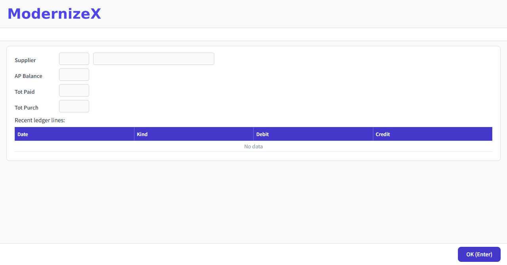

**項目詳細**

| № | コントロール名 | コントロールID | 種別 | Class／データ型 | Tab | 配置 | 文字数 | 値種別 | 初期表示 | 機能／表示データ（DBマッピング） | 取得元／条件 | 入力規則 | 備考 |
|---|---|---|---|---|---|---|---|---|---|---|---|---|---|
| **キー入力画面** ||||||||||||||
| 1 | Supplier Code | WK-KEY-SUPP | 入力 | 9(6) | 1 | 左 | 6 | 数値 | 空 | Supplier Code（-） | 画面入力 | 必須／コード検証 | |
| **照会画面** ||||||||||||||
| 2 | Supplier | WK-KEY-SUPP | 表示 | - | - | 左 | 6 | 英数 | 空 | Supplier（-） | マスタ照合表示 | - | |
| 3 | Supplier | WK-SUPP-NAME | 表示 | - | - | 左 | 40 | 英数 | 空 | Supplier（-） | マスタ照合表示 | - | |
| 4 | AP Balance | WK-CUR-BAL | 表示 | - | - | 左 | 15 | 英数 | 空 | AP Balance（-） | マスタ照合表示 | - | |
| 5 | Tot Paid | WK-TOT-DR | 表示 | - | - | 左 | 15 | 英数 | 空 | Tot Paid（-） | マスタ照合表示 | - | |
| 6 | Tot Purch | WK-TOT-CR | 表示 | - | - | 左 | 15 | 英数 | 空 | Tot Purch（-） | マスタ照合表示 | - | |
| 7 | - | WK-LIST(1) | 表示 | - | - | 左 | 78 | 英数 | 空 | -（-） | マスタ照合表示 | - | |
| 8 | - | WK-LIST(2) | 表示 | - | - | 左 | 78 | 英数 | 空 | -（-） | マスタ照合表示 | - | |
| 9 | - | WK-LIST(3) | 表示 | - | - | 左 | 78 | 英数 | 空 | -（-） | マスタ照合表示 | - | |
| 10 | - | WK-LIST(4) | 表示 | - | - | 左 | 78 | 英数 | 空 | -（-） | マスタ照合表示 | - | |
| 11 | - | WK-LIST(5) | 表示 | - | - | 左 | 78 | 英数 | 空 | -（-） | マスタ照合表示 | - | |
| 12 | - | WK-LIST(6) | 表示 | - | - | 左 | 78 | 英数 | 空 | -（-） | マスタ照合表示 | - | |
| 13 | - | WK-LIST(7) | 表示 | - | - | 左 | 78 | 英数 | 空 | -（-） | マスタ照合表示 | - | |
| 14 | - | WK-LIST(8) | 表示 | - | - | 左 | 78 | 英数 | 空 | -（-） | マスタ照合表示 | - | |
| 15 | - | WK-LIST(9) | 表示 | - | - | 左 | 78 | 英数 | 空 | -（-） | マスタ照合表示 | - | |
| 16 | - | WK-LIST(10) | 表示 | - | - | 左 | 78 | 英数 | 空 | -（-） | マスタ照合表示 | - | |
| 17 | - | WK-LIST(11) | 表示 | - | - | 左 | 78 | 英数 | 空 | -（-） | マスタ照合表示 | - | |
| 18 | - | WK-LIST(12) | 表示 | - | - | 左 | 78 | 英数 | 空 | -（-） | マスタ照合表示 | - | |

**項目状態**

> 記号: `レ`=フォーカス｜`必`=使用可（必須）｜`略`=使用可（省略可）｜`○`=使用可｜`×`=非表示｜`□`=表示のみ

| № | コントロール名 | 初期表示 | 入力／編集 | 確認 | 参照 |
|---|---|---|---|---|---|
| **キー入力画面** ||||||
| 1 | Supplier Code | ○ | 必 | □ | □ |
| **照会画面** ||||||
| 2 | Supplier | □ | □ | □ | □ |
| 3 | Supplier | □ | □ | □ | □ |
| 4 | AP Balance | □ | □ | □ | □ |
| 5 | Tot Paid | □ | □ | □ | □ |
| 6 | Tot Purch | □ | □ | □ | □ |
| 7 | - | □ | □ | □ | □ |
| 8 | - | □ | □ | □ | □ |
| 9 | - | □ | □ | □ | □ |
| 10 | - | □ | □ | □ | □ |
| 11 | - | □ | □ | □ | □ |
| 12 | - | □ | □ | □ | □ |
| 13 | - | □ | □ | □ | □ |
| 14 | - | □ | □ | □ | □ |
| 15 | - | □ | □ | □ | □ |
| 16 | - | □ | □ | □ | □ |
| 17 | - | □ | □ | □ | □ |
| 18 | - | □ | □ | □ | □ |

## 3. チェック仕様

> **画面 ID ごとに 1 ブロック（3.1〜3.36、番号は §2 と一致）。** 本システムには EI/EF 等の
> メッセージコード体系は無く、各画面はエラー・警告・確認の文言を画面下部のメッセージ行に
> 直接表示する。メッセージ内容は画面に表示される文言を逐語で記す。種別: E=エラー／W=警告／
> C=確認。表示: A=項目の横／メッセージ行、P=ポップアップ。

### 3.1 MENU00 — サインオン・メインメニュー

| No. | タイミング | 条件 | 種別 | 表示 | Message ID | メッセージ内容 | 埋め込み文字列 |
|---|---|---|---|---|---|---|---|
| 1 | ログイン画面表示時 | 起動直後、ログイン ID とパスワードの入力を促すとき | C | A | - | Enter login - PF3 to quit | - |
| 2 | ログイン ID・パスワード入力（ENTER） | 入力されたログイン ID とパスワードの組合せが認証できないとき | E | A | - | Invalid login or password | - |
| 3 | ログイン ID・パスワード入力（ENTER） | 認証失敗が上限回数に達したとき | E | A | - | Too many attempts - exiting | - |
| 4 | メインメニュー番号入力時 | 選択された業務グループ番号が有効範囲外のとき | E | A | - | Invalid selection | - |
| 5 | 業務グループ「7. Batch / Closing」選択時 | 当該オペレーターにバッチ／締めの操作権限が無いとき | E | A | - | Not authorised for batch/closing | - |
| 6 | サブメニュー番号入力時 | 選択されたサブメニュー番号が有効範囲外のとき | E | A | - | Invalid selection | - |
| 7 | プログラム起動時 | 選択された業務プログラムが未提供のとき | W | A | - | Program not available yet | - |
| 8 | サインオフ時 | メインメニューで `0`（サインオフ）を選択したとき | C | A | - | Signed off - thank you | - |

### 3.2 MS0010 — 得意先マスタ保守

| No. | タイミング | 条件 | 種別 | 表示 | Message ID | メッセージ内容 | 埋め込み文字列 |
|---|---|---|---|---|---|---|---|
| 1 | キー入力時 | 定義外のファンクションキーを押したとき | E | A | - | Invalid function key | - |
| 2 | キー入力（ENTER） | 得意先コードが 0 のとき | E | A | - | Customer code must not be zero | - |
| 3 | 得意先マスタ照合後 | 入力コードの得意先が未登録のとき（新規登録に切替） | C | A | - | New customer - enter details | - |
| 4 | 得意先マスタ照合後 | 入力コードが論理削除済みの得意先のとき（再登録に切替） | C | A | - | Deleted customer - re-registering | - |
| 5 | 得意先マスタ照合後 | 入力コードの得意先が既存のとき（変更または PF9 削除） | C | A | - | Existing customer - change or PF9 delete | - |
| 6 | 明細入力（ENTER） | 得意先名が未入力のとき | E | A | - | Name is required | - |
| 7 | 明細入力（ENTER） | 入力した地域コードが地域マスタに存在しないとき | E | A | - | Region code not found | - |
| 8 | 明細入力（ENTER） | 入力した担当社員コードが社員マスタに存在しないとき | E | A | - | Sales rep not found | - |
| 9 | 明細入力（ENTER） | 入力した銀行コードが銀行マスタに存在しないとき | E | A | - | Bank code not found | - |
| 10 | 明細入力（ENTER） | 与信限度額が負数のとき | E | A | - | Credit limit cannot be negative | - |
| 11 | 登録確定時 | 同一コードが既に存在し登録に失敗したとき | E | A | - | Write failed - duplicate | - |
| 12 | 登録確定後 | 新規得意先の登録が完了したとき | C | A | - | Customer added | - |
| 13 | 変更確定時 | 既存得意先の更新に失敗したとき | E | A | - | Update failed | - |
| 14 | 変更確定後 | 既存得意先の更新が完了したとき | C | A | - | Customer updated | - |
| 15 | 削除操作（PF9） | 削除対象を確定するため確認入力を促すとき | C | A | - | Press Y then ENTER to delete | - |
| 16 | 削除操作（PF9） | 表示中の得意先が無く削除できないとき | W | A | - | Nothing to delete | - |
| 17 | 削除確定時 | 得意先の削除に失敗したとき | E | A | - | Delete failed | - |
| 18 | 削除確定後 | 得意先の削除が完了したとき | C | A | - | Customer deleted | - |
| 19 | 削除確認入力 | 確認で `Y` 以外を入力し削除を取りやめたとき | C | A | - | Delete cancelled | - |

### 3.3 MS0020 — 仕入先マスタ保守

| No. | タイミング | 条件 | 種別 | 表示 | Message ID | メッセージ内容 | 埋め込み文字列 |
|---|---|---|---|---|---|---|---|
| 1 | キー入力時 | 定義外のファンクションキーを押したとき | E | A | - | Invalid function key | - |
| 2 | キー入力（ENTER） | 仕入先コードが 0 のとき | E | A | - | Supplier code must not be zero | - |
| 3 | 仕入先マスタ照合後 | 入力コードの仕入先が未登録のとき（新規登録に切替） | C | A | - | New supplier - enter details | - |
| 4 | 仕入先マスタ照合後 | 入力コードが論理削除済みの仕入先のとき（再登録に切替） | C | A | - | Deleted supplier - re-registering | - |
| 5 | 仕入先マスタ照合後 | 入力コードの仕入先が既存のとき（変更または PF9 削除） | C | A | - | Existing supplier - change or PF9 delete | - |
| 6 | 明細入力（ENTER） | 仕入先名が未入力のとき | E | A | - | Name is required | - |
| 7 | 明細入力（ENTER） | 締日が 1〜31 または 99 以外のとき | E | A | - | Closing day must be 1-31 or 99 | - |
| 8 | 明細入力（ENTER） | 支払日が 1〜31 または 99 以外のとき | E | A | - | Pay day must be 1-31 or 99 | - |
| 9 | 明細入力（ENTER） | 支払方法が 1〜3 以外のとき | E | A | - | Pay method must be 1-3 | - |
| 10 | 明細入力（ENTER） | 税区分が 1〜3 以外のとき | E | A | - | Tax type must be 1-3 | - |
| 11 | 明細入力（ENTER） | 入力した銀行コードが銀行マスタに存在しないとき | E | A | - | Bank code not found | - |
| 12 | 登録確定時 | 同一コードが既に存在し登録に失敗したとき | E | A | - | Write failed - duplicate | - |
| 13 | 登録確定後 | 新規仕入先の登録が完了したとき | C | A | - | Supplier added | - |
| 14 | 変更確定時 | 既存仕入先の更新に失敗したとき | E | A | - | Update failed | - |
| 15 | 変更確定後 | 既存仕入先の更新が完了したとき | C | A | - | Supplier updated | - |
| 16 | 削除操作（PF9） | 削除対象を確定するため確認入力を促すとき | C | A | - | Press Y then ENTER to delete | - |
| 17 | 削除操作（PF9） | 表示中の仕入先が無く削除できないとき | W | A | - | Nothing to delete | - |
| 18 | 削除確定時 | 仕入先の削除に失敗したとき | E | A | - | Delete failed | - |
| 19 | 削除確定後 | 仕入先の削除が完了したとき | C | A | - | Supplier deleted | - |
| 20 | 削除確認入力 | 確認で `Y` 以外を入力し削除を取りやめたとき | C | A | - | Delete cancelled | - |

### 3.4 MS0030 — 商品マスタ保守

| No. | タイミング | 条件 | 種別 | 表示 | Message ID | メッセージ内容 | 埋め込み文字列 |
|---|---|---|---|---|---|---|---|
| 1 | キー入力時 | 定義外のファンクションキーを押したとき | E | A | - | Invalid function key | - |
| 2 | キー入力（ENTER） | 商品コードが 0 のとき | E | A | - | Product code must not be zero | - |
| 3 | 商品マスタ照合後 | 入力コードの商品が未登録のとき（新規登録に切替） | C | A | - | New product - enter details | - |
| 4 | 商品マスタ照合後 | 入力コードが論理削除済みの商品のとき（再登録に切替） | C | A | - | Deleted product - re-registering | - |
| 5 | 商品マスタ照合後 | 入力コードの商品が既存のとき（変更または PF9 削除） | C | A | - | Existing product - change or PF9 delete | - |
| 6 | 明細入力（ENTER） | 商品名が未入力のとき | E | A | - | Name is required | - |
| 7 | 明細入力（ENTER） | 商品分類が未入力のとき | E | A | - | Category is required | - |
| 8 | 明細入力（ENTER） | 入力した分類コードが商品分類マスタに存在しないとき | E | A | - | Category code not found | - |
| 9 | 明細入力（ENTER） | 税区分が 1〜3 以外のとき | E | A | - | Tax category must be 1-3 | - |
| 10 | 明細入力（ENTER） | 在庫管理区分が 0 または 1 以外のとき | E | A | - | Stock mgmt must be 0 or 1 | - |
| 11 | 明細入力（ENTER） | 原価が負数のとき | E | A | - | Cost cannot be negative | - |
| 12 | 明細入力（ENTER） | 定価が負数のとき | E | A | - | List price cannot be negative | - |
| 13 | 明細入力（ENTER） | ランク単価が負数のとき | E | A | - | Rank price cannot be negative | - |
| 14 | 明細入力（ENTER） | 在庫水準が負数のとき | E | A | - | Stock levels cannot be negative | - |
| 15 | 明細入力（ENTER） | 発注点数量が負数のとき | E | A | - | Reorder qty cannot be negative | - |
| 16 | 明細入力（ENTER） | 入力した既定仕入先コードが仕入先マスタに存在しないとき | E | A | - | Default supplier not found | - |
| 17 | 明細入力（ENTER） | 入力した既定倉庫コードが倉庫マスタに存在しないとき | E | A | - | Default warehouse not found | - |
| 18 | 登録確定時 | 同一コードが既に存在し登録に失敗したとき | E | A | - | Write failed - duplicate | - |
| 19 | 登録確定後 | 新規商品の登録が完了したとき | C | A | - | Product added | - |
| 20 | 変更確定時 | 既存商品の更新に失敗したとき | E | A | - | Update failed | - |
| 21 | 変更確定後 | 既存商品の更新が完了したとき | C | A | - | Product updated | - |
| 22 | 削除操作（PF9） | 削除対象を確定するため確認入力を促すとき | C | A | - | Press Y then ENTER to delete | - |
| 23 | 削除操作（PF9） | 表示中の商品が無く削除できないとき | W | A | - | Nothing to delete | - |
| 24 | 削除確定時 | 商品の削除に失敗したとき | E | A | - | Delete failed | - |
| 25 | 削除確定後 | 商品の削除が完了したとき | C | A | - | Product deleted | - |
| 26 | 削除確認入力 | 確認で `Y` 以外を入力し削除を取りやめたとき | C | A | - | Delete cancelled | - |

### 3.5 MS0040 — 倉庫マスタ保守

| No. | タイミング | 条件 | 種別 | 表示 | Message ID | メッセージ内容 | 埋め込み文字列 |
|---|---|---|---|---|---|---|---|
| 1 | キー入力時 | 定義外のファンクションキーを押したとき | E | A | - | Invalid function key | - |
| 2 | キー入力（ENTER） | 倉庫コードが 0 のとき | E | A | - | Warehouse code must not be zero | - |
| 3 | 倉庫マスタ照合後 | 入力コードの倉庫が未登録のとき（新規登録に切替） | C | A | - | New warehouse - enter details | - |
| 4 | 倉庫マスタ照合後 | 入力コードが論理削除済みの倉庫のとき（再登録に切替） | C | A | - | Deleted warehouse - re-registering | - |
| 5 | 倉庫マスタ照合後 | 入力コードの倉庫が既存のとき（変更または PF9 削除） | C | A | - | Existing warehouse - change or PF9 delete | - |
| 6 | 明細入力（ENTER） | 倉庫名が未入力のとき | E | A | - | Name is required | - |
| 7 | 明細入力（ENTER） | 倉庫区分が 1〜3 以外のとき | E | A | - | Type must be 1-3 | - |
| 8 | 明細入力（ENTER） | 入力した管理者（社員）コードが社員マスタに存在しないとき | E | A | - | Manager code not found | - |
| 9 | 登録確定時 | 同一コードが既に存在し登録に失敗したとき | E | A | - | Write failed - duplicate | - |
| 10 | 登録確定後 | 新規倉庫の登録が完了したとき | C | A | - | Warehouse added | - |
| 11 | 変更確定時 | 既存倉庫の更新に失敗したとき | E | A | - | Update failed | - |
| 12 | 変更確定後 | 既存倉庫の更新が完了したとき | C | A | - | Warehouse updated | - |
| 13 | 削除操作（PF9） | 削除対象を確定するため確認入力を促すとき | C | A | - | Press Y then ENTER to delete | - |
| 14 | 削除操作（PF9） | 表示中の倉庫が無く削除できないとき | W | A | - | Nothing to delete | - |
| 15 | 削除確定時 | 倉庫の削除に失敗したとき | E | A | - | Delete failed | - |
| 16 | 削除確定後 | 倉庫の削除が完了したとき | C | A | - | Warehouse deleted | - |
| 17 | 削除確認入力 | 確認で `Y` 以外を入力し削除を取りやめたとき | C | A | - | Delete cancelled | - |

### 3.6 MS0050 — 社員マスタ保守

| No. | タイミング | 条件 | 種別 | 表示 | Message ID | メッセージ内容 | 埋め込み文字列 |
|---|---|---|---|---|---|---|---|
| 1 | キー入力時 | 定義外のファンクションキーを押したとき | E | A | - | Invalid function key | - |
| 2 | キー入力（ENTER） | 社員コードが 0 のとき | E | A | - | Staff code must not be zero | - |
| 3 | 社員マスタ照合後 | 入力コードの社員が未登録のとき（新規登録に切替） | C | A | - | New staff - enter details | - |
| 4 | 社員マスタ照合後 | 入力コードが論理削除済みの社員のとき（再登録に切替） | C | A | - | Deleted staff - re-registering | - |
| 5 | 社員マスタ照合後 | 入力コードの社員が既存のとき（変更または PF9 削除） | C | A | - | Existing staff - change or PF9 delete | - |
| 6 | 明細入力（ENTER） | 社員名が未入力のとき | E | A | - | Name is required | - |
| 7 | 明細入力（ENTER） | 部門が未入力のとき | E | A | - | Department is required | - |
| 8 | 明細入力（ENTER） | 入力した部門コードが部門マスタに存在しないとき | E | A | - | Department code not found | - |
| 9 | 明細入力（ENTER） | 入力した部門が論理削除済みのとき | E | A | - | Department is deleted | - |
| 10 | 登録確定時 | 同一コードが既に存在し登録に失敗したとき | E | A | - | Write failed - duplicate | - |
| 11 | 登録確定後 | 新規社員の登録が完了したとき | C | A | - | Staff added | - |
| 12 | 変更確定時 | 既存社員の更新に失敗したとき | E | A | - | Update failed | - |
| 13 | 変更確定後 | 既存社員の更新が完了したとき | C | A | - | Staff updated | - |
| 14 | 削除操作（PF9） | 削除対象を確定するため確認入力を促すとき | C | A | - | Press Y then ENTER to delete | - |
| 15 | 削除操作（PF9） | 表示中の社員が無く削除できないとき | W | A | - | Nothing to delete | - |
| 16 | 削除確定時 | 社員の削除に失敗したとき | E | A | - | Delete failed | - |
| 17 | 削除確定後 | 社員の削除が完了したとき | C | A | - | Staff deleted | - |
| 18 | 削除確認入力 | 確認で `Y` 以外を入力し削除を取りやめたとき | C | A | - | Delete cancelled | - |

### 3.7 MS0060 — 商品分類マスタ保守

| No. | タイミング | 条件 | 種別 | 表示 | Message ID | メッセージ内容 | 埋め込み文字列 |
|---|---|---|---|---|---|---|---|
| 1 | キー入力 | ENTER・PF9・PF3 以外のキーが押されたとき | E | A | - | Invalid function key | - |
| 2 | キー入力（ENTER） | 分類コードが 0 のとき | E | A | - | Category code must not be zero | - |
| 3 | キー入力（ENTER） | 入力コードが商品分類マスタに未登録のとき（新規登録の案内） | C | A | - | New category - enter details | - |
| 4 | キー入力（ENTER） | 入力コードが論理削除済みで再登録に切り替わるとき | C | A | - | Deleted category - re-registering | - |
| 5 | キー入力（ENTER） | 入力コードが登録済みのとき（変更／PF9 削除の案内） | C | A | - | Existing category - change or PF9 delete | - |
| 6 | 明細入力 | 分類名が未入力のとき | E | A | - | Name is required | - |
| 7 | 明細入力 | 親分類に自分自身の分類コードを指定したとき | E | A | - | Parent cannot be itself | - |
| 8 | 明細入力 | 指定した親分類が商品分類マスタに存在しないとき | E | A | - | Parent category not found | - |
| 9 | 明細入力 | 指定した親分類が論理削除済みのとき | E | A | - | Parent category is deleted | - |
| 10 | 登録確定 | 登録時に同一キーが既に存在し記帳できなかったとき | E | A | - | Write failed - duplicate | - |
| 11 | 登録確定 | 新規登録が成立したとき | C | A | - | Category added | - |
| 12 | 更新確定 | 更新が成立しなかったとき | E | A | - | Update failed | - |
| 13 | 更新確定 | 変更内容の更新が成立したとき | C | A | - | Category updated | - |
| 14 | 削除操作（PF9） | 削除対象が表示されていないとき | E | A | - | Nothing to delete | - |
| 15 | 削除確認 | 削除確認の入力を促すとき | C | A | - | Press Y then ENTER to delete | - |
| 16 | 削除確定 | 削除処理が成立しなかったとき | E | A | - | Delete failed | - |
| 17 | 削除確定 | 削除が成立したとき | C | A | - | Category deleted | - |
| 18 | 削除確認 | 確認で `Y` 以外が入力され削除を取りやめたとき | C | A | - | Delete cancelled | - |
| 19 | 明細入力 | 操作を取りやめたとき | C | A | - | Cancelled | - |

### 3.8 MS0070 — 得意先別単価マスタ保守

| No. | タイミング | 条件 | 種別 | 表示 | Message ID | メッセージ内容 | 埋め込み文字列 |
|---|---|---|---|---|---|---|---|
| 1 | キー入力 | ENTER・PF9・PF3 以外のキーが押されたとき | E | A | - | Invalid function key | - |
| 2 | キー入力（ENTER） | 得意先コードが 0 のとき | E | A | - | Customer code must not be zero | - |
| 3 | キー入力（ENTER） | 商品コードが 0 のとき | E | A | - | Product code must not be zero | - |
| 4 | キー入力（ENTER） | 入力した得意先コードが得意先マスタに存在しないとき | E | A | - | Customer code not found | - |
| 5 | キー入力（ENTER） | 入力した得意先が論理削除済みのとき | E | A | - | Customer is deleted | - |
| 6 | キー入力（ENTER） | 入力した商品コードが商品マスタに存在しないとき | E | A | - | Product code not found | - |
| 7 | キー入力（ENTER） | 入力した商品が論理削除済みのとき | E | A | - | Product is deleted | - |
| 8 | キー入力（ENTER） | 得意先＋商品の複合キーが未登録のとき（新規登録の案内） | C | A | - | New contract price - enter details | - |
| 9 | キー入力（ENTER） | 該当単価が論理削除済みで再登録に切り替わるとき | C | A | - | Deleted price - re-registering | - |
| 10 | キー入力（ENTER） | 該当単価が登録済みのとき（変更／PF9 削除の案内） | C | A | - | Existing price - change or PF9 delete | - |
| 11 | 明細入力 | 単価が負数のとき | E | A | - | Price cannot be negative | - |
| 12 | 明細入力 | 適用開始日が未入力のとき | E | A | - | Start date is required | - |
| 13 | 明細入力 | 適用開始日が暦日として不正のとき | E | A | - | Start date is invalid | - |
| 14 | 明細入力 | 適用終了日が暦日として不正のとき | E | A | - | End date is invalid | - |
| 15 | 明細入力 | 適用終了日が適用開始日より前のとき | E | A | - | End date is before start date | - |
| 16 | 登録確定 | 登録時に同一キーが既に存在し記帳できなかったとき | E | A | - | Write failed - duplicate | - |
| 17 | 登録確定 | 新規登録が成立したとき | C | A | - | Contract price added | - |
| 18 | 更新確定 | 更新が成立しなかったとき | E | A | - | Update failed | - |
| 19 | 更新確定 | 変更内容の更新が成立したとき | C | A | - | Contract price updated | - |
| 20 | 削除操作（PF9） | 削除対象が表示されていないとき | E | A | - | Nothing to delete | - |
| 21 | 削除確認 | 削除確認の入力を促すとき | C | A | - | Press Y then ENTER to delete | - |
| 22 | 削除確定 | 削除処理が成立しなかったとき | E | A | - | Delete failed | - |
| 23 | 削除確定 | 削除が成立したとき | C | A | - | Contract price deleted | - |
| 24 | 削除確認 | 確認で `Y` 以外が入力され削除を取りやめたとき | C | A | - | Delete cancelled | - |
| 25 | 明細入力 | 操作を取りやめたとき | C | A | - | Cancelled | - |

### 3.9 MS0080 — 部門マスタ保守

| No. | タイミング | 条件 | 種別 | 表示 | Message ID | メッセージ内容 | 埋め込み文字列 |
|---|---|---|---|---|---|---|---|
| 1 | キー入力 | ENTER・PF9・PF3 以外のキーが押されたとき | E | A | - | Invalid function key | - |
| 2 | キー入力（ENTER） | 部門コードが 0 のとき | E | A | - | Department code must not be zero | - |
| 3 | キー入力（ENTER） | 入力コードが部門マスタに未登録のとき（新規登録の案内） | C | A | - | New department - enter details | - |
| 4 | キー入力（ENTER） | 入力コードが論理削除済みで再登録に切り替わるとき | C | A | - | Deleted department - re-registering | - |
| 5 | キー入力（ENTER） | 入力コードが登録済みのとき（変更／PF9 削除の案内） | C | A | - | Existing department - change or PF9 delete | - |
| 6 | 明細入力 | 部門名が未入力のとき | E | A | - | Name is required | - |
| 7 | 明細入力 | 親部門に自分自身の部門コードを指定したとき | E | A | - | Parent cannot be the department itself | - |
| 8 | 明細入力 | 指定した親部門が部門マスタに存在しないとき | E | A | - | Parent department not found | - |
| 9 | 登録確定 | 登録時に同一キーが既に存在し記帳できなかったとき | E | A | - | Write failed - duplicate | - |
| 10 | 登録確定 | 新規登録が成立したとき | C | A | - | Department added | - |
| 11 | 更新確定 | 更新が成立しなかったとき | E | A | - | Update failed | - |
| 12 | 更新確定 | 変更内容の更新が成立したとき | C | A | - | Department updated | - |
| 13 | 削除操作（PF9） | 削除対象が表示されていないとき | E | A | - | Nothing to delete | - |
| 14 | 削除確認 | 削除確認の入力を促すとき | C | A | - | Press Y then ENTER to delete | - |
| 15 | 削除確定 | 削除処理が成立しなかったとき | E | A | - | Delete failed | - |
| 16 | 削除確定 | 削除が成立したとき | C | A | - | Department deleted | - |
| 17 | 削除確認 | 確認で `Y` 以外が入力され削除を取りやめたとき | C | A | - | Delete cancelled | - |
| 18 | 明細入力 | 操作を取りやめたとき | C | A | - | Cancelled | - |

### 3.10 MS0090 — 消費税率マスタ保守

| No. | タイミング | 条件 | 種別 | 表示 | Message ID | メッセージ内容 | 埋め込み文字列 |
|---|---|---|---|---|---|---|---|
| 1 | キー入力 | ENTER・PF9・PF3 以外のキーが押されたとき | E | A | - | Invalid function key | - |
| 2 | キー入力（ENTER） | 税区分コードが 1〜9 の範囲外のとき | E | A | - | Tax category must be 1 to 9 | - |
| 3 | キー入力（ENTER） | 適用開始日が未入力のとき | E | A | - | Start date is required | - |
| 4 | キー入力（ENTER） | 適用開始日が暦日として不正のとき（DATEUT で検証） | E | A | - | Start date is invalid | - |
| 5 | キー入力（ENTER） | 税区分＋適用開始日の複合キーが未登録のとき（新規登録の案内） | C | A | - | New tax rate - enter details | - |
| 6 | キー入力（ENTER） | 該当税率が登録済みのとき（変更／PF9 削除の案内） | C | A | - | Existing tax rate - change or PF9 delete | - |
| 7 | 明細入力 | 税率が負数のとき | E | A | - | Rate cannot be negative | - |
| 8 | 明細入力 | 税率が 1.000 未満の小数でないとき | E | A | - | Rate must be a fraction below 1.000 | - |
| 9 | 明細入力 | 税率名が未入力のとき | E | A | - | Rate name is required | - |
| 10 | 登録確定 | 登録時に同一キーが既に存在し記帳できなかったとき | E | A | - | Write failed - duplicate | - |
| 11 | 登録確定 | 新規登録が成立したとき | C | A | - | Tax rate added | - |
| 12 | 更新確定 | 更新が成立しなかったとき | E | A | - | Update failed | - |
| 13 | 更新確定 | 変更内容の更新が成立したとき | C | A | - | Tax rate updated | - |
| 14 | 削除操作（PF9） | 削除対象が表示されていないとき | E | A | - | Nothing to delete | - |
| 15 | 削除確認 | 削除確認の入力を促すとき | C | A | - | Press Y then ENTER to delete | - |
| 16 | 削除確定 | 削除処理が成立しなかったとき | E | A | - | Delete failed | - |
| 17 | 削除確定 | 削除が成立したとき | C | A | - | Tax rate deleted | - |
| 18 | 削除確認 | 確認で `Y` 以外が入力され削除を取りやめたとき | C | A | - | Delete cancelled | - |
| 19 | 明細入力 | 操作を取りやめたとき | C | A | - | Cancelled | - |

### 3.11 MS0100 — 銀行マスタ保守

| No. | タイミング | 条件 | 種別 | 表示 | Message ID | メッセージ内容 | 埋め込み文字列 |
|---|---|---|---|---|---|---|---|
| 1 | キー入力 | ENTER・PF9・PF3 以外のキーが押されたとき | E | A | - | Invalid function key | - |
| 2 | キー入力（ENTER） | 銀行コードが 0 のとき | E | A | - | Bank code must not be zero | - |
| 3 | キー入力（ENTER） | 入力コードが銀行マスタに未登録のとき（新規登録の案内） | C | A | - | New bank - enter details | - |
| 4 | キー入力（ENTER） | 入力コードが論理削除済みで再登録に切り替わるとき | C | A | - | Deleted bank - re-registering | - |
| 5 | キー入力（ENTER） | 入力コードが登録済みのとき（変更／PF9 削除の案内） | C | A | - | Existing bank - change or PF9 delete | - |
| 6 | 明細入力 | 銀行名が未入力のとき | E | A | - | Bank name is required | - |
| 7 | 登録確定 | 登録時に同一キーが既に存在し記帳できなかったとき | E | A | - | Write failed - duplicate | - |
| 8 | 登録確定 | 新規登録が成立したとき | C | A | - | Bank added | - |
| 9 | 更新確定 | 更新が成立しなかったとき | E | A | - | Update failed | - |
| 10 | 更新確定 | 変更内容の更新が成立したとき | C | A | - | Bank updated | - |
| 11 | 削除操作（PF9） | 削除対象が表示されていないとき | E | A | - | Nothing to delete | - |
| 12 | 削除確認 | 削除確認の入力を促すとき | C | A | - | Press Y then ENTER to delete | - |
| 13 | 削除確定 | 削除処理が成立しなかったとき | E | A | - | Delete failed | - |
| 14 | 削除確定 | 削除が成立したとき | C | A | - | Bank deleted | - |
| 15 | 削除確認 | 確認で `Y` 以外が入力され削除を取りやめたとき | C | A | - | Delete cancelled | - |
| 16 | 明細入力 | 操作を取りやめたとき | C | A | - | Cancelled | - |

### 3.12 MS0110 — 地域マスタ保守

| No. | タイミング | 条件 | 種別 | 表示 | Message ID | メッセージ内容 | 埋め込み文字列 |
|---|---|---|---|---|---|---|---|
| 1 | キー入力 | ENTER・PF9・PF3 以外のキーが押されたとき | E | A | - | Invalid function key | - |
| 2 | キー入力（ENTER） | 地域コードが 0 のとき | E | A | - | Region code must not be zero | - |
| 3 | キー入力（ENTER） | 入力コードが地域マスタに未登録のとき（新規登録の案内） | C | A | - | New region - enter details | - |
| 4 | キー入力（ENTER） | 入力コードが論理削除済みで再登録に切り替わるとき | C | A | - | Deleted region - re-registering | - |
| 5 | キー入力（ENTER） | 入力コードが登録済みのとき（変更／PF9 削除の案内） | C | A | - | Existing region - change or PF9 delete | - |
| 6 | 明細入力 | 地域名が未入力のとき | E | A | - | Region name is required | - |
| 7 | 登録確定 | 登録時に同一キーが既に存在し記帳できなかったとき | E | A | - | Write failed - duplicate | - |
| 8 | 登録確定 | 新規登録が成立したとき | C | A | - | Region added | - |
| 9 | 更新確定 | 更新が成立しなかったとき | E | A | - | Update failed | - |
| 10 | 更新確定 | 変更内容の更新が成立したとき | C | A | - | Region updated | - |
| 11 | 削除操作（PF9） | 削除対象が表示されていないとき | E | A | - | Nothing to delete | - |
| 12 | 削除確認 | 削除確認の入力を促すとき | C | A | - | Press Y then ENTER to delete | - |
| 13 | 削除確定 | 削除処理が成立しなかったとき | E | A | - | Delete failed | - |
| 14 | 削除確定 | 削除が成立したとき | C | A | - | Region deleted | - |
| 15 | 削除確認 | 確認で `Y` 以外が入力され削除を取りやめたとき | C | A | - | Delete cancelled | - |
| 16 | 明細入力 | 操作を取りやめたとき | C | A | - | Cancelled | - |

### 3.13 MS0120 — ユーザーマスタ保守

| No. | タイミング | 条件 | 種別 | 表示 | Message ID | メッセージ内容 | 埋め込み文字列 |
|---|---|---|---|---|---|---|---|
| 1 | ファンクションキー押下 | 定義外のキーを押したとき | E | A | - | Invalid function key | - |
| 2 | キー入力（ENTER） | ユーザーコードが 0 のとき | E | A | - | User code must not be zero | - |
| 3 | ユーザーコード照合後 | 該当ユーザーが未登録のとき（新規登録へ切替） | C | A | - | New user - enter details | - |
| 4 | ユーザーコード照合後 | 論理削除済みユーザーを再登録するとき | C | A | - | Deleted user - re-registering | - |
| 5 | ユーザーコード照合後 | 既存ユーザーを表示したとき（変更または PF9 削除） | C | A | - | Existing user - change or PF9 delete | - |
| 6 | PF9 押下 | 削除対象が存在しないとき | E | A | - | Nothing to delete | - |
| 7 | 登録／更新時 | ログイン ID が未入力のとき | E | A | - | Login ID is required | - |
| 8 | 登録／更新時 | 氏名が未入力のとき | E | A | - | User name is required | - |
| 9 | 登録／更新時 | ロールが 1 管理者／2 管理職／3 担当以外のとき | E | A | - | Role must be 1 admin 2 manager 3 clerk | - |
| 10 | 登録／更新時 | マスタ権限フラグが 0 または 1 以外のとき | E | A | - | Auth Master must be 0 or 1 | - |
| 11 | 登録／更新時 | 受注権限フラグが 0 または 1 以外のとき | E | A | - | Auth Order must be 0 or 1 | - |
| 12 | 登録／更新時 | 売上権限フラグが 0 または 1 以外のとき | E | A | - | Auth Sales must be 0 or 1 | - |
| 13 | 登録／更新時 | 仕入権限フラグが 0 または 1 以外のとき | E | A | - | Auth Purchase must be 0 or 1 | - |
| 14 | 登録／更新時 | 締め権限フラグが 0 または 1 以外のとき | E | A | - | Auth Close must be 0 or 1 | - |
| 15 | 登録／更新時 | 管理者以外のユーザーコードが社員コードと一致しないとき | E | A | - | Non-admin user code must match a staff code | - |
| 16 | 登録／更新時 | 指定した社員コードが社員マスタに無いとき | E | A | - | Staff code not found | - |
| 17 | 登録確定時 | ユーザーコードまたはログイン ID の重複で記帳できないとき | E | A | - | Write failed - duplicate code or login | - |
| 18 | 登録確定時 | 新規ユーザーを記帳できたとき | C | A | - | User added | - |
| 19 | 更新確定時 | 更新の記帳に失敗したとき | E | A | - | Update failed | - |
| 20 | 更新確定時 | 変更を記帳できたとき | C | A | - | User updated | - |
| 21 | PF9 押下（削除確認） | 削除の実行可否を確認するとき | C | A | - | Press Y then ENTER to delete | - |
| 22 | 削除確定時 | 削除の記帳に失敗したとき | E | A | - | Delete failed | - |
| 23 | 削除確定時 | ユーザーを論理削除できたとき | C | A | - | User deleted | - |

### 3.14 OE0010 — 受注入力

| No. | タイミング | 条件 | 種別 | 表示 | Message ID | メッセージ内容 | 埋め込み文字列 |
|---|---|---|---|---|---|---|---|
| 1 | ヘッダ入力開始 | 受注ヘッダの入力を促すとき | C | A | - | Enter order header - PF3 to quit | - |
| 2 | ヘッダ入力（ENTER） | 得意先コードが未入力のとき | E | A | - | Customer code required | - |
| 3 | ヘッダ入力（ENTER） | 指定した得意先が得意先マスタに無いとき | E | A | - | Customer not found | - |
| 4 | ヘッダ入力（ENTER） | 指定した得意先が論理削除済みのとき | E | A | - | Customer is deleted | - |
| 5 | ヘッダ確定後 | 得意先が有効で明細入力へ移るとき | C | A | - | Header OK - enter detail lines | - |
| 6 | 明細入力（PF4） | 明細行をクリアしたとき | C | A | - | Line cleared | - |
| 7 | 明細入力 | 定義外のキーを押したとき | E | A | - | Invalid key | - |
| 8 | 明細入力（ENTER） | 商品コードが未入力のとき | E | A | - | Product code required | - |
| 9 | 明細入力（ENTER） | 指定した商品が商品マスタに無いとき | E | A | - | Product not found | - |
| 10 | 明細入力（ENTER） | 指定した商品が論理削除済みのとき | E | A | - | Product is deleted | - |
| 11 | 明細入力（ENTER） | 数量が正でないとき | E | A | - | Quantity must be positive | - |
| 12 | 明細入力（ENTER） | 数量が引当可能在庫を超えるとき | W | A | - | Warning: quantity exceeds available stock | - |
| 13 | 明細追加 | 明細が 200 行に達したとき | E | A | - | Maximum 200 lines reached | - |
| 14 | 明細追加後 | 明細を 1 行追加できたとき | C | A | - | Line added | - |
| 15 | 明細入力終了（PF3） | 合計を確認し確定を促すとき | C | A | - | Review totals then confirm | - |
| 16 | 確定処理 | 明細が 1 行も無く受注を破棄するとき | C | A | - | No lines entered - order discarded | - |
| 17 | 確定処理 | 確定を取り消し受注を破棄したとき | C | A | - | Order discarded | - |
| 18 | 確定処理（採番） | 受注番号の採番に失敗したとき | E | A | - | Number assignment failed | - |
| 19 | 確定処理（記帳） | 受注ヘッダの記帳に失敗したとき | E | A | - | Header write failed | - |
| 20 | 確定処理 | 受注ヘッダ・明細を記帳できたとき | C | A | - | Order saved | - |

### 3.15 OE0020 — 受注照会

| No. | タイミング | 条件 | 種別 | 表示 | Message ID | メッセージ内容 | 埋め込み文字列 |
|---|---|---|---|---|---|---|---|
| 1 | 検索条件入力 | 受注番号または得意先の入力を促すとき | C | A | - | Enter order number or customer, then ENTER | - |
| 2 | ファンクションキー押下 | 定義外のキーを押したとき | E | A | - | Invalid function key | - |
| 3 | 検索実行（ENTER） | 受注番号も得意先コードも入力されていないとき | E | A | - | Enter an order number or a customer code | - |
| 4 | 受注番号検索 | 指定した受注番号が見つからないとき | E | A | - | Order number not found | - |
| 5 | 受注番号検索 | 該当受注が取消／削除済みのとき | E | A | - | Order is cancelled / deleted | - |
| 6 | 得意先検索 | 指定した得意先が得意先マスタに無いとき | E | A | - | Customer not found | - |
| 7 | 得意先検索 | 該当得意先に受注が無いとき | E | A | - | No orders for this customer | - |
| 8 | 明細ページ操作 | ページ／受注移動の操作案内を表示するとき | C | A | - | PF5/6 order  ENTER/PF12 page  PF3 back | - |
| 9 | 明細ページ送り（PF6/PF12） | 既に最終ページのとき（次受注は PF6） | C | A | - | Already at last page - PF6 for next order | - |
| 10 | 明細ページ戻し | 既に先頭ページのとき | C | A | - | Already at first page | - |
| 11 | 受注再位置付け | 現在の受注で再位置付けできないとき | E | A | - | Cannot reposition on current order | - |
| 12 | 次受注送り（PF6） | これ以上の受注が無いとき | C | A | - | No further orders | - |
| 13 | 前受注戻し（PF5） | この照会に前の受注が無いとき | C | A | - | No previous order in this browse | - |
| 14 | 前受注戻し（PF5） | 前の受注が既に参照できないとき | E | A | - | Previous order no longer available | - |

### 3.16 OE0030 — 受注引当

| No. | タイミング | 条件 | 種別 | 表示 | Message ID | メッセージ内容 | 埋め込み文字列 |
|---|---|---|---|---|---|---|---|
| 1 | 受注番号入力 | 引き当てる受注番号の入力を促すとき | C | A | - | Enter the order number to allocate | - |
| 2 | ファンクションキー押下 | 定義外のキーを押したとき | E | A | - | Invalid function key | - |
| 3 | 受注番号入力（ENTER） | 受注番号が 0 のとき | E | A | - | Order number must not be zero | - |
| 4 | 受注読込 | 指定した受注が見つからないとき | E | A | - | Order not found | - |
| 5 | 受注読込 | 該当受注が論理削除済みのとき | E | A | - | Order is deleted | - |
| 6 | 受注読込 | 受注の状態が引当できない区分のとき | E | A | - | Order cannot be allocated in its status | - |
| 7 | 受注読込 | 受注に明細が 1 行も無いとき | E | A | - | Order has no detail lines | - |
| 8 | 引当確認 | 引当の実行可否を確認するとき | C | A | - | Confirm allocation (Y) or PF3 to cancel | - |
| 9 | 引当確認 | 引当を取り消したとき | C | A | - | Allocation cancelled | - |
| 10 | 引当記帳 | 受注ヘッダの更新に失敗したとき | E | A | - | Order header update failed | - |
| 11 | 引当記帳 | 在庫残高の更新に失敗したとき | E | A | - | Stock update failed | - |
| 12 | 引当記帳 | 受注明細の更新に失敗したとき | E | A | - | Line update failed | - |
| 13 | 引当記帳 | 在庫の引当を完了したとき | C | A | - | Allocation complete | - |

### 3.17 OE0040 — 受注保守

| No. | タイミング | 条件 | 種別 | 表示 | Message ID | メッセージ内容 | 埋め込み文字列 |
|---|---|---|---|---|---|---|---|
| 1 | 受注番号入力 | 保守する受注番号の入力を促すとき | C | A | - | Enter the order number to maintain | - |
| 2 | 受注番号入力（ENTER） | 受注番号が未入力のとき | E | A | - | Order number required | - |
| 3 | 受注読込 | 指定した受注が見つからないとき | E | A | - | Order not found | - |
| 4 | 受注読込 | 該当受注が論理削除済みのとき | E | A | - | Order is deleted | - |
| 5 | 受注読込後 | 受注を呼び出しコマンド入力を促すとき | C | A | - | Order loaded - enter a command | - |
| 6 | コマンド入力（ENTER） | A/C/D/H/X/S 以外を入力したとき | E | A | - | Enter A C D H X or S | - |
| 7 | 明細追加（A） | 明細が 200 行に達したとき | E | A | - | Maximum 200 lines reached | - |
| 8 | 明細追加（A） | 商品コードが未入力のとき | E | A | - | Product code required | - |
| 9 | 明細追加（A） | 指定した商品が商品マスタに無いとき | E | A | - | Product not found | - |
| 10 | 明細追加（A） | 指定した商品が論理削除済みのとき | E | A | - | Product is deleted | - |
| 11 | 明細追加（A） | 数量が正でないとき | E | A | - | Quantity must be positive | - |
| 12 | 明細変更（C） | 有効な行番号でないとき | E | A | - | Enter a valid line number | - |
| 13 | 明細変更（C） | 単価が負のとき | E | A | - | Price cannot be negative | - |
| 14 | ヘッダ変更（H） | 得意先コードが未入力のとき | E | A | - | Customer code required | - |
| 15 | ヘッダ変更（H） | 指定した得意先が得意先マスタに無いとき | E | A | - | Customer not found | - |
| 16 | ヘッダ変更（H） | 指定した得意先が論理削除済みのとき | E | A | - | Customer is deleted | - |
| 17 | ヘッダ変更（H） | 税区分が 1／2／3 以外のとき | E | A | - | Tax type must be 1, 2 or 3 | - |
| 18 | 受注取消（X） | 受注全体を取り消すか確認するとき | C | A | - | Cancel the WHOLE order ? (Y/N) | - |
| 19 | 保存（S） | 変更が無く保存対象が無いとき | C | A | - | Nothing changed - nothing to save | - |
| 20 | 保存（S） | 明細が無く取消（X）が必要なとき | W | A | - | No lines - use X to cancel the order | - |
| 21 | 保存（S） | 保存の実行可否を確認するとき | C | A | - | Save the changes ? (Y/N) | - |
| 22 | 終了時 | 未保存の変更を破棄するか確認するとき | C | A | - | Discard unsaved changes ? (Y/N) | - |
| 23 | 与信判定 | 得意先の与信限度を超えるとき | W | A | - | Warning: customer credit limit exceeded | - |
| 24 | 保存記帳 | 受注明細の記帳に失敗したとき | E | A | - | Detail line write failed | - |
| 25 | 保存記帳 | 受注ヘッダの再記帳に失敗したとき | E | A | - | Header rewrite failed | - |
| 26 | 保存記帳 | 変更を記帳できたとき | C | A | - | Order saved | - |

### 3.18 SL0010 — 売上・請求入力

| No. | タイミング | 条件 | 種別 | 表示 | Message ID | メッセージ内容 | 埋め込み文字列 |
|---|---|---|---|---|---|---|---|
| 1 | 検索条件入力 | 出荷番号または得意先の入力を促すとき | C | A | - | Enter a shipment number or a customer code | - |
| 2 | ファンクションキー押下 | 定義外のキーを押したとき | E | A | - | Invalid function key | - |
| 3 | 検索実行（ENTER） | 出荷番号も得意先コードも入力されていないとき | E | A | - | Enter shipment number or customer code | - |
| 4 | 出荷読込 | 指定した出荷が見つからないとき | E | A | - | Shipment not found | - |
| 5 | 出荷読込 | 該当出荷が論理削除済みのとき | E | A | - | Shipment is deleted | - |
| 6 | 出荷読込 | 該当出荷が既に請求済みのとき | E | A | - | Shipment is already invoiced | - |
| 7 | 出荷読込 | 該当出荷が取消済みのとき | E | A | - | Shipment is cancelled | - |
| 8 | 出荷読込 | 出荷の得意先が得意先マスタに無いとき | E | A | - | Customer of shipment not found | - |
| 9 | 出荷読込 | 出荷に明細が 1 行も無いとき | E | A | - | Shipment has no lines | - |
| 10 | 得意先入力 | 指定した得意先が得意先マスタに無いとき | E | A | - | Customer not found | - |
| 11 | 得意先入力 | 指定した得意先が論理削除済みのとき | E | A | - | Customer is deleted | - |
| 12 | ヘッダ入力開始 | 売上ヘッダの入力を促すとき | C | A | - | Enter sale header - PF3 to cancel | - |
| 13 | ヘッダ入力（ENTER） | 税区分が 1／2／3 以外のとき | E | A | - | Tax type must be 1, 2 or 3 | - |
| 14 | 明細入力（PF4） | 明細行をクリアしたとき | C | A | - | Line cleared | - |
| 15 | 明細入力 | 定義外のキーを押したとき | E | A | - | Invalid key | - |
| 16 | 明細入力（ENTER） | 商品コードが未入力のとき | E | A | - | Product code required | - |
| 17 | 明細入力（ENTER） | 指定した商品が商品マスタに無いとき | E | A | - | Product not found | - |
| 18 | 明細入力（ENTER） | 数量が正でないとき | E | A | - | Quantity must be positive | - |
| 19 | 明細追加 | 明細が 200 行に達したとき | E | A | - | Maximum 200 lines reached | - |
| 20 | 明細追加後 | 明細を 1 行追加できたとき | C | A | - | Line added | - |
| 21 | 確定処理 | 明細が 1 行も無く請求を破棄するとき | C | A | - | No lines entered - invoice discarded | - |
| 22 | 確定確認 | 請求計上の可否を確認するとき | C | A | - | Confirm to post the invoice | - |
| 23 | 確定処理 | 確定を取り消し請求を破棄したとき | C | A | - | Invoice discarded | - |
| 24 | 確定処理（採番） | 請求番号の採番に失敗したとき | E | A | - | Invoice number assignment failed | - |
| 25 | 確定処理（記帳） | 売上ヘッダの記帳に失敗したとき | E | A | - | Invoice header write failed | - |
| 26 | 確定処理（記帳） | 売掛元帳の記帳に失敗したとき | E | A | - | AR ledger write failed | - |
| 27 | 確定処理（記帳） | 得意先残高の更新に失敗したとき | E | A | - | Customer balance update failed | - |

### 3.19 SL0020 — 売上・請求照会

| No. | タイミング | 条件 | 種別 | 表示 | Message ID | メッセージ内容 | 埋め込み文字列 |
|---|---|---|---|---|---|---|---|
| 1 | キー入力画面表示時 | 検索キーの入力を促す案内 | C | A | - | Enter invoice number or customer, then ENTER | - |
| 2 | キー入力（ENTER） | 定義外のファンクションキーを押したとき | E | A | - | Invalid function key | - |
| 3 | キー入力（ENTER） | 請求番号・得意先コードのいずれも入力されていないとき | E | A | - | Enter an invoice number or a customer | - |
| 4 | 請求番号照合時 | 入力した請求番号が売上ヘッダに存在しないとき | E | A | - | Invoice number not found | - |
| 5 | 請求番号照合時 | 該当請求が削除済みのとき | W | A | - | Invoice is deleted | - |
| 6 | 得意先照合時 | 入力した得意先コードが得意先マスタに存在しないとき | E | A | - | Customer not found | - |
| 7 | 得意先照合時 | 当該得意先に売上（請求）が 1 件も無いとき | E | A | - | No invoices for this customer | - |
| 8 | 照会画面のページ送り（PF6） | 現在の請求で最終ページを表示中に次ページを求めたとき | W | A | - | Already at last page - PF6 for next invoice | - |
| 9 | 照会画面のページ送り（PF12） | 先頭ページを表示中に前ページを求めたとき | W | A | - | Already at first page | - |
| 10 | 請求切替時 | 現在の請求上で位置づけ直しができないとき | W | A | - | Cannot reposition on current invoice | - |
| 11 | 次請求送り（PF6） | 参照できる後続の請求が無いとき | W | A | - | No further invoices | - |
| 12 | 前請求送り（PF5） | この参照操作で戻れる前の請求が無いとき | W | A | - | No previous invoice in this browse | - |
| 13 | 前請求送り（PF5） | 直前に参照した請求が既に参照不能になっているとき | W | A | - | Previous invoice no longer available | - |

### 3.20 SL0030 — 売上返品入力

| No. | タイミング | 条件 | 種別 | 表示 | Message ID | メッセージ内容 | 埋め込み文字列 |
|---|---|---|---|---|---|---|---|
| 1 | キー入力画面表示時 | 返品する得意先コードの入力を促す案内 | C | A | - | Enter the customer code for the return | - |
| 2 | キー入力（ENTER） | 定義外のファンクションキーを押したとき | E | A | - | Invalid function key | - |
| 3 | キー入力（ENTER） | 得意先コードが未入力のとき | E | A | - | Customer code required | - |
| 4 | 得意先照合時 | 入力した得意先コードが得意先マスタに存在しないとき | E | A | - | Customer not found | - |
| 5 | 得意先照合時 | 該当得意先が削除済みのとき | E | A | - | Customer is deleted | - |
| 6 | 返品ヘッダ入力画面表示時 | 返品ヘッダの入力を促す案内 | C | A | - | Enter return header - PF3 to cancel | - |
| 7 | ヘッダ入力（ENTER） | 税区分が 1・2・3 のいずれでもないとき | E | A | - | Tax type must be 1, 2 or 3 | - |
| 8 | 明細入力（ENTER） | 商品コードが未入力のとき | E | A | - | Product code required | - |
| 9 | 商品照合時 | 入力した商品コードが商品マスタに存在しないとき | E | A | - | Product not found | - |
| 10 | 明細入力（ENTER） | 返品数量が正値でないとき | E | A | - | Return qty must be positive | - |
| 11 | 明細追加時 | 明細が 200 行に達しているとき | E | A | - | Maximum 200 lines reached | - |
| 12 | 確認画面表示時 | 返品計上の実行可否を確認する案内 | C | A | - | Confirm to post the return | - |
| 13 | 明細未入力での確定時 | 明細が 1 行も入力されていないまま確定しようとしたとき | W | A | - | No lines entered - return discarded | - |
| 14 | 返品計上時 | 在庫残高の更新に失敗したとき | E | A | - | Stock update failed | - |
| 15 | 返品計上時 | 返品ヘッダの書込みに失敗したとき | E | A | - | Return header write failed | - |
| 16 | 返品計上時 | 売掛元帳の書込みに失敗したとき | E | A | - | AR ledger write failed | - |
| 17 | 返品計上時 | 得意先残高の更新に失敗したとき | E | A | - | Customer balance update failed | - |

### 3.21 SL0040 — 売上クレジットノート

| No. | タイミング | 条件 | 種別 | 表示 | Message ID | メッセージ内容 | 埋め込み文字列 |
|---|---|---|---|---|---|---|---|
| 1 | キー入力画面表示時 | 対象とする元請求番号の入力を促す案内 | C | A | - | Enter the original invoice number to credit | - |
| 2 | キー入力（ENTER） | 定義外のファンクションキーを押したとき | E | A | - | Invalid function key | - |
| 3 | キー入力（ENTER） | 元請求番号が未入力のとき | E | A | - | Invoice number required | - |
| 4 | 元請求照合時 | 入力した元請求が売上ヘッダに存在しないとき | E | A | - | Original invoice not found | - |
| 5 | 元請求照合時 | 元請求が削除済みのとき | E | A | - | Original invoice is deleted | - |
| 6 | 元請求照合時 | 元伝票が売上でなくクレジット対象にできないとき | E | A | - | Source is not a sale - cannot credit | - |
| 7 | 元請求照合時 | 元請求が取消済みのとき | E | A | - | Original invoice is cancelled | - |
| 8 | 元請求照合時 | 元請求に明細が 1 行も無いとき | E | A | - | Source invoice has no lines | - |
| 9 | 元請求照合時 | 元請求の得意先が得意先マスタに存在しないとき | E | A | - | Customer of invoice not found | - |
| 10 | 明細ピック画面表示時 | 値引対象の明細と数量の選択を促す案内 | C | A | - | Pick a line and its credit quantity | - |
| 11 | 明細選択（ENTER） | 有効な元明細番号でない値を入力したとき | E | A | - | Enter a valid source line number | - |
| 12 | 明細選択（ENTER） | クレジット数量が正値でないとき | E | A | - | Credit qty must be positive | - |
| 13 | 明細選択（ENTER） | クレジット数量が請求済数量を超えるとき | E | A | - | Credit qty exceeds invoiced qty | - |
| 14 | 確認画面表示時 | クレジットノート計上の実行可否を確認する案内 | C | A | - | Confirm to post the credit note | - |
| 15 | 数量未選択での確定時 | 数量が 1 件も選択されていないまま確定しようとしたとき | W | A | - | No quantities picked - credit discarded | - |
| 16 | クレジット計上時 | 在庫残高の更新に失敗したとき | E | A | - | Stock update failed | - |
| 17 | クレジット計上時 | クレジットヘッダの書込みに失敗したとき | E | A | - | Credit header write failed | - |
| 18 | クレジット計上時 | 売掛元帳の書込みに失敗したとき | E | A | - | AR ledger write failed | - |

### 3.22 SH0010 — 出荷入力（ピッキング／出庫）

| No. | タイミング | 条件 | 種別 | 表示 | Message ID | メッセージ内容 | 埋め込み文字列 |
|---|---|---|---|---|---|---|---|
| 1 | キー入力画面表示時 | 出荷対象の受注番号の入力を促す案内 | C | A | - | Enter the order number to ship | - |
| 2 | キー入力（ENTER） | 定義外のファンクションキーを押したとき | E | A | - | Invalid function key | - |
| 3 | キー入力（ENTER） | 受注番号が 0 のとき | E | A | - | Order number must not be zero | - |
| 4 | 受注照合時 | 入力した受注が受注ヘッダに存在しないとき | E | A | - | Order not found | - |
| 5 | 受注照合時 | 該当受注が削除済みのとき | E | A | - | Order is deleted | - |
| 6 | 受注照合時 | 受注が未引当のとき | E | A | - | Order is not allocated yet - run OE0030 | - |
| 7 | 受注照合時 | 受注の状態が出荷できない区分のとき | E | A | - | Order cannot be shipped in its status | - |
| 8 | 受注照合時 | 受注に明細が 1 行も無いとき | E | A | - | Order has no detail lines | - |
| 9 | 出荷数入力画面表示時 | 行ごとの出荷数調整を促す案内 | C | A | - | Adjust ship qty by line, PF3 to post | - |
| 10 | 出荷数入力（ENTER） | 変更対象の明細行番号の入力を求めたとき | C | A | - | Enter a line number to change | - |
| 11 | 出荷数入力（ENTER） | 入力した明細行番号が存在しないとき | E | A | - | Line number not found | - |
| 12 | 出荷数入力（ENTER） | 出荷数量が負値のとき | E | A | - | Quantity cannot be negative | - |
| 13 | 出荷数入力（ENTER） | 出荷数量が引当数／残数を上回り上限へ丸めたとき | W | A | - | Quantity capped to allocated / outstanding | - |
| 14 | 出荷数量ゼロでの確定時 | 出荷数が全て 0 で出荷対象が無いとき | W | A | - | Nothing to ship - shipment discarded | - |
| 15 | 確認時 | 出荷計上の実行可否を確認する案内 | C | A | - | Confirm shipment (Y) or PF3 to cancel | - |
| 16 | 出荷計上時 | 在庫残高の更新に失敗したとき | E | A | - | Stock update failed | - |
| 17 | 出荷計上時 | 出荷ヘッダの書込みに失敗したとき | E | A | - | Shipment header write failed | - |
| 18 | 出荷計上時 | 受注状態の更新に失敗したとき | E | A | - | Order status update failed | - |

### 3.23 PU0010 — 発注入力

| No. | タイミング | 条件 | 種別 | 表示 | Message ID | メッセージ内容 | 埋め込み文字列 |
|---|---|---|---|---|---|---|---|
| 1 | 発注ヘッダ入力画面表示時 | 発注ヘッダの入力を促す案内 | C | A | - | Enter PO header - PF3 to quit | - |
| 2 | ヘッダ入力（ENTER） | 仕入先コードが未入力のとき | E | A | - | Supplier code required | - |
| 3 | 仕入先照合時 | 入力した仕入先コードが仕入先マスタに存在しないとき | E | A | - | Supplier not found | - |
| 4 | 仕入先照合時 | 該当仕入先が削除済みのとき | E | A | - | Supplier is deleted | - |
| 5 | ヘッダ確定時 | ヘッダが妥当で明細入力に進めるとき | C | A | - | Header OK - enter detail lines | - |
| 6 | 明細入力（ENTER） | 商品コードが未入力のとき | E | A | - | Product code required | - |
| 7 | 商品照合時 | 入力した商品コードが商品マスタに存在しないとき | E | A | - | Product not found | - |
| 8 | 商品照合時 | 該当商品が削除済みのとき | E | A | - | Product is deleted | - |
| 9 | 明細入力（ENTER） | 倉庫が未入力のとき | E | A | - | Warehouse required | - |
| 10 | 明細入力（ENTER） | 数量が正値でないとき | E | A | - | Quantity must be positive | - |
| 11 | 明細入力（ENTER） | 単価が未入力（既定値も採れない）のとき | E | A | - | Unit cost required | - |
| 12 | 明細追加時 | 明細が 200 行に達しているとき | E | A | - | Maximum 200 lines reached | - |
| 13 | 明細確定（PF3）時 | 明細が 1 行も入力されていないとき | W | A | - | No lines entered - PO discarded | - |
| 14 | 確認画面表示時 | 合計を確認し発注登録の可否を求める案内 | C | A | - | Review totals then confirm | - |
| 15 | 発注登録時 | 発注番号の採番に失敗したとき | E | A | - | Number assignment failed | - |
| 16 | 発注登録時 | 発注ヘッダの書込みに失敗したとき | E | A | - | Header write failed | - |
| 17 | 発注登録完了時 | 発注の登録が正常に完了したとき | C | A | - | PO saved | - |

### 3.24 PU0020 — 発注照会

| No. | タイミング | 条件 | 種別 | 表示 | Message ID | メッセージ内容 | 埋め込み文字列 |
|---|---|---|---|---|---|---|---|
| 1 | 検索画面表示時 | 発注番号または仕入先の入力を促す案内 | C | A | - | Enter a PO number, or a supplier to browse | - |
| 2 | 検索（ENTER） | 定義外のファンクションキーを押したとき | E | A | - | Invalid function key | - |
| 3 | 検索（ENTER） | 発注番号・仕入先コードのいずれも入力されていないとき | E | A | - | Enter a PO number or a supplier code | - |
| 4 | 発注番号照合時 | 入力した発注番号が発注ヘッダに存在しないとき | E | A | - | PO number not found | - |
| 5 | 仕入先照合時 | 当該仕入先に発注が 1 件も無いとき | E | A | - | No PO found for supplier | - |
| 6 | 照会画面のページ送り（PF6） | 当該仕入先に後続の発注が無いとき | W | A | - | No more POs for this supplier | - |
| 7 | 照会画面表示時 | 明細が 10 行以上あり先頭 9 行のみ表示するとき | W | A | - | More lines exist - only first 9 shown | - |
| 8 | 照会画面表示時（単一） | 当該仕入先の発注が 1 件のみのとき | C | A | - | Single PO - PF3 to go back | - |

### 3.25 PU0030 — 仕入入力

| No. | タイミング | 条件 | 種別 | 表示 | Message ID | メッセージ内容 | 埋め込み文字列 |
|---|---|---|---|---|---|---|---|
| 1 | 入荷番号入力の案内時 | 仕入計上する入荷番号の入力を促すとき | C | A | - | Enter the receiving number to book as purchase | - |
| 2 | キー入力時 | 定義外のファンクションキーが押されたとき | E | A | - | Invalid function key | - |
| 3 | キー入力（ENTER） | 入荷番号が未入力のとき | E | A | - | Receiving number required | - |
| 4 | キー入力（ENTER） | 指定した入荷番号の入荷が存在しないとき | E | A | - | Receiving not found | - |
| 5 | 入荷読込時 | 指定した入荷が削除済みのとき | E | A | - | Receiving is deleted | - |
| 6 | 入荷読込時 | 指定した入荷が取消済みのとき | E | A | - | Receiving is cancelled | - |
| 7 | 入荷読込時 | 指定した入荷が既に仕入計上済みのとき | E | A | - | Receiving already booked | - |
| 8 | 入荷読込時 | 対象入荷に明細が 1 件も無いとき | E | A | - | No detail lines on this receiving | - |
| 9 | ヘッダ入力の案内時 | 仕入日・税区分の入力を促すとき | C | A | - | Enter purchase date / tax type - PF3 cancel | - |
| 10 | PF3 押下時 | ヘッダ入力を中止したとき | C | A | - | Cancelled | - |
| 11 | 確定前 | 仕入計上の実行可否を確認するとき | C | A | - | Confirm to book the purchase | - |
| 12 | 確定否認時 | 確認で否認され仕入を破棄したとき | C | A | - | Purchase discarded | - |
| 13 | 番号採番時 | 仕入番号の採番に失敗したとき | E | A | - | Purchase number assignment failed | - |
| 14 | 仕入ヘッダ記帳時 | 仕入ヘッダの書込みに失敗したとき | E | A | - | Purchase header write failed | - |
| 15 | 記帳完了時 | 仕入の計上が正常に完了したとき | C | A | - | Purchase booked | - |
| 16 | 買掛元帳採番時 | 買掛元帳番号の採番に失敗したとき | E | A | - | AP ledger number assignment failed | - |
| 17 | 買掛元帳記帳時 | 買掛元帳の書込みに失敗したとき | E | A | - | AP ledger write failed | - |

### 3.26 PU0040 — 仕入返品入力

| No. | タイミング | 条件 | 種別 | 表示 | Message ID | メッセージ内容 | 埋め込み文字列 |
|---|---|---|---|---|---|---|---|
| 1 | 確定前 | 返品明細が 1 件も入力されていないとき | E | A | - | No lines entered - return discarded | - |
| 2 | ヘッダ入力の案内時 | 返品ヘッダの入力を促すとき | C | A | - | Enter return header - PF3 to quit | - |
| 3 | キー入力（ENTER） | 仕入先コードが未入力のとき | E | A | - | Supplier code required | - |
| 4 | 仕入先照合時 | 指定した仕入先が存在しないとき | E | A | - | Supplier not found | - |
| 5 | 仕入先照合時 | 指定した仕入先が削除済みのとき | E | A | - | Supplier is deleted | - |
| 6 | ヘッダ確定時 | 仕入先が有効で返品明細入力へ進めるとき | C | A | - | Header OK - enter return lines | - |
| 7 | PF4 押下時 | 入力中の返品明細を消去したとき | C | A | - | Line cleared | - |
| 8 | キー入力時 | 定義外のファンクションキーが押されたとき | E | A | - | Invalid key | - |
| 9 | 明細入力時 | 商品コードが未入力のとき | E | A | - | Product code required | - |
| 10 | 商品照合時 | 指定した商品が存在しないとき | E | A | - | Product not found | - |
| 11 | 商品照合時 | 指定した商品が削除済みのとき | E | A | - | Product is deleted | - |
| 12 | 明細入力時 | 倉庫が未入力のとき | E | A | - | Warehouse required | - |
| 13 | 明細入力時 | 返品数が正数でないとき | E | A | - | Return qty must be positive | - |
| 14 | 明細入力時 | 単価が未入力のとき | E | A | - | Unit cost required | - |
| 15 | 明細確定時 | 返品数が在庫残高を超えるとき | W | A | - | Warning: return qty exceeds on-hand stock | - |
| 16 | 明細追加時 | 返品明細が上限 200 行に達したとき | E | A | - | Maximum 200 lines reached | - |
| 17 | 明細追加時 | 返品明細を 1 行追加したとき | C | A | - | Line added | - |
| 18 | 確定前 | 合計を確認し返品計上の可否を確認するとき | C | A | - | Review totals then confirm return | - |
| 19 | 確定否認時 | 確認で否認され返品を破棄したとき | C | A | - | Return discarded | - |
| 20 | 番号採番時 | 仕入返品伝票番号の採番に失敗したとき | E | A | - | Number assignment failed | - |
| 21 | ヘッダ記帳時 | 仕入返品ヘッダの書込みに失敗したとき | E | A | - | Header write failed | - |
| 22 | 記帳完了時 | 仕入返品の計上が正常に完了したとき | C | A | - | Purchase return posted | - |
| 23 | 買掛元帳採番時 | 買掛元帳番号の採番に失敗したとき | E | A | - | AP ledger number assignment failed | - |
| 24 | 買掛元帳記帳時 | 買掛元帳の書込みに失敗したとき | E | A | - | AP ledger write failed | - |

### 3.27 RC0010 — 入荷入力

| No. | タイミング | 条件 | 種別 | 表示 | Message ID | メッセージ内容 | 埋め込み文字列 |
|---|---|---|---|---|---|---|---|
| 1 | 発注番号入力の案内時 | 入荷計上する発注番号の入力を促すとき | C | A | - | Enter the purchase order number to receive | - |
| 2 | キー入力時 | 定義外のファンクションキーが押されたとき | E | A | - | Invalid function key | - |
| 3 | キー入力（ENTER） | 発注番号が未入力のとき | E | A | - | PO number required | - |
| 4 | 発注照合時 | 指定した発注が存在しないとき | E | A | - | PO not found | - |
| 5 | 発注照合時 | 指定した発注が削除済みのとき | E | A | - | PO is deleted | - |
| 6 | 発注照合時 | 指定した発注が取消済みのとき | E | A | - | PO is cancelled | - |
| 7 | 発注照合時 | 指定した発注が既に全量入荷済みのとき | E | A | - | PO already fully received | - |
| 8 | 発注照合時 | 対象発注に未入荷明細が無いとき | E | A | - | No outstanding lines on this PO | - |
| 9 | 確定前 | 入荷数が 1 件も入力されず破棄するとき | C | A | - | Nothing received - discarded | - |
| 10 | 入荷日確認の案内時 | 入荷日の確認を促すとき | C | A | - | Confirm receiving date - PF3 to cancel | - |
| 11 | PF3 押下時 | 入荷日確認を中止したとき | C | A | - | Cancelled | - |
| 12 | PF4 押下時 | 当該明細を入荷対象から外したとき | C | A | - | Line skipped | - |
| 13 | キー入力時 | 定義外のキーが押されたとき | E | A | - | Invalid key | - |
| 14 | 入荷数入力の案内時 | 入荷数の入力を促すとき（0 で当該行を除外） | C | A | - | Enter received qty (0 to skip) | - |
| 15 | 明細入力時 | 入荷数が負数のとき | E | A | - | Received qty cannot be negative | - |
| 16 | 明細入力時 | 入荷数が未入荷数を超えるとき | E | A | - | Received qty exceeds outstanding | - |
| 17 | 確定前 | 入荷計上の実行可否を確認するとき | C | A | - | Confirm to post receiving | - |
| 18 | 確定否認時 | 確認で否認され入荷を破棄したとき | C | A | - | Receiving discarded | - |
| 19 | 番号採番時 | 入荷番号の採番に失敗したとき | E | A | - | Receiving number assignment failed | - |
| 20 | 入荷ヘッダ記帳時 | 入荷ヘッダの書込みに失敗したとき | E | A | - | Receiving header write failed | - |
| 21 | 記帳完了時 | 入荷の計上が正常に完了したとき | C | A | - | Receiving posted | - |

### 3.28 IV0010 — 在庫残高照会

| No. | タイミング | 条件 | 種別 | 表示 | Message ID | メッセージ内容 | 埋め込み文字列 |
|---|---|---|---|---|---|---|---|
| 1 | キー入力時 | 定義外のファンクションキーが押されたとき | E | A | - | Invalid function key | - |
| 2 | 検索キー入力の案内時 | 検索キーの入力と ENTER を促すとき | C | A | - | Enter search key then ENTER | - |
| 3 | キー入力（ENTER） | 指定した検索キー以降に在庫が無いとき | C | A | - | No stock records from that key | - |
| 4 | 検索実行時 | 該当する在庫が 1 件も無いとき | C | A | - | No stock records found | - |
| 5 | 送り操作時 | 一覧の末尾に達したとき | C | A | - | End of list - PF3 to re-enter key | - |
| 6 | 表示中 | 次件送り・再検索の操作方法を案内するとき | C | A | - | ENTER/PF6=next  PF3/PF4=re-key | - |
| 7 | 1 件表示時 | 該当在庫を 1 件表示したとき | C | A | - | Record shown - ENTER/PF6 for next | - |

### 3.29 IV0020 — 在庫調整

| No. | タイミング | 条件 | 種別 | 表示 | Message ID | メッセージ内容 | 埋め込み文字列 |
|---|---|---|---|---|---|---|---|
| 1 | キー入力時 | 定義外のファンクションキーが押されたとき | E | A | - | Invalid function key | - |
| 2 | 商品・倉庫入力の案内時 | 商品と倉庫の入力を促すとき | C | A | - | Enter product and warehouse | - |
| 3 | キー入力（ENTER） | 商品コードが 0 のとき | E | A | - | Product code must not be zero | - |
| 4 | 商品照合時 | 指定した商品が存在しないとき | E | A | - | Product not found | - |
| 5 | 商品照合時 | 指定した商品が削除済みのとき | E | A | - | Product is deleted | - |
| 6 | 倉庫照合時 | 指定した倉庫が存在しないとき | E | A | - | Warehouse not found | - |
| 7 | 倉庫照合時 | 指定した倉庫が削除済みのとき | E | A | - | Warehouse is deleted | - |
| 8 | 在庫読込時 | 対象の在庫残高を読み調整入力へ進めるとき | C | A | - | Stock found - enter adjustment | - |
| 9 | 在庫読込時 | 対象の在庫残高が無く新規作成となるとき | C | A | - | No stock record - will be created | - |
| 10 | PF4 押下時 | 入力を消去し中止したとき | C | A | - | Cancelled | - |
| 11 | 調整数入力時 | 調整数が 0 のとき | E | A | - | Adjustment quantity must not be zero | - |
| 12 | 調整数入力時 | 調整後の在庫がマイナスになるとき | E | A | - | Result would be negative - not allowed | - |
| 13 | 理由入力時 | 調整理由が未入力のとき | E | A | - | Reason is required | - |
| 14 | 確定前 | 調整後の在庫数の確定可否を確認するとき | C | A | - | Confirm the new on-hand (Y/N) | - |
| 15 | 確定否認時 | 確認で否認され調整を取り消したとき | C | A | - | Adjustment cancelled | - |
| 16 | 在庫記帳時 | 在庫残高の書込みに失敗したとき | E | A | - | Stock write failed | - |
| 17 | 在庫記帳時 | 在庫残高の更新に失敗したとき | E | A | - | Stock update failed | - |
| 18 | 記帳完了時 | 在庫調整が正常に完了したとき | C | A | - | Adjustment posted | - |
| 19 | 移動採番時 | 在庫移動番号の採番に失敗したとき | E | A | - | Movement number assignment failed | - |
| 20 | 移動記帳時 | 在庫移動履歴の書込みに失敗したとき | E | A | - | Movement write failed | - |

### 3.30 IV0030 — 棚卸（実地棚卸）

| No. | タイミング | 条件 | 種別 | 表示 | Message ID | メッセージ内容 | 埋め込み文字列 |
|---|---|---|---|---|---|---|---|
| 1 | キー入力時 | 定義外のファンクションキーが押されたとき | E | A | - | Invalid function key | - |
| 2 | 倉庫入力の案内時 | 棚卸対象の倉庫の入力を促すとき | C | A | - | Enter warehouse to count | - |
| 3 | 倉庫照合時 | 指定した倉庫が存在しないとき | E | A | - | Warehouse not found | - |
| 4 | 倉庫照合時 | 指定した倉庫が削除済みのとき | E | A | - | Warehouse is deleted | - |
| 5 | 倉庫照合時 | 当該倉庫に在庫が 1 件も無いとき | E | A | - | No stock records in this warehouse | - |
| 6 | 一覧表示時 | 次ページ送り・計上への移行方法を案内するとき | C | A | - | ENTER/PF6=next page  PF3=go to post | - |
| 7 | 実数入力時 | 棚卸対象が上限 500 件に達したとき | E | A | - | Maximum 500 items reached - stop | - |
| 8 | 実数入力の案内時 | 棚卸数の保存・スキップ・完了の操作方法を案内するとき | C | A | - | ENTER=save count PF4=skip PF3=finish | - |
| 9 | 確定前 | 棚卸数を確認し計上の可否を確認するとき | C | A | - | Review counts then confirm posting | - |
| 10 | 確定否認時 | 確認で否認され棚卸を計上しなかったとき | C | A | - | Count discarded - not posted | - |
| 11 | 記帳完了時 | 棚卸の計上が正常に完了したとき | C | A | - | Stocktaking posted | - |

### 3.31 IV0040 — 在庫移動履歴照会

| No. | タイミング | 条件 | 種別 | 表示 | Message ID | メッセージ内容 | 埋め込み文字列 |
|---|---|---|---|---|---|---|---|
| 1 | キー入力 | 使用できないファンクションキーを押下したとき | E | A | - | Invalid function key | - |
| 2 | 画面表示時 | 照会する商品コードの入力を促すとき | C | A | - | Enter product code then ENTER | - |
| 3 | キー入力（ENTER） | 商品コードが 0 のとき | E | A | - | Product code must not be zero | - |
| 4 | キー入力（ENTER） | 指定した商品に在庫移動履歴が 1 件も無いとき | C | A | - | No movements for that product | - |
| 5 | ページ送り時 | 在庫移動履歴を最後まで表示し終えたとき | C | A | - | End of movements - PF3/PF4 | - |
| 6 | 一覧表示時 | 次ページの操作方法を案内するとき | C | A | - | ENTER/PF6=next page  PF3/PF4=re-key | - |
| 7 | 一覧表示時 | 続きの操作方法を案内するとき | C | A | - | ENTER/PF6=next  PF3/PF4=re-key | - |

### 3.32 IV0050 — 倉庫間在庫移動

| No. | タイミング | 条件 | 種別 | 表示 | Message ID | メッセージ内容 | 埋め込み文字列 |
|---|---|---|---|---|---|---|---|
| 1 | キー入力 | 使用できないファンクションキーを押下したとき | E | A | - | Invalid function key | - |
| 2 | 画面表示時 | 商品・出庫倉庫・入庫倉庫・数量の入力を促すとき | C | A | - | Enter product, from/to warehouse and quantity | - |
| 3 | キー入力（ENTER） | 商品コードが 0 のとき | E | A | - | Product code must not be zero | - |
| 4 | キー入力（ENTER） | 入力した商品が商品マスタに存在しないとき | E | A | - | Product not found | - |
| 5 | キー入力（ENTER） | 入力した商品が削除済みのとき | E | A | - | Product is deleted | - |
| 6 | キー入力（ENTER） | 入力した商品が在庫管理対象でないとき | E | A | - | Product is not stock-managed | - |
| 7 | キー入力（ENTER） | 出庫倉庫・入庫倉庫のいずれかが未入力のとき | E | A | - | Both warehouses are required | - |
| 8 | キー入力（ENTER） | 出庫倉庫と入庫倉庫が同一のとき | E | A | - | From and to warehouse must differ | - |
| 9 | キー入力（ENTER） | 出庫倉庫が倉庫マスタに存在しないとき | E | A | - | From warehouse not found | - |
| 10 | キー入力（ENTER） | 出庫倉庫が削除済みのとき | E | A | - | From warehouse is deleted | - |
| 11 | キー入力（ENTER） | 入庫倉庫が倉庫マスタに存在しないとき | E | A | - | To warehouse not found | - |
| 12 | キー入力（ENTER） | 入庫倉庫が削除済みのとき | E | A | - | To warehouse is deleted | - |
| 13 | キー入力（ENTER） | 移動数量が正の値でないとき | E | A | - | Transfer quantity must be positive | - |
| 14 | キー入力（ENTER） | 出庫倉庫に在庫が無いとき | E | A | - | No stock at source warehouse | - |
| 15 | キー入力（ENTER） | 移動数量が出庫倉庫の引当可能在庫を超えるとき | E | A | - | Quantity exceeds available at source | - |
| 16 | 確認要求時 | 検証を通過し移動の実行可否を確認するとき | C | A | - | Confirm the transfer (Y/N) | - |
| 17 | 確認回答後 | 確認で `N` を選び移動を取り消したとき | C | A | - | Transfer cancelled | - |
| 18 | 記帳時 | 出庫倉庫の在庫更新に失敗したとき | E | A | - | Source stock update failed | - |
| 19 | 記帳時 | 在庫移動履歴の記録に失敗したとき | E | A | - | Movement write failed | - |

### 3.33 AR0010 — 入金入力

| No. | タイミング | 条件 | 種別 | 表示 | Message ID | メッセージ内容 | 埋め込み文字列 |
|---|---|---|---|---|---|---|---|
| 1 | 画面表示時 | 入金内容の入力を促すとき | C | A | - | Enter receipt details - PF3 to end | - |
| 2 | クリア後 | 入力内容をクリアしたとき | C | A | - | Cleared | - |
| 3 | キー入力（ENTER） | 入金日が正しい日付でないとき | E | A | - | Receipt date is invalid | - |
| 4 | キー入力（ENTER） | 得意先コードが未入力のとき | E | A | - | Customer code required | - |
| 5 | キー入力（ENTER） | 入力した得意先が得意先マスタに存在しないとき | E | A | - | Customer not found | - |
| 6 | キー入力（ENTER） | 入力した得意先が削除済みのとき | E | A | - | Customer is deleted | - |
| 7 | キー入力（ENTER） | 入金金額が正の値でないとき | E | A | - | Amount must be positive | - |
| 8 | キー入力（ENTER） | 入金方法が 1〜4 以外のとき | E | A | - | Method must be 1 to 4 | - |
| 9 | 検証通過時 | 入金内容の検証を通過したとき | C | A | - | Details OK - press ENTER to confirm | - |
| 10 | キー入力（ENTER） | 振込のとき銀行コードが未入力のとき | E | A | - | Bank code required for transfer | - |
| 11 | キー入力（ENTER） | 入力した銀行が銀行マスタに存在しないとき | E | A | - | Bank code not found | - |
| 12 | キー入力（ENTER） | 入力した銀行が削除済みのとき | E | A | - | Bank is deleted | - |
| 13 | 確認要求時 | 入金の記帳可否を確認するとき | C | A | - | Confirm to post the receipt | - |
| 14 | 確認回答後 | 記帳を取り止めたとき | C | A | - | Receipt discarded | - |
| 15 | 記帳完了時 | 入金と売掛元帳の記帳が完了したとき | C | A | - | Receipt posted | - |
| 16 | 記帳時 | 入金の書き込みに失敗したとき | E | A | - | Receipt write failed | - |
| 17 | 記帳時 | 売掛元帳の書き込みに失敗したとき | E | A | - | Ledger write failed | - |

### 3.34 AR0020 — 売掛照会・年齢表

| No. | タイミング | 条件 | 種別 | 表示 | Message ID | メッセージ内容 | 埋め込み文字列 |
|---|---|---|---|---|---|---|---|
| 1 | キー入力 | 使用できないファンクションキーを押下したとき | E | A | - | Invalid function key | - |
| 2 | 画面表示時 | 照会する得意先コードの入力を促すとき | C | A | - | Enter customer code then ENTER | - |
| 3 | キー入力（ENTER） | 得意先コードが 0 のとき | E | A | - | Customer code must not be zero | - |
| 4 | キー入力（ENTER） | 入力した得意先が得意先マスタに存在しないとき | E | A | - | Customer not found | - |
| 5 | 走査完了時 | 売掛元帳の走査が完了し年齢表を表示したとき | C | A | - | Ledger scanned - press any key | - |

### 3.35 AP0010 — 支払入力

| No. | タイミング | 条件 | 種別 | 表示 | Message ID | メッセージ内容 | 埋め込み文字列 |
|---|---|---|---|---|---|---|---|
| 1 | 画面表示時 | 支払内容の入力を促すとき | C | A | - | Enter payment details - PF3 to end | - |
| 2 | クリア後 | 入力内容をクリアしたとき | C | A | - | Cleared | - |
| 3 | キー入力（ENTER） | 支払日が正しい日付でないとき | E | A | - | Payment date is invalid | - |
| 4 | キー入力（ENTER） | 仕入先コードが未入力のとき | E | A | - | Supplier code required | - |
| 5 | キー入力（ENTER） | 入力した仕入先が仕入先マスタに存在しないとき | E | A | - | Supplier not found | - |
| 6 | キー入力（ENTER） | 入力した仕入先が削除済みのとき | E | A | - | Supplier is deleted | - |
| 7 | キー入力（ENTER） | 支払金額が正の値でないとき | E | A | - | Amount must be positive | - |
| 8 | キー入力（ENTER） | 支払方法が 1〜4 以外のとき | E | A | - | Method must be 1 to 4 | - |
| 9 | 検証通過時 | 支払内容の検証を通過したとき | C | A | - | Details OK - press ENTER to confirm | - |
| 10 | キー入力（ENTER） | 振込のとき銀行コードが未入力のとき | E | A | - | Bank code required for transfer | - |
| 11 | キー入力（ENTER） | 入力した銀行が銀行マスタに存在しないとき | E | A | - | Bank code not found | - |
| 12 | キー入力（ENTER） | 入力した銀行が削除済みのとき | E | A | - | Bank is deleted | - |
| 13 | 確認要求時 | 支払の記帳可否を確認するとき | C | A | - | Confirm to post the payment | - |
| 14 | 確認回答後 | 記帳を取り止めたとき | C | A | - | Payment discarded | - |
| 15 | 記帳完了時 | 支払と買掛元帳の記帳が完了したとき | C | A | - | Payment posted | - |
| 16 | 記帳時 | 支払の書き込みに失敗したとき | E | A | - | Payment write failed | - |
| 17 | 記帳時 | 買掛元帳の書き込みに失敗したとき | E | A | - | Ledger write failed | - |

### 3.36 AP0020 — 買掛照会

| No. | タイミング | 条件 | 種別 | 表示 | Message ID | メッセージ内容 | 埋め込み文字列 |
|---|---|---|---|---|---|---|---|
| 1 | キー入力 | 使用できないファンクションキーを押下したとき | E | A | - | Invalid function key | - |
| 2 | 画面表示時 | 照会する仕入先コードの入力を促すとき | C | A | - | Enter supplier code then ENTER | - |
| 3 | キー入力（ENTER） | 仕入先コードが 0 のとき | E | A | - | Supplier code must not be zero | - |
| 4 | キー入力（ENTER） | 入力した仕入先が仕入先マスタに存在しないとき | E | A | - | Supplier not found | - |
| 5 | 走査完了時 | 買掛元帳の走査が完了し明細を表示したとき | C | A | - | Ledger scanned - press any key | - |

## 4. イベント仕様

> 画面 ID ごとに 1 ブロック（4.1〜4.36、番号は §2・§3 と一致）。キーや項目ごとに、契機・動作・結果を業務の言葉で記す。
> ファンクションキーは画面下部に表示される凡例（逐語）を分解して 1 キー 1 行で示す。表示メッセージは原文のまま引用する。

### 4.1 MENU00 — サインオン・メインメニュー

| No. | イベント | システムが何をするか | 結果／次画面 |
|---|---|---|---|
| 1 | ログイン ID／パスワード（`ENTER`） | 入力時に、ログイン ID とパスワードを照合し、正しければメインメニューへ進み、誤っていれば再入力を促す | 上限回数（3 回）を超えると、業務を終了する |
| 2 | `PF3`（ログイン画面） | 押下時に、ログインを中止し、システムを終了して、サインオフする | ログインメッセージの `PF3 to quit` に準拠 |
| 3 | 業務グループ番号（`ENTER`） | 入力時に、番号に対応するサブメニュー（マスタ保守や受注・売上、購買や在庫、帳票やバッチ・締め）へ進み、範囲外なら再入力を促す | 「7. Batch / Closing」選択時はバッチ・締めの操作権限を判定する |
| 4 | `0`（サインオフ） | メインメニューでの入力時に、当日の業務を終了し、確認のうえサインオフして、システムを離れる | サインオフ完了を通知する |
| 5 | サブメニュー番号（`ENTER`） | 入力時に、番号に対応する業務プログラムを起動し、範囲外なら再入力を促し、未提供なら起動しない | 呼出先は各マスタ保守から各バッチ処理まで |
| 6 | 業務プログラム起動 | サブメニュー番号の確定時に、選択された業務プログラムへ制御を渡し、終了後はサブメニューへ戻る | 各業務画面は `PF3=End` でメニューへ戻る |

### 4.2 MS0010 — 得意先マスタ保守

| No. | イベント | システムが何をするか | 結果／次画面 |
|---|---|---|---|
| 1 | `ENTER` | 押下時に、入力した得意先コードで得意先マスタを読み、登録済みなら変更や削除へ、未登録なら新規登録へ切り替えて明細を表示する | `ENTER=Read`／コードが 0 のときは受け付けない |
| 2 | `PF9` | 押下時に、表示中の得意先を論理削除の対象とし、確認入力（Y）を求めてから論理削除を実行する | `PF9=Delete`／表示中のレコードが無いときは削除しない |
| 3 | `PF3` | 押下時に、現在の入力を確定せず、保守業務を終了し、メインメニューへ戻る | `PF3=End` |
| 4 | 得意先コード（`ENTER`） | 入力時に、得意先マスタを照合し、既存なら明細を表示し、未登録や論理削除済みなら新規登録へ切り替える | コードが 0 のときは受け付けず、当該項目へ戻る |
| 5 | 明細入力（`ENTER`） | 入力時に、得意先名の必須、地域や担当社員、銀行の各コードのマスタ存在、そして与信限度額の非負を検証し、不備があれば当該項目へカーソルを戻して登録を行わない | 検証を通ると確認へ進む |
| 6 | 確認（`Y`） | 登録や変更の入力時に、内容を確定し、新規なら登録、既存なら更新として得意先マスタへ記帳する | 成功で登録／更新完了を通知する |
| 7 | 削除確認（`Y`） | 削除操作の後の入力時に、`Y` で論理削除を得意先マスタへ反映し、`Y` 以外なら削除を取りやめる | 完了または取りやめを通知する |

### 4.3 MS0020 — 仕入先マスタ保守

| No. | イベント | システムが何をするか | 結果／次画面 |
|---|---|---|---|
| 1 | `ENTER` | 押下時に、入力した仕入先コードで仕入先マスタを読み、登録済みなら変更や削除へ、未登録なら新規登録へ切り替えて明細を表示する | `ENTER=Read`／コードが 0 のときは受け付けない |
| 2 | `PF9` | 押下時に、表示中の仕入先を論理削除の対象とし、確認入力（Y）を求めてから論理削除を実行する | `PF9=Delete`／表示中のレコードが無いときは削除しない |
| 3 | `PF3` | 押下時に、現在の入力を確定せず、保守業務を終了し、メインメニューへ戻る | `PF3=End` |
| 4 | 仕入先コード（`ENTER`） | 入力時に、仕入先マスタを照合し、既存なら明細を表示し、未登録や論理削除済みなら新規登録へ切り替える | コードが 0 のときは受け付けず、当該項目へ戻る |
| 5 | 明細入力（`ENTER`） | 入力時に、仕入先名の必須、締日や支払日の 1〜31 または 99、支払方法や税区分の 1〜3、そして銀行コードのマスタ存在を検証し、不備があれば当該項目へカーソルを戻して登録を行わない | 検証を通ると確認へ進む |
| 6 | 確認（`Y`） | 登録や変更の入力時に、内容を確定し、新規なら登録、既存なら更新として仕入先マスタへ記帳する | 成功で登録／更新完了を通知する |
| 7 | 削除確認（`Y`） | 削除操作の後の入力時に、`Y` で論理削除を仕入先マスタへ反映し、`Y` 以外なら削除を取りやめる | 完了または取りやめを通知する |

### 4.4 MS0030 — 商品マスタ保守

| No. | イベント | システムが何をするか | 結果／次画面 |
|---|---|---|---|
| 1 | `ENTER` | 押下時に、入力した商品コードで商品マスタを読み、登録済みなら変更や削除へ、未登録なら新規登録へ切り替えて明細を表示する | `ENTER=Read`／コードが 0 のときは受け付けない |
| 2 | `PF9` | 押下時に、表示中の商品を論理削除の対象とし、確認入力（Y）を求めてから論理削除を実行する | `PF9=Delete`／表示中のレコードが無いときは削除しない |
| 3 | `PF3` | 押下時に、現在の入力を確定せず、保守業務を終了し、メインメニューへ戻る | `PF3=End` |
| 4 | 商品コード（`ENTER`） | 入力時に、商品マスタを照合し、既存なら明細を表示し、未登録や論理削除済みなら新規登録へ切り替える | コードが 0 のときは受け付けず、当該項目へ戻る |
| 5 | 明細入力（`ENTER`） | 入力時に、商品名や分類の必須、分類コードのマスタ存在、税区分の 1〜3、在庫管理区分の 0 か 1、各金額や数量の非負、そして既定仕入先や既定倉庫のマスタ存在を検証し、不備があれば当該項目へカーソルを戻して登録を行わない | 検証を通ると確認へ進む |
| 6 | 確認（`Y`） | 登録や変更の入力時に、内容を確定し、新規なら登録、既存なら更新として商品マスタへ記帳する | 成功で登録／更新完了を通知する |
| 7 | 削除確認（`Y`） | 削除操作の後の入力時に、`Y` で論理削除を商品マスタへ反映し、`Y` 以外なら削除を取りやめる | 完了または取りやめを通知する |

### 4.5 MS0040 — 倉庫マスタ保守

| No. | イベント | システムが何をするか | 結果／次画面 |
|---|---|---|---|
| 1 | `ENTER` | 押下時に、入力した倉庫コードで倉庫マスタを読み、登録済みなら変更や削除へ、未登録なら新規登録へ切り替えて明細を表示する | `ENTER=Read`／コードが 0 のときは受け付けない |
| 2 | `PF9` | 押下時に、表示中の倉庫を論理削除の対象とし、確認入力（Y）を求めてから論理削除を実行する | `PF9=Delete`／表示中のレコードが無いときは削除しない |
| 3 | `PF3` | 押下時に、現在の入力を確定せず、保守業務を終了し、メインメニューへ戻る | `PF3=End` |
| 4 | 倉庫コード（`ENTER`） | 入力時に、倉庫マスタを照合し、既存なら明細を表示し、未登録や論理削除済みなら新規登録へ切り替える | コードが 0 のときは受け付けず、当該項目へ戻る |
| 5 | 明細入力（`ENTER`） | 入力時に、倉庫名の必須、倉庫区分の 1〜3、そして管理者（社員）コードのマスタ存在を検証し、不備があれば当該項目へカーソルを戻して登録を行わない | 検証を通ると確認へ進む |
| 6 | 確認（`Y`） | 登録や変更の入力時に、内容を確定し、新規なら登録、既存なら更新として倉庫マスタへ記帳する | 成功で登録／更新完了を通知する |
| 7 | 削除確認（`Y`） | 削除操作の後の入力時に、`Y` で論理削除を倉庫マスタへ反映し、`Y` 以外なら削除を取りやめる | 完了または取りやめを通知する |

### 4.6 MS0050 — 社員マスタ保守

| No. | イベント | システムが何をするか | 結果／次画面 |
|---|---|---|---|
| 1 | `ENTER` | 押下時に、入力した社員コードで社員マスタを読み、登録済みなら変更や削除へ、未登録なら新規登録へ切り替えて明細を表示する | `ENTER=Read`／コードが 0 のときは受け付けない |
| 2 | `PF9` | 押下時に、表示中の社員を論理削除の対象とし、確認入力（Y）を求めてから論理削除を実行する | `PF9=Delete`／表示中のレコードが無いときは削除しない |
| 3 | `PF3` | 押下時に、現在の入力を確定せず、保守業務を終了し、メインメニューへ戻る | `PF3=End` |
| 4 | 社員コード（`ENTER`） | 入力時に、社員マスタを照合し、既存なら明細を表示し、未登録や論理削除済みなら新規登録へ切り替える | コードが 0 のときは受け付けず、当該項目へ戻る |
| 5 | 明細入力（`ENTER`） | 入力時に、社員名や部門の必須、部門コードのマスタ存在、そして当該部門が論理削除済みでないことを検証し、不備があれば当該項目へカーソルを戻して登録を行わない | 検証を通ると確認へ進む |
| 6 | 確認（`Y`） | 登録や変更の入力時に、内容を確定し、新規なら登録、既存なら更新として社員マスタへ記帳する | 成功で登録／更新完了を通知する |
| 7 | 削除確認（`Y`） | 削除操作の後の入力時に、`Y` で論理削除を社員マスタへ反映し、`Y` 以外なら削除を取りやめる | 完了または取りやめを通知する |

### 4.7 MS0060 — 商品分類マスタ保守

| No. | イベント | システムが何をするか | 結果／次画面 |
|---|---|---|---|
| 1 | `ENTER` | 押下時に、入力した商品分類コードで商品分類マスタを読み、登録済みなら変更や削除へ、未登録なら新規登録へ切り替えて明細を表示する | `ENTER=Read`／コードが 0 のときは受け付けない |
| 2 | `PF9` | 押下時に、表示中の商品分類を論理削除の対象とし、確認入力（Y）を求めてから論理削除を実行する | `PF9=Delete`／表示中のレコードが無いときは削除しない |
| 3 | `PF3` | 押下時に、現在の入力を確定せず、保守業務を終了し、メインメニューへ戻る | `PF3=End` |
| 4 | 商品分類コード（`ENTER`） | 入力時に、商品分類マスタを照合し、既存なら明細を表示し、未登録や論理削除済みなら新規登録へ切り替える | コードが 0 のときは受け付けず、当該項目へ戻る |
| 5 | 明細入力（`ENTER`） | 入力時に、分類名の必須、親分類の自己参照禁止、そして親分類の存在や削除状態を検証し、不備があれば当該項目へカーソルを戻して登録を行わない | 検証を通ると確認へ進む |
| 6 | 確認（`Y`） | 登録や変更の入力時に、内容を確定し、新規なら登録、既存なら更新として商品分類マスタへ記帳する | 成功で登録／更新完了を通知する |
| 7 | 削除確認（`Y`） | 削除操作の後の入力時に、`Y` で論理削除を商品分類マスタへ反映し、`Y` 以外なら削除を取りやめる | 完了または取りやめを通知する |

### 4.8 MS0070 — 得意先別単価マスタ保守

| No. | イベント | システムが何をするか | 結果／次画面 |
|---|---|---|---|
| 1 | `ENTER` | 押下時に、入力した得意先コードと商品コードで得意先別単価を読み、登録済みなら変更や削除へ、未登録なら新規登録へ切り替える | `ENTER=Read`／各コードが 0 のときは受け付けない |
| 2 | `PF9` | 押下時に、表示中の得意先別単価を論理削除の対象とし、確認入力（Y）を求めてから論理削除を実行する | `PF9=Delete`／表示中が無いときは削除しない |
| 3 | `PF3` | 押下時に、現在の入力を確定せず、保守業務を終了し、メインメニューへ戻る | `PF3=End` |
| 4 | 得意先＋商品コード（`ENTER`） | 入力時に、得意先を得意先マスタで、商品を商品マスタで照合し、いずれも有効なら複合キーで単価を読み、区分（新規・再登録・既存）を判定する | 未存在や削除済み、コード 0 は受け付けない |
| 5 | 明細入力（`ENTER`） | 入力時に、単価の非負、適用開始日の必須と暦日妥当性、適用終了日の妥当性と開始日以降であることを検証し、不備があれば当該項目へ戻す | 検証を通ると確認へ進む |
| 6 | 確認（`Y`） | 登録や変更の入力時に、内容を確定し、新規なら登録、既存なら更新として得意先別単価マスタへ記帳する | 成功で登録／更新完了を通知する |
| 7 | 削除確認（`Y`） | 削除操作の後の入力時に、`Y` で論理削除を得意先別単価マスタへ反映し、`Y` 以外なら削除を取りやめる | 完了または取りやめを通知する |

### 4.9 MS0080 — 部門マスタ保守

| No. | イベント | システムが何をするか | 結果／次画面 |
|---|---|---|---|
| 1 | `ENTER` | 押下時に、入力した部門コードで部門マスタを読み、登録済みなら変更や削除へ、未登録なら新規登録へ切り替えて明細を表示する | `ENTER=Read`／コードが 0 のときは受け付けない |
| 2 | `PF9` | 押下時に、表示中の部門を論理削除の対象とし、確認入力（Y）を求めてから論理削除を実行する | `PF9=Delete`／表示中のレコードが無いときは削除しない |
| 3 | `PF3` | 押下時に、現在の入力を確定せず、保守業務を終了し、メインメニューへ戻る | `PF3=End` |
| 4 | 部門コード（`ENTER`） | 入力時に、部門マスタを照合し、既存なら明細を表示し、未登録や論理削除済みなら新規登録へ切り替える | コードが 0 のときは受け付けず、当該項目へ戻る |
| 5 | 明細入力（`ENTER`） | 入力時に、部門名の必須、親部門の自己参照禁止、そして親部門の存在を検証し、不備があれば当該項目へカーソルを戻して登録を行わない | 検証を通ると確認へ進む |
| 6 | 確認（`Y`） | 登録や変更の入力時に、内容を確定し、新規なら登録、既存なら更新として部門マスタへ記帳する | 成功で登録／更新完了を通知する |
| 7 | 削除確認（`Y`） | 削除操作の後の入力時に、`Y` で論理削除を部門マスタへ反映し、`Y` 以外なら削除を取りやめる | 完了または取りやめを通知する |

### 4.10 MS0090 — 消費税率マスタ保守

| No. | イベント | システムが何をするか | 結果／次画面 |
|---|---|---|---|
| 1 | `ENTER` | 押下時に、入力した税区分と適用開始日で消費税率を読み、登録済みなら変更や削除へ、未登録なら新規登録へ切り替える | `ENTER=Read`／税区分は 1〜9、開始日は必須で暦日妥当 |
| 2 | `PF9` | 押下時に、表示中の税率を論理削除の対象とし、確認入力（Y）を求めてから論理削除を実行する | `PF9=Delete`／表示中が無いときは削除しない |
| 3 | `PF3` | 押下時に、現在の入力を確定せず、保守業務を終了し、メインメニューへ戻る | `PF3=End` |
| 4 | 税区分＋適用開始日（`ENTER`） | 入力時に、税区分の範囲と適用開始日の妥当性を検査し、複合キーで税率を読み、区分（新規・既存）を判定する | 範囲外や不正日付は受け付けない |
| 5 | 明細入力（`ENTER`） | 入力時に、税率の非負、税率が 1.000 未満の小数であること、税率名の必須を検証し、不備があれば当該項目へ戻す | 検証を通ると確認へ進む |
| 6 | 確認（`Y`） | 登録や変更の入力時に、内容を確定し、新規なら登録、既存なら更新として消費税率マスタへ記帳する | 成功で登録／更新完了を通知する |
| 7 | 削除確認（`Y`） | 削除操作の後の入力時に、`Y` で削除を消費税率マスタへ反映し、`Y` 以外なら削除を取りやめる | 税率マスタは物理削除がある |

### 4.11 MS0100 — 銀行マスタ保守

| No. | イベント | システムが何をするか | 結果／次画面 |
|---|---|---|---|
| 1 | `ENTER` | 押下時に、入力した銀行コードで銀行マスタを読み、登録済みなら変更や削除へ、未登録なら新規登録へ切り替えて明細を表示する | `ENTER=Read`／コードが 0 のときは受け付けない |
| 2 | `PF9` | 押下時に、表示中の銀行を論理削除の対象とし、確認入力（Y）を求めてから論理削除を実行する | `PF9=Delete`／表示中のレコードが無いときは削除しない |
| 3 | `PF3` | 押下時に、現在の入力を確定せず、保守業務を終了し、メインメニューへ戻る | `PF3=End` |
| 4 | 銀行コード（`ENTER`） | 入力時に、銀行マスタを照合し、既存なら明細を表示し、未登録や論理削除済みなら新規登録へ切り替える | コードが 0 のときは受け付けず、当該項目へ戻る |
| 5 | 明細入力（`ENTER`） | 入力時に、銀行名の必須を検証し、不備があれば当該項目へカーソルを戻して登録を行わない | 検証を通ると確認へ進む |
| 6 | 確認（`Y`） | 登録や変更の入力時に、内容を確定し、新規なら登録、既存なら更新として銀行マスタへ記帳する | 成功で登録／更新完了を通知する |
| 7 | 削除確認（`Y`） | 削除操作の後の入力時に、`Y` で論理削除を銀行マスタへ反映し、`Y` 以外なら削除を取りやめる | 完了または取りやめを通知する |

### 4.12 MS0110 — 地域マスタ保守

| No. | イベント | システムが何をするか | 結果／次画面 |
|---|---|---|---|
| 1 | `ENTER` | 押下時に、入力した地域コードで地域マスタを読み、登録済みなら変更や削除へ、未登録なら新規登録へ切り替えて明細を表示する | `ENTER=Read`／コードが 0 のときは受け付けない |
| 2 | `PF9` | 押下時に、表示中の地域を論理削除の対象とし、確認入力（Y）を求めてから論理削除を実行する | `PF9=Delete`／表示中のレコードが無いときは削除しない |
| 3 | `PF3` | 押下時に、現在の入力を確定せず、保守業務を終了し、メインメニューへ戻る | `PF3=End` |
| 4 | 地域コード（`ENTER`） | 入力時に、地域マスタを照合し、既存なら明細を表示し、未登録や論理削除済みなら新規登録へ切り替える | コードが 0 のときは受け付けず、当該項目へ戻る |
| 5 | 明細入力（`ENTER`） | 入力時に、地域名の必須を検証し、不備があれば当該項目へカーソルを戻して登録を行わない | 検証を通ると確認へ進む |
| 6 | 確認（`Y`） | 登録や変更の入力時に、内容を確定し、新規なら登録、既存なら更新として地域マスタへ記帳する | 成功で登録／更新完了を通知する |
| 7 | 削除確認（`Y`） | 削除操作の後の入力時に、`Y` で論理削除を地域マスタへ反映し、`Y` 以外なら削除を取りやめる | 完了または取りやめを通知する |

### 4.13 MS0120 — ユーザーマスタ保守

| No. | イベント | システムが何をするか | 結果／次画面 |
|---|---|---|---|
| 1 | `ENTER` | 押下時に、入力したユーザーコードでユーザーを読み、登録済みなら変更や削除へ、未登録なら新規登録へ切り替える | `ENTER`／コードが 0 のときは受け付けない |
| 2 | `PF9` | 押下時に、表示中のユーザーを論理削除の対象とし、確認入力（Y）を求めてから論理削除を実行する | `PF9=Delete`／表示中が無いときは削除しない |
| 3 | `PF3` | 押下時に、現在の入力を確定せず、保守業務を終了し、メインメニューへ戻る | `PF3=End` |
| 4 | ユーザーコード（`ENTER`） | 入力時に、ユーザーマスタを照合し、既存なら明細を表示し、未登録や論理削除済みなら新規登録へ切り替える | コードが 0 のときは受け付けない |
| 5 | 明細入力（`ENTER`） | 入力時に、ログイン ID や氏名の必須、ロールの 1〜3、5 種の権限フラグの 0 か 1 を検証し、不備があれば当該項目へ戻す | 管理者以外はユーザーコードと社員コードの一致、および社員マスタ存在も確認する |
| 6 | 確認（`Y`） | 登録や変更の入力時に、内容を確定し、新規なら登録、既存なら更新としてユーザーマスタへ記帳する | コードやログイン ID の重複時は記帳しない |
| 7 | 削除確認（`Y`） | 削除操作の後の入力時に、`Y` で論理削除をユーザーマスタへ反映し、`Y` 以外なら削除を取りやめる | 完了または取りやめを通知する |

### 4.14 OE0010 — 受注入力

| No. | イベント | システムが何をするか | 結果／次画面 |
|---|---|---|---|
| 1 | `ENTER` | 押下時に、入力中の明細行を確定し、単価と在庫引当を解決して、次の明細行の入力へ進む | `ENTER=Next` |
| 2 | `PF3` | 押下時に、明細入力を締めて合計確認・確定へ進み、ヘッダ段階なら業務を終了する | `PF3=End/Finish` |
| 3 | `PF4` | 押下時に、入力中の明細行の内容をクリアし、同じ行を空にして入力し直せるようにする | `PF4=Clear line`（`Line cleared`） |
| 4 | 得意先コード（`ENTER`） | ヘッダ入力時に、得意先マスタを照合し、有効な得意先なら明細入力へ進み、未登録や削除は再入力とする | 確定時 `Header OK - enter detail lines` |
| 5 | 商品コード・数量（`ENTER`） | 明細行の入力時に、商品マスタを照合し、単価を得意先別単価や商品ランク単価から解決し、在庫を引当して明細を 1 行追加する | 数量が引当可能在庫を超えると警告する（`Line added`） |
| 6 | 受注確定 | PF3 で明細を締めたときに、合計や税を計算し、確認のうえ受注番号を採番して、受注ヘッダと明細を記帳する | 成功時 `Order saved` |

### 4.15 OE0020 — 受注照会

| No. | イベント | システムが何をするか | 結果／次画面 |
|---|---|---|---|
| 1 | `ENTER` | 押下時に、表示中の受注明細の次ページを表示し、続きの明細行を読み進める | `ENTER=NextPage` |
| 2 | `PF12` | 押下時に、表示中の受注明細の前ページを表示し、直前の明細行へ戻る | `PF12=PrevPage` |
| 3 | `PF5` | 押下時に、得意先照会で 1 つ前の受注へ、参照対象を切り替える | `PF5/6=Prev/Next`（前受注） |
| 4 | `PF6` | 押下時に、得意先照会で次の受注へ、参照対象を切り替える | `PF5/6=Prev/Next`（次受注） |
| 5 | `PF3` | 押下時に、照会を終了し、メインメニューへ戻る | `PF3=End` |
| 6 | 受注番号（`ENTER`） | 入力時に、受注番号で受注ヘッダを直接読み、該当があれば明細まで表示し、未登録や取消・削除は再入力とする | 直接キーでの照会 |
| 7 | 得意先コード＋日付（`ENTER`） | 入力時に、得意先と日付の代替キーで先頭受注を検索し、該当があれば明細まで表示する | 該当無しは `No orders for this customer` |

### 4.16 OE0030 — 受注引当

| No. | イベント | システムが何をするか | 結果／次画面 |
|---|---|---|---|
| 1 | `ENTER`（番号入力） | 受注番号入力画面での押下時に、入力した番号で受注を読み込み、引当対象として明細を表示する | `ENTER=Read` |
| 2 | `PF3`（番号入力） | 受注番号入力画面での押下時に、引当業務を終了し、メインメニューへ戻る | `PF3=End` |
| 3 | `PF6`（明細一覧） | 明細一覧画面での押下時に、明細の次ページを表示し、続きの行を読み進める | `PF6=NextPage` |
| 4 | `PF12`（明細一覧） | 明細一覧画面での押下時に、明細の前ページを表示し、直前の行へ戻る | `PF12=PrevPage` |
| 5 | `PF3`（明細一覧） | 明細一覧画面での押下時に、明細確認を終え、引当確認へ進む | `PF3=Done` |
| 6 | 受注番号（`ENTER`） | 入力時に、受注ヘッダを読み、状態が引当可能で明細があることを確認して、明細を表示する | 状態不可は `Order cannot be allocated in its status` |
| 7 | 引当確認（`Y`） | 引当確認の入力時に、`Y` で引当を確定し、明細ごとに在庫残高を読んで必要数と引当済を突き合わせ、引当数を確定して受注ヘッダ・明細・在庫残高を更新する | 成功時 `Allocation complete`／PF3 で `Allocation cancelled` |

### 4.17 OE0040 — 受注保守

| No. | イベント | システムが何をするか | 結果／次画面 |
|---|---|---|---|
| 1 | `ENTER`（番号入力） | 受注番号入力画面での押下時に、入力した番号で受注を読み込み、保守画面へ進む | `ENTER=Read` |
| 2 | `PF3`（番号入力） | 受注番号入力画面での押下時に、保守業務を終了し、メインメニューへ戻る | `PF3=End` |
| 3 | `ENTER`（保守画面） | 保守画面での押下時に、入力したコマンド（A・C・D・H・X・S）を解釈し、対応する保守処理を実行する | `ENTER=Cmd` |
| 4 | `PF6`／`PF12`（保守画面） | 保守画面での押下時に、明細の次ページや前ページを表示し、対象行を読み進めたり戻したりする | `PF6/PF12=Page` |
| 5 | `PF3`（保守画面） | 保守画面での押下時に、保守を中断し、未保存があれば破棄を確認してから離れる | `PF3=Quit`（`Discard unsaved changes ? (Y/N)`） |
| 6 | 受注番号（`ENTER`） | 入力時に、受注ヘッダを読み、未出荷（入力済または引当済）の間だけ保守可能とし、明細を表示する | 読込後 `Order loaded - enter a command` |
| 7 | コマンド `A`／`C`／`D`／`H` | 保守画面での実行時に、明細の追加や変更、削除、ヘッダ変更を、対象の検証を経て受注明細やヘッダへ反映する | 各成功で `Line added`／`Line changed`／`Line deleted`／`Header changed` |
| 8 | コマンド `X`（取消） | 受注取消コマンドの実行時に、`Cancel the WHOLE order ? (Y/N)` の確認に応答し、`Y` なら受注全体を取り消す | 成功時 `Order cancelled` |
| 9 | コマンド `S`（保存） | 保存コマンドの実行時に、`Y` で確定し、税や与信を判定のうえ、受注ヘッダ・明細・在庫残高へ記帳する | 与信超過時 `Warning: customer credit limit exceeded`／成功時 `Order saved` |

### 4.18 SL0010 — 売上・請求入力

| No. | イベント | システムが何をするか | 結果／次画面 |
|---|---|---|---|
| 1 | `ENTER`（入力） | 検索・入力画面での押下時に、入力した行を確定し、単価解決を行って、次の入力段階へ進む | `ENTER=Next` |
| 2 | `PF3`（入力） | 検索・入力画面での押下時に、業務を終了する、または入力を取り消して離れる | `PF3=End` |
| 3 | `PF6`／`PF12`（確認） | 確認画面での押下時に、明細の次ページや前ページを表示し、内容を読み進めたり戻したりする | `PF6/PF12=page` |
| 4 | `ENTER`（確認） | 確認画面での押下時に、請求の計上を確定し、記帳処理へ進む | `ENTER=confirm`（`Confirm to post the invoice`） |
| 5 | `PF3`（確認） | 確認画面での押下時に、計上を取り消し、請求を破棄して離れる | `PF3=cancel`（`Invoice cancelled`） |
| 6 | 出荷番号（`ENTER`） | 入力時に、既存出荷を読み込み、明細を複写して売上明細の初期値とする（請求済・取消・削除は不可） | 出荷起点の作成経路 |
| 7 | 得意先コード（`ENTER`） | 入力時に、得意先マスタを照合し、直接キー入力で売上を作成する経路へ進む（未登録・削除は再入力） | 直接入力の作成経路 |
| 8 | 明細（商品・数量）（`ENTER`） | 明細行の入力時に、商品マスタを照合し、単価を解決して、売上明細を 1 行追加する | PF4 で明細行クリア（`Line added`／`Line cleared`） |
| 9 | 請求計上確定 | 確認画面での確定時に、税を計算し、請求番号を採番して売上ヘッダ・明細を記帳し、売掛元帳へ計上して得意先残高を更新する | 税計算・採番の共通処理を利用 |

### 4.19 SL0020 — 売上・請求照会

| No. | イベント | システムが何をするか | 結果／次画面 |
|---|---|---|---|
| 1 | `ENTER` | 照会画面表示中の押下時に、表示中の請求の明細を次ページへ送り、続きの行を読み進める | `ENTER=Page` |
| 2 | `PF12` | 照会画面表示中の押下時に、表示中の請求の明細を前ページへ戻し、直前の行を表示する | `PF12=PrevPage` |
| 3 | `PF5/6` | 照会画面表示中の押下時に、前の請求や次の請求へ、参照対象を切り替える | `PF5/6=Prev/Next` |
| 4 | `PF3` | 押下時に、照会を終了し、メインメニューへ戻る | `PF3=End` |
| 5 | 請求番号（`ENTER`） | 入力時に、請求番号で売上ヘッダを読み、該当があれば照会画面へ進む | 未存在時 `Invoice number not found` |
| 6 | 得意先コード（`ENTER`） | 請求番号を空にして入力時に、得意先マスタを照合し、当該得意先の売上を代替キーで検索して照会へ進む | 未存在時 `Customer not found` |

### 4.20 SL0030 — 売上返品入力

| No. | イベント | システムが何をするか | 結果／次画面 |
|---|---|---|---|
| 1 | `ENTER`（キー・ヘッダ） | キー入力やヘッダ入力での押下時に、入力内容を確定し、次の入力段階へ進む | `ENTER=Next` |
| 2 | `PF3`（キー・ヘッダ） | キー入力やヘッダ入力での押下時に、返品入力を中止し、メインメニューへ戻る | `PF3=End`（`Return cancelled`） |
| 3 | `PF6`／`PF12`（明細一覧） | 明細一覧表示中の押下時に、明細を次ページや前ページへ送り、内容を読み進めたり戻したりする | `PF6/PF12=page` |
| 4 | `ENTER`（明細一覧） | 明細一覧表示中の押下時に、入力した明細内容を確認し、返品計上の確認画面へ進む | `ENTER=confirm`（`Confirm to post the return`） |
| 5 | `PF3`（明細一覧） | 明細一覧表示中の押下時に、返品入力を取り消し、破棄して離れる | `PF3=cancel`（`Return discarded`） |
| 6 | 得意先コード（`ENTER`） | 入力時に、得意先マスタを照合し、存在すれば返品ヘッダ入力へ進む | 未存在時 `Customer not found` |
| 7 | 明細（商品・返品数量）（`ENTER`） | 明細行の入力時に、商品を照合し、正の返品数量を明細に追加する（数量・金額は負値で保持） | 追加時 `Line added` |
| 8 | 返品計上確認（`Y`） | 確認画面での `Y` 入力時に、返品をマイナス請求として記帳し、返品品を在庫へ戻し、売掛元帳や得意先残高へ計上する | 返品番号は自動採番 |

### 4.21 SL0040 — 売上クレジットノート

| No. | イベント | システムが何をするか | 結果／次画面 |
|---|---|---|---|
| 1 | `ENTER`（キー入力） | キー入力画面での押下時に、入力した元請求番号を読み込み、該当があれば明細ピック画面へ進む | `ENTER=Read` |
| 2 | `PF3`（キー入力） | キー入力画面での押下時に、クレジットノート入力を終了し、メインメニューへ戻る | `PF3=End` |
| 3 | `ENTER`（明細ピック） | 明細ピック画面での押下時に、選択した元明細番号を確定し、その行にクレジット数量を設定する | `ENTER=Set`（`Credit quantity set`） |
| 4 | `PF4`（明細ピック） | 明細ピック画面での押下時に、選択中の明細を対象に、設定済みのクレジット数量を取り消す | `PF4=ClrLine`（`Credit quantity cleared`） |
| 5 | `PF6`／`PF12`（明細ピック） | 明細ピック画面での押下時に、明細一覧を次ページや前ページへ送り、内容を読み進めたり戻したりする | `PF6/PF12=Page` |
| 6 | `PF3`（明細ピック） | 明細ピック画面での押下時に、明細選択を終え、クレジット計上の確認へ進む | `PF3=Done`（`Confirm to post the credit note`） |
| 7 | 元請求番号（`ENTER`） | 入力時に、売上ヘッダ・明細を読み込み、売上伝票であることを確認して、明細を一覧表示する | 未存在時 `Original invoice not found` |
| 8 | 元明細番号・クレジット数量（`ENTER`） | 明細ピック画面での入力時に、請求済数量を上限として、クレジット数量を設定する | 超過時 `Credit qty exceeds invoiced qty` |
| 9 | クレジット計上確認（`Y`） | 確認画面での `Y` 入力時に、クレジットノートを記帳し、対象数量を在庫へ戻し、売掛元帳や得意先残高へ計上する | クレジット番号は自動採番 |

### 4.22 SH0010 — 出荷入力（ピッキング／出庫）

| No. | イベント | システムが何をするか | 結果／次画面 |
|---|---|---|---|
| 1 | `ENTER`（キー入力） | キー入力画面での押下時に、入力した受注番号を読み込み、引当済みなら出荷数入力画面へ進む | `ENTER=Read` |
| 2 | `PF3`（キー入力） | キー入力画面での押下時に、出荷入力を終了し、メインメニューへ戻る | `PF3=End` |
| 3 | `ENTER`（出荷数入力） | 出荷数入力画面での押下時に、指定した明細行を確定し、その行の出荷数を設定する | `ENTER=set`（`Line updated`） |
| 4 | `PF4`（出荷数入力） | 出荷数入力画面での押下時に、全明細の出荷数を 0 にして、まとめて対象外にする | `PF4=zero-all` |
| 5 | `PF6`／`PF12`（出荷数入力） | 出荷数入力画面での押下時に、明細一覧を次ページや前ページへ送り、内容を読み進めたり戻したりする | `PF6/PF12=page` |
| 6 | `PF3`（出荷数入力） | 出荷数入力画面での押下時に、出荷計上（出庫）の確認へ進む | `PF3=post`（`Confirm shipment (Y) or PF3 to cancel`） |
| 7 | 受注番号（`ENTER`） | 入力時に、受注ヘッダ・明細を読み込み、引当状態や出荷可否を判定して、出荷明細を表示する | 未引当時 `Order is not allocated yet - run OE0030` |
| 8 | 明細行・出荷数量（`ENTER`） | 出荷数入力画面での入力時に、提案出荷数（残数と在庫の小さい方）を初期値に、引当数や残数を上限として出荷数を確定する | 上限丸め時 `Quantity capped to allocated / outstanding` |
| 9 | 出荷確認（`Y`） | 確認時の `Y` 入力時に、出荷ヘッダ・明細を記帳し（出荷番号を採番）、在庫を引き落とし、受注明細や受注状態を更新する | 取消時 `Shipment cancelled` |

### 4.23 PU0010 — 発注入力

| No. | イベント | システムが何をするか | 結果／次画面 |
|---|---|---|---|
| 1 | `ENTER` | ヘッダや明細の入力での押下時に、入力内容を確定し、次の明細行の入力へ進む | `ENTER=Next` |
| 2 | `PF3` | 押下時に、明細入力を終えて発注登録の確認へ進む、または業務を終了する | `PF3=End/Finish`（`Enter PO header - PF3 to quit`） |
| 3 | `PF4` | 明細入力での押下時に、入力中の明細行をクリアし、同じ行を空にして入力し直せるようにする | `PF4=Clear line`（`Line cleared`） |
| 4 | 仕入先コード（`ENTER`） | ヘッダ入力時に、仕入先マスタを照合し、存在すれば明細入力へ進む | 未存在時 `Supplier not found`／確定時 `Header OK - enter detail lines` |
| 5 | 商品コード（`ENTER`） | 明細入力時に、商品マスタで商品を照合し、有効なら単価・数量の入力へ進む | 未存在時 `Product not found` |
| 6 | 単価・倉庫・数量（`ENTER`） | 明細入力の確定時に、単価が空なら最終原価や標準原価を既定に採り、倉庫や正の数量、単価を検証して明細に追加する | 既定を採れなければ `Unit cost required`（`Line added`） |
| 7 | 発注確定（`Y`） | 確認画面での確定時に、発注番号を採番し、発注ヘッダ・明細を登録する | 完了時 `PO saved`／中止時 `PO discarded` |

### 4.24 PU0020 — 発注照会

| No. | イベント | システムが何をするか | 結果／次画面 |
|---|---|---|---|
| 1 | `ENTER` | 検索画面での押下時に、入力した発注番号や仕入先で発注を検索し、該当があれば照会画面へ進む | `ENTER=Search` |
| 2 | `PF3` | 押下時に、照会を終了し、メインメニューへ戻る | `PF3=End`（`PF3=Back`） |
| 3 | `PF6` | 仕入先で参照中の照会画面での押下時に、当該仕入先の次の発注へ、表示を送る | `PF6=Next`（`No more POs for this supplier`） |
| 4 | 発注番号（`ENTER`） | 入力時に、発注番号で発注ヘッダを読み、該当があれば照会画面へ進む | 未存在時 `PO number not found` |
| 5 | 仕入先コード＋開始日（`ENTER`） | 発注番号を空にして入力時に、仕入先と任意の開始日の代替キーで発注を辿り、最初の該当を照会に表示する | 該当無し時 `No PO found for supplier` |

### 4.25 PU0030 — 仕入入力

| No. | イベント | システムが何をするか | 結果／次画面 |
|---|---|---|---|
| 1 | `ENTER` | 押下時に、入力した入荷番号で入荷を呼び出し、その明細を仕入明細として、次の入力段階へ進める | `ENTER=Next` |
| 2 | `PF3` | 押下時に、仕入入力を終了し、メインメニューへ戻る | `PF3=End` |
| 3 | 入荷番号（入力） | 入力時に、入荷ヘッダ・明細を照合し、削除・取消・計上済でなく明細があれば、仕入対象として取り込む | 該当なしは `Receiving not found` |
| 4 | 仕入日・税区分（入力） | 入力時に、仕入日と税区分を受け付け、税額を計算して、仕入金額を確定する | 案内 `Enter purchase date / tax type - PF3 cancel` |
| 5 | 仕入計上確認（`Y`） | 確認入力時に、承認で仕入番号を採番し、仕入ヘッダ・明細・買掛元帳へ記帳し、否認で仕入を破棄する | 完了 `Purchase booked` |

### 4.26 PU0040 — 仕入返品入力

| No. | イベント | システムが何をするか | 結果／次画面 |
|---|---|---|---|
| 1 | `ENTER` | 押下時に、入力中のヘッダや返品明細を確定し、次の入力段階へ進める | `ENTER=Next` |
| 2 | `PF3` | 押下時に、返品入力を終え確定へ移り、明細があれば返品計上、無ければメインメニューへ戻る | `PF3=End/Finish` |
| 3 | `PF4` | 押下時に、入力中の返品明細を消去し、同じ行を空にして入力し直せるようにする | `PF4=Clear line` |
| 4 | 仕入先コード（入力） | 入力時に、仕入先マスタを照合し、有効なら返品明細入力へ進む | 削除・不在はエラー |
| 5 | 商品コード・倉庫（入力） | 入力時に、商品を商品マスタで照合し、倉庫とともに返品対象として取り込む | 削除・不在はエラー |
| 6 | 返品数・単価（入力） | 入力時に、正の返品数と単価を受け付け、在庫残高を超える場合は警告する | `Warning: return qty exceeds on-hand stock` |
| 7 | 返品計上確認（`Y`） | 確認入力時に、承認で伝票番号を採番し、仕入伝票・明細・買掛元帳を作成し、在庫を減算して移動履歴を残し、否認で破棄する | 完了 `Purchase return posted` |

### 4.27 RC0010 — 入荷入力

| No. | イベント | システムが何をするか | 結果／次画面 |
|---|---|---|---|
| 1 | `ENTER` | 押下時に、表示中の明細の入荷数を受理し、次の未入荷明細へ進める | `ENTER=Accept` |
| 2 | `PF4` | 押下時に、表示中の明細を入荷対象から外し、次の明細へ進める | `PF4=Skip line` |
| 3 | `PF3` | 押下時に、入荷入力を終了し、メインメニューへ戻る | `PF3=End` |
| 4 | 発注番号（入力） | 入力時に、発注ヘッダ・明細を照合し、削除・取消・全量入荷済でなく未入荷明細があれば、各明細を入荷対象として提示する | 未入荷数は発注数から入荷済を差し引く |
| 5 | 入荷日（確認） | 確認時に、入荷日を確認し、入荷計上の対象日とする | 案内 `Confirm receiving date - PF3 to cancel` |
| 6 | 入荷数（入力） | 入力時に、未入荷数の範囲内で入荷数を受け付け、0 なら当該行を除外する | 負数・超過はエラー |
| 7 | 入荷計上確認（`Y`） | 確認入力時に、承認で入荷番号を採番し、入荷ヘッダ・明細を作成し、在庫を加算して移動履歴を残し、否認で破棄する | 完了 `Receiving posted` |

### 4.28 IV0010 — 在庫残高照会

| No. | イベント | システムが何をするか | 結果／次画面 |
|---|---|---|---|
| 1 | `ENTER` | 押下時に、入力した開始商品や倉庫、並び順で在庫を検索し、該当在庫を 1 件表示する | `ENTER=Search` |
| 2 | `PF6` | 押下時に、次の在庫 1 件を表示し、キー順に読み進める | `PF6=Next` |
| 3 | `PF4` | 押下時に、検索条件を消去し、新しい検索キーの入力に戻す | `PF4=New` |
| 4 | `PF3` | 押下時に、在庫照会を終了し、メインメニューへ戻る | `PF3=End` |
| 5 | 開始商品・倉庫・並び順（入力） | 入力時に、開始商品や倉庫と並び順を受け付け、当該キー以降の在庫残高を、在庫・引当・有効数とともに 1 件ずつ表示する | 該当なしは `No stock records found` |

### 4.29 IV0020 — 在庫調整

| No. | イベント | システムが何をするか | 結果／次画面 |
|---|---|---|---|
| 1 | `ENTER` | 押下時に、入力した商品・倉庫で在庫残高を読み、現残高を表示して、調整入力へ進める | `ENTER=Read` |
| 2 | `PF3` | 押下時に、在庫調整を終了し、メインメニューへ戻る | `PF3=End` |
| 3 | `PF4` | 押下時に、入力した内容を消去し、最初から入力し直せるようにする | `PF4=Clear` |
| 4 | 商品・倉庫（入力） | 入力時に、商品を商品マスタ、倉庫を倉庫マスタで照合し、対象の在庫残高を読み、無ければ新規作成扱いとする | `No stock record - will be created` |
| 5 | 調整数・理由（入力） | 入力時に、符号付きの調整数と調整理由を受け付け、調整数 0 や調整後マイナス、理由未入力はエラーとする | `Result would be negative - not allowed` |
| 6 | 調整確認（`Y`） | 確認入力時に、`Y` で在庫残高を更新または新規作成し、在庫移動履歴を残し、`N` で調整を取りやめる | 完了 `Adjustment posted` |

### 4.30 IV0030 — 棚卸（実地棚卸）

| No. | イベント | システムが何をするか | 結果／次画面 |
|---|---|---|---|
| 1 | `ENTER` | 押下時に、表示中の商品の実地棚卸数を保存し、次の商品へ進める | `ENTER=Save/Next` |
| 2 | `PF3` | 押下時に、巡回を打ち切って棚卸計上へ移り、確認後にメインメニューへ戻る | `PF3=Finish` |
| 3 | `PF4` | 押下時に、表示中の商品を保存せず飛ばし、次の商品へ進める | `PF4=Skip` |
| 4 | 倉庫（入力） | 入力時に、倉庫を倉庫マスタで照合し、当該倉庫の全在庫を棚卸対象として、巡回を開始する | 在庫なしは `No stock records in this warehouse` |
| 5 | 実地棚卸数（入力） | 入力時に、商品ごとに実地棚卸数を受け付け、帳簿在庫との差異（実数から帳簿を引いた値）を表示する | 上限 500 件 |
| 6 | 棚卸計上確認（`Y`） | 確認入力時に、承認で在庫残高を棚卸数へ更新し、在庫移動履歴を残し、否認なら計上しない | 完了 `Stocktaking posted` |

### 4.31 IV0040 — 在庫移動履歴照会

| No. | イベント | システムが何をするか | 結果／次画面 |
|---|---|---|---|
| 1 | `ENTER` | 押下時に、入力した商品コードの在庫移動履歴を日付順に読み込み、先頭ページを一覧表示する | `ENTER/PF6=Next page` |
| 2 | `PF6` | 押下時に、次ページの在庫移動履歴を続けて表示し、読み進める | `PF6=Next page` |
| 3 | `PF4` | 押下時に、入力内容をクリアし、別の商品コードで照会をやり直せるようにする | `PF4=New` |
| 4 | `PF3` | 押下時に、業務を終了し、メインメニューへ戻る | `PF3=End` |
| 5 | 商品コード（入力） | 入力時に、商品コードで商品マスタを照合し、その商品の在庫移動履歴を日付順に検索する | コードが 0 のときは受け付けない |

### 4.32 IV0050 — 倉庫間在庫移動

| No. | イベント | システムが何をするか | 結果／次画面 |
|---|---|---|---|
| 1 | `ENTER` | 押下時に、入力した商品・出庫倉庫・入庫倉庫・数量を検証し、問題なければ移動の確認を求める | `ENTER=Read` |
| 2 | `PF3` | 押下時に、業務を終了し、メインメニューへ戻る | `PF3=End` |
| 3 | `PF4` | 押下時に、入力した内容をクリアし、最初から入力し直せるようにする | `PF4=Clear` |
| 4 | 商品コード（入力） | 入力時に、商品コードで商品マスタを照合し、削除済みでないことや在庫管理対象であることを確認する | コードが 0 のときは受け付けない |
| 5 | 出庫倉庫・入庫倉庫（入力） | 入力時に、両倉庫を倉庫マスタで照合し、同一でないことや、出庫倉庫の在庫と引当可能数を確認する | 同一倉庫は不可 |
| 6 | 移動数量（入力） | 入力時に、正の値であることと、出庫倉庫の引当可能在庫以内であることを確認する | 超過は不可 |
| 7 | 移動確認（`Y`） | 入力時に、`Y` で移動を確定し、出庫倉庫の在庫を減算・入庫倉庫の在庫を加算し、在庫移動履歴を記録し、`N` で取りやめる | 移動番号を採番して記録する |

### 4.33 AR0010 — 入金入力

| No. | イベント | システムが何をするか | 結果／次画面 |
|---|---|---|---|
| 1 | `ENTER` | 押下時に、入力した入金内容を検証し、問題なければ記帳の確認を求め、確定で入金と売掛元帳へ記帳する | `ENTER=Confirm` |
| 2 | `PF3` | 押下時に、業務を終了し、メインメニューへ戻る | `PF3=End` |
| 3 | `PF4` | 押下時に、入力した内容をクリアし、最初から入力し直せるようにする | `PF4=Clear` |
| 4 | 得意先コード（入力） | 入力時に、得意先コードで得意先マスタを照合し、削除済みでないことを確認する | 未入力は受け付けない |
| 5 | 入金金額・入金方法（入力） | 入力時に、金額が正の値であることと、入金方法が 1〜4 の範囲であることを確認する | 範囲外はエラー |
| 6 | 銀行コード（入力） | 振込や手形の入力時に、銀行コードを銀行マスタで照合し、削除済みでないことを確認する | 振込は銀行コード必須 |
| 7 | 入金計上確認（`Y`） | 入力時に、`Y` で入金を確定し、入金番号を採番して記録し、売掛元帳へ貸方記帳して得意先残高を更新する | 完了を通知する |

### 4.34 AR0020 — 売掛照会・年齢表

| No. | イベント | システムが何をするか | 結果／次画面 |
|---|---|---|---|
| 1 | `ENTER` | 押下時に、入力した得意先コードで売掛元帳を走査し、現残高と年齢表を表示する | `ENTER=Inquire` |
| 2 | `PF3` | 押下時に、業務を終了し、メインメニューへ戻る | `PF3=End` |
| 3 | 得意先コード（入力） | 入力時に、得意先コードで得意先マスタを照合し、その得意先の売掛元帳を走査する | コードが 0 のときは受け付けない |
| 4 | 年齢表（走査完了時） | 走査完了時に、売掛残高を 0-30・31-60・61-90・90 日超の年齢バケットへ区分して表示する | 参照専用 |

### 4.35 AP0010 — 支払入力

| No. | イベント | システムが何をするか | 結果／次画面 |
|---|---|---|---|
| 1 | `ENTER` | 押下時に、入力した支払内容を検証し、問題なければ記帳の確認を求め、確定で支払と買掛元帳へ記帳する | `ENTER=Confirm` |
| 2 | `PF3` | 押下時に、業務を終了し、メインメニューへ戻る | `PF3=End` |
| 3 | `PF4` | 押下時に、入力した内容をクリアし、最初から入力し直せるようにする | `PF4=Clear` |
| 4 | 仕入先コード（入力） | 入力時に、仕入先コードで仕入先マスタを照合し、削除済みでないことを確認する | 未入力は受け付けない |
| 5 | 支払金額・支払方法（入力） | 入力時に、金額が正の値であることと、支払方法が 1〜4 の範囲であることを確認する | 範囲外はエラー |
| 6 | 銀行コード（入力） | 振込の入力時に、銀行コードを銀行マスタで照合し、削除済みでないことを確認する | 振込は銀行コード必須 |
| 7 | 支払計上確認（`Y`） | 入力時に、`Y` で支払を確定し、支払番号を採番して記録し、買掛元帳へ借方記帳して仕入先残高を更新する | 完了を通知する |

### 4.36 AP0020 — 買掛照会

| No. | イベント | システムが何をするか | 結果／次画面 |
|---|---|---|---|
| 1 | `ENTER` | 押下時に、入力した仕入先コードで買掛元帳を走査し、現買掛残高や購入合計、支払合計と直近明細を表示する | `ENTER=Inquire` |
| 2 | `PF3` | 押下時に、業務を終了し、メインメニューへ戻る | `PF3=End` |
| 3 | 仕入先コード（入力） | 入力時に、仕入先コードで仕入先マスタを照合し、その仕入先の買掛元帳を走査する | コードが 0 のときは受け付けない |
| 4 | 元帳明細（走査完了時） | 走査完了時に、現買掛残高や購入合計、支払合計とともに、直近の元帳明細を表示する | 参照専用 |

## 5. DB CRUD

**更新仕様**

> 書き込まれる代表テーブルごとに、イベント（各画面の確定操作）別の値の出所を示す。マスタ保守画面は
> 確定（`Confirm (Y/N)` = `Y`）で登録／更新、`PF9=Delete` で削除する。取引画面は `Save/Confirm (Y/N)` の
> 確定で計上する。

### CUSTF_得意先マスタ（保守: MS0010、計上時更新: SL0010／AR0010）

| No. | PK | 項目名 | フィールド名 | 登録時（Confirm=Y／新規） | 修正時（Confirm=Y／既存） | 削除時（PF9） |
|---|---|---|---|---|---|---|
| 1 | ✓ | 得意先コード | CU-CODE | 画面.Customer Code | ー（キー） | キーで対象特定 |
| 2 | | 得意先名 | CU-NAME | 画面.Name | 画面.Name | ー |
| 3 | | 地域コード | CU-REGION | 画面.Region Code（地域マスタ照合） | 同左 | ー |
| 4 | | 営業担当 | CU-STAFF | 画面.Sales Rep（社員マスタ照合） | 同左 | ー |
| 5 | | 与信限度 | CU-CREDIT-LIMIT | 画面.Credit Limit | 同左 | ー |
| 6 | | 現在残高 | CU-BALANCE | 0（新規時） | 売上・入金計上時に加減算（SL0010／AR0010） | ー |
| 7 | | 削除フラグ | CU-DEL-FLAG | 0 | 同左 | 1（論理削除） |

### ORDHF_受注ヘッダ ／ ORDDF_受注明細（入力: OE0010、保守: OE0040）

| No. | PK | 項目名 | フィールド名 | 登録時（Save=Y／OE0010） | 修正時（OE0040） | 削除時（OE0040 明細） |
|---|---|---|---|---|---|---|
| 1 | ✓ | 受注番号 | OH-NO | NUMGEN "ORDER" から採番 | ー（キー） | ー |
| 2 | | 得意先 | OH-CUST | 画面.Customer（得意先マスタ照合） | 画面で変更可 | ー |
| 3 | | 受注日 | OH-DATE | 画面.Order Date | 同左 | ー |
| 4 | | 状態 | OH-STATUS | 0（入力済） | 引当で 1、出荷で更新 | ー |
| 5 | ✓ | 明細番号 | OD-NO | 受注番号＋行番号 | ー | キーで明細 delete |
| 6 | | 商品／数量／単価 | OD-PROD/OD-QTY/OD-PRICE | 画面入力（単価は契約単価／ランク単価で解決） | 画面で変更可 | ー |

### INVHF_売上ヘッダ ／ INVDF_売上明細 ／ ARLF_売掛元帳（売上入力: SL0010／返品: SL0030／値引: SL0040）

| No. | PK | 項目名 | フィールド名 | 登録時（Confirm=Y） | 修正時 | 削除時 |
|---|---|---|---|---|---|---|
| 1 | ✓ | 請求番号 | IH-NO | NUMGEN "INVOICE" から採番 | ー | ー（追記のみ） |
| 2 | | 区分 | IH-KIND | 1（売上）／2（返品・値引は負値） | ー | ー |
| 3 | | 税額 | IH-TAX | TAXCAL で算出 | ー | ー |
| 4 | ✓ | 元帳連番 | AL-SEQ | NUMGEN／連番 | ー | ー |
| 5 | | 貸借金額 | AL-DEBIT/AL-CREDIT | 売上＝借方、入金＝貸方（AR0010） | ー | ー |

### STOKF_在庫残高 ／ SMOVF_在庫移動履歴（引当: OE0010/OE0030、調整: IV0020、棚卸: IV0030、移動: IV0050、出荷: SH0010、入荷: RC0010）

| No. | PK | 項目名 | フィールド名 | 登録時／確定時 | 修正時 | 削除時 |
|---|---|---|---|---|---|---|
| 1 | ✓ | 商品／倉庫 | SK-PROD/SK-WHSE | ー（キー） | ー | ー |
| 2 | | 在庫数 | SK-ONHAND | 調整・棚卸・移動・入荷で加減算 | 同左 | ー |
| 3 | | 引当数 | SK-ALLOC | 受注引当で加算、出荷で減算 | 同左 | ー |
| 4 | ✓ | 移動連番 | SM-SEQ | NUMGEN／連番（追記） | ー | ー |
| 5 | | 移動区分／数量 | SM-KIND/SM-QTY | 調整＝調整、出荷＝出庫、入荷＝入庫、移動＝倉庫間 | ー | ー |

**列レベル CRUD（イベント／業務種別ごと）**

> 主要な取引画面について、画面項目がどのテーブルの列にどの操作（C/R/U/D）で反映されるかを示す。

| 画面項目 | テーブル名 | 意味 (JP) | フィールド | OE0010 受注入力（Save=Y） | AR0010 入金入力（Confirm=Y） |
|---|---|---|---|---|---|
| Customer | ORDHF | 受注ヘッダ | OH-CUST | C（照合は CUSTF を R） | - |
| （採番） | ORDHF | 受注ヘッダ | OH-NO | C（NUMGEN） | - |
| Product/Qty | ORDDF | 受注明細 | OD-PROD/OD-QTY | C | - |
| （引当） | STOKF | 在庫残高 | SK-ALLOC | U（引当加算） | - |
| Customer | RCPTF | 入金 | RE-CUST | - | C |
| Amount | ARLF | 売掛元帳 | AL-CREDIT | - | C（貸方計上） |
| （残高更新） | CUSTF | 得意先マスタ | CU-BALANCE | - | U（入金で減算） |

## 6. API 契約

> TO-BE の UI は Vue SFC ＋ WebSocket ターミナルランタイムである（REST ではない）。オペレーターの操作は
> AID コード付きのメッセージフレームとしてサーバへ送られ、サーバは画面描画フレームを返す。接続先は
> `/ws/{programId}`（`programId` は画面プログラム ID の小文字。例: `menu00`, `ms0010`）。

| クライアント→サーバ | サーバ→クライアント | 何をするか | エラー |
|---|---|---|---|
| WebSocket 接続 `/ws/{programId}` | `displayScreen` ほか | 指定した画面プログラムのセッションを開始し、最初の画面を描画する。ログイン未了なら認証へ誘導する | 認証失敗時は接続を拒否し、ログインへ戻す |
| `fieldInput`（value, aidKey） | `acceptField`／`displayField`／`showMessage` | 入力中の 1 項目の値と押下キーを送り、項目チェックと次項目への前進を行う | 不備は `showMessage` で通知し、当該項目に留まる |
| `screenInput`（values, aidKey） | `acceptScreen`／`displayScreen` | 画面上の複数項目をまとめて送り、確定処理へ進める（ログイン・確認画面など） | 不備は `showMessage` で通知し、再入力を促す |
| `endStatusInput`（aidKey） | `displayScreen`／`programFinished` | 確定・終了などの終了操作を送り、次画面へ遷移する、または業務を終える | 業務エラーは `showMessage` で通知する |
| `guideDisplayAck` | `displayScreen` | 案内ダイアログ（旧 `STOP`／`DISPLAY UPON`）を閉じ、処理を再開する | - |

- 画面状態（24×80 バッファ・項目値・カーソル・メッセージ）はサーバ側セッションが保持し、`ScreenState` として
  クライアントへ反映される。項目チェック・分岐・DB 更新はすべてサーバ側で実行し、クライアントからはバイパスできない。
- FE の型定義: `front-end/src/types/screen.ts`（サーバメッセージ）／`composables/useTerminalSocket.ts`（送受信）／
  `composables/useScreenForm.ts`（項目入力・AID 解決）。AID コード表は `composables/aidCodes.ts`。

